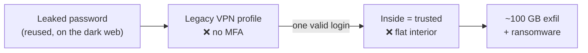
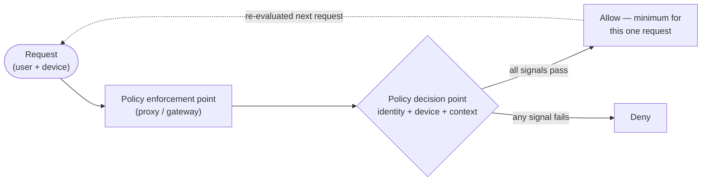
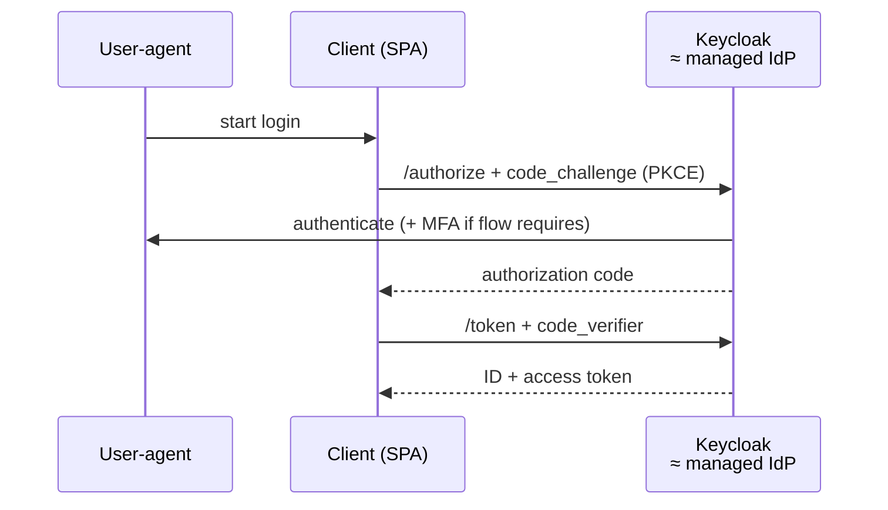
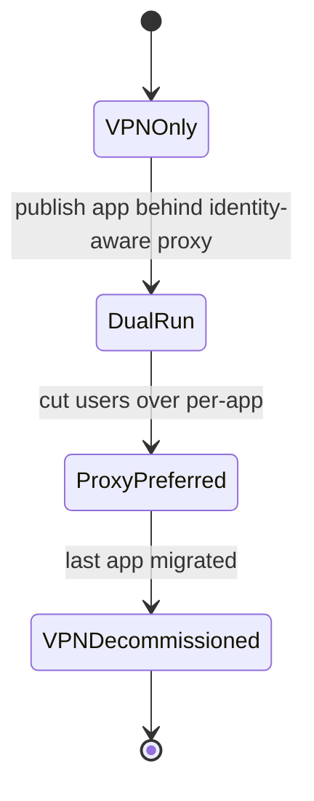

# Visual conventions — diagrams & de-densifying

*Authoring standard for the **OSS-500 edition** pilot (Track 11, `tracks/11-ztna-oss500/`). Adapted
from the sibling `oss-500` course's `domains/DIAGRAMS.md`. Lives at repo root (out of `docs_dir`) so
`mkdocs build --strict` never treats it as an orphan page. If the edition is promoted repo-wide, fold
this into `CONTRIBUTING.md`.*

> **At a glance:** diagrams are **Mermaid, as code** (never images, never ASCII art). Pick the diagram
> type from the *shape of the concept*. Put the diagram **at the top of the section it summarizes**, and
> **compress the prose against it** — a diagram replaces the paragraph that narrated the flow, it does
> not decorate one. Preserve every objective mapping, resource link, and gotcha.

This is the discipline that turns a wall of text into something a visual learner can anchor on. The
goal is not "more diagrams" — it is **fewer, denser** ones, each carrying the load a dense paragraph
used to.

## 1. Format: Mermaid, as code

Author every diagram as a fenced ` ```mermaid ` block. Material for MkDocs renders these natively
(configured via `pymdownx.superfences` in `mkdocs.yml`).

- **Never** commit binary images (PNG/JPG) or external image references — they aren't diff-able, bloat
  the repo, and break the everything-as-code ethos.
- **Never** hand-draw ASCII / box-drawing diagrams for shipped content — use Mermaid.
- Write node labels that read cleanly as **plain text**, so the source stays legible in any reader
  without Mermaid support.

## 2. Diagram type follows the concept's shape

Don't guess the type — map it from what you're depicting:

| Concept shape | Mermaid type | Use it for (ZTNA examples) |
|---|---|---|
| Protocol / token / request **hops** | `sequenceDiagram` | OIDC auth-code+PKCE, SAML assertion flow, mTLS handshake, SPIFFE/SPIRE attestation |
| **Decision / policy** logic, gates, pipelines | `flowchart` (LR/TB) | PEP→PDP per-request evaluation, OPA/Rego allow-deny, conditional/step-up access |
| **Lifecycle / state** | `stateDiagram-v2` | VPN→ZTNA strangler-fig migration, cert/token lifecycle, session→per-request shift |
| **Hierarchy / topology / binding** | `flowchart` / `graph` | broker topology, the five NIST pillars, micro-segmentation east-west paths |
| **Attack chain / kill-chain** | `flowchart LR` with annotated failure nodes | a breach reconstructed step-by-step (entry → foothold → spread) |
| **A vs B** contrast | **comparison table**, or paired-node `flowchart` | perimeter vs per-request, self-hosted vs cloud-delivered, confidential vs public |

## 3. House style

So the whole set reads as one system:

- **Direction:** `LR` for flows/pipelines/sequences that read left-to-right; `TB` for hierarchies and
  decision trees. State it explicitly (`flowchart LR`).
- **Node labels:** concise, human-readable. Name the **OSS tool** and, where the module draws the
  parallel, its **managed-cloud analogue** — e.g. `PEP["Pomerium proxy<br/>≈ Cloudflare Access"]`.
- **Edge labels:** put the condition or action on the edge — `-->|device unmanaged| Deny`.
- **No hard-coded colors or inline style hacks.** Rely on default theming so diagrams stay legible in
  both light and dark (the site is theme-aware).
- Keep a diagram to **one idea**. If it needs a legend to parse, split it.

## 4. Placement: compress the densest prose

- Every module README **over the density threshold** (a long multi-paragraph section explaining a flow,
  hierarchy, mapping, or attack chain) gets **at least one diagram**.
- Put the diagram **near the top of the section it summarizes**, so it orients the reader *before* the
  detail — then let the prose go deep on the nuance the picture can't carry.
- Condense the surrounding prose *against* the diagram: once the flow is a picture, the paragraph that
  narrated it step-by-step becomes a few lines.
- **Don't force it.** Short sections, or sections with no spatial concept, get no diagram —
  de-densifying formatting alone (below) is fine.

## 4b. Diagrams are click-to-enlarge

Diagrams render small; on large monitors they can be hard to read. The site loads
`javascripts/mermaid-zoom.js` (+ styles in `stylesheets/extra.css`), which makes **every Mermaid
diagram click-to-enlarge** — a full-screen lightbox with scroll-to-zoom and drag-to-pan. You get this
for free by using a ` ```mermaid ` block; author nothing extra. Because the reader can zoom, prefer
**one dense, complete diagram** over several thin ones — legibility at inline size is no longer the
constraint it was.

## 4c. Section naming: "Go deeper", not "Learn"

Because the edition teaches the mechanism in the body, the curated-links section is titled **"Go
deeper (~N hrs · optional)"**, not "Learn". The name has to tell the truth: the links are optional
depth and primary sources, not the path the learner must click through to understand the module.
Reserve the collapsible `??? note` titles for other words (e.g. "Background:") so a page never shows
two "Go deeper" labels.

## 5. De-densifying patterns (no diagram required)

Break up walls of text without deleting content:

- **Callout admonitions** for the one key takeaway or a warning (Material syntax):
  `!!! note "The mental model"`, `!!! warning "The gotcha"`, `!!! tip "AI caveat"`,
  `??? note "Go deeper: …"` (collapsible).
- **Comparison tables** wherever prose says "X vs Y" (perimeter vs per-request, TOTP vs FIDO2,
  self-hosted vs SASE).
- **"At a glance" lead-in** — a one-line summary or a tight bullet set at the head of a long section.
- **Bold lead-in terms** on list items so the eye can scan.
- Keep it **meaning-preserving**: every objective/tenet mapping, lab link, resource link, and gotcha
  present before your edit must still be present after.

## 6. Don't break navigation

- Don't rename a heading without updating everything that links to its anchor.
- The edition is nav-explicit in `mkdocs.yml`; a new page must be added to the nav or
  `mkdocs build --strict` fails on the orphan.

## 7. Copyable examples

**Attack chain — a breach reconstructed (annotate the two failure points):**



**Decision — per-request evaluation (PEP/PDP):**



**Sequence — OIDC authorization-code + PKCE:**



**State — VPN → ZTNA strangler-fig migration:**


