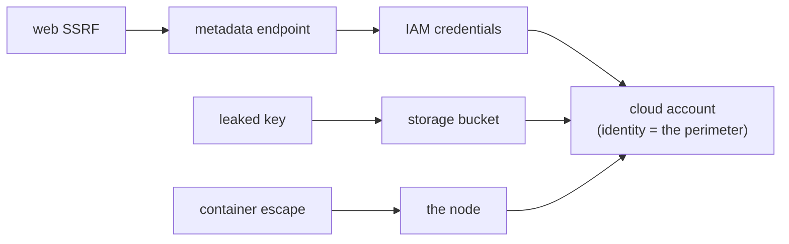

# Module 16 — Cloud & Container Attack Primer

*Type 3 · Blast-Radius Trace — exploit cloud/container misconfigs on real targets (flaws.cloud, CloudGoat) and trace the reach: SSRF→metadata→IAM, key→bucket, container-escape→node, revealing that identity is the perimeter. (Secondary: Decision/ADR — a primer that hands off the deeper paths to Track 05.) [Go to the hands-on lab →](lab.md)*

*Last reviewed: 2026-06*

**Offensive Security** — *where your on-prem skills meet the cloud — the bridge to Track 05.*

<!-- module-meta -->
**Difficulty:** Intermediate &nbsp;·&nbsp; **Estimated time:** ~5–7 hrs (study + lab) &nbsp;·&nbsp; **Prerequisites:** [Foundations](../../../00-foundations/README.md)
{ .module-meta }

!!! abstract "In 60 seconds"
    Attacks increasingly *end* in the cloud, and this primer is the hinge between your on-prem skills
    and cloud-native targets. The recurring path: a web SSRF reaches the metadata endpoint and yields
    IAM credentials; a leaked key unlocks a storage bucket; a container escape lands you on the node.
    The mental shift that makes cloud attacking click: **identity is the perimeter** — there's no
    "inside the network," only whatever the credential or role you steal is allowed to do. It's
    deliberately a primer that hands off to the full Cloud track for depth.

## Why this matters
Attacks increasingly end in the cloud: a web SSRF reaches a metadata endpoint, leaked keys
unlock a storage bucket, a container escape lands on the node. This primer connects the
offensive skills you've built to cloud-native targets — IAM, metadata, storage, and containers
— and hands off to the full Cloud track. It's also where the Capital One SSRF you met in module
08 actually pays off.

## Objective
Exploit common cloud and container misconfigurations against a deliberately vulnerable
environment, and explain the path from a web/host foothold to cloud compromise.

## The core idea
Attacks increasingly *end* in the cloud, and this primer is the hinge between the on-prem skills you've
built and cloud-native targets. The recurring path: a web SSRF (module 08) reaches the metadata
endpoint and yields IAM credentials; a leaked key unlocks a storage bucket; a container escape lands you
on the node.

!!! note "The mental model"
    **Identity is the perimeter.** There's no "inside the network" to fight toward — what you can do is
    whatever the credential or role you steal is allowed to do, so privilege escalation here is about
    IAM *policy*, not SUID binaries. The concrete pivots to internalise: the metadata endpoint
    (`169.254.169.254`) as the SSRF→credentials oracle (the Capital One mechanism, paid off from module
    08); IAM keys and roles and their over-broad-policy escalation paths; object-storage (S3)
    misconfigurations; and container escape to the host/node.

This is deliberately a *primer* — it connects your existing skills to cloud targets and hands off to
the full Cloud track (T05) for the depth.

!!! warning "The gotcha"
    The cloud is unforgiving in a new way — your actions hit a real, *billed* account with real audit
    logs, and a wrong API call can break production or run up cost. Stick to the intentionally
    vulnerable targets (flaws.cloud, CloudGoat), and never run cloud changes you don't understand
    against a live account.

!!! tip "AI caveat"
    A model explains AWS errors and IAM-policy quirks well (genuinely useful in unfamiliar terrain) but
    will also hallucinate a service behaviour or an API that doesn't exist. Verify against provider docs
    before you act.

## Learn (~4 hrs)

**Hands-on, real targets**
- [flaws.cloud](http://flaws.cloud/) — a free, guided, real-world AWS pentest you do in the browser; the best on-ramp to cloud attacking.
- [CloudGoat (Rhino Security Labs)](https://github.com/RhinoSecurityLabs/cloudgoat) — deliberately vulnerable AWS scenarios you deploy and attack with [Pacu](https://github.com/RhinoSecurityLabs/pacu).

**Where it sits**
- [MITRE ATT&CK — Cloud Matrix](https://attack.mitre.org/matrices/enterprise/cloud/) — cloud techniques and tactics.

## Key concepts
- The metadata endpoint (`169.254.169.254`) and SSRF-to-credentials
- IAM keys, roles, and privilege escalation
- Object-storage (S3) misconfigurations
- Container escape to the host/node
- Where attacker skills hand off to the Cloud track (T05)

## AI acceleration
A model explains AWS error messages and IAM policy quirks well — genuinely useful in unfamiliar
cloud terrain. But it will also hallucinate a service behaviour or an API; verify against the
provider docs, and never run cloud changes you don't understand against a live account.

!!! question "Check yourself"
    - What does "identity is the perimeter" change about how you think about privilege escalation in the cloud?
    - Trace the SSRF → metadata → IAM-credential path and name the magic IP.
    - Why is hitting a real cloud account riskier than a lab VM, and what's the safe way to practise?
