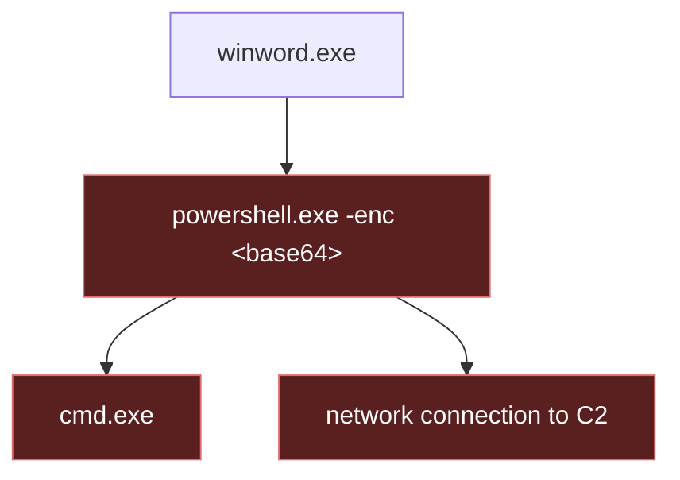

# Module 02 — Windows & Endpoint Telemetry

*Type 7 · Build-&-Operate — deploy Sysmon with a good config, read the process/network/persistence events real detections rely on, then author and prove a detection that fires on the malicious chain and stays quiet on benign activity; you commit the config plus a verified detection. (Secondary: Concept Autopsy — the config *is* the detection strategy.) [Go to the hands-on lab →](lab.md)*

*Last reviewed: 2026-06*

**Defensive Operations** — *the endpoint sees what the network can't; Sysmon is how you make it talk.*

<!-- module-meta -->
**Difficulty:** Intermediate &nbsp;·&nbsp; **Estimated time:** ~5–7 hrs (study + lab) &nbsp;·&nbsp; **Prerequisites:** [Foundations](../../../00-foundations/README.md)
{ .module-meta }

!!! abstract "In 60 seconds"
    The endpoint is where the attack actually executes — a process spawns, injects, installs
    persistence — while the network only sees the echoes. Default Windows logging is famously thin;
    **Sysmon** turns a host into a rich detection sensor with a schema a huge share of public
    detections are written against. Its most valuable gift is **process ancestry**: almost nothing
    looks malicious as a single event, only as a lineage. And the config *is* the detection strategy
    — every exclusion is a place an attacker can choose to live.

## Why this matters
Most attacker activity — process creation, injection, persistence — happens on the endpoint, where
default Windows logging is thin. Sysmon turns a Windows host into a rich detection sensor, and its
event schema underlies a huge share of real-world detections. Learning what to collect and read
here is what makes the later detection and hunting modules possible.

## Objective
Deploy Sysmon with a good config, and read the process/network/persistence events that real
detections are built on — using real attack telemetry — then *author* a detection for the attack
you found and **prove it**: it fires on the malicious chain and stays quiet on benign activity.
Reading the telemetry and building a verified detection from it are equal halves.

## The core idea
The endpoint is where the attack actually executes — a process spawns, injects into another,
installs persistence — while the network only ever sees the echoes. The problem is that default
Windows logging is famously thin: it will happily tell you a logon occurred, but not that
`winword.exe` spawned `powershell.exe` which spawned `cmd.exe`. **Sysmon** is the sensor that fills
that gap, writing a rich, consistent event schema — process creation with the full command line and
parent, network connections, image loads, registry and file changes — that a huge fraction of
public detections are written directly against.

!!! note "The mental model"
    The single most valuable thing Sysmon gives you is **process ancestry** — the parent/child
    chain. Almost no technique looks malicious as a single event; it looks malicious as a *lineage*.
    `powershell.exe` alone is benign; `winword.exe → powershell.exe -enc <base64>` is a macro
    dropper. (That is literally the event the [detection-as-code](../08-detection-as-code/README.md) lab
    fires on.) Learning to read the tree — with command lines attached — is the core endpoint skill,
    and it's why Event ID 1 is the workhorse of endpoint detection.

!!! note ""
    No single node is damning — `powershell.exe` runs all day. The *lineage* `winword.exe →
    powershell.exe` is the macro dropper. Sysmon Event ID 1 carries the parent, which is what makes
    the chain visible.

The judgment call: Sysmon's power is also its trap. Log everything and you drown in volume and cost
while burying the very signal you're after — so **the config *is* the detection strategy.** The
community baseline (SwiftOnSecurity's config) encodes years of "what's worth collecting and what's
just noise"; you start from it and tune, not from a blank file.

!!! warning "The gotcha"
    Every exclusion is a security decision, not just noise reduction — each path you stop logging is
    a place an attacker can choose to live. A "tidy" config that drops a noisy directory may have
    just handed an adversary a blind spot, so weigh exclusions as carefully as inclusions.

??? note "Go deeper: reading telemetry is only half the job"
    Reading the events and *building a verified detection from them* are equal halves. It's easy to
    "note what a rule would key on" and stop there; the discipline is to author the detection
    (Sigma/predicate) and prove it fires on the malicious chain while staying quiet on benign
    activity — not assume it would.

!!! tip "AI caveat"
    A model explains a Sysmon Event ID or a suspicious command line instantly — a genuine
    accelerator when triaging. But it'll also rationalise a benign-looking event that's actually
    malicious (or vice-versa); confirm against the process ancestry and the real data, not the
    model's vibe.

## Learn (~4 hrs)

**The endpoint sensor**
- [What is Sysmon — How to Install and Set Up Sysmon (video)](https://www.youtube.com/watch?v=PY1v_mZnjks) — install and configure the endpoint sensor.
- [SwiftOnSecurity sysmon-config](https://github.com/SwiftOnSecurity/sysmon-config) — the community baseline config; read it to learn what's worth collecting and why.

**Reading the events**
- [MITRE ATT&CK — Data Source: Process](https://attack.mitre.org/datasources/DS0009/) — how Sysmon events map to techniques.

## Key concepts
- Why default Windows logging isn't enough
- Key Sysmon Event IDs (1 process-create, 3 network, 11 file, 13 registry)
- Process ancestry and command-line logging
- Endpoint agents (Sysmon → Wazuh / EDR)
- Tuning: signal vs volume
- Author then verify: write the detection (Sigma/predicate) and prove it fires on the malicious chain, quiet on benign — not just "note what it would key on"

## AI acceleration
A model explains a Sysmon Event ID or a suspicious command line instantly — a genuine accelerator
when triaging. But it'll also rationalise a benign-looking event that's actually malicious (or
vice-versa); confirm against the process ancestry and the real data, not the model's vibe.

!!! question "Check yourself"
    - Why is `powershell.exe` running not suspicious on its own, but `winword.exe → powershell.exe
      -enc …` is — and which Sysmon field makes that visible?
    - In what sense is a Sysmon exclusion a *security* decision and not just noise reduction?
    - You've read the telemetry and spotted the malicious chain — what two things must your
      detection prove before the module is actually done?
