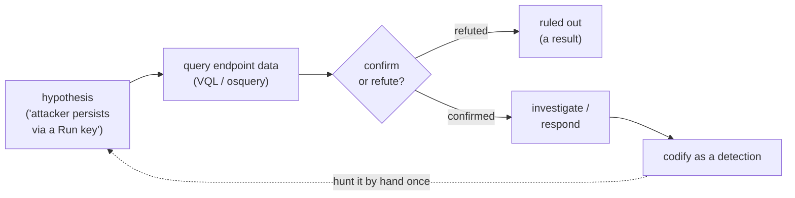

# Module 11 — Threat Hunting: Endpoint

*Type 6 · Reconstruct — run a hypothesis-driven hunt across real endpoint data with Velociraptor/osquery and either find the activity or rule it out; you commit the hunt notebook and the detection it turns into. (Secondary: Build-&-Operate — closing the hunt→detection loop into something that keeps running.) [Go to the hands-on lab →](lab.md)*

*Last reviewed: 2026-06*

**Defensive Operations** — *don't wait for an alert — go looking for what your detections missed.*

<!-- module-meta -->
**Difficulty:** Intermediate &nbsp;·&nbsp; **Estimated time:** ~5–7 hrs (study + lab) &nbsp;·&nbsp; **Prerequisites:** [Foundations](../../../00-foundations/README.md)
{ .module-meta }

!!! abstract "In 60 seconds"
    Detection *waits* for known-bad; hunting *goes looking*. Threat hunting assumes a breach already
    happened and asks, "if an attacker were here, what would I see?" — then interrogates endpoint
    data to confirm or refute a specific, testable hypothesis. The organising principle is the
    **Pyramid of Pain**: hunt *behaviours* (expensive to change), not atomic indicators (trivial to
    change). Velociraptor and osquery make this an enterprise-scale activity. The payoff loop: a
    successful hunt becomes a detection, so you only hunt that thing by hand once.

## Why this matters
Detections catch the known; hunting finds the unknown. Threat hunting is hypothesis-driven: you assume
a breach, form a testable idea ("an attacker would persist via a Run key"), and go look across your
endpoint data. It's how teams find the dwell-time attacker that slipped past every rule — and
Velociraptor makes enterprise-scale endpoint hunting free.

## Objective
Run a hypothesis-driven hunt across real endpoint data with Velociraptor/osquery, and either find the
activity or rule it out.

## The core idea
Detection and hunting are opposite stances. Detection *waits* — it encodes known-bad and fires when
it appears. Hunting *goes looking* — it assumes a breach already happened and asks, "if an attacker
were here, what would I see, and is it there?" That flip from reactive to proactive is the whole
discipline: you're hunting precisely the thing your rules didn't have a signature for. And it's
*hypothesis-driven* — you form a specific, testable idea ("an attacker would persist via a Run key,"
"they'd do discovery with built-in tools") and then interrogate your endpoint data to confirm or
refute it. A hunt that ends in "ruled out" is a result, not a failure.

!!! note "The mental model"
    The organising principle is the **Pyramid of Pain**: hunt *behaviours*, not atomic indicators. A
    hash or IP is trivial for an attacker to change (bottom of the pyramid); their techniques cost
    real effort to alter (top). So "any Office app spawning a script interpreter" outlives any
    single hash — hunt the TTP, not the IOC. Velociraptor and osquery let you ask that question
    across thousands of endpoints at once (host-as-database, VQL/SQL), which is what makes hunting
    an enterprise activity rather than a one-box exercise.

!!! warning "The gotcha"
    Hunting is judgment under ambiguity, and there is no rule firing to tell you when you're done.
    A pattern that's just normal-for-you will look suspicious until you confirm it against the data —
    so treat every hypothesis as something to *refute*, and remember a hunt that ends in "ruled
    out" is a result, not a failure.

??? note "Go deeper: make hunting compound"
    The move that makes hunting pay off over time: a successful hunt becomes a new detection (module
    08), so you only ever have to hunt that thing by hand once. Otherwise you re-discover the same
    behaviour every quarter; codify it and your detection coverage grows with every hunt.

!!! tip "AI caveat"
    A model is great for generating hunt hypotheses and drafting VQL/osquery — but a model will
    happily "confirm" a pattern that's just normal-for-you. Treat its leads as hypotheses to test
    against the data, never conclusions.

## Learn (~4 hrs)

**The method & the tool**
- [Hunt for Hackers with Velociraptor (video)](https://www.youtube.com/watch?v=S8POUZv7pT8) — endpoint hunting with the OSS platform.
- [Velociraptor documentation](https://docs.velociraptor.app/) — VQL, artifacts, and hunts; read "Getting Started."

**Method**
- [The ThreatHunting Project](https://www.threathunting.net/) — hunting methodology and concrete hunt ideas.

## Key concepts
- Hypothesis-driven hunting (assume breach)
- Endpoint hunt data: processes, persistence, auth, file
- VQL / osquery for hunting at scale
- The Pyramid of Pain (hunt for behaviours, not just IOCs)
- Turning a successful hunt into a detection

## AI acceleration
A model is great for generating hunt hypotheses and drafting VQL/osquery — but hunting is judgment
under ambiguity, and the model will happily "confirm" a pattern that's just normal-for-you. Treat its
leads as hypotheses to test against the data, never conclusions.

!!! question "Check yourself"
    - In one sentence, how does hunting differ from detection in stance?
    - Why is a hunt that ends in "ruled out" a success rather than a wasted afternoon?
    - Using the Pyramid of Pain, why is "any Office app spawning a script interpreter" a better hunt
      than a list of malicious hashes?
