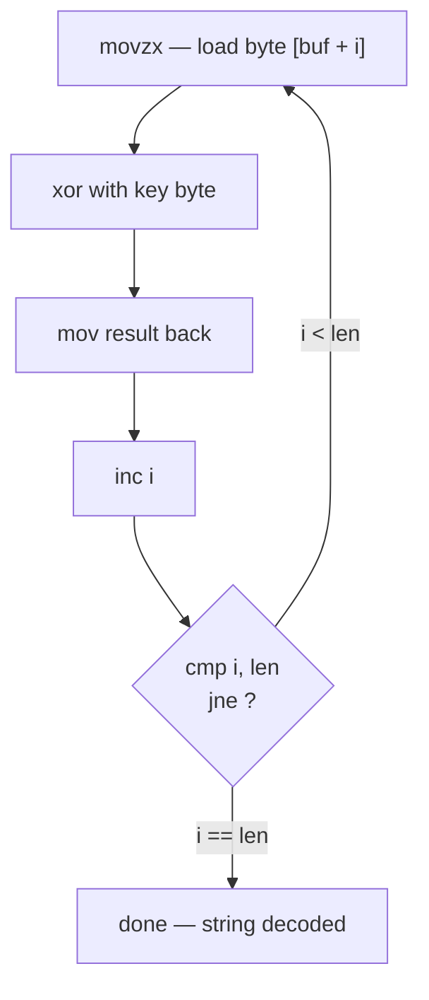

# Module 07 — Disassembly Basics

*Type 6 · Reconstruct — disassemble a compiled C program with `objdump`/`radare2`, recognise a XOR string-obfuscation routine, extract the key, and recover the hidden string from ground-truth assembly, deliverable the recovered string plus a YARA hex-pattern rule on the decode stub proven against a benign control. (Secondary: Concept Autopsy — map each asm construct back to the source that generated it.) [Go to the hands-on lab →](lab.md)*

*Last reviewed: 2026-06*

**Malware Analysis** — *when every other analysis layer is exhausted, the disassembler is the ground truth — it shows you exactly what the CPU will execute.*

<!-- module-meta -->
**Difficulty:** Advanced &nbsp;·&nbsp; **Estimated time:** ~6–8 hrs (study + lab) &nbsp;·&nbsp; **Prerequisites:** [Foundations](../../../00-foundations/README.md)
{ .module-meta }

!!! abstract "In 60 seconds"
    When every other layer is exhausted, the disassembler is ground truth — it shows exactly what the
    CPU will execute. Assembly isn't a foreign language; it's a *small* one, built from a handful of
    instruction families you can learn to read structurally. The highest-value pattern in malware is
    the **XOR loop**: load a byte, XOR with a key, store, increment, compare, jump. Recognising that
    shape — without knowing in advance what it does — lets you extract the key and recover the hidden
    string, then prove it with a YARA hex-pattern rule on the decode stub.

## Why this matters

Static analysis tools and dynamic traces give you observations. Disassembly gives you the mechanism. When you need to understand *why* a sample does something — how its encryption key is derived, what condition triggers its destructive payload, what the exact comparison is that the anti-analysis check performs — you go to the disassembler. This is also where capability claims from tools like capa get verified or corrected. **Ursnif** (also tracked as Gozi/ISFB) is a concrete reason to be fluent in the XOR loop: this long-lived banking trojan uses an XOR-based algorithm to obscure data it drops to disk (MITRE documents it XOR-encrypting the Tor client it deploys, T1027.013). To recover what Ursnif actually hides, you find that decode routine in the disassembly, read out the key, and run it in reverse — the exact skill this module builds. ([Ursnif — MITRE ATT&CK S0386](https://attack.mitre.org/software/S0386/).)

## Objective

Use `objdump` and `radare2` to disassemble a compiled C program, identify a simple XOR-based string obfuscation function, extract the XOR key, and recover the hidden string — then *author* a YARA hex-pattern rule on the recovered decode stub (or the encrypted blob) and **prove** it matches the sample but stays quiet on a benign control. Map the assembly constructs to the source code patterns that generated them. Recovering the string and authoring a byte-pattern detection that proves you found the right bytes are equal halves.

## The core idea

!!! note "The mental model"
    Assembly is not a foreign language — it is a very *small* one. An x86-64 function is built from a
    handful of instruction families: data movement (`mov`, `lea`, `push`, `pop`), arithmetic (`add`,
    `sub`, `imul`, `xor`), comparison (`cmp`, `test`), conditional branching (`je`, `jne`, `jg`, `jl`),
    and control flow (`call`, `ret`). Once you can read those, you can read most malware-grade assembly
    at the structural level.

The XOR loop is the single most important assembly pattern in malware analysis. XOR obfuscation (T1027.013) is everywhere: string decryption, payload deobfuscation, simple key derivation — Ursnif's XOR-encrypted dropped Tor client is one real instance of exactly this pattern. The canonical form is a loop that XORs each byte of a buffer with a key byte, often with the loop counter as an index into both buffers. In assembly, this looks like: `movzx` a byte, `xor` it with a register containing the key, `mov` the result back, `inc` the index, `cmp` with the length, `jne` to loop top. Recognising that structure — without knowing what it does in advance — is the core skill.

??? note "Go deeper: build the C↔asm map first"
    The way to learn disassembly is to start from a function *you wrote*, disassemble it, and build the
    map between source and assembly. Every C `for` loop becomes a `cmp + jne` pattern; every local
    variable becomes a `[rbp - N]` offset; every call passes its first six args in `rdi`, `rsi`, `rdx`,
    `rcx`, `r8`, `r9` (System V AMD64 ABI). Once that map is in your head, you can run it in reverse on
    an unknown binary.

!!! warning "The gotcha"
    `radare2` keeps you close to the raw assembly precisely *because* it has no decompiler abstraction —
    that's the point at this stage. The analysts who trust a decompiler's pseudocode uncritically are
    the ones who miss the XOR key width (byte vs. word) or a wrong loop bound. Reading the instructions
    yourself is what separates understanding from guessing; production tools (Ghidra, Binary Ninja)
    come later, on top of this skill, not instead of it.

## Learn (~5 hrs)

**x86-64 assembly foundations**
- [Intel x86-64 Instruction Reference (Felix Cloutier)](https://www.felixcloutier.com/x86/) — the per-instruction reference. Look up every instruction you encounter that you don't recognise.

**Practical disassembly with radare2**
- [radare2 Book (official)](https://book.rada.re/) — read "Getting Started," "Analysis," and "Disassembling." Focus on `aaa`, `pdf` (print disassembly of function), and `axt` (cross-references). (~1 hr to read relevant chapters.)
- [Chris Eagle — The Ghidra Book: The Definitive Guide](https://www.oreilly.com/library/view/the-ghidra-book/9781492052586/) — even if you use radare2, the sections on assembly, function calling conventions, and local variable layout are the clearest reference. (~30 min.)

**XOR obfuscation patterns**
- [MITRE ATT&CK — T1027.013: Obfuscated Files or Information — XOR](https://attack.mitre.org/techniques/T1027/013/) — the canonical adversarial technique reference for XOR obfuscation in malware.
- [Ursnif — MITRE ATT&CK S0386](https://attack.mitre.org/software/S0386/) — a real family that uses an XOR-based algorithm (T1027.013) to obscure data dropped to disk; read its entry to see the technique attributed to a specific, well-documented banking trojan rather than a toy example.
- [XOR Cipher — Wikipedia](https://en.wikipedia.org/wiki/XOR_cipher) — practical explanation of XOR obfuscation mechanics and why it's so common in malware.

## Key concepts
- x86-64 registers: general purpose (`rax`, `rbx`, `rcx`, `rdx`, `rsi`, `rdi`, `rsp`, `rbp`, `r8`–`r15`)
- System V AMD64 ABI: first six args in `rdi`, `rsi`, `rdx`, `rcx`, `r8`, `r9`
- Function prologue/epilogue: `push rbp` / `mov rbp, rsp` / `pop rbp` / `ret`
- Loop structure in assembly: `cmp + jne/jl` + index increment
- XOR obfuscation loop: how `xor byte [rbx + rax], cl` looks in practice
- `objdump -d`: flat disassembly, good for overview
- `radare2 -q -c 'aaa; pdf @ sym.decode'`: targeted function disassembly
- MITRE ATT&CK T1027.013 — Obfuscated Files: XOR
- Real worked family: **Ursnif/Gozi** (banking trojan) — uses an XOR-based algorithm (T1027.013) to obscure dropped data; recovering it is the same find-the-loop, read-the-key, reverse-it skill this module drills
- Author then verify: write the YARA hex-pattern rule on the recovered decode-stub bytes and prove it matches the sample, not the benign corpus — the build half

## AI acceleration

AI is very good at explaining what an assembly function does — paste a disassembly and ask "what does this function do?" But it makes mistakes on XOR key width (byte vs. word), on loop bounds, and on calling convention details. Use AI to get the first-pass interpretation, then verify the XOR key and loop bounds manually by tracing through the instructions yourself. An analyst who relies on the AI explanation without independent verification will miss the nuance every time.

!!! tip "AI caveat"
    A model explains an asm function well in prose but quietly errs on the load-bearing details — XOR
    key width, loop bounds, calling convention. Those are exactly the things that change the recovered
    string. Trace them by hand; the AI summary is a hypothesis, not the answer.

!!! question "Check yourself"
    - Why is the disassembler called "ground truth" when tools like capa or a decompiler already gave you answers?
    - Describe the canonical XOR-decode loop in instructions. Which register typically holds the key, and what ends the loop?
    - Why learn this on radare2 rather than jumping straight to a decompiler's pseudocode?
