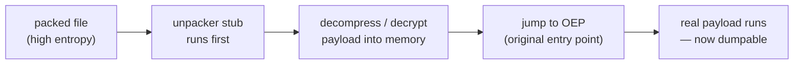

# Module 09 — Unpacking & Obfuscation

*Type 9 · Tool-Build — pack an ELF with UPX, confirm the entropy jump, unpack and verify hash equivalence, and decode XOR-obfuscated strings from a loader script, deliverable a reusable unpacker/string-decoder plus a YARA rule on UPX section names proven to fire on the packed binary but not the unpacked one. (Secondary: Reconstruct — recover the IOCs the loader hid.) [Go to the hands-on lab →](lab.md)* &nbsp;·&nbsp; *[Cheat sheet →](cheatsheet.md)*

*Last reviewed: 2026-06*

**Malware Analysis** — *get to the real code when the sample has been deliberately wrapped to hide it.*

<!-- module-meta -->
**Difficulty:** Advanced &nbsp;·&nbsp; **Estimated time:** ~4–6 hrs (study + lab) &nbsp;·&nbsp; **Prerequisites:** [Foundations](../../../00-foundations/README.md)
{ .module-meta }

!!! abstract "In 60 seconds"
    Packing is the oldest anti-analysis trick and still the most common — over half of submitted PE
    samples are packed. Hand a packed binary to a decompiler and you see the *stub*, not the payload;
    the real code is invisible until you defeat the packer. A packer is two stages: a build-time
    compress/encrypt pass and a runtime decompression stub — which shows up as a sharp entropy jump
    (a benign `.text` ~5–6 bits/byte; UPX pushes it past 7.5). You unpack, verify by hash equivalence,
    and prove it with a YARA rule on the `UPX0`/`UPX1` section names.

## Why this matters

Packing is the oldest anti-analysis trick and still the most common. VirusTotal data consistently shows that more than half of submitted PE samples are packed or protected in some way. If you hand a packed binary to a decompiler, you see the unpacker stub — a few hundred instructions that decompress the real payload into memory and jump to it. The actual malicious code is invisible until you defeat the packer. Analysts who cannot handle packed samples cannot handle most production samples. **DarkComet** — a notorious Windows RAT used in everything from commodity crime to nation-state surveillance — is a clean real-world case: MITRE documents that it "has the option to compress its payload using UPX or MPRESS" (T1027.002). A DarkComet sample packed with UPX shows the exact entropy jump and `UPX0`/`UPX1` section names this lab teaches you to spot and reverse. ([DarkComet — MITRE ATT&CK S0334](https://attack.mitre.org/software/S0334/); see also the UPX procedure examples on [T1027.002](https://attack.mitre.org/techniques/T1027/002/).)

## Objective

Pack a benign ELF binary with UPX, verify the entropy increase that signals packing, unpack it and confirm hash equivalence to the original, then decode a set of XOR-obfuscated strings from a Python loader script and understand how loaders use encoding to hide IOCs — then *author* a YARA rule on the UPX section names and **prove** it matches the packed binary but stays quiet on the unpacked one. Defeating the obfuscation and authoring a corpus-verified packer-detection rule from what you recovered are equal halves.

## The core idea

!!! note "The mental model"
    A packer works in two stages: a build-time compression/encryption pass that turns the payload into
    an opaque blob, and a runtime decompression stub that reconstructs the original in memory before
    jumping to the real entry point. UPX is the simplest case — compress the sections, prepend a small
    decompressor, redirect the entry point to it. Runtime behaviour is unchanged; on-disk entropy is
    radically higher. That entropy jump is the first signal: a benign `.text` runs ~5–6 bits/byte; UPX
    pushes it above 7.5.

String encoding is packing's close cousin in the scripting world. A loader script (PowerShell, Python, VBScript) cannot compress itself at the byte level the way a compiled packer can, so authors XOR-encode or base64-encode their strings. The pattern is always the same: a blob of encoded bytes, a short decode loop, and then a call using the decoded string as a URL, a registry key, or a filename. Recognising that pattern — encoded blob + decode loop + use — is enough to extract the IOC without fully reversing the rest of the script.

!!! warning "The gotcha"
    UPX has a clean static unpacker; most real-world packers do not. When `upx -d` (or a Themida-style
    script) fails, the next move is to let the sample unpack *itself* in a controlled dynamic
    environment and dump the unpacked image from memory — the subject of Module 10. Don't assume every
    packed sample yields to a one-command static unpack; UPX is the target here precisely because the
    workflow is clean and reproducible.

??? note "Go deeper: hash equivalence is evidence, not a sanity check"
    The unpack workflow is: identify the packer (YARA, `die`/Detect-It-Easy, UPX magic), apply a static
    unpacker if one exists, verify by hash. That post-unpack hash is *evidence*: matching a known-clean
    sample in your corpus means the inner payload isn't novel; matching nothing means a new artifact
    worth full analysis. Either way it goes into your case system and your YARA rule's `hash` metadata.

## Learn (~3 hrs)

**Packer internals**
- [MalwareUnicorn — Reverse Engineering 102: "Unpacking" workshop section](https://malwareunicorn.org/workshops/re102.html#1) — the clearest free walkthrough of the universal packer model: a compressed/encrypted payload plus a runtime stub that rebuilds the original image in memory and jumps to the original entry point (OEP). This is the mental model every manual-unpacking job relies on; work the unpacking section before the lab.

**UPX in practice**
- [UPX official documentation](https://upx.github.io/) — covers compression levels, supported formats, and the `--decompress` flag; read the "Usage" section (~20 min).
- [MITRE ATT&CK T1027.002 — Software Packing](https://attack.mitre.org/techniques/T1027/002/) — real-world usage and detection opportunities; skim the procedure examples and note how many named families (DarkComet, Mimikatz, BLINDINGCAN, …) ship UPX-packed (~15 min).
- [DarkComet — MITRE ATT&CK S0334](https://attack.mitre.org/software/S0334/) — a real RAT documented to optionally pack its payload with UPX or MPRESS (T1027.002); read its entry to ground the lab's UPX exercise in an actual family rather than a synthetic one (~10 min).

**Script obfuscation**
- [decalage2/oletools wiki — mraptor and olevba background](https://github.com/decalage2/oletools/wiki) — context for script obfuscation in Office macros, relevant to Module 11 (~15 min).

## Key concepts

- Packers transform on-disk bytes; runtime behaviour is restored by the stub.
- High section entropy (> 7.0) is the primary packer signal; check `.text` specifically.
- UPX magic bytes (`UPX0`/`UPX1` section names) allow trivial static detection.
- XOR-encoded strings follow blob → decode loop → use; extract blob + key to recover IOC.
- Hash the binary before packing; verify after unpack — hash equivalence is an evidential fact.
- MITRE ATT&CK T1027.002 is the tagging for software packing in your analysis report.
- Real worked family: **DarkComet** (Windows RAT) — documented to optionally UPX/MPRESS-pack its payload (T1027.002); the entropy jump and `UPX0`/`UPX1` section names you detect here are exactly what a packed DarkComet sample shows
- Author then verify: write the YARA rule on the UPX section names and prove it matches the packed binary, not the unpacked one — the build half

## AI acceleration

Paste an encoded string blob and its decode loop into a model. Prompt: *"Decode this XOR-obfuscated string array. The key is the repeating byte at offset 0 of the key array. Show the decoded bytes as ASCII."* The model can usually decode it directly and saves manual Python scripting. Always verify the decoded output makes sense (valid URL, valid filename) before using it as an IOC.

!!! tip "AI caveat"
    A model decodes a XOR/base64 blob directly and saves the Python scripting — but garbage-in,
    garbage-out: if the key width or offset is wrong it returns confident nonsense. Sanity-check the
    output is a *valid* URL/filename before it becomes an IOC.

!!! question "Check yourself"
    - What two stages make up a packer, and which one produces the on-disk entropy jump you measure?
    - Why is hash equivalence before-and-after unpacking evidence, not just a sanity check?
    - `upx -d` fails on a sample. What's the next unpacking strategy, and which module covers it?
