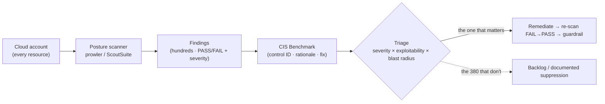
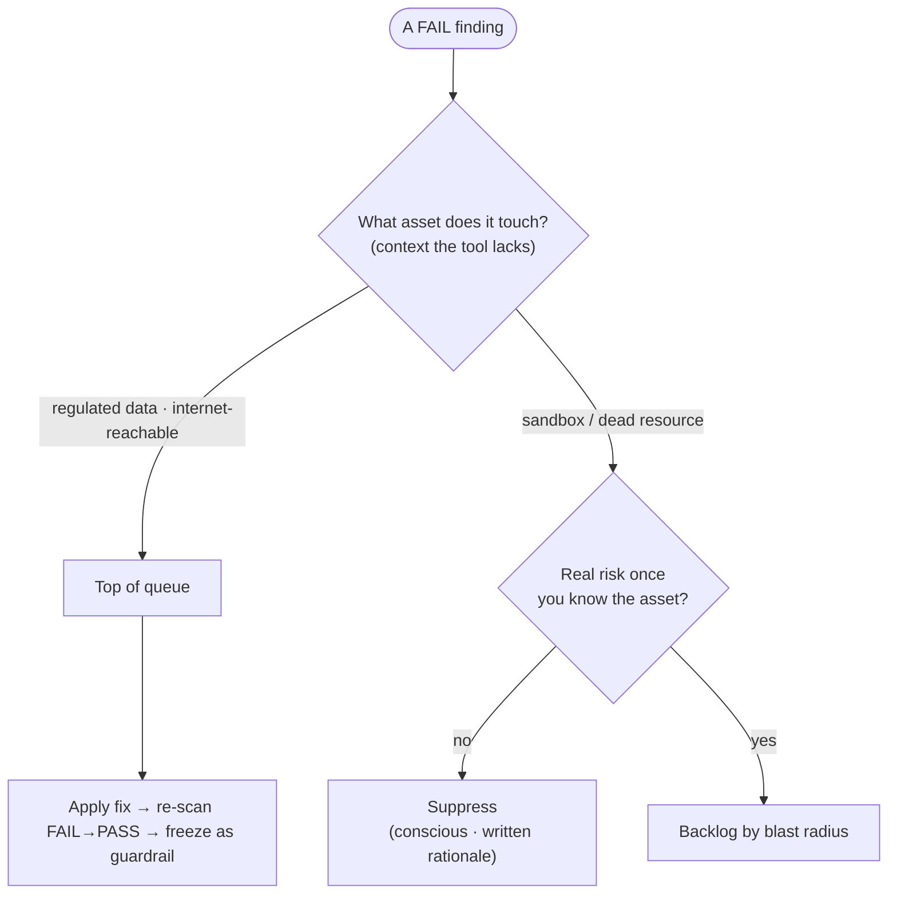

# Module 05 — Posture & Misconfiguration Auditing

*Type 4 · Audit→Build→Verify — run a posture scanner over a live account, then do the real work: triage 400 findings to the one that matters, remediate it, and re-scan to verify. (Secondary: Concept Autopsy — why the scanner-trivial 2017 S3 leaks shipped anyway.) [Go to the hands-on lab →](lab.md)* &nbsp;·&nbsp; *[Cheat sheet →](cheatsheet.md)*

*Last reviewed: 2026-08*

**Cloud & Container Security** — *the same one-line misconfiguration leaked half the Fortune 500 in a single year. A scanner finds it in seconds; the job is deciding which of 400 findings is that one.*

<!-- module-meta -->
**Difficulty:** Intermediate &nbsp;·&nbsp; **Estimated time:** ~5–7 hrs (study + lab) &nbsp;·&nbsp; **Prerequisites:** [Foundations](../../../00-foundations/README.md) · [Module 01 — Shared Responsibility](../01-cloud-fundamentals/README.md)
{ .module-meta }

!!! abstract "In 60 seconds"
    A posture scanner like `prowler` is a linter for your cloud account: one command walks every
    resource and prints a few hundred CIS-rule violations with a severity. The 2017 wave of public-S3
    leaks (Verizon, Accenture, Booz Allen) proves the finding was always *trivial to detect* — the
    breach was a failure to act, not to scan. So the skill this module grades isn't running the tool;
    it's **triage** — severity × exploitability × blast radius, with the asset context the tool can't
    have — and **verification**: re-scanning to watch the fix flip FAIL→PASS, then freezing it as a guardrail.

## The case

2017 was the year the cloud's default went on trial in public. In a single run of months, the same
one-line misconfiguration — an **Amazon S3 bucket set to public** — spilled data from one organisation
after another, each discovered not by the owner but by an outside researcher (most of them by UpGuard's
Chris Vickery) who simply guessed or stumbled onto the bucket name and read it without a credential:

- **Verizon / Nice Systems** — ~14 million customer records (names, phone numbers, some account PINs)
  exposed in a public bucket held by a third-party vendor.
- **Accenture** — four public buckets holding internal master keys, plaintext credentials, and
  decryption keys for the company's enterprise cloud platform.
- **Dow Jones** — customer data for millions of subscribers in a misconfigured bucket.
- **Booz Allen / U.S. Army INSCOM** — the most striking: a public bucket holding **classified** DoD
  intelligence material and the private keys of a contractor with Top Secret/SCI access.

No exploit. No zero-day. No clever chain like Capital One's. One ACL, the same one, at scale — the
**same misconfiguration** that module 01's verdict already pinned on the customer's side of the line.
The lesson 2017 burned in is not "S3 is dangerous." It is that misconfiguration, not vulnerability, is
the dominant cloud breach cause — the [Verizon DBIR](https://www.verizon.com/business/resources/reports/dbir/)
has said so for years — and that **a posture scanner would have found every one of these in seconds.**
Which raises the only interesting question in this module:

> **If the tool finds the public bucket trivially, why did half the Fortune 500 ship it anyway — and
> what is the actual skill, if it isn't "run the scanner"?**

## Your job

By the end of this module you'll **audit → triage → remediate → verify**: run `prowler` (and
ScoutSuite) against a seeded account, take its raw finding dump and **triage it down to the few that
matter** — severity × exploitability × blast radius, *not* the raw count — then draft a remediation,
apply it, and **re-scan to prove the finding is gone.** Finally you encode that verified fix as a
guardrail: a benchmark check, mapped to its specific CIS control, that stays **green** on the fixed
account and fails on the broken one. Triage and verification — not running the tool — are the job.

## The core idea

**A posture scanner is a linter for your account.** `prowler` is to your AWS config what `eslint` is
to a codebase: it walks every resource, applies a few hundred rules, and prints a list of rule
violations with a severity. CIS (Center for Internet Security) publishes the rulebook — scored,
numbered benchmarks for AWS/GCP/Azure where each control has a rationale, the exact API check that
tests it, and the fix. ScoutSuite does the same collection from a different angle and renders it as a
walkable HTML report. Running it is one command. **The output is the start of the work, not the end.**

The benchmark is the scanner's rulebook, and it is organised into control families — the same four
the lab's seeded account is shaped around:

| CIS control family | What it checks | Lab finding (2017-shaped) | ATT&CK |
|---|---|---|---|
| **Identity & Access (1.x)** | root MFA, key rotation, least privilege | `svc-legacy` stale key; root no MFA | T1078 |
| **Storage / S3 (2.x)** | public-access blocks, bucket ACLs, encryption | `inherited-public-data` public ACL | T1530 |
| **Logging (3.x)** | CloudTrail enabled *and* logging | `trail` exists but logging off | — |
| **Networking (5.x)** | no `0.0.0.0/0` to sensitive ports | `wide-open` SG on 22/3389 | T1021 |

!!! note "The mental model"
    `prowler` is to your AWS config what `eslint` is to a codebase — it finds rule violations in
    seconds. The tool supplies findings; **you** supply which resource holds what, who can reach it,
    and what its blast radius crosses. That asset context is the part no scanner can run.

Here is the trap, and it is the whole module. A linter that emits 400 warnings is *worse* than useless
if you treat every line equally — you drown the one that matters (public bucket holding INSCOM's
classified data) under 380 that don't (an unused IAM user from 2019 whose key is "stale"). A real
account active for a year returns *hundreds* of findings on the first run. The instinct is to either
close them all or suppress the rule; both are wrong. **The skill is triage: severity × exploitability
× blast radius, applied with asset context the tool cannot have.** A MEDIUM finding on a sandbox is
noise; a public bucket *with regulated data in it, reachable from the internet* is the 2017 wave
waiting to happen, whatever severity the tool stamped on it. The tool supplies findings; **you** supply
which resource holds what, who can reach it, and what its blast radius crosses — and you make the call.

!!! warning "The gotcha"
    The raw finding count is not the priority order, and the tool's severity stamp is only a guess. A
    MEDIUM on a sandbox is noise; a public bucket with regulated data reachable from the internet is the
    2017 wave waiting to happen — whatever label the scanner printed. Closing all 400 or suppressing the
    noisy rule are both wrong; suppression is a *conscious, documented* decision, never the default way to clear a finding.

And triage without verification is a wish. "I'll remediate the public bucket" is not done until you've
applied the fix **and re-run the check to watch it flip from FAIL to PASS.** That re-scan is the
difference between a remediation plan and a remediated account — and it is the seed of the guardrail.
The mature end-state of posture management isn't a quarterly PDF; it's the same check running every day
(and, in module 06, in CI) so the fix can't silently regress. The verified check *is* your verdict —
"this control must hold" — turned into something that fails the moment it stops holding.

!!! tip "AI caveat"
    A model explains a prowler finding and drafts the remediation fast and usually correct on the
    *mechanism* — but it sees one finding, not your account. It can't know which bucket holds regulated
    data or which "stale" key still serves a live service. Let it do the synthesis (group and draft);
    own the priority order against real asset criticality, and never let it shortcut you to a clean report by suppressing a rule.

## Go deeper (~4 hrs · optional)

*The triage skill is yours to own — the spine above teaches it and you can do the lab from it alone.
These links go deeper on the tooling and the rulebook, and to the primary sources; they are not the
path to learning the module.*

**The 2017 S3 wave, from the discovering researcher (~25 min) — the case-study seam**
- UpGuard — the [Verizon](https://www.upguard.com/breaches/verizon-cloud-leak) and [Accenture](https://www.upguard.com/breaches/cloud-leak-accenture) S3 exposure writeups — Chris Vickery's own accounts of the wave. Read both and notice the pattern is *identical* every time: a public bucket, terabytes downloadable to anyone with the URL. Your evidence for why the lab's `inherited-public-data` bucket is the whole ballgame.

**The CIS rulebook and the posture model (~1 hr)** *(`[depth]` — the diagram and table above already teach the shape; read for the authoritative source)*
- [CIS Amazon Web Services Foundations Benchmark](https://www.cisecurity.org/benchmark/amazon_web_services) (~30 min, skim) — the scored standard `prowler` implements. Read the structure: control families (Identity, Logging, Networking, Monitoring), Level 1 vs. Level 2, scored vs. not-scored. You're learning the *shape* of the rulebook so a finding ID means something.

**Prowler — the linter (~1.5 hrs)** *(`[depth]`)*
- [Prowler docs — getting started](https://docs.prowler.com/) (~40 min) — install, authenticate, run a scan, and crucially the **filtering** (by severity, by compliance framework, by check). Read "Quick Start" and "Output formats"; filtering is how you turn 400 findings into a triage queue.
- [prowler-cloud/prowler — the check library](https://github.com/prowler-cloud/prowler) (~30 min, browse) — open `prowler/providers/aws/services/s3/` and read an actual check's code. This is the fastest way to learn what *good* config looks like and what a check truly tests (so you can judge a false positive).

**ScoutSuite — the second opinion (~45 min)** *(`[depth]`)*
- [nccgroup/ScoutSuite](https://github.com/nccgroup/ScoutSuite) (~30 min) — NCC Group's multi-cloud auditor. Read the README's auth model and run it once for the HTML report; note where it agrees with prowler and where it surfaces something prowler didn't (two linters, different blind spots).

**Triage and ATT&CK mapping (~30 min)** *(`[depth]`)*
- [MITRE ATT&CK for Cloud — IaaS matrix](https://attack.mitre.org/matrices/enterprise/cloud/iaas/) (~20 min, orient) — filter to Initial Access / Collection and map a finding to the technique it *enables*: a public bucket → **T1530** (Data from Cloud Storage). Severity is the tool's guess; the technique is the blast radius.

## Key concepts
- A posture scanner is a **linter for your account** — running it is one command; the value is entirely in what you do with the output
- Misconfiguration, not vulnerability, is the dominant cloud breach cause (the 2017 S3 wave; the DBIR's standing finding)
- **Triage = severity × exploitability × blast radius**, with asset context the tool cannot know — *not* the raw finding count; a 400-line report is useless unprioritised
- CIS Benchmark structure (scored/not-scored, L1/L2) gives each finding a control ID, a rationale, and a fix — map findings to it, and to ATT&CK (T1530, T1078)
- Remediation isn't done until **re-scan proves FAIL→PASS**; the verified check, mapped to its CIS control, is the guardrail (and the CI gate of module 06)
- Suppressing a rule is a *conscious, documented* decision — never the default way to clear a finding

## AI acceleration
Paste a prowler JSON finding into a model and ask it to explain the risk and draft the remediation (a
Terraform block or an `awslocal` command) — it's fast and usually correct on the *mechanism*. But the
model sees one finding, not your account: it cannot know which bucket holds regulated data, which
"stale" key belongs to a still-live service, or whether a fix breaks a dependency you know about. So
use it for the **synthesis it's good at** — "group these 400 findings by service and draft a remediation
note per group" — and own the part it can't do: the **priority order against real asset criticality**,
and the decision to suppress (which must be conscious, with a written rationale, never an AI shortcut to
a clean report). AI triages the noise; you make the verdict on the signal.

!!! question "Check yourself"
    - A first scan of a year-old account returns 400 findings. What turns that dump into a triage queue — and why is the raw count the wrong way to prioritise?
    - The scanner stamps a public bucket MEDIUM. What account-specific facts would override that severity, and why can't the tool know them?
    - Your remediation plan says "fix the public bucket." What single step proves it's actually done, and how does that step become the guardrail?
