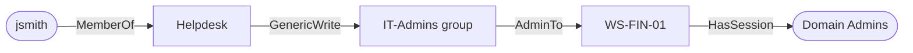

# Module 02 — Enumeration

*Type 3 · Blast-Radius Trace — enumerate a live domain with `ldapsearch`, `enum4linux-ng`, and BloodHound CE, then graph how "any authenticated user can read the whole directory" becomes a `jsmith → Domain Admins` shortest path, delivering the imported BloodHound attack-path graph. (Secondary: Detonate & Detect — note the Event 1644 / query-volume signal the enumeration leaves behind.) [Go to the hands-on lab →](lab.md)* &nbsp;·&nbsp; *[Cheat sheet →](cheatsheet.md)*

*Last reviewed: 2026-06*

**Active Directory & Windows Security** — *you can't attack what you can't see; every domain-level attack starts with a read.*

<!-- module-meta -->
**Difficulty:** Intermediate &nbsp;·&nbsp; **Estimated time:** ~5–7 hrs (study + lab) &nbsp;·&nbsp; **Prerequisites:** [Foundations](../../../00-foundations/README.md)
{ .module-meta }

!!! abstract "In 60 seconds"
    Active Directory is, by design, a readable LDAP directory — any authenticated user can query
    every user, group, SPN, and most ACLs. `ldapsearch` and `enum4linux-ng` pull that raw; the leap
    is **BloodHound**, which *graphs* the relationships so "who can reach Domain Admins?" becomes a
    shortest-path query that exposes three-hop paths invisible in any spreadsheet. SharpHound exploits
    nothing — it reads the directory as a normal user — so the detection is on the *pattern* (volume
    and source, e.g. Event 1644), not the query type.

## Why this matters

Enumeration is where almost every real intrusion goes sideways — either the attacker misses the path that would have been obvious with proper tooling, or the defender fails to notice that LDAP is being queried at 2 a.m. by a workstation that has no business doing so. The same LDAP interface that a legitimate tool uses to look up email addresses is the interface an attacker uses to map the entire domain's users, groups, SPNs, and ACL misconfigurations in minutes. Understanding enumeration from both sides is what separates defenders who detect it from defenders who only read about it.

## Objective

Enumerate a live Active Directory domain using `ldapsearch`, `enum4linux-ng`, and BloodHound CE; identify all users, groups, SPNs, and unconstrained delegation settings; and import the results into BloodHound to visualise attack paths.

## The core idea

Active Directory is, at its core, a publicly readable LDAP directory. Any authenticated domain user — including the lowest-privilege service account — can query every object in the directory by default. This is not a vulnerability; it is by design (the alternative, where only admins can read the directory, breaks every lookup an enterprise app makes). The consequence is that an attacker with *any* domain credential — even `jsmith` from Finance — can immediately query for users with SPNs, accounts with no Kerberos pre-authentication, groups and their members, and most ACL entries, all in plaintext LDAP over port 389. The first tool they'll reach for is `ldapsearch` (raw, precise, no dependencies), or the `impacket` suite's `GetADUsers.py`, `GetUserSPNs.py`, and `GetNPUsers.py`.

The conceptual leap with **BloodHound** is that it doesn't just list those objects — it *graphs* the relationships. BloodHound ingests the raw data from SharpHound (or the Python equivalent, `bloodhound-python`) and builds a directed graph where nodes are users, groups, computers, OUs, and GPOs, and edges are the relationships: `MemberOf`, `AdminTo`, `GenericWrite`, `HasSession`, `CanRBCD`. The attack-path query then becomes a graph shortest-path problem: "what is the minimum number of hops from `jsmith` to `Domain Admins`?" A domain that looks locked down in a spreadsheet view of group memberships can have a three-hop path to DA that only becomes visible when you ask the graph.

!!! note "The mental model"
    Stop thinking of enumeration as "listing objects" and start thinking of it as **building a
    graph**. Group membership is a table; attack paths are a graph problem. BloodHound's value isn't
    the data SharpHound collects (that's just normal LDAP/SMB) — it's reframing reachability as
    shortest-path, which is why a "locked-down" domain still has a three-hop route to DA.

What defenders often miss: the BloodHound data SharpHound collects is entirely available from normal LDAP and SMB queries. SharpHound doesn't exploit anything; it queries the directory as a legitimate user. A defender watching for "lateral movement" at the network level will miss it entirely. The detection is on the *enumeration pattern*: an account that has never queried LDAP before suddenly issuing thousands of LDAP requests to the DC (Event 1644 on Windows Server, or SMB enumeration of every computer in the domain). The signal is in the volume and the source, not the query type.

!!! warning "The gotcha"
    There is no "block enumeration" knob — directory readability is by design, and treating the
    *query* as malicious will bury you in false positives. The signal is **volume and source**: one
    LDAP query is noise; 2,000 in 60 seconds from a Finance workstation is the alert. And don't skip
    the unauthenticated pass — null sessions and guest access often hand away enumeration with no
    credential at all.

A practical note on **enum4linux-ng**: it wraps several enumeration techniques (RPC, SMB, LDAP) into a single scan and is especially useful for quickly baselining what a domain exposes to an unauthenticated or guest user. Many organisations accidentally expose null sessions or guest access that allows enumeration without any credential at all. enum4linux-ng surfaces that immediately. Always run it first — before you even have credentials — to establish what the domain gives away for free.

??? note "Go deeper: edges are not membership — they are exploitable relationships"
    The reason BloodHound's graph beats a membership export is that its **edges** encode *what you
    can do*, not just *what you're in*. `MemberOf` is the boring one; `GenericWrite`, `AdminTo`,
    `HasSession`, and `CanRBCD` each represent a concrete abuse you'll execute in later modules.
    Skim the BloodHound `docs/` for the edge taxonomy now — every edge type you learn here is a
    technique you'll detonate in modules 05–07.

!!! tip "AI caveat"
    A model writes BloodHound Cypher fast — ask it to turn "paths from jsmith to Domain Admins" into
    a query and run it in the UI. But it will occasionally invent edge types that don't exist;
    confirm every edge against the BloodHound docs and check the result against the raw JSON.

## Learn (~4 hrs)

**LDAP enumeration**
- [ldapsearch man page + tutorial (LDAP.com)](https://ldap.com/ldap-tools/) — understand the filter syntax before you run anything. The most important filter for AD: `(objectClass=user)`, `(objectClass=group)`, `(servicePrincipalName=*)`.
- [LDAP Filter Syntax — RFC 4515](https://tools.ietf.org/html/rfc4515) — the canonical LDAP filter specification; reference for crafting precise queries for users, groups, and SPNs.

**BloodHound CE**
- [BloodHound CE source and docs (GitHub)](https://github.com/SpecterOps/BloodHound) — the architecture, the Cypher query examples, and the edge types. Skim the `docs/` directory to understand what each edge means.

**bloodhound-python**
- [bloodhound-python (GitHub)](https://github.com/dirkjanm/BloodHound.py) — the Python ingestor that talks to a live DC from a Linux attacker. Understand the flags: `-d` (domain), `-u` (user), `-p` (password), `-c All` (collect everything).

**ATT&CK mapping**
- [T1069 — Permission Groups Discovery (ATT&CK)](https://attack.mitre.org/techniques/T1069/) and [T1087 — Account Discovery (ATT&CK)](https://attack.mitre.org/techniques/T1087/) — the formal technique descriptions. Know the sub-techniques.

## Key concepts
- Any authenticated domain user can read most of the LDAP directory by default — this is by design.
- `ldapsearch` with the right filter is the most direct way to query the directory; no dependencies, no noise.
- BloodHound turns LDAP data into a graph and turns attack-path analysis into a shortest-path query.
- BloodHound edges (`MemberOf`, `GenericWrite`, `AdminTo`, etc.) represent exploitable relationships, not just membership.
- Enumeration detection is a volume/pattern problem: one LDAP query is noise; 2,000 in 60 seconds from a Finance workstation is a signal.
- Null sessions and guest access can expose enumeration without any credentials at all.

## AI acceleration

BloodHound CE has a natural-language query interface in its Enterprise tier; in CE, you write Cypher queries manually. Ask a model to translate an attack path question ("what paths exist from jsmith to Domain Admins?") into a Cypher query, then run it in the BloodHound UI. Verify the result against what you see in the raw JSON — AI is good at Cypher templating but will occasionally hallucinate edge types that don't exist. Always confirm the edges it uses against the BloodHound docs.

!!! question "Check yourself"
    - Why is "any authenticated user can read the whole directory" a design decision rather than a vulnerability — and what does that imply for detection?
    - What does BloodHound add over a flat export of group memberships?
    - Your SIEM can't alert on "an LDAP query happened." What signal *does* distinguish enumeration from normal directory use?
