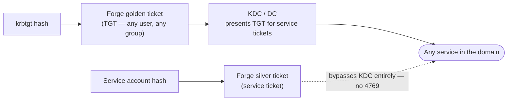

# Module 07 — Persistence in AD

*Type 5 · Detonate & Detect — create golden (T1558.001) and silver (T1558.002) tickets and establish DCSync rights (T1003.006) against Corp, capturing the artefacts each leaves, delivering the executed persistence plus what genuinely removes it. (Secondary: Reconstruct — answer what "fully remediated" actually requires, e.g. rotating krbtgt twice, as an IR reconstruction.) [Go to the hands-on lab →](lab.md)*

*Last reviewed: 2026-06*

**Active Directory & Windows Security** — *losing domain admin access once is a setback; being kicked out after a golden ticket is nearly impossible without a full domain rebuild.*

<!-- module-meta -->
**Difficulty:** Intermediate &nbsp;·&nbsp; **Estimated time:** ~4–6 hrs (study + lab) &nbsp;·&nbsp; **Prerequisites:** [Foundations](../../../00-foundations/README.md)
{ .module-meta }

!!! abstract "In 60 seconds"
    AD persistence is durable because it survives password resets and most of incident response. A
    **golden ticket** forges a TGT from the `krbtgt` hash — any user, any group, ~10 years — and the
    only fix is rotating `krbtgt` **twice**. A **silver ticket** forges a service ticket from a
    service account's hash and never touches the KDC, so there's no 4769 at all. **DCSync rights**
    granted to a low-privilege account quietly enable on-demand credential pulls. All three hide in
    legitimate-looking traffic; "remediated" means far more than deleting the attacker's account.

## Why this matters

Most real-world intrusions are not discovered during the initial compromise — they are discovered months later, when the attacker has already established multiple layers of persistence. AD-level persistence (golden tickets, DCSync rights, AdminSDHolder abuse) is particularly durable because it survives password resets, account lockouts, and even most incident response actions short of a full domain recovery. Understanding these mechanisms is essential for both the attacker writing the playbook and the defender who needs to know what "fully remediated" actually requires.

## Objective

Demonstrate golden ticket creation (T1558.001), silver ticket creation (T1558.002), and DCSync persistence rights (T1003.006) against the Corp domain; explain what artefacts each leaves and what remediation genuinely removes them.

## The core idea

A **golden ticket** is a forged Kerberos TGT — crafted without involving the KDC, using only the `krbtgt` account's NT hash and the domain's SID. Because every DC validates TGTs by checking the signature with the `krbtgt` key, a valid `krbtgt` hash is sufficient to create a ticket for any user, with any group membership, valid for any duration (the default forged lifetime is 10 years). The attack consequence: once an attacker has the `krbtgt` hash (via DCSync from module 04), they maintain persistent, unkickable access to the domain. Password resets on user accounts are irrelevant. Revoking domain admin doesn't help. The only remediation is rotating the `krbtgt` hash — twice, because Kerberos remembers the previous hash for interoperability — and even then, any outstanding golden tickets remain valid until their embedded expiry time.

!!! note "The mental model"
    Persistence here is about owning the *minting key*, not an account. The `krbtgt` hash is the key
    that signs every TGT in the domain — steal it and you can print identities forever, which is why
    resetting user passwords or revoking DA does nothing. Think "they have the printing press," not
    "they have a stolen badge."

A **silver ticket** is a forged service ticket, encrypted with the *service account's* hash rather than the `krbtgt` hash. It is more targeted — valid only for a specific service/host — and completely bypasses the KDC, meaning there is no TGS-REQ event on the DC at all. Silver tickets are useful for persistent access to specific services (a file server, an MSSQL instance) even after the domain is partially cleaned up. They are harder to detect than golden tickets because the KDC is never consulted during their use.

**DCSync persistence** takes a different form: instead of forging tickets, it adds `DS-Replication-Get-Changes` and `DS-Replication-Get-Changes-All` rights to an attacker-controlled account on the domain object. These are the rights that allow a DC to replicate credentials from another DC — and that allow `secretsdump.py` to pull all hashes without touching NTDS.dit on disk. With these rights, an attacker doesn't need DA privileges; they can pull fresh credentials any time from a low-privilege-looking account. This misconfiguration is often missed in incident response because the attacker-added ACEs on the domain object don't show up in the normal group membership review.

The practical detection challenge is that all three persistence mechanisms leave minimal footprint during use: golden and silver tickets are used exactly like legitimate Kerberos tickets; DCSync traffic looks like normal DC replication. The detection window is narrow — Event 4768 with an unusual source IP for a TGT that nobody requested, Event 4662 for an account exercising replication rights when it has no business doing so. The key insight for defenders: the remediation is not just removing the attacker's account — it is rotating `krbtgt` (twice), auditing the domain object's ACL for replication rights, auditing AdminSDHolder for added ACEs, and checking for rogue DCs. Anything less and the attacker likely remains.

!!! warning "The gotcha"
    "We reset the compromised accounts" is not remediation. A single `krbtgt` rotation isn't enough
    (Kerberos keeps the previous hash for interoperability — rotate **twice**), DCSync ACEs and
    AdminSDHolder additions don't appear in any group-membership review, and outstanding golden
    tickets stay valid until their embedded expiry regardless. The honest answer to "are they out?"
    is usually "not yet."

??? note "Go deeper: AdminSDHolder is persistence that reinstates itself"
    The nastiest variant is **AdminSDHolder** abuse: an attacker adds an ACE to the AdminSDHolder
    object, and the SDProp process propagates it to *every protected group* roughly every 60 minutes.
    Remove the ACE from Domain Admins and it comes *back* on the next cycle. This is why IR has to
    audit AdminSDHolder itself, not just the protected groups — you're fighting a clock that re-stamps
    the attacker's access for them.

!!! tip "AI caveat"
    Have a model draft the "golden ticket was used" remediation checklist — it's a good scaffold. But
    it routinely omits the load-bearing steps: **rotate `krbtgt` twice**, audit AdminSDHolder for
    added ACEs, and check for rogue DCs. Grade its list against the Microsoft IR guide and
    adsecurity.org before you trust it as a runbook.

## Learn (~3 hrs)

**Golden and silver tickets**
- [Golden Ticket Attack Explained (adsecurity.org)](https://adsecurity.org/?p=1640) — the original Sean Metcalf writeup; the most precise technical explanation of what the `krbtgt` hash enables and why the detection is hard.
- [T1558.001 — Golden Ticket (MITRE ATT&CK)](https://attack.mitre.org/techniques/T1558/001/) — the formal technique description with detection guidance. Note the two required rotations of `krbtgt`.
- [T1558.002 — Silver Ticket (MITRE ATT&CK)](https://attack.mitre.org/techniques/T1558/002/) — the silver ticket technique; pay attention to the "no KDC contact" property and its detection implications.

**DCSync and AD persistence**
- [DCSync Attack (adsecurity.org)](https://adsecurity.org/?p=1729) — the full explanation of how DS-Replication rights work and why adding them to a normal account is invisible to most monitoring.
- [AdminSDHolder abuse (adsecurity.org)](https://adsecurity.org/?p=1906) — a persistence technique where an attacker adds ACEs to the AdminSDHolder object, which propagates to all protected groups every 60 minutes.

**Impacket ticketer**
- [impacket ticketer.py (GitHub)](https://github.com/fortra/impacket/blob/master/examples/ticketer.py) — the tool used to forge golden and silver tickets. Read the usage: `-nthash` (krbtgt hash), `-domain-sid`, `-domain`, user.

## Key concepts
- Golden ticket = forged TGT using `krbtgt` hash; valid for any user, any group, any duration.
- Silver ticket = forged TGS using service account hash; bypasses KDC entirely — no Event 4769.
- Rotate `krbtgt` *twice* to invalidate golden tickets; a single rotation is not sufficient.
- DCSync rights (`DS-Replication-Get-Changes-All`) on a non-DC account = persistent credential pull without DA.
- AdminSDHolder ACEs propagate every 60 minutes to all protected groups — persistence that resets itself.
- Detection: Event 4769 with unusual encryption type, Event 4662 for replication events from non-DC accounts, Event 4624 for ticket-based logons with PAC anomalies.

## AI acceleration

Ask a model to write a remediation checklist for a "golden ticket was used" incident. What must be done, in what order? Check its list against the Microsoft incident response guide and the adsecurity.org golden ticket remediation notes — the model will often miss the "rotate twice" requirement or the AdminSDHolder audit step.

!!! question "Check yourself"
    - Why does resetting every user's password fail to evict a golden-ticket attacker, and what actually does?
    - Why must `krbtgt` be rotated twice rather than once?
    - DCSync rights granted to a normal-looking account survive most IR. Why doesn't a group-membership review catch this, and what does?
