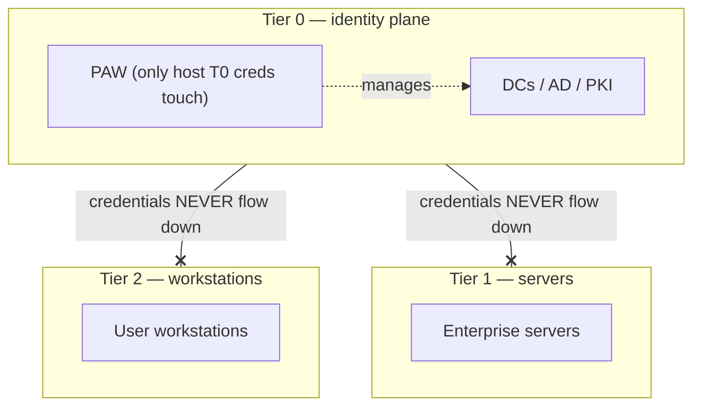

# Module 11 — Defending Identity

*Type 10 · Design → Red-team-your-own-design → Harden — design a tiered administrative model for Corp that structurally breaks each hop in PATH-001 (module 08), implement it as GPO restrictions and group-membership rules, then re-walk PATH-001 against the new design to prove the path now dies, delivering the architecture plus a control matrix mapping each technique to the control that prevents it. (Secondary: Decision / ADR — defend the tradeoff calls, e.g. Protected Users vs Authentication Policy Silos, tier-by-OU vs tier-by-group.) [Go to the hands-on lab →](lab.md)*

*Last reviewed: 2026-06*

**Active Directory & Windows Security** — *the attacks in modules 03-08 are symptoms; the tiered admin model is the architecture that makes them structurally impossible.*

<!-- module-meta -->
**Difficulty:** Intermediate &nbsp;·&nbsp; **Estimated time:** ~5–7 hrs (study + lab) &nbsp;·&nbsp; **Prerequisites:** [Foundations](../../../00-foundations/README.md)
{ .module-meta }

!!! abstract "In 60 seconds"
    Patching findings one at a time always leaves you a finding behind; the architectural answer is a
    **tiered admin model** that makes the attacks structurally impossible. The central rule:
    higher-tier credentials never touch lower-tier hosts, so a compromised Finance workstation can
    *never* hold a domain admin's hash. The enforcement stack is GPO "Deny log on" restrictions, PAWs,
    the **Protected Users** group (no NTLM, no RC4, no delegation, 4-hour TGT), and **JIT** access that
    keeps privileged groups empty. You'll design it, then re-walk PATH-001 to prove the path dies.

## Why this matters

Hardening individual misconfigurations (module 10) is necessary but insufficient. An environment that patches each finding as it's discovered will always be one new finding behind. The architectural answer — the one that changes the economics for an attacker — is a **tiered admin model** that structurally prevents privileged credentials from ever being in the same place as untrusted code. When Tier 0 credentials (domain admin) can only be used from Tier 0 hosts (PAWs / jump servers), and those hosts only accept Tier 0 user logons, a compromised Finance workstation can *never* contain a domain admin credential in memory. The attack paths from module 08 depend on credential co-location; the tiered model eliminates that.

## Objective

Design a tiered administrative model for Corp that structurally breaks each hop in the primary attack path (module 08, PATH-001), implement it as a set of GPO restrictions and group membership rules, and produce a control matrix mapping each attack technique to the control that prevents it.

## The core idea

The Microsoft tiered admin model (now evolved into the "Enterprise Access Model") divides the environment into three tiers based on control scope: **Tier 0** controls the entire identity plane (DCs, AD itself, PKI, federation); **Tier 1** controls enterprise servers and applications; **Tier 2** controls workstations and user devices. The central rule: credentials from a higher tier must never be exposed on a lower-tier host. A domain admin who logs on to a user workstation to fix a printer driver has just exposed their credential to whatever is running on that workstation — a keylogger, a credential-harvesting tool, or simply a stale LSASS dump.

!!! note "The mental model"
    Every attack path in modules 03–08 depends on **credential co-location** — a privileged hash
    landing in memory on a host an attacker can reach. Tiering attacks the precondition, not the
    technique: if Tier 0 credentials only ever exist on Tier 0 hosts, owning every Tier 2 workstation
    yields *nothing* against Tier 0. You're not blocking the exploit; you're removing the credential
    it would have stolen.

The enforcement mechanism is GPO-based logon restrictions: **"Deny log on locally"** and **"Deny log on through Remote Desktop Services"** applied to privileged accounts on lower-tier systems. Paired with **Privileged Access Workstations (PAWs)** — hardened devices used only for administrative tasks, with no internet browsing, no email, and no standard user applications — this means Tier 0 credentials are physically and logically isolated from the threat landscape that workstations face. An attacker who compromises every Finance workstation in the domain has gained nothing useful against a correctly tiered Tier 0.

The **Protected Users** security group is the Kerberos-level enforcement: accounts in Protected Users cannot use NTLM for authentication (removing PTH from the picture), cannot be delegated (removing delegation abuse), have their TGT lifetime reduced to 4 hours, and cannot use DES or RC4 encryption types (eliminating Kerberoasting of those accounts). For Tier 0 and Tier 1 service accounts, Protected Users membership — combined with password complexity requirements — removes the entire Kerberos attack surface with a single group membership.

The **Just-In-Time (JIT) access** pattern goes further: privileged group memberships are not permanent. An admin requests elevated access for a specific task, receives time-bounded membership in the privileged group via an automation workflow, and the membership expires automatically. This means the BloodHound graph of "who has GenericWrite on Domain Admins" is almost always empty — the answer is "nobody, right now." JIT is the architectural answer to the question "what if an attacker finds a path to DA through a service account?" — the answer is "the path exists, but it leads to a group that no account is currently a member of."

!!! warning "The gotcha"
    The enforcement is GPO logon restrictions — and they cut the wrong way just as easily as the
    right way. "Deny log on through Remote Desktop Services" applied to the wrong **scope** can lock
    every administrator out of a production DC. This module designs the model on a clean slate;
    module 12 is the entire lesson of why you *never* link those GPOs at the domain root in one shot.

??? note "Go deeper: what Protected Users and Credential Guard do *not* cover"
    Protected Users is a powerful single-group switch (no NTLM, no delegation, no RC4/DES, 4-hour
    TGT), but it has caveats — it breaks NTLM-dependent apps for its members, and it does not protect
    *local* accounts. Credential Guard virtualises LSASS to protect NT hashes and TGTs, but it does
    *not* protect DPAPI blobs or cached credentials used for offline logon. Knowing the gaps is the
    difference between defence-in-depth and a false sense of coverage; pair these with Authentication
    Policy Silos (which restrict *where* a Tier 0 account can even obtain a TGT).

!!! tip "AI caveat"
    A model is a good starting point for the exact GPO policy paths and values to enforce Tier 0
    logon restrictions — but validate each against the Microsoft hardening baseline, and pay special
    attention to "Deny log on through Remote Desktop Services": a model that applies it at the wrong
    scope will cheerfully lock you out of a production DC.

## Learn (~4 hrs)

**Tiered admin model**
- [Microsoft Enterprise Access Model (Microsoft Docs)](https://learn.microsoft.com/en-us/security/privileged-access-workstations/privileged-access-access-model) — the current Microsoft guidance on tiering (the evolution of the older ESAE/Tier model). Read the "Control plane" and "Management plane" sections. This is the architecture document; understand the concepts before implementing.
- [Privileged Access Workstations (PAWs) (Microsoft Docs)](https://learn.microsoft.com/en-us/security/privileged-access-workstations/privileged-access-devices) — the device-level component; understand what makes a PAW different from a standard workstation.

**Protected Users and Kerberos hardening**
- [Protected Users Security Group (Microsoft Docs)](https://learn.microsoft.com/en-us/windows-server/security/credentials-protection-and-management/protected-users-security-group) — exactly what protections the group provides and, critically, what it does *not* protect. Read the "Protected Users group caveats" section.
- [Authentication Policies and Policy Silos (Microsoft Docs)](https://learn.microsoft.com/en-us/windows-server/security/credentials-protection-and-management/authentication-policies-and-authentication-policy-silos) — the next step beyond Protected Users; restricts which hosts a Tier 0 account can even obtain a TGT from.

**Credential Guard**
- [Windows Defender Credential Guard (Microsoft Docs)](https://learn.microsoft.com/en-us/windows/security/identity-protection/credential-guard/credential-guard) — virtualises LSASS so that credential material is protected even when an attacker has SYSTEM on a host. Understand what it protects (NT hashes, TGTs) and what it does not (DPAPI blobs, cached credentials for offline logon).

## Key concepts
- Tier 0 = domain controllers, AD itself; Tier 1 = enterprise servers; Tier 2 = workstations.
- The central rule: higher-tier credentials never touch lower-tier hosts.
- GPO "Deny log on locally/RDP" on lower-tier hosts enforces the separation.
- Protected Users: no NTLM, no delegation, no RC4/DES, 4-hour TGT. Add all Tier 0 accounts.
- PAW: the hardened device that is the *only* host Tier 0 credentials ever touch.
- JIT access: time-bounded, workflow-approved privileged group membership. Empty groups = no persistent attack paths.
- Credential Guard: kernel-level protection of LSASS credential material via virtualisation.
- Authentication Policy Silos: device-level restriction — Tier 0 accounts can only get TGTs from approved hosts.

## AI acceleration

Ask a model to draft the GPO settings (specific policy paths and values) required to enforce Tier 0 logon restrictions on a Windows Server 2019 DC. The model's output is a good starting point for the exact policy paths — but validate each setting against the Microsoft hardening baseline before applying it. Pay particular attention to "Deny log on through Remote Desktop Services" — accidentally applying it to the wrong scope can lock administrators out of a production DC.

!!! question "Check yourself"
    - The attacks in modules 03–08 all depend on one precondition. What is it, and how does tiering remove it rather than block the technique?
    - What does adding an account to Protected Users change, and name one thing it does *not* protect.
    - Why does JIT access make a BloodHound "path to Domain Admins" frequently dead even though the edges still exist?
