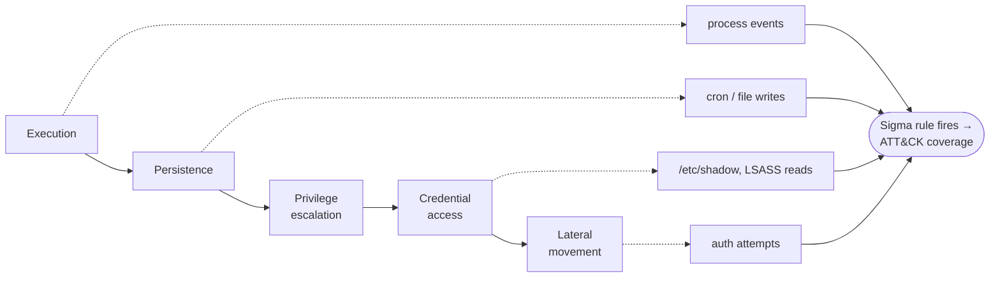

# Module 10 — Detecting Host Compromise

*Type 5 · Detonate & Detect — match Sigma rules (via sigma-cli) against Wazuh-shaped alert JSON for lateral movement, credential dumping, and persistence, identify which fire and why, and map coverage to ATT&CK to produce a gap analysis. (Secondary: Judgment-as-Code / Gate — the detection-as-code rules form a coverage gate against compromise indicators.) [Go to the hands-on lab →](lab.md)* &nbsp;·&nbsp; *[Cheat sheet →](cheatsheet.md)*

*Last reviewed: 2026-06*

**[Track 07 — Endpoint & Host Hardening]** — *Hardening raises the cost of attack; detection ensures the cost is paid visibly, not silently.*

<!-- module-meta -->
**Difficulty:** Intermediate &nbsp;·&nbsp; **Estimated time:** ~5–7 hrs (study + lab) &nbsp;·&nbsp; **Prerequisites:** [Foundations](../../../00-foundations/README.md)
{ .module-meta }

!!! abstract "In 60 seconds"
    Hardening makes a host expensive to attack; detection makes the attack *visible* — and the two are
    complements, not substitutes. Post-compromise activity follows a recognisable playbook (execution,
    persistence, privesc, credential access, lateral movement), and each phase leaves observable
    artefacts. This module matches Sigma rules against Wazuh-shaped alert JSON for those behaviours,
    works out which fire and why, and maps coverage to ATT&CK to produce a gap analysis. The output
    isn't "we have 200 rules" — it's "we cover 83% of Credential Access, with these named gaps."

## Why this matters

The hardening baseline (modules 02–09) makes a host expensive to attack. Detection makes the attack visible. These are complementary, not substitutes — a perfectly hardened host that generates no alerts is an unobservable target; a well-instrumented host that generates no hardening controls is an easily-exploited but noisy one. The combination — hardened and instrumented — is what security operations actually needs: a host that is hard to compromise and loud when something does get through.

## Objective

Use Wazuh and sigma-cli to match Sigma detection rules against a set of Wazuh-shaped alert JSON representing common host compromise indicators — lateral movement, credential dumping, persistence — and identify which alerts fire and why.

## The core idea

Host compromise has a recognisable pattern. Regardless of the initial access technique, most post-compromise activity follows a playbook: execution (running commands), persistence (ensuring access survives reboots), privilege escalation (reaching root or SYSTEM), credential access (dumping LSASS, reading /etc/shadow, extracting browser credentials), and lateral movement (using those credentials to pivot). Each of these phases produces observable artefacts on the host — process creation events, file modifications, authentication attempts, network connections. Detection is the practice of writing rules that fire on those artefacts.

!!! note "The mental model"
    Initial access varies, but post-compromise activity follows a playbook — and every phase of it
    leaves observable artefacts (process events, file writes, auth attempts). Detection is writing
    rules that fire on those artefacts, in Sigma's portable schema so the rule outlives any one SIEM,
    then asking the coverage question: for each ATT&CK technique, do I have a rule that fires?

Wazuh's agent collects and normalises these artefacts from multiple sources: syslog, auditd, FIM events, osquery results, Windows event logs. The normalised events are then forwarded to the Wazuh manager for rule evaluation. Wazuh ships with a large library of detection rules that cover common attack patterns — but the library is general, and the practitioner's job is to tune it for the environment. A rule that fires on every privileged command is useless in an environment where operators run sudo constantly; the same rule tuned to fire only on first-time privilege use by a non-admin user is signal.

!!! warning "The gotcha"
    A shipped rule library is general, not tuned to you — a rule that fires on *every* privileged
    command is noise in a shop where operators run sudo all day, and noise is how real alerts get
    ignored. The skill is tuning: the same rule scoped to first-time privilege use by a non-admin is
    signal. Rule count is vanity; tuned coverage against your ATT&CK gaps is the metric.

Sigma is the portable rule format that translates across SIEMs. A Sigma rule describes a detection condition in a vendor-neutral schema; sigma-cli converts it to the query language of a specific SIEM or log tool. Writing host compromise detections in Sigma means the rule is not locked to Wazuh — it can be converted to Splunk SPL, Elastic EQL, or Microsoft Sentinel KQL as the organisation's tooling changes. This is the "detection-as-code" pattern from Track 02 applied to endpoint events.

The detection coverage question is: for each technique in the adversary's post-compromise playbook, do you have a rule that fires on it? ATT&CK's technique matrix for Linux and Windows endpoint provides the checklist. A mature host monitoring programme maps each detection rule to one or more ATT&CK techniques and identifies gaps — techniques with no rule — as detection engineering priorities. The gap analysis is the output that drives the roadmap: not "we have 200 rules" but "we cover 67% of ATT&CK Initial Access and 83% of Credential Access, with these specific gaps."

!!! tip "AI caveat"
    A model drafts a Sigma rule for a given ATT&CK technique quickly — but a rule that *looks* right
    can miss the real events or fire on benign ones. Test the generated YAML against your sample alert
    JSON with sigma-cli: does it match the malicious events and stay quiet on the benign ones? The
    test data, not the model, tells you the rule works.

## Learn (~4 hrs)

**Wazuh host monitoring**
- [Wazuh documentation — File Integrity Monitoring](https://documentation.wazuh.com/current/user-manual/capabilities/file-integrity/index.html) — FIM is the foundational host detection capability; read the overview and configuration sections.
- [Wazuh documentation — Audit (auditd) integration](https://documentation.wazuh.com/current/user-manual/capabilities/system-calls-monitoring/index.html) — how Wazuh collects kernel audit events for process/syscall-level visibility.
- [Wazuh rule writing guide](https://documentation.wazuh.com/current/user-manual/ruleset/ruleset-xml-syntax/index.html) — the Wazuh rule XML syntax; understand the `if_sid`, `field`, and `options` elements.

**Sigma for endpoint detection**
- [Sigma specification (GitHub)](https://github.com/SigmaHQ/sigma-specification/blob/main/specification/sigma-rules-specification.md) — the rule schema reference; focus on `detection`, `condition`, and `logsource` sections.
- [SigmaHQ rules repository — linux category](https://github.com/SigmaHQ/sigma/tree/master/rules/linux) — browse the Linux endpoint rules; read 3–4 to understand the pattern before writing your own.

**ATT&CK coverage and gap analysis**
- [ATT&CK Navigator](https://mitre-attack.github.io/attack-navigator/) — the coverage mapping tool; load a technique list and see gaps visually.

## Key concepts

- Post-compromise phases produce observable artefacts; detection is rules that fire on those artefacts.
- Wazuh normalises events from auditd, FIM, syslog, and osquery; Sigma rules describe detection conditions portably.
- Rule tuning is the practitioner skill: a rule that fires on everything is noise; a rule tuned to the environment is signal.
- ATT&CK technique coverage gap analysis drives the detection engineering roadmap.
- Detection and hardening are complementary: hardened host = expensive to compromise; instrumented host = visible when compromised.

## AI acceleration

Ask an AI to write a Sigma rule for a specific ATT&CK technique (e.g. T1003.008 — `/etc/passwd` credential dumping). Test the generated rule against the sample alert JSON with sigma-cli. Does it match the expected events? Does it produce false positives on the benign events? The model drafts the YAML; `sigma-cli` and the test data tell you if it works.

!!! question "Check yourself"
    - Why are hardening and detection complements rather than substitutes?
    - Why write detections in Sigma rather than directly in Wazuh's rule format?
    - What makes "we have 200 rules" a worse answer to the coverage question than an ATT&CK gap analysis?
