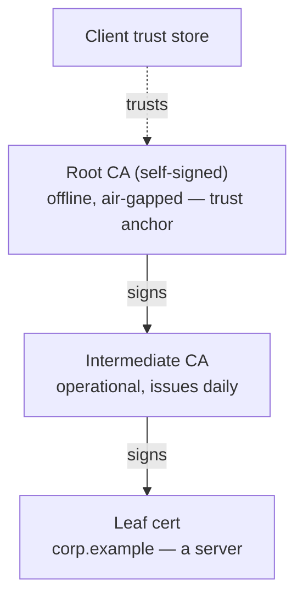

# Module 06 — PKI & Certificate Management

*Type 7 · Build-&-Operate — stand up a CA with step-ca, issue and chain certificates, and prove revocation actually works (the soft-fail gotcha); the deliverable is the running PKI and a verified revocation. (Secondary: Concept Autopsy.) [Go to the hands-on lab →](lab.md)*

*Last reviewed: 2026-06*

**[Track 08 — Cryptography, PKI & Secrets]** — *Certificates solve the "who are you talking to" problem — the chain of trust is only as strong as the weakest CA in it.*

<!-- module-meta -->
**Difficulty:** Intermediate &nbsp;·&nbsp; **Estimated time:** ~5–7 hrs (study + lab) &nbsp;·&nbsp; **Prerequisites:** [Foundations](../../../00-foundations/README.md)
{ .module-meta }

!!! abstract "In 60 seconds"
    PKI is how TLS's *authenticity* guarantee works — a certificate chain links a server's public key
    to a signature your client already trusts. The chain is a delegation of trust, and it's only as
    strong as the weakest CA in your trust store: DigiNotar (2011) was breached, mis-issued a trusted
    `*.google.com` cert, and one CA compromise let an attacker impersonate any site. Revocation is the
    intended undo button, but it half-works — soft-fail clients treat an unreachable check as "valid,"
    which is why short-lived certs plus automated renewal beat revocation in practice.

## Why this matters

In 2011, the Dutch certificate authority **DigiNotar** was breached, and the attacker issued a fraudulent wildcard certificate for **`*.google.com`** — which was then used to silently man-in-the-middle the Gmail traffic of Iranian users ([Mozilla Security Blog — "Fraudulent \*.google.com Certificate"](https://blog.mozilla.org/security/2011/08/29/fraudulent-google-com-certificate/)). Every browser on earth *cryptographically trusted* that certificate, because every browser trusted DigiNotar's root. Within weeks, browser vendors yanked the DigiNotar root entirely and the company went bankrupt. That is the structural lesson of PKI: the chain of trust is only as strong as the *weakest* CA in your trust store, and a single compromised CA can impersonate any site on the internet. Public Key Infrastructure is the mechanism by which TLS's authenticity guarantee works — without it, a server can prove it has a keypair but cannot prove it is the server you intended to connect to, and a man-in-the-middle attacker could substitute their own keypair. The certificate chain answers the "is this the right server?" question by linking the server's public key to a trusted authority's signature. Understanding how certificate chains work, how CAs issue and revoke certificates, and how to run a private CA is essential for engineers who operate TLS services, code-signing pipelines, or mutual TLS (mTLS) authentication.

## Objective

Use `step-ca` to initialise a private Certificate Authority, issue a leaf certificate, verify the chain, and demonstrate OCSP-based revocation — showing the complete certificate lifecycle that a production PKI programme operates.

## The core idea

A certificate chain is a delegation of trust. At the root is a self-signed CA certificate — the trust anchor, whose public key is distributed to clients out-of-band (in a browser's trust store, in an OS keychain, or in a TLS client's configuration). This delegation is also the weak point: the DigiNotar 2011 compromise produced a chain that validated perfectly to a trusted root, which is why a CA breach defeats the entire model rather than one site. The root CA signs intermediate CA certificates; the intermediate CA signs leaf (end-entity) certificates:

This three-tier structure separates the high-value root CA (which can be offline and air-gapped) from the operational intermediate CA (which issues certificates day-to-day), limiting the blast radius of a CA private key compromise.

!!! note "The mental model"
    A certificate doesn't prove "this server is trustworthy" — it proves "an authority you already
    trust vouches that this public key belongs to this name." All the security collapses to one
    question: do you trust the root at the top of the chain? Trust is transitive down the chain and no
    stronger than its weakest link.

!!! warning "The gotcha"
    Every CA in your trust store can mint a valid certificate for *any* name on the internet — that's
    DigiNotar's lesson. The trust model has no "this CA may only issue for these domains" boundary by
    default; one compromised or rogue CA impersonates everyone. Constraints like CAA records and short
    lifetimes are mitigations bolted on *because* the base model is this permissive.

Certificate fields matter for security. The `subjectAltName` extension (SAN) carries the hostname(s) the certificate is valid for — the Common Name (CN) is deprecated for hostname validation and ignored by modern TLS implementations. The `notBefore` and `notAfter` fields bound the validity period; a certificate with a 10-year validity is a certificate whose private key needs to be kept secret for 10 years, which is why best practice has moved toward 90-day certificates (as Let's Encrypt uses). The `basicConstraints` extension with `CA:TRUE` marks a certificate as a CA certificate capable of signing others — a leaf certificate without this constraint cannot be used as a CA, which is why a stolen leaf certificate cannot be used to sign arbitrary certificates.

Revocation is the mechanism for invalidating a certificate before its `notAfter` date. Two protocols exist. CRL (Certificate Revocation List) is a signed list of revoked serial numbers distributed by the CA and cached by clients. OCSP (Online Certificate Status Protocol) is a real-time query: the client sends the certificate's serial number to the CA's OCSP responder and receives a signed "good" or "revoked" response. OCSP Stapling moves the OCSP query to the server — the server periodically fetches and caches the OCSP response and staples it to the TLS handshake, eliminating the privacy and latency issues of client-side OCSP queries. In practice, revocation is imperfect: CRL caching, OCSP soft-fail (browsers continue if OCSP is unreachable), and the lack of universal OCSP stapling deployment mean revocation is not a reliable last line of defence — which is why short-lived certificates and automated renewal are the modern answer.

??? note "Go deeper: why revocation 'works' in theory and not in practice"
    CRL and OCSP both let a CA say "this cert is dead before its expiry" — but the client has to act on
    it. OCSP soft-fail is the gap: if the responder is slow or blocked, browsers proceed rather than
    break the page, so an attacker who can block the check defeats revocation entirely. CRL caching and
    patchy OCSP-stapling deployment widen the gap further. That structural unreliability is why the
    industry pivoted to short-lived certs (90 days, Let's Encrypt), OCSP stapling, and browser-pushed
    sets like CRLite — shrink the exposure window instead of relying on a check that may never run.

Running a private CA with `step-ca` is the practical equivalent of what every PKI-using organisation should have: an internal CA for mTLS between services, for developer certificate issuance, and for internal HTTPS without depending on a public CA's pricing or policies. `step-ca` is an ACME-compatible CA server — internal services can use `certbot` or any ACME client to obtain and auto-renew certificates from it, the same workflow as Let's Encrypt but with a private trust anchor.

!!! tip "AI caveat"
    An AI is a good X.509 field explainer — paste `openssl x509 -text` output and it annotates each
    extension. But verify the load-bearing claims (what `basicConstraints CA:TRUE` permits, whether CN
    is honored for hostnames) against RFC 5280 §4.2; a confident wrong answer here misreads what a
    certificate is actually authorised to do.

## Learn (~4 hrs)

**PKI's real-world failures — the *why* (~20 min)**
- [Mozilla Security Blog — "Fraudulent \*.google.com Certificate" (2011)](https://blog.mozilla.org/security/2011/08/29/fraudulent-google-com-certificate/) — the DigiNotar compromise: an attacker mis-issued a trusted `*.google.com` cert used to MITM Iranian Gmail users, ending with browsers removing the root and the CA's bankruptcy. The definitive case that a single compromised CA breaks trust for the whole web.
- [NVD — CVE-2008-0166 (Debian OpenSSL weak keys)](https://nvd.nist.gov/vuln/detail/CVE-2008-0166) — a Debian patch crippled OpenSSL's PRNG so generated keys were predictable; any certificate or SSH key made on an affected system for ~2 years was guessable. A different PKI failure — the *key* under the cert, not the CA — and why key provenance matters in an audit.

**PKI and X.509**
- [Everything you should know about certificates and PKI but are too afraid to ask (SmallStep blog)](https://smallstep.com/blog/everything-pki/) — the clearest conceptual treatment of the certificate chain, extensions, and trust model available; read the full post (~45 min).
- [RFC 5280 — X.509 PKI Certificate and CRL Profile](https://www.rfc-editor.org/rfc/rfc5280) — Sections 4.1–4.2 (certificate structure and extensions) and Section 6 (path validation); the normative reference.

**step-ca**
- [step-ca documentation — Getting Started](https://smallstep.com/docs/step-ca/) — read the Installation, Initialisation, and Certificate Issuance sections.
- [step CLI documentation](https://smallstep.com/docs/step-cli/) — the command-line tool for interacting with step-ca; read the `step ca certificate` and `step certificate inspect` commands.

**Revocation**
- [Adam Langley — "Revocation still doesn't work" (ImperialViolet)](https://www.imperialviolet.org/2014/04/29/revocationagain.html) — the practitioner reality behind CRLs and OCSP: soft-fail clients treat a missing revocation response as "valid," so classic revocation does not stop an attacker who can block the check. Read it to understand why OCSP stapling, short-lived certs, and browser-pushed CRL sets (CRLite) emerged. Frames the revocation step in the lab.

## Key concepts

- Certificate chain: root CA (offline, trust anchor) → intermediate CA (operational) → leaf certificate (end-entity).
- SAN (subjectAltName) is the hostname validation field; CN is deprecated for this purpose.
- Short validity periods + automated renewal > long-lived certificates + revocation.
- OCSP Stapling: server fetches and caches OCSP response, staples it to TLS handshake — eliminates client-side OCSP queries.
- step-ca: ACME-compatible private CA; same automated renewal workflow as Let's Encrypt.
- The chain is only as strong as its weakest CA: **DigiNotar 2011** (a breached CA issued a trusted `*.google.com` cert) is the canonical proof a single compromised CA breaks trust for everyone.

## AI acceleration

Ask an AI to explain what each field in an X.509 certificate does (paste the output of `openssl x509 -text -in cert.pem -noout`). Use the explanation to understand each extension before the lab. Verify the extension descriptions against RFC 5280 Section 4.2 — does the model's description match the RFC's normative requirement?

!!! question "Check yourself"
    - Why did the DigiNotar compromise let an attacker impersonate Google, when Google's own keys and CA were never touched?
    - A leaf certificate's private key is stolen. Why can't the thief use it to sign certificates for other hostnames?
    - Your browser can't reach a cert's OCSP responder during a handshake. What does it most likely do, and why does that make revocation a weak last line of defence?
