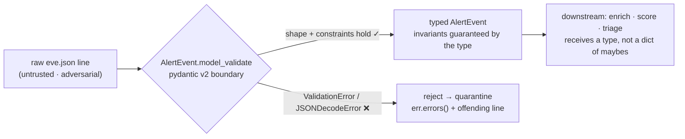
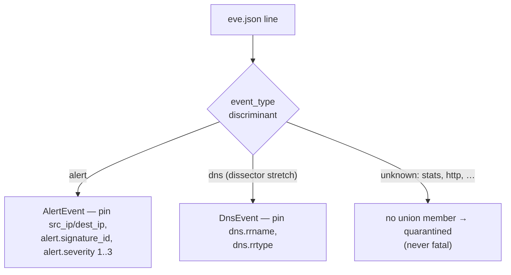
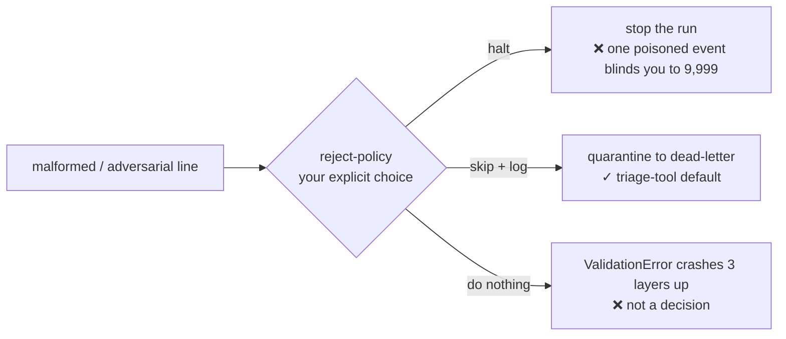

# Module 02 — Parse, Don't Validate

*Type 9 · Tool-Build — add a typed input boundary to `sift`: pydantic v2 domain models that turn a real **Suricata EVE JSON** feed into `AlertEvent` objects (and load secrets safely), so invalid states can't reach your logic. [Go to the hands-on lab →](lab.md)* &nbsp;·&nbsp; *[Cheat sheet →](cheatsheet.md)*

*Last reviewed: 2026-08*

**Python for Security** — *the copilot will happily trust whatever the feed hands it; your edge is the boundary that refuses malformed and adversarial input before it becomes a bug.*

!!! abstract "In 60 seconds"
    Your `sift` skeleton from Module 01 reads **Suricata EVE JSON** (`eve.json` — newline-delimited events
    keyed by `event_type`) and pokes at it with `.get()` and `if`-checks — the shape the copilot reaches
    for by default. This module replaces that with a **typed boundary**: pydantic v2 models (`EveBase`,
    `AlertDetails`, `AlertEvent`) that *parse* each raw line into a validated domain object, or raise
    `ValidationError` and reject it. Real EVE carries dozens of envelope fields, so the judgment isn't
    "forbid everything unexpected" — it's **pin and constrain the fields you depend on, `extra="ignore"`
    the rest.** The slogan is Alexis King's — **"parse, don't validate"**: once a line is a typed
    `AlertEvent`, its invariants hold everywhere downstream, so you stop re-checking the same fields and
    stop shipping bugs that live in the gaps between checks. You'll also load API keys with
    `pydantic-settings` instead of hard-coding them. The anchor is a whole CVE class: Python libraries that
    *deserialize untrusted input into live objects* — `yaml.load()`, `pickle` — and hand an attacker code
    execution.

!!! note "The anchor is a real feed"
    The bundled `eve.json` is **genuine Suricata EVE output**, not an invented toy: real Emerging Threats
    signatures fire against a RAT infection capture — `ET MALWARE Win32/RAT CnC Checkin` (`signature_id`
    `2035678`), `ET POLICY PE EXE or DLL Windows file download HTTP` (`2018959`), `ET MALWARE Observed RAT
    Related SSL/TLS Certificate` (`2036842`) — carried inside the sprawling, version-dependent EVE envelope
    (`community_id`, `in_iface`, `app_proto`, `flow_id`, …). Everything you constrain, you constrain against
    the shape a real sensor actually emits, and the discipline it teaches — **parse, don't trust** — is the
    input edge of the track's through-line.

## Why this matters

The most dangerous line in a security tool is the one that trusts its input. Alert feeds, threat-intel
API responses, log lines — all of it is attacker-influenced, and the moment you treat a raw dict as if
its fields are the type and shape you assumed, you've built the bug. The sharpest version of this is
**unsafe deserialization**: `yaml.load()` on untrusted YAML in older PyYAML would construct arbitrary
Python objects — including ones that execute code — turning "parse this config" into remote code
execution (the class tracked as CVE-2017-18342; `pickle.loads` on untrusted data is the same trap and
has no safe mode at all). The fix pattern is identical
whether the payload is a YAML bomb or a merely-malformed alert: **don't hand untrusted bytes to
something that builds live objects unchecked — parse them through a schema that only admits the shapes
you allow.**

This is the **input edge** of the track's through-line, *parse, don't trust*. The same discipline
returns on the AI edge in Module 07 (validating untrusted *LLM output* with `instructor`) and as the
measurement layer in Module 09 (`pydantic-evals`). Get the muscle here — a typed boundary that makes
invalid input unrepresentable — and the later edges are the same move aimed at a new source of
untrusted data.

## Objective

Replace `sift`'s `.get()`-and-`if` input handling with pydantic v2 domain models — `EveBase`,
`AlertDetails`, and `AlertEvent` over real Suricata EVE fields — that parse each `eve.json` line at the
boundary, reject malformed and adversarial records with a `ValidationError` you handle deliberately, pin
and constrain the fields downstream code depends on while ignoring the rest of the EVE envelope, and move
every secret out of the code into `pydantic-settings`, loaded from the environment.

## The core idea

**"Parse, don't validate" means the type *is* the check.** Validation, the way the copilot writes it, is
a scatter of `if`-statements: `if "alert" not in event: ...`, `if not isinstance(ts, str): ...`,
sprinkled wherever a field is touched. The problem isn't that any one check is wrong — it's that the
information they establish *evaporates*. Three functions deep, the type system still thinks `event` is a
plain dict, so you (and the copilot) re-check the same fields, and the one place you forgot is the bug.
Parsing flips it: you run each untrusted EVE line through a schema **once**, at the boundary, and what
comes out is a typed `AlertEvent` whose invariants are now guaranteed by its *type*. Downstream code
receives an `AlertEvent`, not a dict of maybes — the invalid states are gone because they were never
constructed.

**pydantic v2 is how you write that boundary in Python.** A `BaseModel` subclass declares fields with
types (`dest_ip: IPvAnyAddress`, `alert: AlertDetails`), and `AlertEvent.model_validate(raw)` either
returns a fully-typed, coerced instance or raises `ValidationError` with a precise, field-level report of
what was wrong. Constrained types and a `field_validator` let you encode real domain rules — an IP that
must parse, `alert.severity` inside Suricata's `1..3` range (`Field(ge=1, le=3)`), a timestamp that must
parse to `datetime` — so a record that violates them can't become an `AlertEvent` at all. That last part
is the security property: you're not hoping downstream code remembers to check; you've made the malformed
record **unrepresentable** as a valid domain object.

**Pin what you depend on; ignore the rest of the envelope — that's the real-feed judgment.** A toy schema
can `extra="forbid"` and treat any unexpected key as an attack. Real EVE can't: a genuine `eve.json` line
carries dozens of envelope fields (`community_id`, `in_iface`, `app_proto`, `tx_id`, `pkt_src`, …) that
vary by Suricata version and ruleset, so forbidding the unexpected would reject *every* real line. The
craft is the opposite move — `extra="ignore"`, then **pin and constrain the fields you actually consume**
(`src_ip`/`dest_ip`, `alert.signature_id`, `alert.severity`) and reason about which are *required* versus
*legitimately optional* (some events omit `dest_ip`; `flow_id` may be absent). Deciding that split — what
to depend on, what to let through — is exactly the bridge the copilot skips when it either trusts every
key or forbids them all.

**The boundary is also where you decide what "reject" means — that's a design choice, not a default.**
A validating parser gives you the *option* to be strict, but you still choose the policy: does a
bad line halt the run, get quarantined to a dead-letter file, or get logged and skipped so one poisoned
event doesn't blind you to the other 9,999? Making that call explicitly — and catching `ValidationError`
where you can act on it, rather than letting it crash three layers up — is the judgment the copilot
skips. Secrets get the same "boundary" treatment: `pydantic-settings`' `BaseSettings` parses your API
keys out of the environment into a typed settings object, so a missing key fails loudly at startup
instead of as a confusing `None` mid-request, and the key never lives in the source.

??? note "Why `model_validate` at the edge beats `isinstance` everywhere"
    You could keep passing dicts around and guard each use with `isinstance`/`.get()` — but that's O(uses)
    checks, each a place to forget one, and the type checker can't help because a dict is a dict. Parsing
    is O(1) boundaries: one `model_validate` call converts untrusted input into a type, and from then on
    `pyright` enforces the shape for free. pydantic also *coerces* sanely (a numeric string to `int`,
    an ISO string to `datetime`) and reports **all** failures at once via `ValidationError.errors()`,
    which is far better triage than the first `KeyError` your `.get()`-soup happens to throw. On a real
    EVE feed you keep `extra="ignore"` at the record level (the envelope is huge and version-dependent)
    and get your strictness from *constrained fields* instead — reserve `extra="forbid"` for a small
    sub-object whose exact shape you truly own.

## Go deeper (~2–3 hrs · optional)

*The core idea above teaches the parse-don't-validate boundary, the pin-don't-forbid judgment on a real
feed, and the reject-policy decision — you can build the lab from it. These links go deeper on the exact
pydantic API and the primary sources for the anchor; pull them when a step doesn't click, not as required
reading.*

**pydantic v2 — the typed boundary (start here)**

- **[core]** [pydantic docs — "Models" and "Validators"](https://docs.pydantic.dev/latest/concepts/models/)
  (~40 min) — read how `BaseModel`, field types, and `model_validate` work, then the
  [`field_validator`/`model_validator`](https://docs.pydantic.dev/latest/concepts/validators/) page.
  This is the exact API you'll build the `EveBase`/`AlertDetails`/`AlertEvent` models with.
- **[core]** [pydantic docs — "Fields" and constrained types](https://docs.pydantic.dev/latest/concepts/fields/)
  (~15 min) — `Field(...)` constraints, `Annotated` types, and stdlib types like `IPvAnyAddress` that
  turn a domain rule into a type instead of an `if`.
- **[reference]** [pydantic docs — "Handling errors" / `ValidationError`](https://docs.pydantic.dev/latest/errors/validation_errors/)
  (~15 min) — what a rejection actually contains, so your reject-policy can act on `.errors()` instead
  of a bare stack trace.

**Secrets at the boundary**

- **[core]** [`pydantic-settings` docs — "Settings management"](https://docs.pydantic.dev/latest/concepts/pydantic_settings/)
  (~20 min) — `BaseSettings`, env-var loading, `SecretStr`, and `.env` support; why a typed settings
  object beats `os.environ.get("API_KEY")` scattered through the code.

**The idea and the anchor**

- **[context]** [Alexis King — "Parse, don't validate"](https://lexi-lambda.github.io/blog/2019/11/05/parse-don-t-validate/)
  (~25 min) — the essay the whole module is named after. It's Haskell-flavored, but read it for the
  thesis: push the untrusted-to-trusted conversion to the boundary and let the type carry the proof.
- **[primary source]** [NVD — CVE-2017-18342 (PyYAML `yaml.load()` arbitrary code execution)](https://nvd.nist.gov/vuln/detail/CVE-2017-18342)
  (~10 min) — the anchor CVE: how deserializing untrusted YAML into live objects becomes RCE, and why
  `yaml.safe_load` / a schema is the fix.

## Key concepts
- **Parse, don't validate:** convert each untrusted EVE line to a typed `AlertEvent` *once* at the boundary; the type then carries the invariant everywhere downstream.
- **pydantic v2 basics:** `BaseModel` + field types; `AlertEvent.model_validate(raw)` returns a typed instance or raises `ValidationError`.
- **Pin, don't forbid, on a real feed:** `extra="ignore"` the sprawling EVE envelope; pin and constrain only the fields you consume (`src_ip`/`dest_ip`, `alert.signature_id`, `alert.severity`), and reason required-vs-optional.
- **Domain rules as types:** constrained fields, `IPvAnyAddress`, `Field(ge=1, le=3)` for `alert.severity`, and `field_validator` make malformed records *unrepresentable* — not just flagged.
- **Reject-policy is a decision:** halt / quarantine / skip-and-log is your call; catch `ValidationError` where you can act on `.errors()`.
- **Secrets via `pydantic-settings`:** `BaseSettings` parses keys from the environment into a typed object; `SecretStr` keeps them out of logs and source.
- **Unsafe deserialization is the extreme case:** `yaml.load`/`pickle` build live objects from untrusted bytes — the same "trusted input" bug, escalated to RCE.

## AI acceleration

Point the copilot at the raw feed and it will confidently generate `.get("severity", "low")` soup that
trusts every field — this module *is* the lens for catching that. The move: write the spec for the typed
boundary (the fields, their constraints, the reject-policy), let the copilot draft the
`EveBase`/`AlertDetails`/`AlertEvent` models, then review the draft *against the spec* with two questions
it usually gets wrong. **One:** did it actually constrain the fields, or just annotate them (`dest_ip: str`
is not `dest_ip: IPvAnyAddress`; a bare `severity: int` is not `Field(ge=1, le=3)`)? A type that admits
any value parses nothing. **Two:** does malformed input get *rejected*, or silently defaulted — and did it
`extra="forbid"` the whole record (which rejects every real EVE line) instead of `extra="ignore"` plus
pinned fields? Have the copilot generate the adversarial fixtures too — a truncated non-JSON line, a
record missing `dest_ip`, an out-of-range `alert.severity`, an unhandled `event_type` — and confirm each
raises `ValidationError` (or a `JSONDecodeError` you catch) rather than constructing a quietly-wrong
`AlertEvent`. The bug you catch here isn't in the happy path; it's in what the model lets through.

!!! question "Check yourself"
    - Explain "parse, don't validate" in your own words: what does converting a line to a typed
      `AlertEvent` at the boundary buy you that scattering `if`-checks does not?
    - Why is `dest_ip: str` with a manual regex weaker than `dest_ip: IPvAnyAddress`, and where would the
      difference actually bite downstream?
    - Real EVE has dozens of envelope fields. Why is `extra="forbid"` on the whole record the wrong call
      here, and what do you use *instead* to stay strict about the fields you consume?
    - Your feed has one malformed line in ten thousand. What's your reject-policy, where do you catch the
      `ValidationError`, and why is "let it crash" the wrong default for a triage tool?
    - How is `yaml.load()` on untrusted input the *same* bug as trusting a raw EVE dict — just escalated?
