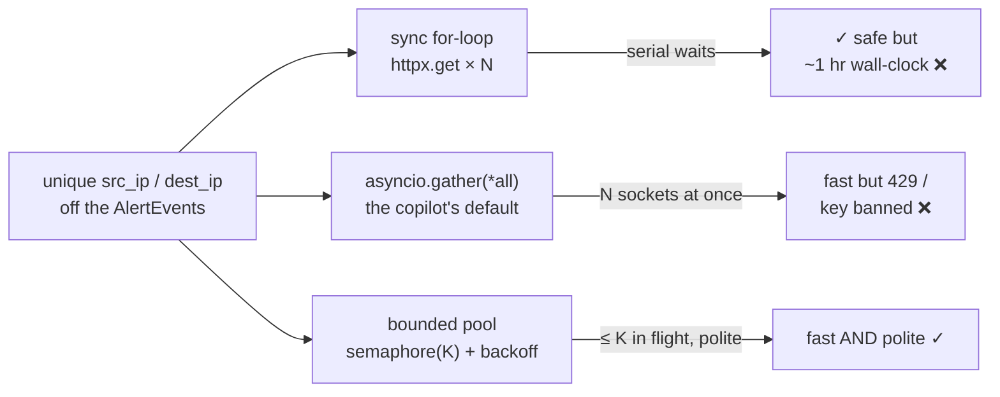
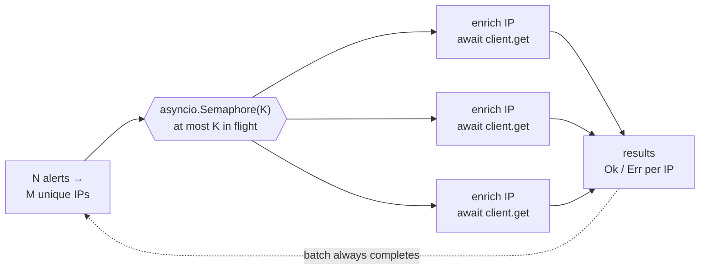
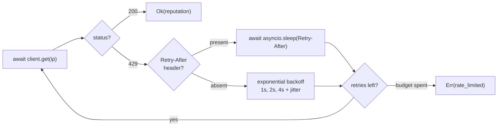
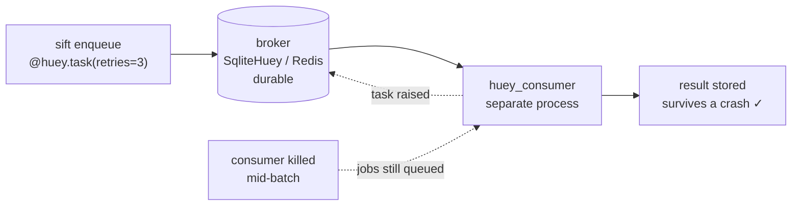

# Module 04 — Async & Structured Concurrency

*Type 7 · Build-&-Operate — enrich the IPs pulled from your validated `AlertEvent`s against a threat-intel API concurrently without becoming a thundering herd: bound the concurrency, back off on `429`, and survive partial failure. The toil eliminated is the sync loop that takes an hour; the disaster averted is getting your API key banned. [Go to the hands-on lab →](lab.md)* &nbsp;·&nbsp; *[Cheat sheet →](cheatsheet.md)*

*Last reviewed: 2026-08*

**Python for Security** — *the copilot writes the enrichment loop in seconds; your edge is the bound it forgot to put on it.*

!!! abstract "In 60 seconds"
    `sift` now parses a large `eve.json` into validated `AlertEvent`s (Module 02) and asks the obvious
    next question: *are the IPs in these alerts known-bad?* Answering means pulling the `src_ip` /
    `dest_ip` off each alert and calling a threat-intel API once per unique IP. Do it in a sync loop and
    10,000 IPs take an hour of mostly *waiting* — enrichment is I/O-bound, so it's the perfect case for
    **async concurrency**. But the copilot's fix — `asyncio.gather` over all 10,000 at once — is worse
    than the loop: it's a **thundering herd** that opens thousands of connections, floods the API, and
    gets you rate-limited or key-banned in seconds. This module teaches the middle path: **bounded**
    concurrency (a semaphore or worker pool), **respectful backoff** that honors `Retry-After` on a `429`,
    and handling the reality that *some* enrichments will fail. The skill isn't "make it async" — the
    copilot does that. It's "make it async *and bounded and polite*."

## Why this matters

Rate limits are the single most common way a working script becomes a *banned* script. Nearly every
threat-intel API you'll integrate — VirusTotal, AbuseIPDB, GreyNoise, urlscan, Shodan — publishes a hard
quota (requests per minute, per day, per key) and enforces it with HTTP `429 Too Many Requests`. Ignore
it and the polite outcome is throttling; the impolite outcome is your key revoked and your team locked
out of a tool an incident depends on. The failure isn't hypothetical for the API provider either: an
unbounded client that retries instantly on every `429` is indistinguishable from a small denial-of-service
attack, and it's exactly the load pattern that takes shared services down. This is a
*Build-&-Operate* lesson, not a breach — the disaster is operational, and you cause it to *yourself*.

This is also where the copilot's blind spot is widest. Ask it to "enrich these indicators concurrently"
and you get one of two wrong answers: a sync `for` loop that's slow but safe, or `await asyncio.gather(*[
enrich(i) for i in indicators])` that's fast and *dangerous*. Neither has a concurrency bound, neither
handles `429`, and `gather` will also abandon every result the moment one task raises. Async is genuinely
harder to review than sync — the bugs are **races** (two coroutines mutating the shared results dict at
once), **unbounded fan-out** (the herd), and **swallowed exceptions**, none of
which show up as a red squiggle. Getting this right is what separates a script that *works on three test
indicators* from one that *operates against a real API at scale*.

The three shapes the same "enrich these IPs" job can take — only the third is both fast *and* safe:

## Objective

Add an async enricher to `sift` that queries a threat-intel API for every IP pulled off your validated
`AlertEvent`s (the `src_ip` / `dest_ip` fields) with **bounded**
concurrency, **honors `Retry-After` on `429`** with exponential backoff, reuses a single connection-pooled
`httpx.AsyncClient`, and returns a result for *every* indicator — success or a recorded failure — without
one bad call sinking the batch. Prove the bound holds and the backoff fires under a simulated rate limit.

## The core idea

**Async is for waiting, not for computing.** The reason enrichment is the textbook async case is that it's
**I/O-bound**: each call spends microseconds of CPU and hundreds of milliseconds *waiting on the network*.
A sync loop serializes all that waiting — 10,000 calls × 300 ms is 50 minutes of your process doing
nothing. `asyncio` lets a single thread start the next request while the last one waits, collapsing the
wall-clock time to roughly the *slowest* call rather than the *sum*. But `async` is not "parallel" and it
is not free of hazards — it's cooperative concurrency in one thread, and the hazards are **how many
coroutines you let run at once** and **what happens when one of them fails**. `httpx.AsyncClient` (not
`requests`, which is sync-only) is the async HTTP client the ecosystem standardizes on; a single client
instance carries a connection pool you want to *reuse*, not recreate per call.

**Unbounded concurrency is the bug; the semaphore is the fix.** `asyncio.gather(*tasks)` schedules
*everything* immediately — 10,000 open sockets, 10,000 requests hitting the API in the same instant. That's
the **thundering herd**, and it's the copilot's default. The fix is a **bound**: allow only *K* requests in
flight at a time. An `asyncio.Semaphore(K)` is the direct tool — each coroutine `async with` the semaphore
before its request and releases it after, so at most *K* are ever active. `httpx.Limits` complements it at
the transport layer (`max_connections`, `max_keepalive_connections`), but the semaphore is what you
*reason about*: pick *K* from the API's published rate limit, not from how fast your CPU is.

**A `429` is an instruction, not an error — obey it.** When the API returns `429 Too Many Requests`, it
often includes a `Retry-After` header telling you *exactly* how long to wait. The respectful client reads
that header and sleeps for it; only if it's absent do you fall back to **exponential backoff** (wait 1s,
2s, 4s, … with a little jitter so a fleet of clients doesn't retry in lockstep). Retrying *instantly* on a
`429` is the herd behavior that gets you banned — you must slow down *because the server told you to*.

**Partial failure is the normal case — design for it, don't gather for it.** At scale, some calls will
time out, some will `429` past your retry budget, some indicators just won't resolve. `asyncio.gather`
without `return_exceptions=True` will **cancel the whole batch** on the first raise — you lose 9,999 good
results because one failed. The robust shape is a bounded worker pool where each task returns a *result
object* (`Ok(data)` or `Err(reason)`), so the batch always completes and you can triage what failed
separately. `return_exceptions=True` is the minimum; a typed per-indicator result is the professional move.

**In-process async is fast but *ephemeral*; durable work is a task queue.** Everything above makes one
*batch* fast and polite — but it all lives inside a single process. If `sift` crashes mid-batch the
in-flight enrichments simply vanish, and it can't enrich *continuously* as new alerts arrive. The moment
the work must **survive a restart, retry itself later, or run in the background**, you've outgrown
`asyncio` and want a **task queue**. A lightweight one — **`huey`** (`@huey.task()`, backed by SQLite or
Redis, run by a separate *consumer* process) — turns "enrich this indicator" into a **durable job**:
persisted to the broker, retried on failure, and picked back up after a restart. Hold the distinction,
because it *is* the lesson: **async = in-process, ephemeral, one batch; a task queue = out-of-process,
durable, retryable, continuous.** Reach for the queue the moment the work must outlive the request that
created it — and *not* before, because a queue you don't need is just latency and a broker to babysit.

*(When a durable job in turn grows into a long-running, multi-step **workflow** — enrich → wait for human
approval → contain → ticket — that must survive restarts across *every* step, you've outgrown the queue
too and graduate to **durable execution** (Temporal). That's workflow orchestration; it lives in the
Automation track's SOAR, not here — keep `sift` at the task-queue layer.)*

??? note "`asyncio.gather` vs. a bounded worker pool — and why not just raise the limit"
    `gather` is fine for a *handful* of known tasks; it's the wrong tool for *N* untrusted-size fan-out
    because it has no bound and its all-or-nothing default hides partial failure. A bounded pool (semaphore
    + `asyncio.as_completed`, or `asyncio.Queue` workers, or `anyio`'s task groups with a capacity limiter)
    gives you a knob and per-task results. And no, you can't fix the herd by "just setting a high limit" —
    the limit exists on the *server*, and your job is to stay *under* it. The correct *K* comes from the
    API's documented quota (e.g. 4 req/s → a semaphore of 4 plus pacing), not from your bandwidth.

## Go deeper (~2–3 hrs · optional)

*The core idea above teaches the async-is-for-waiting model, the semaphore bound, the `429`/backoff
discipline, partial-failure results, and the async-vs-task-queue distinction — you can do the lab from it.
These links go deeper on each primitive and the primary sources; pull them when a step doesn't click,
not as required reading.*

**Async Python fundamentals (the mental model, then the client)** *(`[depth]` — the core idea already teaches these; read for the source vocabulary)*

- [Python docs — `asyncio` "Coroutines and Tasks"](https://docs.python.org/3/library/asyncio-task.html)
  (~30 min) — the primary source: `async`/`await`, `asyncio.gather`, `asyncio.as_completed`, and read the
  `return_exceptions` note on `gather` carefully — it's the partial-failure trap.
- [`asyncio.Semaphore` reference](https://docs.python.org/3/library/asyncio-sync.html#asyncio.Semaphore)
  (~10 min) — the exact primitive you'll bound concurrency with; note it's `async with`, not the threading
  semaphore.
- [Real Python — "Async IO in Python: A Complete Walkthrough"](https://realpython.com/async-io-python/)
  (~40 min) — the best single explainer of *why* I/O-bound work wins from async and how the event loop
  actually schedules it; skim the CPU-bound caveat.

**The async HTTP client + rate-limit reality** *(`[depth]` — the bound/backoff mechanism is in the core idea; read for the API surface)*

- [HTTPX docs — "Async Support"](https://www.python-httpx.org/async/) (~20 min) — how to use
  `httpx.AsyncClient` as a reused, connection-pooled client; read the `async with` client lifecycle.
- [HTTPX docs — "Resource Limits" (`httpx.Limits`)](https://www.python-httpx.org/advanced/resource-limits/)
  (~10 min) — `max_connections` / `max_keepalive_connections` at the transport layer, the pooling
  complement to your semaphore.
- [MDN — HTTP `429 Too Many Requests` and the `Retry-After` header](https://developer.mozilla.org/en-US/docs/Web/HTTP/Status/429)
  (~10 min) — the spec behavior your backoff must honor; note `Retry-After` can be seconds *or* an HTTP
  date.

**The pattern in the wild**

- [`tenacity` — retrying library docs](https://tenacity.readthedocs.io/) (~15 min) — the standard way to
  express "retry with exponential backoff + jitter, capped" declaratively; read the `wait_exponential_jitter`
  and `retry_if_exception` recipes so you don't hand-roll the backoff loop badly.
- [`huey` — a lightweight task queue](https://huey.readthedocs.io/) (~15 min) — `@huey.task()`, the
  `SqliteHuey`/`RedisHuey` backends, automatic retries, and the separate *consumer* process: the
  **durable, out-of-process** counterpart to in-process async. Read "Getting Started" and the retry/consumer
  sections. (The next tier — durable, long-running *workflows* — is Temporal, covered in the Automation track's SOAR.)

## Key concepts
- **I/O-bound → async wins:** enrichment is mostly *waiting on the network*; async overlaps the waits.
- **`httpx.AsyncClient`, reused:** one connection-pooled client for the whole batch — not `requests`, not one client per call.
- **Bound the concurrency:** `asyncio.Semaphore(K)` caps in-flight requests; *K* comes from the API's rate limit, not your CPU.
- **Thundering herd = the copilot's `gather`:** unbounded fan-out floods the API and gets you `429`'d or banned.
- **Backoff honors the server:** on `429`, sleep for `Retry-After`; else exponential backoff **with jitter** — never retry instantly.
- **Design for partial failure:** every indicator returns a result object; `gather` without `return_exceptions` cancels the batch on the first raise.
- **Ephemeral vs. durable:** in-process `asyncio` loses in-flight work on a crash; a **task queue** (`huey`) makes each enrichment a persisted, retryable background job that survives restarts. Long-running multi-step *workflows* graduate further — to durable execution (Temporal), in the Automation track.

## AI acceleration

Have the copilot draft the async enricher from your spec — it *will* get the `async def` and `await`
mechanics right, and that's the boring part worth delegating. Then review for the two things it reliably
omits: **the bound and the backoff.** Search the diff for `asyncio.gather(` with no semaphore around the
tasks — that's the thundering herd. Search for any handling of `429` at all — usually there's none, or a
`time.sleep()` (which *blocks the whole event loop* — a second bug). Ask it "what's the maximum number of
concurrent requests this makes?" and watch it realize the answer is *N*. The review lens: you specified the
rate limit and the concurrency bound; did the implementation actually enforce them, or did it just make the
unsafe version faster?

!!! question "Check yourself"
    - Why does a sync loop over 10,000 API calls spend almost all its wall-clock time idle, and what
      specifically does async change about that?
    - What is the maximum number of simultaneous requests `await asyncio.gather(*[enrich(i) for i in
      indicators])` makes, and why is that the bug rather than the feature?
    - On a `429` with `Retry-After: 30`, what does a respectful client do — and why is `time.sleep(30)`
      inside a coroutine wrong even though the *duration* is right?
    - If one of 500 enrichments raises, what happens to the other 499 under `asyncio.gather` with default
      settings, and how does a per-indicator result object fix it?
    - `sift` dies after enriching 6,000 of 10,000 indicators. With the in-process async batch, what happens
      to the other 4,000 — and how does moving enrichment onto a `huey` task queue change the answer? When
      would reaching for the queue instead be *premature*?
