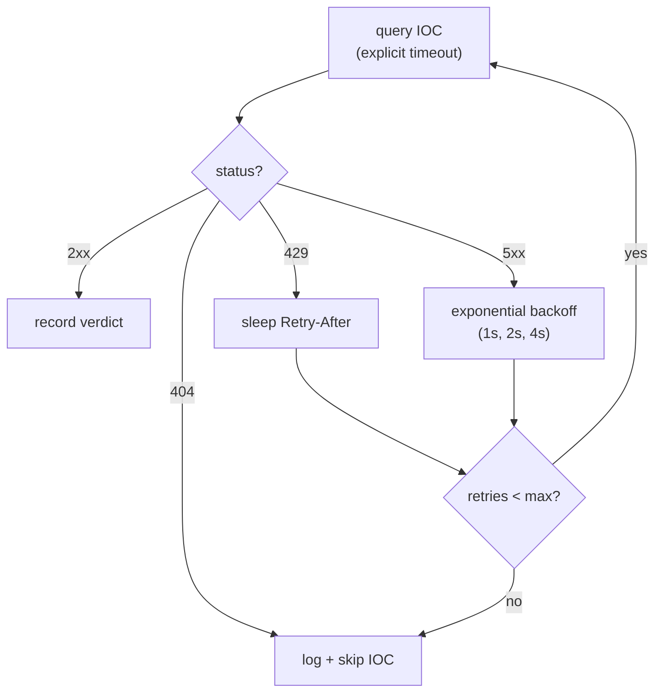

# Module 04 — HTTP & APIs for Enrichment

*Type 7 · Build-&-Operate — build an `httpx` IOC-enrichment client that handles the error paths (timeouts, 429 retry/backoff, rate limits) and prove it with a `test_enrich.py` pinning the 429-retry and the malicious/clean/404 verdicts. (Secondary: Tool-Build — the enrichment function later modules wrap into a CLI and an MCP server.) [Go to the hands-on lab →](lab.md)*

*Last reviewed: 2026-06*

**Python for Security** — *every IOC you can't explain is a ticket you can't close; APIs give you the context.*

<!-- module-meta -->
**Difficulty:** Beginner &nbsp;·&nbsp; **Estimated time:** ~3.5–4.5 hrs (study + lab) &nbsp;·&nbsp; **Prerequisites:** [Foundations](../../../00-foundations/README.md)
{ .module-meta }

!!! abstract "In 60 seconds"
    A bare IP tells you nothing; the same IP with its ASN, abuse score, and malware history tells you
    whether to escalate. Enrichment is querying threat-intel APIs to make that call — and the HTTP
    layer is the easy part. What makes it a *tool* rather than a demo is the error handling: explicit
    timeouts, `429` retry honouring `Retry-After`, exponential backoff on `5xx`, a max-retry cap, and
    skip-don't-crash on `404`. You prove it with a test that pins the retry and the verdicts.

## Why this matters
A bare IP address tells you nothing. An IP address with its ASN, abuse-report count, country,
and known-malware association tells you whether to escalate or deprioritize. Threat-intel
enrichment — querying VirusTotal, AbuseIPDB, Shodan, or any internal API — is the step that
transforms a raw alert into something actionable. Every SOC analyst does this by hand; every
senior engineer automates it.

## Objective
Use `httpx` to query a local threat-intel API — backed by **real abuse.ch feeds** (Feodo Tracker
+ URLhaus); enrich a list of IOCs (IPs and hashes) from `data/iocs.txt`; handle errors, timeouts, and rate-limiting correctly; output enriched results —
and **prove it with a test you wrote**: a `test_enrich.py` that asserts the `429`-retry succeeds
and the malicious/clean/404 verdicts are correct. Building the enrichment client and committing a
test that pins its behaviour are equal halves.

## The core idea
The HTTP layer is simple; the error handling is not. A script that queries an API and prints the
result on success is a demo. A tool that handles `429 Too Many Requests` (rate limiting), retries
with exponential backoff on `503`, logs and skips on `404` (unknown IOC), and times out rather
than hanging forever is production-ready. These cases are not rare — they are the normal
behaviour of any real threat-intel API under load. Build for them from the start.

!!! note "The mental model"
    A script that prints the result on success is a demo. A *tool* assumes the API will rate-limit,
    time out, and 404 on you — because under real load it will — and decides up front what to do in
    each case. The error paths are the product; the happy path is the part that writes itself.

`httpx` is the modern replacement for `requests` for security tooling: same interface, but async
support is built in (which matters when you need to enrich 1000 IOCs in parallel), and it has
better defaults for connection pooling and timeouts. In synchronous mode (`httpx.get(...)`) it is
a drop-in replacement. Set an explicit `timeout=` on every call; the default is no timeout, which
means a hung API call hangs your whole script. `timeout=httpx.Timeout(10.0, connect=5.0, read=30.0)`
is a reasonable starting point — `httpx.Timeout` needs either a default (the first positional) or all
four of `connect`/`read`/`write`/`pool` set explicitly.

!!! warning "The gotcha"
    `httpx`'s default is *no* timeout — one hung API call hangs your whole enrichment run with no
    error and no progress. Set an explicit `timeout=` on every call (or on the `Client`); a tool that
    can wait forever is a tool that will, on the worst possible night.

Authentication to threat-intel APIs is almost always via a header: `X-API-Key: <value>` or
`Authorization: Bearer <token>`. Load the key from the environment, never from the source file.
`httpx.Client(headers={"X-API-Key": os.environ["VT_API_KEY"]})` applies the header to every
request in a session — you set it once, not on every call. The Client context manager also
handles connection reuse across requests, which matters for rate-limiting: a single persistent
session respects the same-connection queue better than a new connection per request.

Rate limiting is the adversary. Real threat-intel APIs return `429` with a `Retry-After` header
when you exceed your quota. The correct response is: read the header, sleep that many seconds,
retry once. If there is no `Retry-After`, use exponential backoff: wait 1 s, then 2 s, then 4 s,
up to a cap. Do not retry indefinitely — set a max retry count (three is usually right) and then
log and skip the IOC. An enrichment script that hangs or crashes on rate-limiting is worse than
one that skips a few IOCs and finishes.

??? note "Go deeper: why a session, not per-call headers"
    `httpx.Client(headers={"X-API-Key": os.environ["VT_API_KEY"]})` sets auth once for every request
    in the session and reuses the connection. That connection reuse matters for rate-limiting — a
    single persistent session respects the same-connection queue better than a fresh connection per
    request — and loading the key from the environment (never the source file) keeps it out of git.

!!! tip "AI caveat"
    A model writes the query loop fast; the hidden bugs are all in the error cases. Run its code
    against an API that returns `429`, `503`, and `404` in sequence: does it retry the 429, give up
    gracefully on repeated 503, skip the 404? Those few lines of test coverage are the whole difference
    between a script and a tool.

## Learn (~2.5 hrs)

**HTTP with httpx (~1 hr)**
- [httpx documentation — Quickstart](https://www.python-httpx.org/quickstart/) — covers the synchronous API; focus on `Client`, `get`, `post`, response status codes, and timeout configuration.
- [httpx documentation — Advanced Usage](https://www.python-httpx.org/advanced/clients/) — read the "Timeout configuration" and "Authentication" sections specifically.

**Error handling and retries (~1 hr)**
- [Exponential Backoff And Jitter — AWS Architecture Blog](https://aws.amazon.com/blogs/architecture/exponential-backoff-and-jitter/) — the canonical explanation of why you add jitter to backoff; short read, high value.
- [tenacity — retry library for Python](https://tenacity.readthedocs.io/en/latest/) — a clean declarative way to add retries; understand the `retry`, `wait`, and `stop` parameters.

**Threat intel API context (~30 min)**
- [VirusTotal API v3 — Getting Started](https://docs.virustotal.com/reference/overview) — skim the authentication and rate-limiting sections to understand the real API shape; the lab's local API mirrors this shape but serves real abuse.ch threat intel, and the real VT shape is what you'll hit in the field.

## Key concepts
- `httpx.Client` with session-level headers and timeouts — never per-call headers for auth
- Status-code-first response handling: check the code before reading the body
- `429` + `Retry-After`: sleep and retry; exponential backoff for other 5xx errors
- Loading API keys from environment variables only — never from source files
- Enrichment as a pipeline: iterate IOCs, query, handle error, accumulate, write results
- Verify by test, not by eye: a learner-written `test_enrich.py` that asserts the retry and the verdicts — the ownership half, not a diff against `make demo`

## AI acceleration
A model writes the API query loop quickly. The hidden bugs are in the error cases: test it
against the local API that returns `429`, `503`, and `404` in sequence. Does the model's code retry
the 429? Does it give up gracefully on repeated 503? Does it skip the 404 or crash? Those three
lines of test coverage are the difference between a script and a tool.

!!! question "Check yourself"
    - What is `httpx`'s default timeout, and why is that the most dangerous default in the library?
    - On a `429`, what's the correct response — and how does that differ from a `503`?
    - Why set the auth header on the `Client` once rather than on every individual request?
