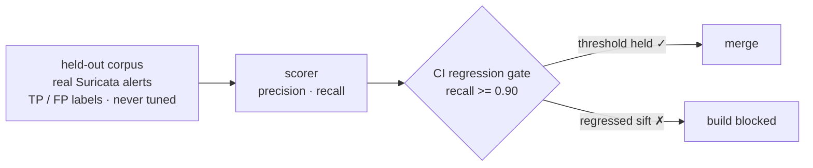
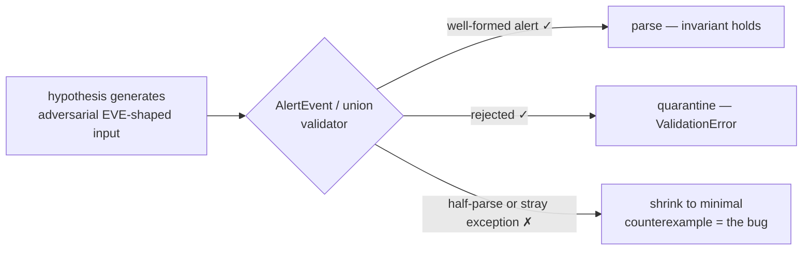
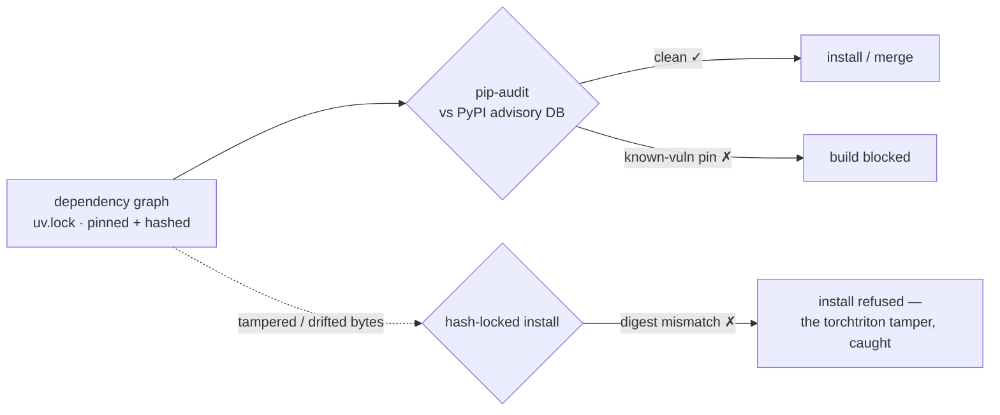

# Module 09 — Eval Harness, Property Tests & Supply Chain

*Type 13 · Eval Harness — build a held-out eval set, a metric chosen on purpose, a scorecard, and a CI regression gate that fails the build on a planted regression. (Secondary: Type 14 · Adversarial Review — fuzz the validator and audit the dependency graph.) [Go to the hands-on lab →](lab.md)* &nbsp;·&nbsp; *[Cheat sheet →](cheatsheet.md)*

*Last reviewed: 2026-08*

**Python for Security** — *the copilot writes the code in seconds; your edge is proving it still works — measured, fuzzed, and pinned.*

!!! abstract "In 60 seconds"
    By Module 08 `sift` makes **non-deterministic judgments**: triage scores, LLM verdicts, a hardened
    MCP tool. A green test suite tells you the code *runs*; it does not tell you the tool is *any good*, and
    it never catches the slow drift when you swap a prompt or a model. This module closes the loop with
    **eval-as-code**: a **held-out labelled corpus** of real Suricata `alert` events with ground-truth
    true-positive/false-positive labels that you never tune against, a metric chosen on purpose
    (precision/recall for triage), a scorecard, and a **CI regression gate** — built with `pydantic-evals`.
    Then you fuzz the M2 EVE boundary (the `AlertEvent`/union validator) with `hypothesis` (it must reject
    *all* malformed EVE, not just your examples), and finally close the supply-chain loop M1 opened:
    `pip-audit` + a hash-locked lockfile as a
    CI gate. This is the **final** module: it doesn't add a stage to `sift` — it *measures* the whole
    tool and locks the measurement into CI, the third edge of *parse, don't trust* (M2 typed the input,
    M7 hardened the tool, M9 proves the whole system stays good). The anchor is the oldest lesson in the
    track: **you can't trust what you can't measure.**

## Why this matters

You cannot improve — or even trust — what you don't measure. Every module before this one added a
capability and a test that the capability *runs*. But `sift` now decides: it scores alerts, and it asks an
LLM for a verdict. "The tests pass" says nothing about whether the triage is *correct*, and it says
nothing at all the day someone bumps the model version and precision quietly falls off a cliff. Unmeasured
judgment is a liability wearing a green checkmark.

And the trust problem isn't only about behavior — it's about *what you shipped*. In December 2022 a
malicious package named `torchtriton` shadowed a real internal PyTorch dependency on PyPI; anyone who
installed PyTorch-nightly that week ran the attacker's code, which exfiltrated environment variables and
SSH keys. Module 01 named that incident and established a hash-locked lockfile as the defense. This module
*enforces* it: a lockfile is only a control if CI fails when the graph drifts or a known-vulnerable
version slips in. Untested, unmeasured, unpinned — that's the copilot's default, and it's exactly the
posture this module is built to end.

## Objective

Build an eval harness for `sift` with `pydantic-evals`: a held-out labelled corpus of real Suricata
`alert` events (true-positive/false-positive ground truth, kept out of tuning), a purpose-chosen metric, a
scorecard, and a CI gate that fails on a planted regression. Add `hypothesis` property tests that fuzz the
M2 EVE validator (the `AlertEvent`/union boundary) so it rejects *all* malformed EVE. And harden the
supply chain: `pip-audit` plus a hash-locked lockfile, both gated in CI. Prove each gate fails on a
deliberate defect and passes when fixed.

## The core idea

**Eval-as-code, and the corpus is held out — twice over.** An eval is a test whose subject is *judgment*
rather than *return value*: you give the system inputs, you have the *expected* label, and you score the
gap. The discipline that makes it honest is the **held-out set** — here, real Suricata `alert` events hand-
labelled true-positive or false-positive, a corpus you never used to
tune prompts, thresholds, or rules. Tune on your eval set and you've built a mirror: it will always say
you're doing great, because you optimized against the exact thing measuring you. Keep it sealed and it
becomes an instrument. State this explicitly in your repo: *this corpus is held out; tuning against it
invalidates the score.* `pydantic-evals` models this directly — a `Dataset` of `Case`s (inputs +
expected output + metadata), one or more **evaluators** (scorers) run over it, and a report you can assert
on.

**A metric chosen on purpose beats accuracy every time.** For alert triage, "accuracy" is a trap: if 98%
of alerts are benign, a tool that says "benign" to everything scores 98% and misses every real attack.
You choose the metric to match the *cost of being wrong*: **recall** (did we catch the true positives —
the misses that get someone breached) traded against **precision** (how much of what we flagged was real —
the false positives that drown an analyst). Write down which you're optimizing and why *before* you read
the number, so the metric drives the tool instead of the tool flattering the metric.

**A regression gate is the whole point — eval gates, not vibes.** A scorecard you look at once is a vanity
metric. The value is in CI: assert `precision >= 0.80 and recall >= 0.90` (thresholds *you* justify), and
the build **fails** when a change drops below them. Now swapping a prompt, a model, or a scoring rule can't
silently degrade the tool — the gate catches the drift the day it's introduced, not the week after an
incident. "It felt fine" is not a merge criterion; a held-out number over a threshold is. You'll prove the
gate works by planting a regression and watching CI go red.



**Property tests fuzz the boundary the examples missed.** Your M2 EVE validator has example-based tests: a
few known-bad `eve.json` lines it must reject (the truncated line, `severity: 5`, the unhandled
`event_type`). But you wrote those examples, so they encode *your* imagination of malformed input — the
adversary's job is to find the input you didn't imagine. `hypothesis` inverts this: you state a
**property** ("the `AlertEvent`/union validator either returns a well-formed event *or* raises
`ValidationError` — it never returns a half-parsed object, and never crashes on some other exception") and
it *generates* hundreds of adversarial EVE-shaped inputs trying to break it, then **shrinks** any failure
to the minimal reproducing case. This is the same *parse, don't trust* discipline from M2 and M7, now
turned on the parser itself.



**The shape, concretely.** The eval and the property are each a few lines — see the API once so the
mechanism doesn't live behind a link:

```python
from pydantic_evals import Case, Dataset
from hypothesis import given, strategies as st

# eval-as-code: a held-out corpus the CI gate scores sift.triage against
dataset = Dataset(cases=[
    Case(name="c2-beacon", inputs=alert_json, expected_output="true_positive"),
    # ... more held-out cases
])
report = dataset.evaluate_sync(sift.triage)      # scorecard; the gate fails if recall < your floor

# property test: the invariant that must hold over ANY generated input
@given(st.text())                                # feed it arbitrary bytes
def test_parse_or_raise(line: str):
    try:
        ev = AlertEvent.model_validate_json(line)
    except ValueError:
        return                                   # rejecting malformed input is correct
    assert ev.alert.signature_id > 0             # a *returned* event is always well-formed
```

**Supply-chain gating is measurement too — of your dependency graph.** `pip-audit` cross-checks your
locked graph against the PyPI Advisory Database and fails on a known-vulnerable version; the hash-locked
lockfile (`uv.lock` / `--require-hashes`) fails install if the *bytes* don't match what you locked — the
exact tamper `torchtriton` relied on nobody checking. Both belong in the same CI gate as the eval: a
change that adds a vulnerable dependency, or drifts the graph without updating the lock, should turn the
build red for the same reason a triage regression does. This is the M1 loop closed: M1 *named*
`torchtriton` and wrote the lockfile; M9 makes the lockfile *bite*.



??? note "pydantic-evals is young — pin it, learn the durable pattern"
    `pydantic-evals` is newer and moving faster than the rest of the stack; expect its API (`Case`,
    `Dataset`, evaluator signatures, report shape) to shift between releases. Pin an exact version in your
    lockfile and read *that version's* docs, not a blog post. What's durable regardless of API churn is the
    **pattern**, and it's what transfers: held-out cases → a scorer that returns a comparable number → a
    threshold asserted in CI. That shape is identical whether you use `pydantic-evals`, `promptfoo`,
    `deepeval`, or a hand-rolled `pytest` loop — learn the shape, treat the library as swappable.

## Go deeper (~2–3 hrs · optional)

*The core idea above carries the eval-as-code, metric-choice, property-testing, and supply-chain moves —
you can run the lab from it. These links go deeper on each tool and to the primary sources; pull them when
a step doesn't click, not as required reading.*

**Eval-as-code (build the harness)**

- [`pydantic-evals` documentation — concepts + your pinned version's API](https://ai.pydantic.dev/evals/)
  (~40 min) — read `Dataset`, `Case`, and evaluators against the **version you pinned**; the API moves, so
  trust the installed docs over any tutorial.
- [Chip Huyen — "Evaluation-Driven Development" (from *AI Engineering*, 2024)](https://huyenchip.com/2024/07/25/genai-platform.html)
  (~25 min) — the durable *why*: held-out sets, metric choice, and eval as a gate rather than a dashboard.
  Read it for judgment, not API.

**Metric choice (pick the number on purpose)**

- [Google ML Crash Course — "Classification: Precision and Recall"](https://developers.google.com/machine-learning/crash-course/classification/precision-and-recall)
  (~20 min) — the precision/recall trade-off and why accuracy lies on imbalanced data — exactly the alert
  triage case. Skip the ROC section; you need the confusion-matrix intuition.

**Property testing (fuzz the validator)**

- [`hypothesis` — "Quick start" + "What you can generate"](https://hypothesis.readthedocs.io/en/latest/quickstart.html)
  (~30 min) — `@given`, strategies, and **shrinking**; focus on how a property differs from an example and
  why generated input finds bugs your examples can't.
- [Hillel Wayne — "Metamorphic testing" / property-based testing intro](https://www.hillelwayne.com/post/metamorphic-testing/)
  (~15 min) — how to *find* good properties (the hard part), with a security lens. Read it for the "what
  property?" question, which is where most people stall.

**Supply chain (enforce the M1 lockfile)**

- [`pip-audit` README + PyPI Advisory Database](https://github.com/pypa/pip-audit) (~15 min) — how it
  resolves your locked graph against the advisory DB, and how to wire it as a CI failure.
- [PyTorch security advisory — "Compromised PyTorch-nightly dependency chain (Dec 2022)"](https://pytorch.org/blog/compromised-nightly-dependency/)
  (~10 min) — the `torchtriton` anchor, revisited: what the malicious package did and why hash-locking is
  the control.

## Key concepts
- **Eval-as-code:** inputs + expected labels + a scorer → a number you can assert on in CI (`pydantic-evals`: `Case`/`Dataset`/evaluator).
- **Held-out corpus:** real Suricata `alert` events labelled TP/FP — never tune against your eval set; say so in the repo, or the score is a mirror.
- **Metric on purpose:** precision vs recall by the *cost of being wrong*; accuracy lies on imbalanced alert data.
- **Regression gate:** assert thresholds in CI so a prompt/model/rule change can't silently degrade `sift` — proven by a planted regression.
- **Property tests:** `hypothesis` *generates* adversarial EVE-shaped input and *shrinks* failures — fuzzes the M2 `AlertEvent`/union validator beyond your examples.
- **Supply-chain gate:** `pip-audit` + hash-locked lockfile fail the build on a vulnerable or drifted dependency graph — the M1 loop, enforced.

## AI acceleration

This is the module where you point the discipline *back at the AI's own defaults*. Ask a copilot to "add
tests for the triage" and it will write example-based unit tests that pass — untested judgment, unmeasured
quality, exactly the failure-class here. Instead: have it draft the `pydantic-evals` `Dataset` and scorer,
the `hypothesis` property, and the `pip-audit` CI step from your spec — then review every line for the
things it skips. Did it tune thresholds on the eval set (held-out violated)? Did it pick accuracy when
recall is what protects you? Did the property have an escape hatch (`assume()` that swallows the
interesting cases)? Did `pip-audit` run against the *lockfile* or a loose `requirements.txt`? The copilot
can generate a whole eval harness; only you can certify it *measures the right thing and can't be gamed*.

!!! question "Check yourself"
    - Why does tuning your thresholds against the eval corpus make the eval worthless — and how would you
      structure the repo so it *can't* happen by accident?
    - For alert triage where 98% of alerts are benign, why is "accuracy" the wrong metric, and when would
      you optimize recall over precision (and vice versa)?
    - What does a `hypothesis` property catch about your validator that ten hand-written bad-payload tests
      cannot, and what makes a *good* property versus a trivially-true one?
