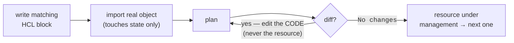

# Module 11 — Click-ops → IaC Migration

*Type 12 · Migration / Brownfield — adopt a running, hand-built resource under Infrastructure as Code *incrementally, without an outage* (strangler-fig); the deliverable is the migration runbook + proof that the imported reality equals the code (zero drift) + a rollback note, not an essay. [Go to the hands-on lab →](lab.md)* &nbsp;·&nbsp; *[Cheat sheet →](cheatsheet.md)*

*Last reviewed: 2026-06 · (placement: after IaC scanning; final number TBD at promotion)*

**Security Automation** — *every greenfield IaC tutorial starts from an empty account. Your job starts from an account that already exists, is serving traffic, and was clicked together by people who left.*

<!-- module-meta -->
**Difficulty:** Intermediate &nbsp;·&nbsp; **Estimated time:** ~3.5–4.5 hrs (study + lab) &nbsp;·&nbsp; **Prerequisites:** [Module 02 — Infrastructure as Code](../02-infrastructure-as-code/README.md) · [Module 03 — IaC Security Scanning](../03-iac-security-scanning/README.md)
{ .module-meta }

!!! abstract "In 60 seconds"
    Every greenfield IaC tutorial starts from an empty account; the real job is **brownfield** — a
    running estate clicked together by people who left, existing in exactly one place with no version
    history. The naive "just write the HCL and `apply`" is the dangerous move: an empty state means
    Terraform thinks the resource doesn't exist and creates a duplicate or destroy-recreates it — the
    outage you were hired to avoid. The correct path is **import, not recreate**, one resource at a time
    (strangler-fig), driving `plan` to **`No changes`** — zero drift — by editing the *code* to match
    reality, never the reverse. The deliverable is the runbook + the zero-drift proof + a rollback note.

## Why this matters

Module 02 taught you to build infrastructure from an empty directory: write the HCL, `plan`, `apply`,
and the account fills up with exactly what your code says. That is **greenfield**, and almost no real
job starts there. The job you actually walk into is **brownfield**: an account, a cluster, a fleet that
already exists — a security group someone widened in the console during an incident two years ago, a
storage bucket created by a developer who has since left, a load balancer nobody is quite sure how to
reproduce. It is *running*. It is *serving*. And it exists in exactly one place — the live account —
with no version history, no review, and no way to rebuild it. This is the click-ops estate Module 02's
"Why this matters" warned about, except now it's not hypothetical: it's the thing you've been told to
"put under Terraform" without taking anything down.

The naive move is the dangerous one. You write fresh HCL that *describes* the existing resource, run
`apply`, and discover that to Terraform an empty state file means "none of this exists yet" — so it
tries to **create a second one**, or worse, the provider sees a name collision and the apply errors out
mid-flight, or it "adopts" the resource by destroying and recreating it. Either way you've caused the
outage you were hired to avoid. The resource was fine; your migration broke it. This is the brownfield
trap, and it is why "just write the IaC" is wrong advice for anything already in production.

The correct path is **import, not recreate** — teach the state file that the resource *already exists*
and is now governed by code — and to do it **one resource at a time** so the surface you're moving is
always small enough to roll back. The proof that it worked is the most satisfying output in all of IaC:
a `plan` that says **`No changes. Your infrastructure matches the configuration.`** That single line
means the code you wrote and the reality that's running are now the same thing — **zero drift** — and
from here on the resource is reviewable, reproducible, and rollback-able like anything you built
greenfield.

## The core idea: you don't rewrite the estate; you wrap it, import it, and shrink the un-coded surface to zero

The mental model is the **strangler fig** (Martin Fowler, 2001 — named for the rainforest vine that
grows *around* a host tree, gradually taking over its structure until it can stand on its own, with the
original never cut down in a single stroke). Applied to infrastructure: you do **not** tear down the
click-ops estate and rebuild it from clean HCL in one cutover. You grow code *around* the running
resources — importing them under management one at a time — and the un-coded, un-reviewed surface
shrinks toward zero while the thing never stops serving. Big-bang migration is the failure mode the
pattern exists to prevent: a single `apply` that reconciles a whole estate at once is a single blast
radius with no incremental rollback.

!!! note "The mental model"
    Strangler fig: don't tear down the click-ops estate and rebuild from clean HCL in one cutover —
    grow code *around* the running resources, importing them under management one at a time, so the
    un-coded surface shrinks toward zero while the thing never stops serving. Import touches *only*
    state, so backing one resource out is `tofu state rm` and the resource keeps running exactly as
    it was — every step's rollback is small and honest.

The mechanism that makes this possible is **`terraform import` / `tofu import`** (and its modern,
reviewable form, the **`import` block**). Importing does exactly one thing: it writes a mapping into the
state file binding a resource *address in your code* (`local_file.config`) to a resource *that already
exists* (a real path, a real cloud ID) — **without creating, modifying, or touching the resource
itself**. State is the join table between "what I declared" and "what exists" (you met this in Module
02); import populates a row of that table for something that was already there. Critically, **import
does not write your HCL for you** — the classic workflow is *write the matching resource block first,
then `import` the real object into it, then `plan` and read the diff to confirm they match*. (OpenTofu
≥ 1.6 can also draft a first-pass block from an `import` block via `tofu plan
-generate-config-out=...` — useful as a *starting point you then review and correct*, never as
output you trust blind: the same "AI/tooling drafts → you review every line → you own it" posture this
track runs on, applied to generated HCL.)

The whole discipline reduces to one feedback signal: **`plan` is your drift meter, and the goal is
zero.** Right after an import, `plan` will almost always show a diff — because your hand-written HCL
doesn't yet match every attribute the real resource actually has (a tag you forgot, a default the
console set, a field the provider populated). Each line of that diff is a *gap between your code and
reality*, and you close it by **editing the code to match the resource — never by applying changes to
the resource**, because applying is how you'd accidentally mutate the thing you're trying to leave
untouched. You iterate — `plan`, read the diff, edit the HCL, `plan` again — until the diff is empty.
**`No changes` is the done signal**: the imported reality and the code are now identical, the resource
is fully under management, and you've added exactly nothing to the un-coded surface. Then you do the
next resource. The rollback at every step is correspondingly small and honest: because import only
touches *state*, backing a single resource out is `tofu state rm <address>` — the state forgets the
resource, the resource keeps running exactly as it was, and you're back to where you started for that
slice with the old path never having stopped serving.

!!! tip "AI caveat"
    A model is useful at the tedious half — drafting the matching HCL block, or cleaning up
    `-generate-config-out` output — and that's exactly where the brownfield danger lives. It doesn't
    know which attributes the *real* resource has, so its draft looks complete and `plan` still shows
    drift; the skill it can't do is reading that diff and deciding, per line, "edit the code" vs. "this
    would mutate the resource." Worse, asked to "make the plan clean," it cheerfully suggests `apply`-ing
    its guesses onto the running resource — the precise move that causes the outage.

!!! warning "The gotcha"
    The naive move causes the outage: write fresh HCL describing an existing resource and `apply`, and
    an empty state means Terraform tries to *create a duplicate*, errors on a name collision, or
    "adopts" by destroy-and-recreate. And after import, when `plan` shows a diff, you close it by
    **editing the code to match the resource — never by applying changes to the resource** (and never by
    asking a model to "make the plan clean," which suggests exactly that). `No changes` must mean the
    code matched reality, not that you bent reality to the code.

## Learn (~2 hrs)

*Build-first and tool-heavy: read enough to import one resource and drive `plan` to zero drift, then go to the lab.*

**The strangler-fig pattern — why incremental beats big-bang (~25 min)**
- [Martin Fowler — *Strangler Fig Application*](https://martinfowler.com/bliki/StranglerFigApplication.html) (~15 min) — the original 2001 essay that named the pattern. Read it for the *why*: gradual replacement around a running system de-risks what a big-bang rewrite cannot. This is the mental model the entire module rests on; the metaphor (grow around, then retire) maps one-to-one onto importing resources one at a time.
- [AWS — *Strangler Fig pattern* (Prescriptive Guidance)](https://docs.aws.amazon.com/prescriptive-guidance/latest/modernization-decomposing-monoliths/strangler-fig.html) (~10 min) — a second, infrastructure-flavored take so you're not anchored on one author; read the "when to use / when not to" section specifically — incremental migration has real costs (transitional complexity) and isn't free.

**The import mechanism — the actual tool skill (~50 min)**
- [OpenTofu — *Import* (CLI)](https://opentofu.org/docs/cli/import/) (~15 min) — the classic `tofu import <address> <id>` workflow: **write the resource block first, then import into it**. Read why import only changes *state* and never the resource — that property is the entire safety guarantee of this module.
- [OpenTofu — *Import* (language / `import` blocks)](https://opentofu.org/docs/language/import/) (~20 min) — the modern, reviewable form: declare imports as `import {}` blocks so they show up in `plan` like any other change and go through review. This is the form to prefer for anything beyond a one-off.
- [OpenTofu — *Generating configuration*](https://opentofu.org/docs/language/import/generating-configuration/) (~15 min) — `tofu plan -generate-config-out=generated.tf` drafts a first-pass HCL block from an import block (experimental since v1.6). Read the **caveats** carefully: the output is a *starting point to review and correct*, never trustworthy as-is — exactly the AI-review posture, applied to generated code.

**Reading the drift the import leaves behind (~20 min)**
- [HashiCorp — *Import Terraform configuration*](https://developer.hashicorp.com/terraform/tutorials/state/state-import) (~20 min) — a hands-on walkthrough of the import → `plan` → reconcile-until-zero-changes loop. The same lifecycle applies verbatim to OpenTofu; read it for the *rhythm* of closing the post-import diff by editing the code (not the resource) until `plan` reports `No changes`.

## Key concepts
- **Brownfield is the default job, not the edge case** — the estate already exists, is serving, and was clicked together; "just write the IaC" is wrong advice for anything in production.
- **Import, don't recreate** — an empty state means Terraform thinks the resource doesn't exist and will try to *create a duplicate* or destroy-and-recreate it. `import` teaches state the resource already exists, touching *only* state, never the resource.
- **Strangler-fig: one resource at a time** — grow code around the running estate and shrink the un-coded surface to zero; never a single big-bang `apply` that reconciles the whole estate as one blast radius.
- **Write the HCL first, then import** — import does not generate your config; `-generate-config-out` only drafts a starting point you must review and correct (AI/tooling drafts → you review → you own it).
- **`plan` is the drift meter; `No changes` is the done signal** — close the post-import diff by editing the *code* to match the resource, never by applying changes *to* the resource.
- **Rollback is cheap because import is state-only** — `tofu state rm <address>` forgets one resource without touching it; the old path served throughout.

## AI acceleration
A model is genuinely useful at the *tedious* half of this — drafting the matching HCL block for a
resource you describe to it, or cleaning up the rough output of `-generate-config-out` into idiomatic
config. That is exactly where the brownfield danger lives, so the posture is strict: **AI drafts the
HCL → you import → you read the `plan` diff line by line → you own the zero.** The model does not know
which attributes the real resource actually has, so its draft will *look* complete and `plan` will
*still* show drift — and the skill the model cannot do for you is reading that diff and deciding, per
line, "edit the code to match" versus "this would mutate the resource, never apply it." Worse, asked to
"make the plan clean," a model will cheerfully suggest `apply`-ing its guesses *onto* the running
resource — the precise move that causes the outage. Make the model draft; **you** confirm every
reconciliation is a code edit, that no step applies changes to the live resource, and that the final
`plan` says `No changes` because the code matched reality — not because you bent reality to the code.
And once it's imported and at zero drift, the resource is finally scannable by the Module 03 gate —
brownfield infrastructure that was invisible to your security pipeline is now governed code.

!!! question "Check yourself"
    - You write fresh HCL for a running bucket and `apply`. Why is that the dangerous move, and what does an empty state file make Terraform believe?
    - After importing, `plan` shows a diff. Which side do you edit to close it, and why is doing it the other way the outage you were hired to prevent?
    - Why is rollback cheap at every step of a strangler-fig migration — what does `tofu state rm` touch, and what does it leave alone?
