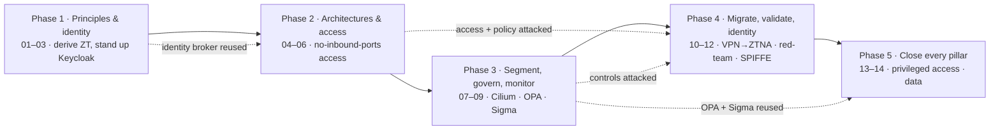

# Track 11 — Zero Trust Network Access

**The perimeter is dead; identity is the new control plane.** Replace "inside the network =
trusted" with per-request, identity-aware access — built with open source and cloud-native tools.

## What you'll be able to do
- Explain Zero Trust and SASE beyond the marketing, and where each actually applies.
- Make identity and device posture the basis for access — with OSS tools and cloud-delivered services.
- Stand up identity-aware access with no inbound ports using both self-hosted and free managed options.
- Segment, express policy as code, and monitor a Zero Trust environment.
- Give workloads a cryptographic identity (SPIFFE/SPIRE) so services authenticate each other with
  mutual TLS, not network position.
- Gate privileged infrastructure access (SSH/admin) with short-lived certificates, per-session RBAC,
  and recorded sessions — no standing keys, no shared bastion.
- Make data classification an access-control input and detect exfiltration — closing all five Zero
  Trust pillars (identity, device, network, workload, data).

## The shape of the track

**At a glance —** five phases run as a dependency chain: you derive the principles, stand up identity,
then build access on top of it, then segment/govern/monitor, then migrate a legacy VPN and attack your
own deployment, and finally close the remaining pillars — privileged access and data. Dashed edges show
where a later phase **reuses or attacks** what an earlier one built.

## Modules

| # | Module | What you'll learn | OSS / free tools |
|---|--------|-------------------|--------------------|
| 01 | [Zero Trust Principles](modules/01-zero-trust-principles/README.md) | Why the perimeter failed; the core tenets and the SASE landscape | — |
| 02 | [Identity as the Control Plane](modules/02-identity-control-plane/README.md) | Authentication, SSO, and authorization; OIDC/SAML federation | `keycloak` |
| 03 | [Device Trust & Posture](modules/03-device-trust-posture/README.md) | Tying access to device health; hardware-bound auth | `tailscale`, `headscale`, FIDO2/passkeys |
| 04 | [ZTNA Architectures](modules/04-ztna-architectures/README.md) | OSS vs. cloud-delivered patterns and trade-offs | — |
| 05 | [SASE & Cloud-Delivered Zero Trust](modules/05-sase-cloud-delivered/README.md) | Managed ZT at the edge; when SASE beats self-hosted | Cloudflare Zero Trust (free tier) |
| 06 | [Identity-Aware Access](modules/06-identity-aware-access/README.md) | Per-request access with no open ports | `pomerium`, `tailscale` |
| 07 | [Microsegmentation](modules/07-microsegmentation/README.md) | Limiting blast radius between workloads | `cilium` |
| 08 | [Policy as Code](modules/08-policy-as-code/README.md) | Continuous, versioned authorization | `OPA` |
| 09 | [Monitoring & Detection in Zero Trust](modules/09-monitoring-detection/README.md) | What "trust nothing" means for logging | `sigma` |
| 10 | [VPN → ZTNA Migration](modules/10-vpn-ztna-migration/README.md) | Cut a legacy VPN over to ZTNA without an outage | `wireguard`, `pomerium` |
| 11 | [Red-team Your Zero-Trust Deployment](modules/11-redteam-zt-deployment/README.md) | Attack your own ZT deployment, then regression-check the gaps | — |
| 12 | [Workload Identity & mTLS](modules/12-workload-identity-mtls/README.md) | Cryptographic service-to-service identity | `SPIFFE`/`SPIRE` |
| 13 | [Privileged Access](modules/13-privileged-access/README.md) | Short-lived certs, RBAC, and recorded sessions for SSH/infra admin access | `teleport` |
| 14 | [Data — the Last Pillar](modules/14-data-pillar/README.md) | Label-based authorization and exfil detection — the 5th NIST pillar | `OPA`, `sigma` |

## Phases & projects

The fourteen modules run in five phases; each ends in a **project** that integrates its modules (a phase
is the substantial, standalone unit — a single module is a few hours). Identity-aware proxies touch
real access — test only against resources you own.

- **Phase 1 · Principles & identity** (01–03) — **Project:** stand up an identity control plane with
  Keycloak (OIDC/SAML) and tie access to device posture — passkeys/FIDO2 and a Tailscale/Headscale
  mesh — with a short written map of the Zero Trust tenets each control satisfies.
- **Phase 2 · Architectures & access** (04–06) — **Project:** publish a lab service with **no inbound
  ports** behind an identity-aware proxy — self-hosted (Pomerium/Tailscale) *and* cloud-delivered
  (Cloudflare Zero Trust) — and explain the trade-off you'd choose for which use case.
- **Phase 3 · Segment, govern & monitor** (07–09) — segment the network with Cilium, govern access
  with policy as code, and monitor what "trust nothing" means for logging and detection.
- **Phase 4 · Migrate, validate & identity** (10–12) — cut a legacy VPN over to ZTNA without an outage,
  red-team your own deployment and turn the gaps into regression checks, and give each workload a
  cryptographic identity (SPIFFE/SPIRE). **Project:** the track capstone — segment the workloads with
  Cilium, enforce authorization as code with OPA, and prove from the access logs that every request was
  authenticated and authorised.
- **Phase 5 · Close every pillar** (13–14) — gate *privileged* infrastructure access (SSH/admin) through
  short-lived certs, RBAC, and recorded sessions with Teleport, then close the fifth NIST pillar —
  **data** — by driving authorization from data classification (OPA) and detecting exfil-shaped access
  (Sigma). These complete the identity → device → network → workload → data pillar set an enterprise
  buyer expects to see covered end to end.

## Scope
This track begins **where the perimeter ends**: firewall, egress, and network-boundary controls belong
to the boundary-focused program — here the boundary *is* identity, device, workload, and data, enforced
per request. Deliberately out of scope (assessed from config, not stood up, where noted): commercial
MDM/EDR posture internals, commercial DLP/CASB engines, and physical network segmentation.

## Prerequisites
Complete [Track 00 — Foundations](../00-foundations/README.md); [Track 05 — Cloud](../05-cloud/README.md) helps.

> Build with your own accounts and lab hosts. Identity-aware proxies touch real access — test against
> resources you own.

## Capstone
Publish a lab service with **no inbound ports** behind an identity-aware proxy (Pomerium or Cloudflare
Tunnel + Access), enforce an access policy as code with OPA, and show the access logs that prove every
request was authenticated and authorised. **Deliverable:** the working setup, the policy-as-code, and
the audit trail.

### Capstone rubric

The service must be reachable with **no inbound ports**, gated by **policy as code**, with an **audit
trail that proves it**. **Proficient is the bar to ship.**

| Dimension | Developing | Proficient | Exemplary |
|---|---|---|---|
| **No inbound ports** | Service exposed on an open port | Reachable only through an identity-aware proxy/tunnel; no inbound ports | External port scan shows nothing open; egress-only tunnel proven |
| **Identity-aware access** | Single shared credential | Per-request access tied to authenticated identity (OIDC/SSO) | Device posture or hardware-bound auth (FIDO2/passkey) factored in |
| **Policy as code** | Policy clicked in a UI | Access policy expressed as code (OPA/Rego) and version-controlled | Policy is tested — allow *and* deny cases asserted — least-privilege by default |
| **Audit trail** | No logs, or logs don't show identity | Access logs prove each request was authenticated and authorised | A denied-and-allowed pair shown end to end; logs feed a detection |
| **Reproducibility** | Manual, undocumented setup | A reader can stand up the proxy and policy from the committed config | One command brings the gated service up; policy change is a reviewed diff |

## AI & automation
ZTNA is policy-as-code, and AI will happily write the policy — including one that's quietly too
permissive. The skill is reviewing generated authorization rules against least privilege before they go
live. AI drafts the policy; you prove it denies what it should.

## Standards & further reading
- NIST SP 800-207 (Zero Trust Architecture)
- CISA Zero Trust Maturity Model
- The BeyondCorp papers (Google)
- Gartner SASE framework overview
- Cloudflare Zero Trust documentation (free tier)
- Open Policy Agent and Pomerium documentation
