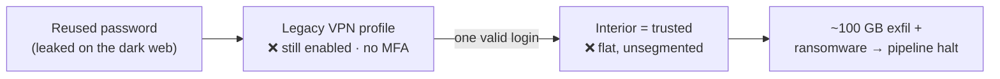
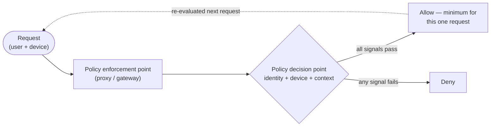
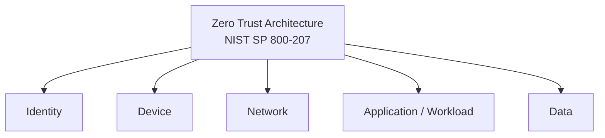

# Module 01 — Zero Trust Principles

*Type 1 · Concept Autopsy — take a real lateral-movement breach apart and derive the zero-trust
principle: the perimeter held, but the flat, trusted interior was the breach. Deliverable: a one-page
principle/boundary memo mapping each failure to a tenet. [Go to the hands-on lab →](lab.md)*

*Last reviewed: 2026-08*

**Zero Trust Network Access** — *the perimeter didn't fail; it dissolved — and the model that replaced
it starts by trusting nothing, learned by taking one famous breach apart.*

<!-- module-meta -->
**Difficulty:** Intermediate &nbsp;·&nbsp; **Estimated time:** ~4–6 hrs (study + lab) &nbsp;·&nbsp; **Prerequisites:** [Foundations](../../../00-foundations/README.md)
{ .module-meta }

!!! abstract "In 60 seconds"
    The perimeter didn't fail — it dissolved. Once apps moved to SaaS, infra to cloud, and the
    workforce home, "inside the network" stopped meaning anything coherent, yet most access models
    still trust it. Zero Trust is the architectural response: the unit of access is the *request*, not
    the session; you verify identity **and** device explicitly every time; and you assume breach and
    minimize blast radius. The cleanest way to learn *why* is to take apart Colonial Pipeline — a
    breach the perimeter model could never have stopped.

## Why this matters

For most of network-security history, the working assumption was that everything inside the firewall
was relatively safe and everything outside was not. That worked when "inside" was a data-centre you
controlled and "outside" was the open internet. It stopped working the moment applications moved to
SaaS, infrastructure moved to cloud, and the workforce moved home. Today the average enterprise has no
single perimeter worth defending — dozens of identity providers, hundreds of SaaS apps, thousands of
remote endpoints, contractors who never touch the corporate LAN. "Inside the network" no longer means
anything coherent, and yet most access models still behave as if it does. Zero Trust is the response —
and the cleanest way to learn *why* it exists is to take apart a breach the perimeter model couldn't
have stopped.

## Objective

Use a real lateral-movement breach to derive the Zero Trust tenets from first principles — name the
exact place where "inside = trusted" failed at each step — then map those failures onto the five NIST
SP 800-207 pillars and produce a gap-analysis + roadmap a security architect could act on.

## The case: Colonial Pipeline, April 2021

**At a glance —** one reused password, no second factor, and a flat interior turned a single login
into a national fuel crisis. The chain has exactly two load-bearing failures; find both.

On April 29, 2021, the **DarkSide** group logged into Colonial Pipeline — the company that carries
~45% of the U.S. East Coast's fuel — using one set of valid credentials for a **legacy VPN account**.
No zero-day. No clever bypass. They *logged in*. Drawn from CEO Joseph Blount's June 2021 Senate
testimony and the CISA/FBI advisory, the chain was:

1. **Entry** — an old remote-access **VPN profile**, no longer used but still **enabled**, that did
   **not require MFA**. A password was the only gate.
2. **Foothold** — that password appeared in a batch of **leaked credentials**, consistent with reuse
   from a separately-breached account. One reused password, no second factor → a valid remote session.
3. **Spread** — once on the VPN, the attacker was *inside*, and inside meant **trusted**. The flat
   interior turned a foothold into reach: ~100 GB exfiltrated, ransomware detonated, and Colonial
   pre-emptively shut the pipeline. Fuel shortages hit the Southeast for days.

!!! note "Two older breaches, same shape"
    **Target 2013** — attackers entered through an HVAC *vendor's* stolen credentials and crossed a
    flat interior into the point-of-sale network. **OPM 2015** — a contractor-adjacent foothold led to
    ~21.5M background-investigation records. Different entry, identical lesson: *the wall held at the
    edge and there was nothing behind it.*

## Call it before you read on

Don't scroll. Write one answer — being wrong here is the point; it's what makes the lesson stick.

> **The Colonial VPN required a password. The perimeter *did* its job — it asked for credentials. So
> wasn't the perimeter holding? Where, exactly, did the security model fail?**

Most people name the obvious villain: "the VPN had no MFA." That's a real failure — hold it. But it
only explains how the attacker got *one* foothold. It does **not** explain how one foothold became the
whole network.

## The reveal — "inside = trusted" is the bug

The perimeter was not holding, because **the perimeter model itself is the failure — not a control
that happened to break.** The VPN did exactly what a perimeter is built to do: authenticate once, at
the edge, then place the session *inside*, where "you're on the network, so you're trusted." That one
assumption turned a stolen password into a fuel crisis. The tenets below aren't a vendor checklist —
they're the **lenses** that show why a perimeter + a trusted interior is structurally fragile.

!!! note "The mental model"
    *Trust is never granted by location.* "Inside the network" is not a security property — it is the
    bug Zero Trust removes. Every access decision re-derives trust from identity, device, and context,
    and grants the minimum for that one request.

The shift is a single change in the **unit of access** — and everything else follows from it:

| | Perimeter / VPN model | Zero Trust |
|---|---|---|
| **Unit of access** | the **session** (put the user *on the network*) | the **request**, re-evaluated each time |
| **When trust is checked** | once, at the edge | every request |
| **What's checked** | a credential | identity **and** device posture **and** context |
| **After the door** | interior is trusted (flat) | no standing trust; least privilege; segmented |
| **Colonial outcome** | one login → whole network | one login → one request, on a vetted device, for one resource |

### 1 · The unit of access is the request, not the session

The founding insight — Google's 2014 **BeyondCorp** work, formalized by **NIST SP 800-207** — is that
"put the user on the network" is the wrong unit. A VPN grants a *session* on the interior and stops
asking questions. Under ZT the unit is **the individual request**, re-evaluated every time against the
identity, the device, the resource's sensitivity, and the moment's context. A per-request model would
have forced Colonial's attacker to *keep* proving who they were, on a device the org could vet, for
every resource — instead of buying the interior with one login.

### 2 · Verify explicitly, every time — identity *and* device

"It required a password" is single-factor auth evaluated once. ZT says verify *explicitly*: a strong
identity assertion (MFA, FIDO2, mTLS, a short-lived token) **and** a device-posture signal (managed?
patched? EDR-enrolled?), checked at request time, not inferred from the subnet.

!!! warning "The gotcha — identity alone is not enough"
    This is the most common first-pass ZT mistake. A stolen credential on a trusted device is bad; the
    same credential on an unmanaged, compromised box is catastrophic — and an identity-only model can't
    tell the two apart. Naming "no MFA on the VPN" explains the open door but misses the design that
    let one open door own everything behind it.

### 3 · Assume breach, and minimize blast radius

The Colonial interior was flat: a foothold reached far more than it should have. ZT's third move is to
*assume the attacker is already inside* and design so it barely matters — least privilege, no standing
trust, segmentation so server-to-server paths that have no business existing simply don't. The goal is
**not** maximum friction or inspecting every packet; it is shrinking what any one compromised
credential or device can touch.

## The five pillars you'll map against

The lab maps the breach — and a firm's real access architecture — onto the five **NIST SP 800-207**
pillars, benchmarked by **CISA's** three maturity levels (Traditional → Advanced → Optimal).

!!! note "Where Colonial lands"
    On this rubric Colonial scores **Traditional** across identity (MFA at the edge only), device (no
    posture signal in the access decision), and network (flat, unsegmented interior) — which is exactly
    why one credential owned everything. You'll reproduce this scoring in the lab as a sanity check on
    your own rubric.

??? note "Background: BeyondCorp, NIST 800-207, and the maturity model"
    The per-request model traces to Google's 2014 **BeyondCorp** work, formalized by **NIST SP 800-207**
    (seven tenets; five pillars). CISA's Zero Trust Maturity Model then benchmarks an org across three
    levels per pillar — Traditional → Advanced → Optimal — the rubric you map the breach onto in the lab.

**The model to keep:** *trust is never granted by location.* If your answer to the callout was "no MFA
on the VPN," you named the open door — and missed the design that let one open door own everything
behind it. Closing that gap is what this module, and this whole track, is about.

!!! tip "AI caveat"
    Hand a model the breach timeline and it produces a fast, confident tenet-mapping — but it tends to
    collapse the story into the single headline cause ("they had no MFA") and stop. Your job is catching
    what it flattened: the structural failure is the **flat interior**. Verify every gap claim traces to
    a specific NIST 800-207 tenet or CISA maturity level before you commit it.

## Go deeper (~3 hrs · optional)

*The autopsy above is the spine — it teaches the model, and you can do the lab from it alone. These
links are for **going deeper** and working from the **primary sources**, not for relearning what's
above.*

**The breach, from the primary source (~30 min) — the case-study seam**
- [Joseph Blount (Colonial Pipeline CEO) — Senate Homeland Security Committee testimony, June 8, 2021](https://www.hsgac.senate.gov/hearings/threats-to-critical-infrastructure-examining-the-colonial-pipeline-cyber-attack/) — where Blount confirmed the entry was a legacy VPN profile *without* MFA and a single-factor password. Your evidence file for the lab.
- [CISA & FBI — DarkSide Ransomware joint advisory (AA21-131A)](https://www.cisa.gov/news-events/cybersecurity-advisories/aa21-131a) — the government technical advisory on the DarkSide TTPs: initial access via weakly-protected remote services, then lateral movement. Read "Technical Details" and "Mitigations."

**The principles (~1.5 hrs)** *(`[depth]` — the reveal above already teaches these; read for the source vocabulary)*
- [BeyondCorp: A New Approach to Enterprise Security (Ward & Beyer, 2014)](https://research.google/pubs/beyondcorp-a-new-approach-to-enterprise-security/) — the founding paper, ~10 pages. Everything downstream comes from here; watch for the VPN-as-access-unit being rejected.
- [NIST SP 800-207: Zero Trust Architecture (2020)](https://csrc.nist.gov/pubs/sp/800/207/final) — the authoritative U.S. spec. Read **sections 1–3** (abstract model + seven tenets) and **section 7** (deployment scenarios); the rest is reference.

**Policy and maturity model (~1 hr)**
- [CISA Zero Trust Maturity Model v2.0 (2023)](https://www.cisa.gov/sites/default/files/2023-04/zero_trust_maturity_model_v2_508.pdf) — the five-pillar maturity model. Read the executive summary and each pillar's maturity table — the framework you benchmark an org against in the lab.

!!! info "Why this module still links out for the standards"
    Per the edition's per-topic rule (repo-root `VISUAL-CONVENTIONS.md`, sibling to
    `CONTRIBUTING.md`), the *tenets and pillars* are taught above and stand alone — but NIST 800-207 and the
    CISA MM are **authoritative primary sources** the deliverable must cite verbatim, so they stay as
    required reference rather than being paraphrased away. The *breach* links out for the same reason:
    we own the mechanism, we cite the source for the facts.

## Key concepts

- "Inside the network" is not a security property — location-based trust is the bug Zero Trust removes.
- The unit of access is the individual **request**, re-evaluated each time — not the VPN **session**.
- Verify explicitly: a strong identity assertion **and** a device-posture signal — identity alone is insufficient.
- Assume breach; design to minimize **blast radius** (least privilege, segmentation), not to maximize friction.
- The seven NIST 800-207 tenets and five pillars: identity, device, network, application/workload, data.
- CISA's three maturity levels per pillar: Traditional → Advanced → Optimal.
- One reused password + no MFA + a flat interior = **one credential owns the whole network** (Colonial 2021).

## AI acceleration

Hand a model the public Colonial timeline (or Target / OPM) and ask it to map each failure to a Zero
Trust tenet *before* you write yours. It produces a fast, confident draft — good to check, because
models collapse the story into the headline cause ("they had no MFA") and stop. Catch what it
flattened: the quieter, structural failure is the **flat interior** that turned one foothold into the
whole network, and the conflation of ZT marketing ("we have SSO, so we did Zero Trust") with the actual
NIST tenets. Verify every gap claim is traceable to a specific NIST 800-207 tenet or CISA maturity
level before committing. If you can explain *why* the breach needed both the open door **and** the flat
interior, you've learned the module — and you own the verdict.

!!! question "Check yourself"
    - Colonial's VPN *did* ask for a password — so why was the perimeter model still the failure, not just the missing MFA?
    - What changes when the unit of access becomes the individual request instead of the VPN session?
    - Why does "we have SSO" not mean "we did Zero Trust" — which tenets does that claim leave unaddressed?
