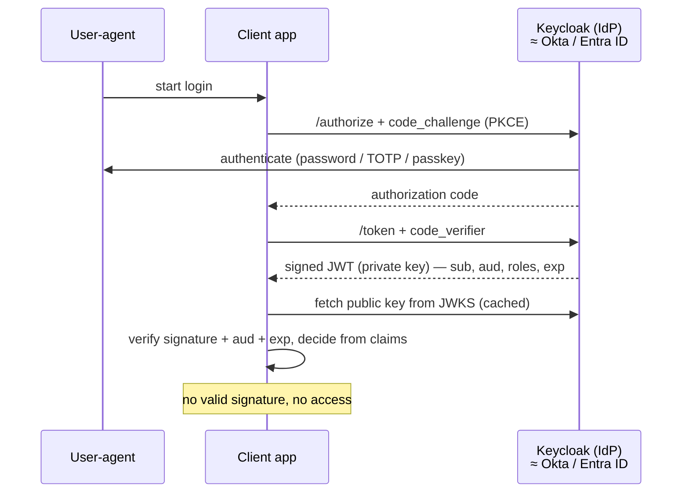
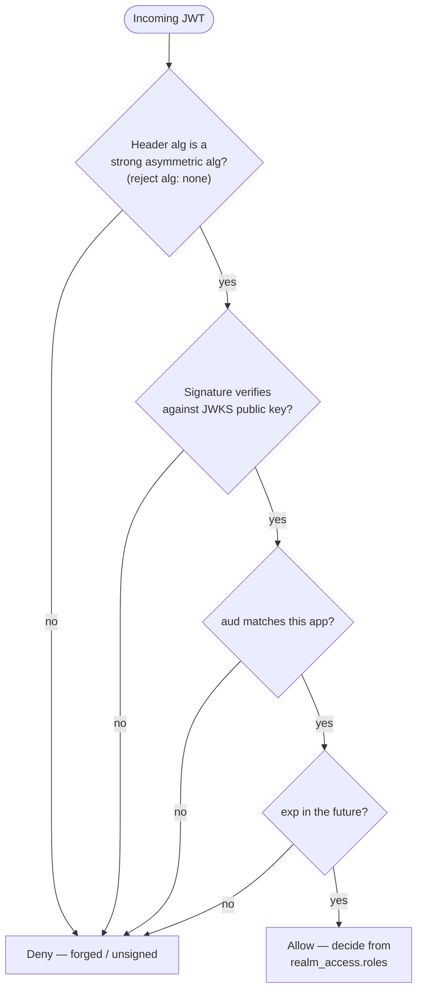
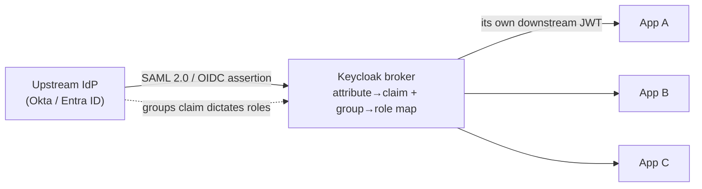
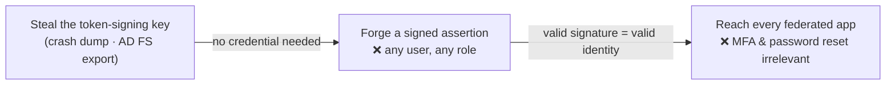

# Module 02 — Identity as the Control Plane

*Type 7 · Build-&-Operate — stand up a real OIDC identity provider and run the full token flow through
it; the deliverable is the running IdP plus a token you minted and signature-validated, not an essay.
[Go to the hands-on lab →](lab.md)*

*Last reviewed: 2026-08*

**Zero Trust Network Access** — *when the perimeter dissolves, identity is the only boundary left — so
the key that signs identity is the master key to everything, as the attackers who stole one keep
proving.*

<!-- module-meta -->
**Difficulty:** Intermediate &nbsp;·&nbsp; **Estimated time:** ~5–7 hrs (study + lab) &nbsp;·&nbsp; **Prerequisites:** [Foundations](../../../00-foundations/README.md) · [Module 01](../01-zero-trust-principles/README.md)
{ .module-meta }

!!! abstract "In 60 seconds"
    Module 01 killed the network perimeter. This module names what replaced it: **identity.** Every Zero
    Trust access decision rides on a cryptographic assertion — a JWT, a SAML token — signed by the
    identity provider's private key. That makes the signing key the *master key to the entire estate*:
    whoever holds it can **mint** a valid identity for anyone, for any app, with no password, no MFA
    prompt, and no session — which is exactly what Storm-0558 did to Microsoft and what Golden SAML did
    inside SolarWinds. You'll stand up Keycloak, run the OIDC token flow end-to-end, validate a token's
    signature against the published public key, and learn that token lifetime and claim scope are not
    defaults to accept — they are your blast-radius controls.

## Why this matters

In a Zero Trust model the question *"can this request proceed?"* is no longer answered by a firewall
rule but by an access policy, and the anchor of every access policy is identity: **who** is the subject,
can they **prove** it, and do they have standing to reach **this** resource right now? All three answers
travel inside one artifact — a cryptographic assertion signed by the identity provider's private key.
Which means that key stops being one secret among thousands and becomes **the single master key to every
access decision in the organization.** Steal a password and you get one account. Steal the signing key
and you don't *need* a password — you forge the identity itself.

That is not a hypothetical. It is the exact shape of the two most consequential identity breaches of the
decade, and it is why "stand up an IdP" is the easy half of this module and "understand that its key,
token lifetime, and claim scope *are* the blast-radius controls" is the half that makes you an architect
instead of a tutorial-follower.

## Objective

Stand up Keycloak as a real OIDC identity broker, walk the token flow end-to-end — obtain a signed JWT,
read its claims, and **validate its signature against the realm's published public key** — then reason
about the two failure modes the case studies teach: a **stolen token** (bounded by `exp` and `aud`) and
a **stolen signing key** (bounded by nothing you can revoke fast). Produce a running IdP, a
signature-validating script that you have watched reject a forged token, and a short blast-radius memo.

## The core idea

!!! note "The mental model"
    **Identity is the new network perimeter.** Where a firewall once checked a packet's source IP against
    a zone, a Zero Trust policy engine checks a cryptographically signed identity assertion against an
    access policy — and because the assertion travels *with* the request, it can be re-evaluated at every
    hop without the request ever being "inside" anything.

The shift is small to state and enormous in consequence. The old model asked *"where is this request
coming from?"* and trusted the answer. The Zero Trust model asks *"who is making this request, and can
they cryptographically prove it?"* — and the proof is a signed token the policy engine can verify on the
spot, offline, without phoning home. The mechanics change; the job is identical to what a firewall did,
just anchored to a provable identity instead of a spoofable network location.

### OIDC — the token flow you're about to run

**OpenID Connect (OIDC)** is the identity layer on top of OAuth 2.0 that makes this practical, and the
architecture you build in the lab is its canonical shape. A user authenticates to a Keycloak **realm**
(password, TOTP, passkey — whatever the realm requires). Keycloak issues a short-lived **JWT** signed
with the realm's *private* key. That token carries claims — `sub` (who), `aud` (which application),
`realm_access.roles` (what they may do), `exp` (when it dies). The application validates the
**signature against the realm's public key** — published at the **JWKS** endpoint, so no round-trip to
the auth server per request — and decides access from the claims alone. That is "identity as the control
plane" made concrete: the token is the pass, the signature is the tamper-evident seal, the application
is the enforcer, and *no valid signature means no access.*

!!! note "Auth-code+PKCE is the real flow; the lab uses the direct grant"
    The diagram above is the browser flow every production app should use (`code_challenge`/`code_verifier`
    stops a stolen authorization code from being redeemed). The lab drives Keycloak with the
    **Resource Owner Password Grant** instead — one `curl`, no browser redirect — purely so the token
    exchange is scriptable and you can see the raw JWT. The token you get back, and everything you learn
    validating it, is identical. Never use the password grant in production; use auth-code+PKCE.

### Validation is a chain of gates, not a base64 decode

Reading a JWT is trivial: the payload is base64url, anyone can decode it. **Trusting** a JWT is the
whole job, and it is a sequence of gates — *is the algorithm one I accept, does the signature verify
against the public key, is this token actually meant for me (`aud`), has it expired (`exp`)?* Skip any
gate and you have a decoder, not a validator. The most dangerous shortcut is accepting `alg: none` (a
JWT with an empty signature that the spec technically permits) or blindly honoring whatever algorithm the
*token* names — that is how an attacker hands you an unsigned token and you wave it through.

!!! warning "The gotcha — a decoder is not a validator"
    The single most common — and most catastrophic — mistake in this module is code that base64-decodes
    the payload and reads the claims *without verifying the signature*, or that accepts `alg: none`. That
    isn't a lax validator; it is the Storm-0558 failure mode written in Python. If your code trusts a
    claim it never cryptographically checked, an attacker who can craft a payload owns your access
    decisions. Verify the signature against the JWKS public key **first**, then read claims.

### Federation — one broker, and the trust mapping that can betray you

The enterprise version of all this is **federation**, and reasoning about it is the operator skill that
separates "I ran the tutorial" from "I can run the IdP." An organization rarely wants a *second* identity
silo, so Keycloak runs as an **identity broker**: it trusts assertions from an upstream IdP (Okta, Entra
ID) over SAML 2.0 or OIDC and issues *its own* downstream tokens to the applications. To each app there
is one issuer; to the user, their familiar single sign-on.

The judgment lives entirely in the **trust mapping** — which upstream attributes map to which downstream
claims, and, crucially, *which upstream groups are trusted to grant elevated roles.* Get that mapping
wrong and the upstream IdP silently dictates **your** authorization: an attacker who can influence group
membership on the upstream side (or forge the upstream assertion outright) has just written your access
policy for you.

### The case: forge the assertion, skip everything else

Everything above says *the signature is the trust.* The two breaches below are what happens when the
attacker gets to make the signature.

**Storm-0558 (2023) — stolen key, forged tokens.** A China-aligned actor obtained a Microsoft consumer
(MSA) signing key and used it to **forge authentication tokens**, reaching the email of roughly **25
organizations** — including the U.S. Departments of State and Commerce and Congressional staff — with no
credential theft and no MFA bypass. The forged token *was* the credential. Microsoft traced the key to a
2021 crash dump that should never have contained it, recovered after an engineer's account was
compromised. The U.S. **Cyber Safety Review Board (CSRB), April 2024** called the intrusion
**preventable** and faulted Microsoft's security culture.

**Golden SAML (SolarWinds / SUNBURST, 2020) — the federation-layer version.** After the SolarWinds Orion
supply-chain compromise, attackers who reached an on-prem environment stole the **AD FS token-signing
key** and minted their own SAML assertions — impersonating any user, with any privileges, straight into
cloud services that federated trust to that AD FS. This is **Golden SAML** (MITRE ATT&CK **T1606.002**):
the exact abuse of the trust-mapping seam in the federation diagram above. Same lesson as Storm-0558, one
layer down: *own the signing key and you own every downstream access decision, and no password reset or
token revocation touches you.*

!!! note "Why forgery is categorically worse than theft"
    A **stolen token** is a bounded problem: it expires (`exp`), it is scoped to one audience (`aud`),
    and revoking the session or rotating the user's password limits the damage. A **stolen signing key**
    is unbounded: the attacker mints *fresh, valid* tokens on demand, for any user, and the only real
    remedy is to rotate the key and re-establish trust everywhere it was used. That is why the key is the
    crown jewel — and why the whole module obsesses over the signature.

| | Stolen token (T1528) | Stolen signing key (Storm-0558 / Golden SAML, T1606.002) |
|---|---|---|
| **What the attacker holds** | one issued JWT | the ability to sign *any* JWT |
| **Bounded by** | `exp` (short), `aud` (single) | nothing you can revoke quickly |
| **Credentials / MFA needed** | had to phish the token | none — forgery bypasses both |
| **Remedy** | expire session, rotate password | rotate the key, re-federate everywhere |
| **Blast radius** | one user, one app, minutes | every user, every federated app, until key rotation |

### The one load-bearing judgment — lifetime and scope are blast-radius controls

Two failure modes recur, and both are choices dressed up as defaults:

- **Token-lifetime creep.** Teams stretch `exp` to stop re-auth interruptions, and a 24-hour access
  token quietly restores *session-based* trust — undoing the per-request evaluation Zero Trust depends
  on, and widening the window any forged or stolen token stays live. The lab realm ships
  `accessTokenLifespan: 300` (five minutes) on purpose; that number is a defensible decision, not an
  accident.
- **Claim inflation.** Roles get added to the token schema and never removed, so a JWT carrying 40 group
  memberships from a sprawling AD sync isn't fine-grained access control — it's *VPN access re-packaged
  as JSON.* Issue only the claims the app needs, scope each token to a single `aud` so it cannot be
  replayed against a different application, and keep `exp` short.

Every one of those settings is a number you must be able to **defend**, not a default you inherited.

!!! tip "AI caveat"
    A model emits Keycloak realm JSON and `curl` OIDC flows that are *syntactically* perfect — that is
    the trap. The sharpest review is on the **validation** code: a model will happily produce a
    "validator" that base64-decodes the payload and skips the signature, or that accepts `alg: none` —
    the Storm-0558 failure in script form. Make it defend each realm setting (why `accessTokenLifespan:
    300`, not `3600`?) and prove the validator *rejects* a tampered token before you run it for real.

## Go deeper (~4 hrs · optional)

*The sections above teach the mechanism end-to-end — you can complete the lab from them alone. These
links go to the **primary sources** and deepen the two case studies; they are not the path you must
click through to understand the module. Optional depth is tagged `[depth]`.*

**The signing key as crown jewel — the case-study seam (~1 hr)**
- [Microsoft — Analysis of Storm-0558 techniques for unauthorized email access](https://www.microsoft.com/en-us/security/blog/2023/07/14/analysis-of-storm-0558-techniques-for-unauthorized-email-access/) (~20 min) — the first-party writeup of how a stolen consumer signing key forged tokens against Exchange Online. Read it as the concrete answer to *"what happens if the IdP private key leaks."*
- [MITRE ATT&CK T1606.002 — SAML Tokens (Golden SAML)](https://attack.mitre.org/techniques/T1606/002/) — the federation-layer forge: mint trusted SAML assertions by stealing the token-signing key. This is the technique used inside the SolarWinds intrusion, and the exact seam you reason about in the lab's federation step.
- [MITRE ATT&CK T1528 — Steal Application Access Token](https://attack.mitre.org/techniques/T1528/) — the everyday cousin of forgery: stealing an *issued* token. What short `exp` and single `aud` are defending against. Short and directly applicable.
- [CISA advisory AA20-352A — Advanced Persistent Threat Compromise of Government Agencies (SolarWinds / SUNBURST)](https://www.cisa.gov/news-events/cybersecurity-advisories/aa20-352a) — the government technical advisory; read it for the Golden SAML attack narrative in context. `[depth]`
- [U.S. Cyber Safety Review Board — Review of the Summer 2023 Microsoft Exchange Online Intrusion (2024)](https://www.cisa.gov/resources-tools/resources/CSRB-Review-Summer-2023-MEO-Intrusion) — the report that called the Storm-0558 intrusion "preventable"; read the findings on the signing-key failure. `[depth]`

**OIDC and JWTs — the primary specs (~1.5 hrs)** *(`[depth]` — the flow above already teaches these; read for source vocabulary)*
- [The OAuth 2.0 Authorization Framework (RFC 6749)](https://datatracker.ietf.org/doc/html/rfc6749) — read sections 1–2 (roles) and 4.3 (Resource Owner Password Credentials grant, which the lab drives). The RFC is ground truth when vendor docs disagree.
- [OpenID Connect Core 1.0](https://openid.net/specs/openid-connect-core-1_0.html) — read sections 1–3 (overview and authentication flows). OIDC is the identity layer on OAuth 2.0; the authentication-vs-authorization distinction is foundational.
- [jwt.io](https://www.jwt.io/) — paste any JWT to decode and inspect claims. Run a real lab token through it while you work.

**Keycloak — realms, clients, and the broker (~1 hr)**
- [Keycloak — Core Concepts and Terms](https://www.keycloak.org/docs/latest/server_admin/index.html#core-concepts-and-terms) — ~15 min on realm, client, user, role, scope: exactly the vocabulary the lab uses.
- [Keycloak — Identity Brokering and Social Login](https://www.keycloak.org/docs/latest/server_admin/index.html#_identity_broker) — how Keycloak brokers an upstream IdP (Okta, Entra ID) to downstream apps; read for the federated trust model behind the lab's federation step.

**Token inspection (~30 min)**
- [jwt-cli (GitHub)](https://github.com/mike-engel/jwt-cli) — a command-line JWT decoder used in the lab; `jwt decode <token>` reads claims faster than pasting into a browser during operations.

## Key concepts

- **Identity is the ZT control plane** — every access decision anchors to a verifiable identity
  assertion, so the **signing key is the crown jewel** (Storm-0558 and Golden SAML both forged identities
  with a stolen key, no credential needed).
- **OIDC token flow:** authenticate → IdP signs a short-lived JWT with its private key → application
  validates the signature against the JWKS public key → access decision from claims alone.
- **JWT anatomy:** header (algorithm), payload (`sub`, `aud`, `realm_access.roles`, `exp`), signature.
- **Validation is a chain of gates** — strong `alg`, signature verifies, `aud` matches, `exp` in the
  future — and skipping any of them (especially accepting `alg: none`) turns a validator into a decoder.
- **Federation broker pattern:** Keycloak brokers an upstream IdP to downstream apps; the
  attribute→claim and group→role mapping *is* the trust decision (Golden SAML / T1606.002 abuses it).
- **Stolen token vs stolen key:** a stolen token is bounded by `exp` and `aud`; a stolen signing key is
  bounded by nothing you can revoke quickly — forge on demand until the key is rotated.
- **Lifetime and scope are blast-radius controls:** short `exp` preserves per-request evaluation; a
  single `aud` blocks cross-app replay; minimal claims stop the JWT from becoming VPN-in-JSON.

## AI acceleration

A model will generate Keycloak realm JSON and `curl` OIDC flows quickly, and the output is usually
syntactically correct — which is precisely the trap. **Your review job:** verify the token-lifetime and
scope settings reflect ZT discipline rather than the permissive defaults a model tends to emit, and trace
every claim in the issued JWT back to a deliberate policy decision. The sharpest review move is on the
lab's `validate-token.py`: a model will happily produce a "validator" that base64-decodes the payload and
skips the signature, or that accepts `alg: none` — that is not a validator, it is the Storm-0558 failure
mode in miniature. Ask the model to justify each realm setting before you run it: if it can't defend
`accessTokenLifespan: 300` versus `3600`, you don't yet know what you're running, so you don't yet own
it. The whole posture of this module lives in one test — drive the model to write the validator, then
*watch it reject a tampered token* before you trust a line of it.

!!! question "Check yourself"
    - Why does possessing the IdP's signing key let an attacker skip credentials, MFA, and sessions
      entirely — and what makes that categorically worse than a stolen token?
    - What does validating the signature against the JWKS public key add that a base64 decode of the
      payload can never give you — and why is `alg: none` the whole ballgame?
    - In the broker pattern, where exactly does the trust decision live, and how could a wrong
      group→role mapping (or a stolen upstream signing key, à la Golden SAML) hand your authorization to
      the upstream IdP?
