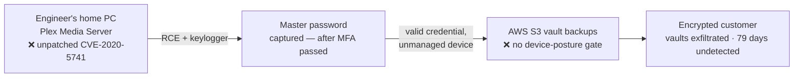
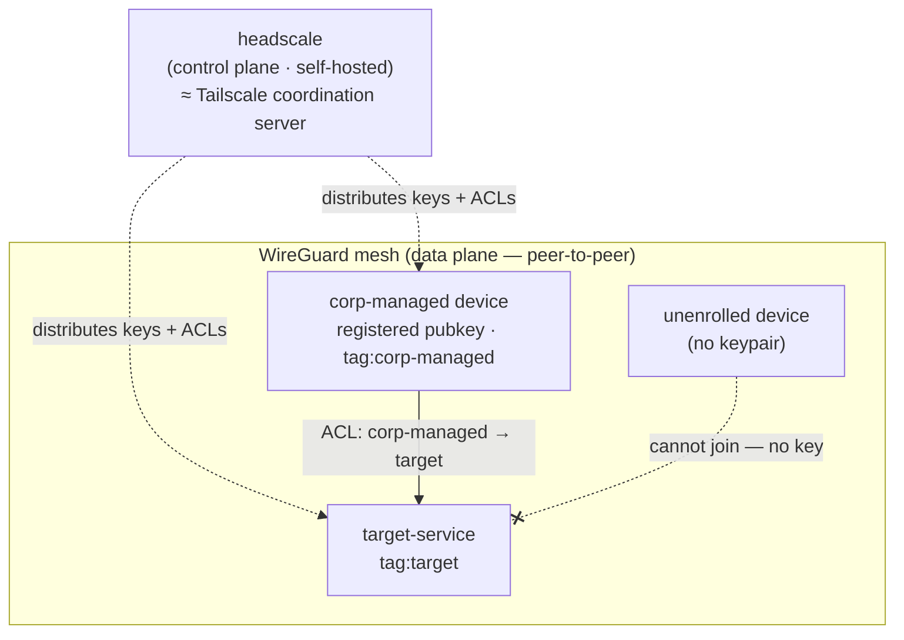
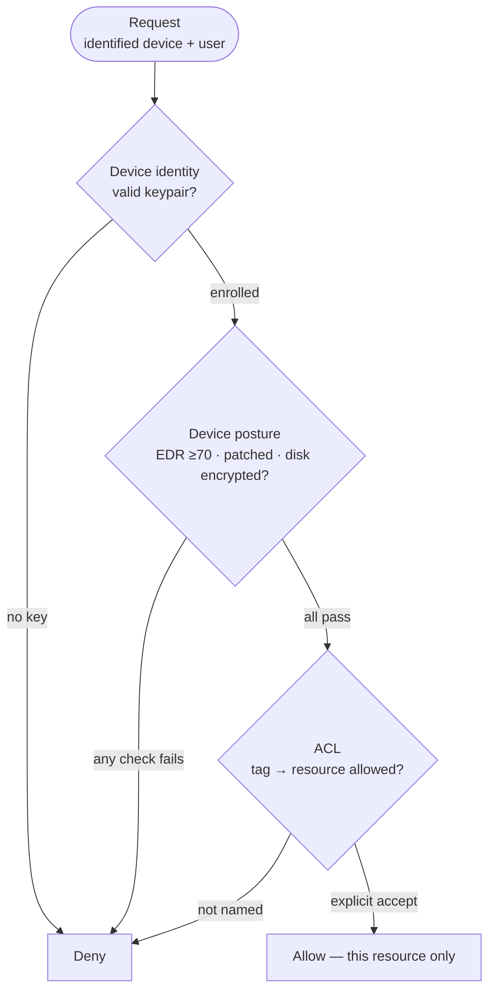
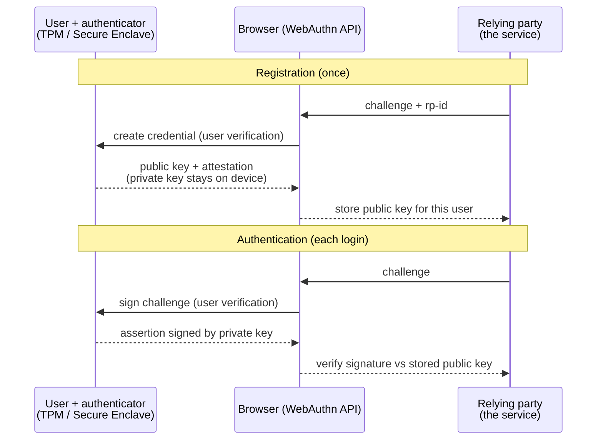

# Module 03 — Device Trust & Posture

*Type 7 · Build-&-Operate — stand up a self-hosted device-identity mesh (headscale + WireGuard),
enroll a device, and prove access is bound to *that device* — an unenrolled one is denied by
construction. Deliverable: the running, reviewed system plus the enrolled-vs-denied proof, not an
essay. [Go to the hands-on lab →](lab.md)*

*Last reviewed: 2026-08*

**Zero Trust Network Access** — *identity tells you who is asking; device trust binds the answer to a
known, healthy machine — so a stolen credential alone is not enough.*

<!-- module-meta -->
**Difficulty:** Intermediate &nbsp;·&nbsp; **Estimated time:** ~5–7 hrs (study + lab) &nbsp;·&nbsp; **Prerequisites:** [Foundations](../../../00-foundations/README.md) · [Module 02 — Identity as the Control Plane](../02-identity-control-plane/README.md)
{ .module-meta }

!!! abstract "In 60 seconds"
    Identity tells you *who* is asking; device trust binds that answer to a known, healthy machine — so
    a stolen credential alone isn't enough. LastPass 2022 is the case: the right user, the right
    credential, MFA passed — and an *unmanaged home computer* still became the trusted launch point
    into cloud backups, because nobody asked whether the device was one to trust. You'll build device
    *identity* end-to-end with WireGuard + headscale (an unenrolled device is denied by construction),
    enforce a default-deny ACL, and reason honestly about device *posture* — the half this lab assesses
    rather than builds.

## Why this matters

For a decade the second question after "who are you?" went unasked. If your credential checked out and
you were on an approved connection, you were in — the machine you were sitting at was nobody's concern.
That gap is exactly the seam attackers now aim at: phish or keylog a valid credential, ride it in from
a device the target has no visibility into, and a model that only verifies *identity* cannot tell your
compromised home laptop from a fully-managed corporate one. Device trust — the second NIST 800-207
pillar after identity — is the control that closes the seam, and it is the pillar most organizations
handle worst. The cleanest way to see *why* it matters is a breach where identity verification worked
perfectly and it was still not enough.

## Objective

Build device *identity* end-to-end — a WireGuard mesh coordinated by self-hosted headscale — and
**prove access is bound to the device, not the credential**: an enrolled node reaches the protected
service, an unenrolled one is refused by a default-deny ACL. Then map a structured device-*posture*
policy to the controls a production deployment enforces, labelling honestly what a self-hosted lab can
demonstrate versus only assess.

## The case: LastPass, August 2022

**At a glance —** the right human, the right master password, MFA already passed — and an *unmanaged
home computer* still became the launch point into cloud vault backups. The failure isn't the
credential; it's that no control ever asked about the *device*.

In August 2022 an attacker compromised the **personal home computer of a senior LastPass DevOps
engineer** — one of only four people with decryption access to the company's vault backups. The entry
point was not LastPass's network. It was a **Plex Media Server the engineer ran at home**, left
unpatched against **CVE-2020-5741** — a flaw Plex had fixed *two years earlier*. The attacker landed on
the machine, installed a **keylogger**, and captured the engineer's master password **after** the
engineer had already passed MFA. With that credential, between **September 8 and 22** the attacker
reached LastPass's **AWS S3 backups** and exfiltrated encrypted customer vault data. The unauthorized
access ran for **79 days** before AWS GuardDuty flagged it.

Read the failure precisely, because it is the case for this whole module: **identity verification
worked, and it was not enough.** The right human, the right credential, even MFA — all satisfied. What
was never asked was *"is the device this is coming from one we trust?"* An unmanaged home machine,
outside any patch policy or endpoint visibility, was allowed to become the trusted launch point into
cloud backups. In ATT&CK terms this is **T1078 Valid Accounts**: no exploit against LastPass, just a
legitimate credential used from an illegitimate place.

!!! note "The two devices identity can't tell apart"
    A stolen credential on a healthy, enrolled, fully-patched corporate laptop is a serious incident.
    The **same credential on an unmanaged, compromised personal box is the LastPass breach.** An
    identity-only access model sees one indistinguishable "valid login" for both. Device trust is the
    control that separates them — and its absence is what let a two-year-old unpatched Plex bug end in
    stolen vault backups.

## The two halves of device trust

!!! note "The mental model"
    Device trust answers two different questions. **Is this the device I think it is? (identity)** and
    **is this device in a state I'm willing to trust? (posture).** Identity is *cryptographic*, not
    network-positional — the WireGuard public key *is* the device, where an IP is spoofable and says
    nothing about the machine. This module builds the identity half end-to-end and is honest about why
    the posture half stays mostly assessed, not demonstrated, in a self-hosted lab.

The distinction is the whole module, so hold both halves apart:

| | Device identity | Device posture |
|---|---|---|
| **Question** | Is this the device I think it is? | Is this device healthy enough to trust? |
| **Signal** | a private key bound to the device (WireGuard pubkey, TPM/Secure Enclave) | patch level, EDR running, disk encrypted, screen-lock |
| **Where it comes from** | the mesh itself — cryptographic, self-hosted | device-state signals — free/self-hosted via osquery/Fleet or NetBird; only a vendor *risk score* (CrowdStrike ZTA) is paywalled |
| **This lab** | **built and proven** — unenrolled = denied by construction | **assessed from a policy file** — mapped to production controls, labelled honestly |
| **LastPass** | attacker's box was *never* a known device | *and* it was unhealthy — unpatched, no EDR |

### 1 · Device identity is cryptographic, not positional

The old model trusted a device by *where it sat*: a request from the corporate `/20` was "inside," and
inside meant trusted. But an IP is trivially spoofed and says nothing about the machine behind it. The
modern answer is a **private key generated on the device** — ideally sealed in a TPM or Secure Enclave
so it can never be exported — whose public half is registered with a coordination plane. **WireGuard is
the clearest concrete instance:** each device generates a WireGuard keypair, registers the public key,
and *every* packet thereafter is authenticated by that key. WireGuard's crypto is **fixed by design**
(the Noise framework, ChaCha20-Poly1305, Curve25519) — no algorithm negotiation to downgrade, no legacy
cipher suites to misconfigure; a peer is *only* a 256-bit public key.

The coordination server you'll run — **headscale**, the self-hosted Tailscale control server — is the
**control plane**: it distributes public keys and enforces ACLs. It is emphatically **not** the data
plane; once keys are exchanged, traffic flows **peer-to-peer** with no central chokepoint. The
load-bearing consequence for the lab: a machine without the registered private key **cannot join the
mesh**, so an unenrolled device is denied *by construction*, not by a rule someone remembered to write.
That is the thing you'll prove.

### 2 · Default-deny is the judgment that makes it Zero Trust

A WireGuard mesh that lets *every* enrolled device reach *everything* is just a flatter network with
better crypto — you've moved the perimeter, not removed it. Zero Trust requires the ACL to **start from
deny** and allow only the specific tag-to-service edges the architecture needs: `tag:corp-managed` can
reach `tag:target`; an untagged or contractor device cannot. The lab's `headscale-acl.yaml` is written
this way on purpose — two `accept` stanzas and **no catch-all `allow *`**, so everything not named is
refused.

!!! warning "The gotcha — the implicit default-allow"
    The failure mode to watch for — and the single thing AI-generated ACLs reliably get wrong — is an
    **implicit default-allow**: a policy that looks correct, passes a syntax check, and quietly grants
    everything it *didn't* explicitly deny. A syntax linter will never catch it. You verify against it
    the only honest way: confirm an **unenrolled** device is *refused*, not merely that an enrolled one
    *succeeds*. Prove the deny, don't just prove the allow.

### 3 · Posture is the second half — assessed, not demonstrated

Even a genuinely *identified* device can be **unhealthy**: 60 days behind on patches, EDR disabled,
disk unencrypted — the LastPass home machine, exactly. Production ZT gates on this signal *before*
issuing access: Cloudflare Access queries a CrowdStrike Zero Trust Assessment score, the OS version,
and disk-encryption state; Tailscale's tag/group ACLs segment "managed corporate" from "contractor
BYOD" inside one mesh. Conceptually, posture is a gate that sits between the request and the
access decision:

Those posture signals are more self-hostable than they look. **Reading** device state is free —
[osquery](https://www.osquery.io/) exposes OS build, disk-encryption, firewall, screen-lock, and
running-process state across Windows/macOS/Linux — and **enforcing** on it is free too:
[NetBird](https://netbird.io/), an open-source WireGuard mesh, gates access on native posture checks
and, via its [Fleet (osquery) integration](https://docs.netbird.io/manage/access-control/endpoint-detection-and-response/fleetdm-edr),
revokes a peer that falls out of compliance. What genuinely costs money is narrow: consuming a *vendor
risk score* like CrowdStrike's Zero Trust Assessment — the EDR is itself the product — and turnkey
managed-MDM at fleet scale.

So this module treats device *posture* as **assessed, not demonstrated** — but as a **scope choice, not
a limit.** headscale is a single container that teaches the control-plane / data-plane split cleanly;
posture *enforcement* lives in a different tool (NetBird) or a heavier stack (Fleet pulls in its own
server, database, and agents) that this lab deliberately doesn't stand up. You'll **build and prove
device *identity***, and map a structured posture policy (`device-posture-policy.json`) to the controls
a production deployment enforces — labelled *assessed*, never *demonstrated*. Naming that seam honestly
— what's built, what's mapped, and what a real signal would add — is the practitioner's job.

??? note "Background: what production posture gating actually checks"
    The lab's `device-posture-policy.json` mirrors a real Cloudflare Access + CrowdStrike posture
    profile: a minimum CrowdStrike ZTA score (≥70), a minimum OS build (Windows 11 22H2 / macOS
    Sonoma), disk encryption (BitLocker/FileVault) `enabled`, plus warn-level firewall and screen-lock
    checks. Contractor BYOD gets a weaker profile (WARP client + minimum OS) and is *denied* the
    corp-managed and financial-system tags outright. Devices with **no** posture signal hit
    `default_posture: deny_all` — the Zero Trust default: deny unless verified, not trust unless a
    check happens to fail.

!!! note "Can you trust the posture signal?"
    Every software posture check is **self-attestation**: osquery (or an EDR) asks the operating system
    about itself, and a device compromised at root/kernel level can lie to it — reporting "disk
    encrypted, patched, EDR running" while none of it is true. So treat posture as a strong **hygiene**
    signal — it would have flagged the LastPass engineer's unpatched home box instantly — not as *proof*
    a device is uncompromised. The real root of trust is **hardware attestation** (TPM 2.0 / measured
    boot, Secure Enclave), which is exactly what FIDO2 gives the *user* half below: a key the endpoint
    can't forge. That asymmetry is the honest ceiling — this module anchors the *user* in hardware, while
    device *posture* rests on the endpoint's word for itself unless hardware-attested. It's why Zero
    Trust treats posture as one **weighted, continuously re-evaluated, fail-closed** signal, never a
    trusted gate.

### The human half — FIDO2 / passkeys

WireGuard proves the *device*; **FIDO2/passkeys** prove the *user is present at that device*. A passkey
is a hardware-bound credential whose private key **never leaves the authenticator** (TPM, Secure
Enclave, or a security key); registration binds a keypair to the relying party, and each login is a
fresh challenge-response signed by that key — phishing-resistant because there's no shared secret to
steal and the signature is scoped to the origin.

Together, WireGuard (device) and FIDO2 (user-on-device) are **NIST 800-207 Tenet 3** — access
conditioned on the observable state of *both* the identity and the asset. Because FIDO2 hardware is
physical, the lab exercises it via the browser at WebAuthn.io and reasons about it in prose.

!!! tip "AI caveat"
    A model generates headscale/Tailscale ACL HuJSON well from a plain-English description — genuinely
    fast. But an ACL that *looks* correct can carry an implicit default-allow, the single failure a
    syntax check never catches. Your review job is not "does it parse" but "does an *unenrolled* device
    get refused" — and you prove it with a `curl` from a container that holds no registered keypair.

## Go deeper (~4 hrs · optional)

*The sections above are the spine — they teach the mechanism, and you can do the lab from them alone.
These links are for **going deeper** and working from **primary sources**, not for relearning what's
above.*

**The case, from the record (~20 min) — the case-study seam**
- [MITRE ATT&CK — T1078 Valid Accounts](https://attack.mitre.org/techniques/T1078/) — the technique the
  LastPass attacker used: a legitimate credential from an illegitimate device. Read the description and
  the "Mitigations" — device-conditioned access is the control the breach lacked.
- [LastPass — Notice of Recent Security Incident (updated Feb 2023)](https://blog.lastpass.com/posts/2022/12/notice-of-recent-security-incident) — the company's own timeline: the second incident, the compromised engineer, the Plex vector, and the S3 backups. Your evidence for the device-trust seam.

**WireGuard and mesh networking (~1.5 hrs)**
- [WireGuard whitepaper](https://www.wireguard.com/papers/wireguard.pdf) (~40 min) — Donenfeld's original paper; read sections 1–3 (introduction, crypto model, protocol). Short but dense — it explains *why* the fixed crypto model is a security advantage over IPSec/IKEv2, not a limitation. `[depth]`
- [Tailscale — How Tailscale Works](https://tailscale.com/blog/how-tailscale-works) (~30 min) — the clearest explanation of the coordination-server / data-plane split, NAT traversal, and the ACL model. Read it to understand exactly what headscale is doing in the lab.

**headscale — the self-hosted control server (~30 min)**
- [headscale documentation](https://headscale.net/stable/) (~30 min) — the control server the lab runs. Read "Getting started" and the ACL section; the rest is operational reference for later.

**Device posture and ZT (~1 hr)**
- [Cloudflare Zero Trust — Device posture checks](https://developers.cloudflare.com/cloudflare-one/reusable-components/posture-checks/) (~30 min) — how a production product queries CrowdStrike, Intune, and OS-level signals to gate application access. This is exactly what the lab's `device-posture-policy.json` stands in for — the turnkey, managed version of posture gating; the underlying checks are self-hostable free (see osquery/NetBird below). `[depth]`
- [osquery](https://www.osquery.io/) + [Fleet](https://fleetdm.com/) and [NetBird posture checks](https://docs.netbird.io/manage/access-control/posture-checks) (~20 min) — the free, self-hostable side of the same idea: osquery reads device state, Fleet manages it across a fleet, and NetBird gates WireGuard access on it (revoking peers that fail compliance). Read these to see why "posture is assessed, not demonstrated" is a scope choice in this lab, not a hard limit.
- [Tailscale — Access controls (ACLs)](https://tailscale.com/kb/1018/acls) (~30 min) — how to express "only devices tagged `corp-managed` can reach service X" in HuJSON. Directly applicable; read it before you extend the lab's ACL.

**FIDO2 and passkeys (~1 hr)**
- [WebAuthn.io](https://webauthn.io/) (~20 min) — browser-based FIDO2/WebAuthn demo; register and authenticate with your built-in authenticator, no hardware needed. Run it to feel the challenge-response flow before the spec.
- [FIDO Alliance — Passkeys](https://fidoalliance.org/passkeys/) (~40 min) — the foundational explainer: authenticator binding, user verification, and why the private key never leaves the device. Read it for the "FIDO2 proves the user on the device" half of Tenet 3. `[depth]`

## Key concepts

- **Identity ≠ enough.** LastPass-2022: right user, right credential, MFA passed — and an unmanaged, unpatched device still became the trusted launch point into cloud backups (**T1078 Valid Accounts**).
- **Cryptographic device identity** — the WireGuard public key *is* the device's identity (vs. a spoofable IP/VLAN); no registered private key, no membership in the mesh.
- **Control plane vs. data plane** — headscale distributes keys and enforces ACLs; WireGuard tunnels carry traffic peer-to-peer, no central chokepoint.
- **Default-deny ACL is the ZT judgment** — an enrolled-can-reach-everything mesh is just a flatter VPN; the win is the tag-to-service allow-list, and the trap is the implicit default-allow.
- **Posture is assessed, not demonstrated — a scope choice, not a limit** — reading *and* enforcing posture is self-hostable free (osquery/Fleet, NetBird); only a *vendor risk score* (CrowdStrike ZTA) is paywalled. The lab maps a structured policy to production controls and labels it honestly — and even free posture is self-attestation: hygiene, not proof against a rooted host (hardware attestation, TPM/Secure Enclave, is the real root of trust).
- **FIDO2/passkeys** — user-presence + hardware-bound credential; WireGuard proves the device, FIDO2 proves the user on it (**NIST 800-207 Tenet 3**).

## AI acceleration

A model will generate headscale/Tailscale ACL HuJSON from a plain-English description of your access
requirements, and it handles the syntax well — genuinely fast. The posture holds: **AI authors → you
review every line → you own it**, and here the review has one concrete shape. An ACL that *looks*
correct can carry an **implicit default-allow** — the exact opposite of Zero Trust, and the single
failure a syntax check will never catch. So your review job is not "does it parse" but "does an
*unenrolled* or *untagged* device get refused." Prove it the only honest way: construct a `curl` from a
container with no registered keypair and confirm it cannot reach the protected service. If a device you
never tagged can still reach it, the ACL has a hole — and the model's confident, valid-looking output
was wrong. You direct it; you own the deny.

!!! question "Check yourself"
    - In the LastPass breach, identity verification *worked* — so what question was never asked, and why did its absence become the breach?
    - Why is a WireGuard public key a stronger device identity than the source IP or VLAN it connects from?
    - What's the difference between device *identity* and device *posture*, and which one can a self-hosted headscale lab actually prove?
