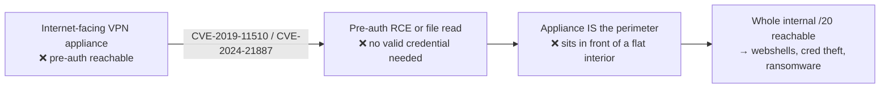
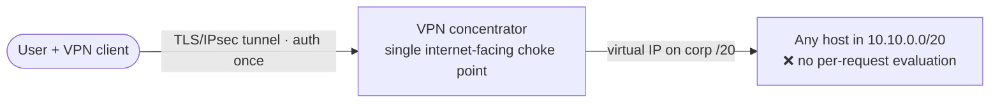
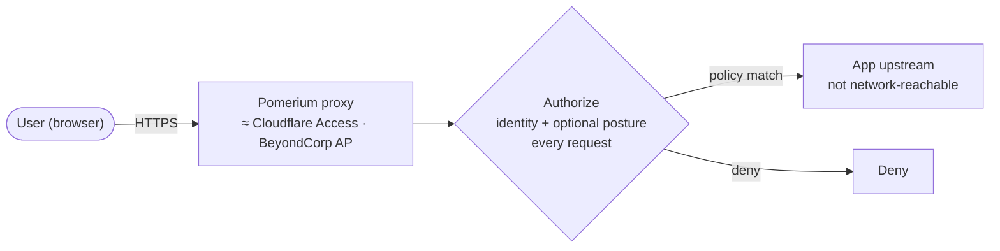
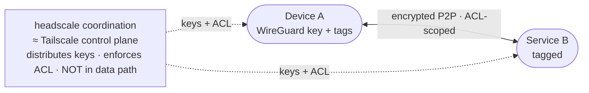
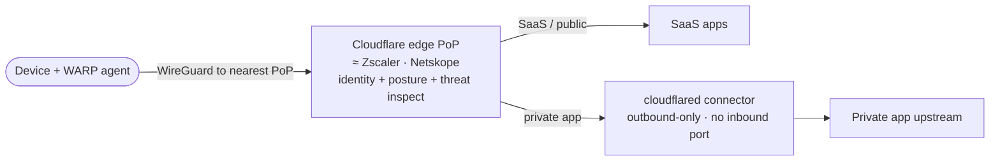
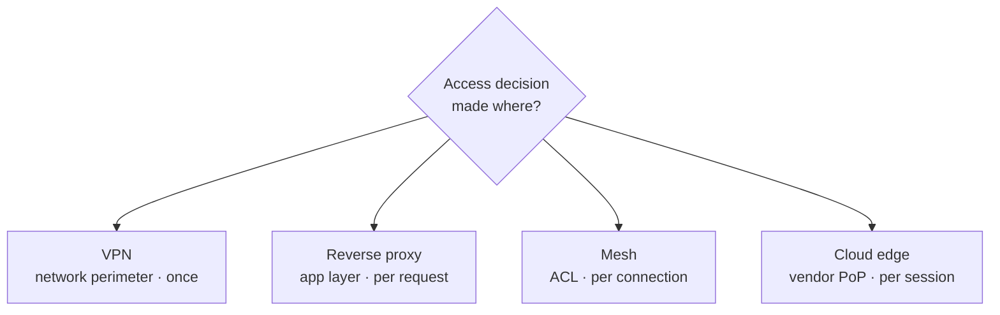

# Module 04 — ZTNA Architectures

*Type 11 · Decision / ADR — choose a ZTNA architecture under real constraints (self-hosted vs
cloud-delivered, threat model vs ops burden) and defend the pick; the deliverable is an Architecture
Decision Record with options scored, a one-sentence decision, and the honest consequences.
[Go to the hands-on lab →](lab.md)*

*Last reviewed: 2026-08*

**Zero Trust Network Access** — *four delivery patterns, one fixed principle: match the architecture
to the threat model and the team you actually have — not to the vendor's marketing, and not to the
internet-facing appliance that gets a new pre-auth CVE every year.*

<!-- module-meta -->
**Difficulty:** Intermediate &nbsp;·&nbsp; **Estimated time:** ~4–6 hrs (study + lab) &nbsp;·&nbsp; **Prerequisites:** [Foundations](../../../00-foundations/README.md)
{ .module-meta }

!!! abstract "In 60 seconds"
    "Zero Trust" is a government mandate, a sales term, and a real architectural shift all at once — and
    the practitioner skill is choosing the right *delivery pattern* for a specific org, not memorizing
    which product "is" ZT. Four patterns — VPN, reverse proxy, network mesh, cloud edge (plus hybrid) —
    map onto three trade-off axes: **self-hosted vs cloud-delivered**, **OSS/self-run vs managed**, and
    **threat model vs blast radius**. The cleanest way to feel *why* the newer patterns exist is to look
    at what keeps happening to the pattern they replace: the internet-facing VPN concentrator, popped
    pre-auth, again and again. You'll score the four against a real bank's constraints and defend the
    pick as an Architecture Decision Record — where the *Consequences* section is the proof, not the pick.

## Why this matters

"Zero Trust" is now a requirement in government mandates (the 2021 U.S. Executive Order 14028), a sales
term stamped on products that have little to do with ZT principles, and a genuine architectural shift
organizations are in various stages of implementing. The practitioner skill is being able to look at one
organization's real access patterns — its apps, its users, the size of the team that has to *run* the
thing — and say: which delivery pattern fits, what are the operational trade-offs, and where is the
blast-radius boundary when this pattern is compromised? That is a *decision*, and a decision worth
anything is one you can defend after the fact. This module is where you learn to make the call and record
it as an **Architecture Decision Record (ADR)** — the construct the rest of this track reuses every time
a choice has to be justified to someone who will live with the consequences.

## Objective

Read a structured comparison of the four ZTNA patterns, understand each one's traffic flow and
blast-radius boundary well enough to reason about it unaided, then score all four against a real
constraint set and produce an **Architecture Decision Record** — options scored, a pick, and *honest*
consequences — that a security architect could defend to a CISO. The deliverable is the ADR; its quality
is the defence, not the pick.

## The case: the appliance everyone was still trusting

**At a glance —** the VPN concentrator is one internet-facing box, reachable *before* anyone logs in,
that sits in front of the whole flat interior. That makes it the highest-value target on your edge — and
it keeps getting popped pre-auth. This is the concrete reason the newer patterns exist; feel it before
you score them.

Colonial Pipeline (Module 01) was a *stolen credential* walking through a VPN. This case is worse and
more instructive for an architect: the attacker never needed a credential at all. Legacy remote-access
appliances — **Pulse Connect Secure**, its successor **Ivanti Connect Secure** — are a single box, exposed
to the internet, that terminates the tunnel and fronts the entire trusted network. Because it is the
perimeter, it must be internet-facing, and because it is internet-facing it is *pre-authentication
reachable*. That combination is a magnet:

- **CVE-2019-11510** (Pulse Connect Secure) — an unauthenticated arbitrary file read. Attackers read
  plaintext credentials and session data straight off the appliance, then logged in as any user,
  including admin. Mass-exploited through 2019–2021; it is in **CISA's Known Exploited Vulnerabilities**
  catalog.
- **CVE-2023-46805 + CVE-2024-21887** (Ivanti Connect Secure) — an authentication-bypass chained with a
  command injection, giving **pre-auth remote code execution**. In January 2024 this was exploited at
  scale across thousands of appliances before patches landed; both CVEs are in the CISA KEV catalog.

!!! note "The architect's takeaway — this is a topology problem, not a patching problem"
    You can patch faster, but you cannot patch away the *shape*: one internet-facing, pre-auth-reachable
    box that, once owned, hands over the flat interior behind it. Every pattern below changes that shape.
    A **reverse proxy** exposes only the proxy and demands an authenticated identity per request. A
    **mesh** removes the public listener entirely (peer-to-peer WireGuard; the coordination server is not
    in the data path). A **cloud edge** flips the direction of connection — the connector dials *out*, so
    there is *no inbound port to attack*. "Which architecture?" is, in part, "where is my pre-auth box,
    and what does popping it buy the attacker?"

## The mental model — the principle is fixed; the delivery is an engineering decision

!!! note "The mental model"
    The ZT *principle* is fixed — never trust, always verify, enforce least-privilege at the resource —
    but the **delivery mechanism** is an engineering decision with real trade-offs. The skill is
    reasoning along the axes of that trade-off, not memorizing which product "is" Zero Trust. "We bought
    a ZTNA product" is not "we have Zero Trust" — the gap is being able to say *why this pattern was
    chosen* and *what threat model it addresses*, which is exactly what an ADR closes.

Three axes carry almost every ZTNA decision, and a good ADR reasons explicitly along each:

- **Self-hosted vs cloud-delivered.** Self-hosting (Pomerium, headscale) keeps the control plane and the
  data path in your hands — no vendor in the middle, no per-seat subscription, no third-party SLA tied to
  yours — at the cost of *you* now running, patching, and scaling that control plane with the staff you
  have. Cloud-delivered (Cloudflare Zero Trust, Zscaler) hands the ops burden and the global edge to a
  vendor, gets you one policy plane and threat inspection for free, and in exchange puts that vendor in
  your data path and makes their abuse handling and SLA part of your posture. This is the central call
  the lab asks you to defend.
- **OSS/self-run vs managed.** A near-relative of the first axis, but about *who carries the toil*: a
  3-engineer team with no network function will drown maintaining a self-hosted proxy fleet across dozens
  of apps, while a larger team may prefer the control and cost profile of OSS. The honest ADR scores
  operational complexity against the *actual* team, not an idealized one.
- **Threat model and blast radius.** The deciding question is **where the policy engine sits and what it
  can observe at the moment of the access decision** — and therefore *what an attacker gains if the
  pattern is compromised*. Each pattern below moves the policy engine to a different place, and every
  step narrows the blast radius while buying that with cost, ops, or a dependency on one of the other axes.

## The four patterns

Read each as *"where does the access decision get made, and what is exposed to the internet?"* — the two
questions that determine both granularity and attack surface.

### 1 · VPN (the baseline to improve on)

Authenticate once at the concentrator; get a virtual IP on the corporate subnet; reach anything. The
policy engine is the network perimeter, and it stops asking questions after the tunnel comes up.

Broad protocol support (any TCP/UDP), low operational novelty — and **maximum blast radius on credential
compromise**, plus the pre-auth appliance-CVE exposure from the case above. It is the pattern you are
almost always trying to shrink, not extend.

### 2 · Reverse proxy — the identity-aware proxy (Pomerium, BeyondCorp-style)

Move the decision to the application layer, evaluated **per request**. The app is not on the network at
all; only the proxy's listener is reachable, and it forwards nothing until identity (and optionally device
posture) matches policy.

Excellent for HTTP/S, self-hostable, OIDC-native — but **protocol-scoped**: it cannot replace a VPN for
arbitrary SSH/RDP/database traffic. A stolen JWT reaches only that user's authorized apps, not the network.
The gotcha: if the upstream is *also* reachable by any other path, the proxy protects nothing (see the
bypass warning below).

### 3 · Network mesh (Tailscale / headscale / Netbird)

Restore private-IP reachability cryptographically. Every device gets a WireGuard keypair and mesh IP; the
coordination server distributes keys and enforces an ACL, but is **not in the data path** — traffic flows
peer-to-peer. There is no public listener to attack.

Any protocol, cryptographic device identity, and an ACL model that *is* micro-segmentation — blast radius
is scoped to a device's tags. The costs: a client on every device (harder for BYOD), device-posture
integration that headscale OSS does not include (it's a Tailscale-commercial feature), and no traffic
inspection or SaaS visibility.

### 4 · Cloud edge (Cloudflare Zero Trust / Zscaler / Netskope)

Move enforcement to a distributed vendor edge with one policy plane and **continuous re-evaluation**. The
device agent routes to the nearest PoP, where identity, device posture, and threat signals are evaluated
per session; private apps are reached through an **outbound-only connector** — so no inbound firewall rule
exists to be attacked.

Best-in-class BYOD (browser-based access with no client), native posture signals (CrowdStrike ZTA, Intune),
and threat inspection for free — bought with **vendor dependency in your data path**: their SLA becomes
your security floor, they can observe your DNS and (with inspection) TLS, and the Access/Gateway control
plane is not self-hostable (only the `cloudflared` connector is open source).

A **hybrid** — cloud edge for SaaS/web + mesh for infrastructure — is often the honest answer for a mixed
estate, and a real ADR should be willing to recommend it.

### The comparison, on the axes that decide

| Dimension | VPN | Reverse proxy | Network mesh | Cloud edge |
|---|---|---|---|---|
| **Policy engine sits at** | network perimeter | app layer (proxy) | coordination server + node ACL | vendor edge PoP |
| **Trust evaluated** | once, at tunnel | per request | per connection (ACL) | per session (continuous) |
| **Protocol scope** | any TCP/UDP | HTTP/S, gRPC | any TCP/UDP | any (with WARP) |
| **Device posture** | none by default | optional (cert/claim) | tags only (headscale OSS) | native (CrowdStrike, Intune) |
| **Internet-facing pre-auth surface** | the concentrator (high) | the proxy listener | none (P2P, no listener) | none inbound (connector dials out) |
| **Blast radius (stolen credential)** | full network | that user's apps | that device's tagged services | policy-scoped, posture-gated |
| **Blast radius (control plane popped)** | concentrator = interior | all upstreams behind proxy | key distribution / routing | all data-path traffic (vendor) |
| **BYOD support** | poor (same grant) | good (browser) | fair (client required) | excellent (browser option) |
| **Ops burden (3-eng team)** | low (familiar) | medium (per-app config) | medium (ACL mgmt) | low–medium (managed) |
| **Self-hosted** | yes | yes (Pomerium) | yes (headscale) | partial (`cloudflared` only) |
| **Per-request audit** | no | yes | ACL level | yes |

### The ADR discipline — Consequences is the proof

The point of the ADR format (Nygard's **Context / Decision / Consequences**) is that it *forces the
honesty*: the Consequences section is where you write down what you are giving up and what new risk you
are taking on. Self-hosting is not "free" — you now run, patch, and scale a control plane (and *it* becomes
the pre-auth box). Cloud-delivered is not dependency-free — the vendor sits in your data path and their SLA
becomes your floor. A recommendation with only upsides is the tell of a junior architect — or an AI draft
you didn't review.

!!! warning "The gotcha — the upstream bypass"
    Every proxy or edge pattern rests on one assumption: the resource is reachable **only** through the
    policy engine. If the app is also directly reachable — firewalled by IP but not locked to the proxy's
    source, or a mesh service left listening on its old address — the ZTNA layer protects *nothing*. Before
    you recommend a per-request pattern, name where the bypass path is and how you close it. That
    sentence is worth more than the whole scoring table.

!!! tip "AI caveat"
    A model drafts the ADR template and pre-populates the scoring tables well — it knows the vendor
    landscape. Your critical review is the **Consequences** section: a model reliably lists only *positive*
    consequences. Explicitly ask it for the negative and risky ones per option, then verify each against
    the actual product docs. A model that says Cloudflare carries no single-vendor risk, or that a
    self-hosted proxy is "free," is not being honest about the axes.

## Go deeper (~3 hrs · optional)

*The patterns above are the spine — they teach the topology and the blast-radius reasoning, and you can do
the lab from them alone. These links are for **going deeper** and working from **primary sources**, not for
relearning what's above.*

**The case-study seam — from the primary source (~40 min)**
- [CISA — Known Exploited Vulnerabilities catalog](https://www.cisa.gov/known-exploited-vulnerabilities-catalog) — the authoritative "these are being exploited *now*" list; search "Ivanti" and "Pulse" to see the appliance CVEs land here. Your evidence that the VPN-appliance shape is a standing target, not a one-off.
- [NVD — CVE-2024-21887 (Ivanti Connect Secure command injection)](https://nvd.nist.gov/vuln/detail/CVE-2024-21887) and [CVE-2023-46805 (auth bypass)](https://nvd.nist.gov/vuln/detail/CVE-2023-46805) — the chain that gave pre-auth RCE in January 2024. Read the descriptions and the "known affected" scope.
- [NVD — CVE-2019-11510 (Pulse Connect Secure arbitrary file read)](https://nvd.nist.gov/vuln/detail/CVE-2019-11510) — the earlier, same-shape pre-auth read that leaked appliance credentials for years.

**Architecture patterns (~1.5 hrs)** *(`[depth]` — the four-pattern section already teaches these; read for the source vocabulary)*
- [Pomerium — Architecture Overview](https://www.pomerium.com/docs/internals/architecture) — the clearest documentation of the reverse-proxy ZTNA pattern: how the proxy fronts upstreams, how authentication and authorization are separated, and how policy is evaluated per request. Read it as the self-hosted end of the build-vs-buy axis.
- [Tailscale — What is Tailscale?](https://tailscale.com/docs/concepts/what-is-tailscale) — Tailscale's overview of the WireGuard mesh model, coordination server, and ACL-driven access. Read alongside module 03's headscale lab; note where commercial Tailscale adds posture signals that headscale OSS does not.

**The BeyondCorp pattern (~1 hr)** *(`[depth]`)*
- [BeyondCorp: Design to Deployment at Google (2016)](https://research.google/pubs/beyondcorp-design-to-deployment-at-google/) — the second BeyondCorp paper, on deployment. Read sections 2–4 for how the access proxy, device inventory, and trust-inference engine were assembled — the original reverse-proxy ZTNA in production, and real "prior art" you can cite in your ADR.

**ADR format (~30 min)**
- [Architecture Decision Records — Michael Nygard (2011)](https://cognitect.com/blog/2011/11/15/documenting-architecture-decisions) — the original ADR-format post. Short. The structure (Context / Decision / Consequences) is exactly what the deliverable uses; watch *Consequences* as the place the honest downsides live.

## Key concepts

- The ZT *principle* is fixed; the **delivery pattern** is an engineering decision with real trade-offs.
- The three axes: **self-hosted vs cloud-delivered**, **OSS/self-run vs managed (the ops burden on the *actual* team)**, **threat model & blast radius**.
- Four patterns: VPN (network perimeter), reverse proxy (app layer, per request), network mesh (device identity, per connection), cloud edge (distributed, per session) — plus hybrid.
- Policy-engine placement decides both *granularity* and *attack surface*: where is the decision made, and what is exposed to the internet pre-auth?
- The VPN concentrator is a single internet-facing, pre-auth-reachable box in front of a flat interior — the shape that Pulse/Ivanti CVEs keep exploiting (CVE-2019-11510; CVE-2023-46805 + CVE-2024-21887).
- Newer patterns change that shape: reverse proxy exposes only an authenticated listener; mesh has no public listener; cloud edge's connector is outbound-only.
- The **upstream bypass** voids any proxy/edge pattern: the resource must be reachable *only* through the policy engine.
- The ADR is the artifact: Context → options scored → Decision (the pick) → **Consequences** (the honest downsides + a real attack-path note).

## AI acceleration

Use a model to draft the ADR template and pre-populate the comparison and scoring tables — it knows the
vendor landscape well. **Your critical review is the Consequences section**: a model will reliably list
only positive consequences. Explicitly ask it to populate the *negative and risky* consequences per option,
then verify each against the actual product documentation. A model that claims Cloudflare Zero Trust carries
no single-vendor dependency risk, or that a self-hosted proxy is "free," is not being honest about the axes
— and catching that is the skill this module certifies. Push it one step further: ask it where the
**upstream bypass** is for your chosen pattern; if it can't name one, it hasn't reasoned about your topology,
it has recited a datasheet. **AI drafts → you review every line → you own the decision.**

!!! question "Check yourself"
    - Name the three trade-off axes — and why is "self-hosted vs cloud-delivered" not the same axis as "OSS/self-run vs managed"?
    - For the *same* stolen credential, how does the blast radius differ across VPN, reverse proxy, mesh, and cloud edge?
    - The Pulse/Ivanti CVEs are a patching story on the surface — why is the VPN concentrator a *topology* problem an architect can't patch away, and which patterns change the shape?
    - Why is a recommendation with only upsides — or one that never names its upstream-bypass path — a sign the ADR wasn't reviewed honestly?
