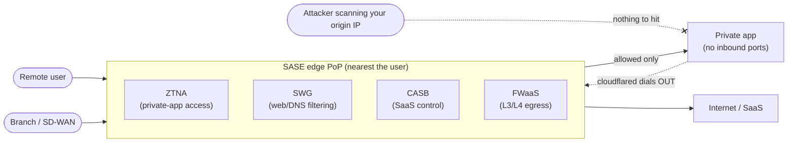
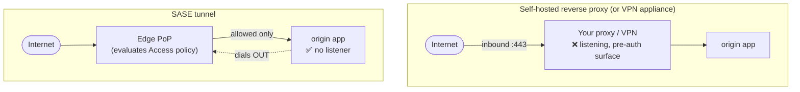
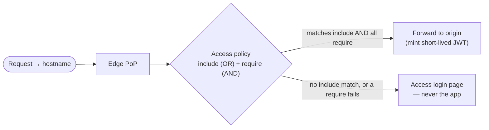
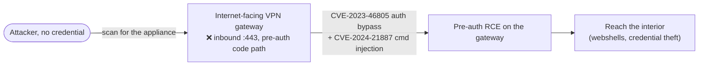

# Module 05 — SASE & Cloud-Delivered Zero Trust

*Type 7 · Build-&-Operate — publish an app through a SASE tunnel with an identity-aware Access policy
and no inbound ports; the deliverable is the working zero-inbound deployment plus a verified
unauthenticated-denial check. (Secondary: Design → Red-team-your-own.) [Go to the hands-on lab →](lab.md)*

*Last reviewed: 2026-08*

**Zero Trust Network Access** — *publish a private app to the whole internet with zero inbound ports,
gated at a global edge — then prove an unauthenticated request can't reach it, and defend why you
rented the edge instead of building it.*

<!-- module-meta -->
**Difficulty:** Intermediate &nbsp;·&nbsp; **Estimated time:** ~4–6 hrs (study + lab) &nbsp;·&nbsp; **Prerequisites:** [Foundations](../../../00-foundations/README.md)
{ .module-meta }

!!! abstract "In 60 seconds"
    SASE is the *managed* version of the Zero Trust networking stack you'd otherwise build by hand —
    ZTNA, a secure web gateway, a CASB, and a cloud firewall converged onto one global edge of points
    of presence. You publish a private app to anyone on the planet while the app opens **no inbound
    ports**: `cloudflared` dials *out* to the edge, the edge enforces your Access policy, and an
    attacker scanning your IP finds nothing to hit. That inversion is exactly what a decade of
    internet-facing **VPN-appliance** breaches (Pulse, Citrix, Ivanti) never had. The judgment is
    build-vs-buy — ops burden vs control — and the module ends by red-teaming your own design: prove
    there is no listener, and that an unauthenticated request is turned away.

## Why this matters

The previous module made you decide the *architecture*. This one makes you ship it and operate it. For
a small team without a data-centre, the fastest honest path from "we chose Zero Trust access" to "a
private app is live, authenticated, and has no open ports" is a cloud-delivered SASE edge.

And there is a second reason it matters, sharper than convenience. For twenty years the standard way to
reach a private app from outside was to point an **inbound-listening VPN appliance** at the internet
and let people dial in. That appliance is a permanently-exposed, pre-auth attack surface — and the last
few years turned that surface into a mass-casualty event: Pulse Secure, Citrix NetScaler ("CitrixBleed"),
and Ivanti Connect Secure each shipped a pre-authentication bug that let attackers walk *through* the
gateway with no credential at all. SASE doesn't harden that appliance — it **deletes** it. There is no
inbound listener to exploit, because the connection is dialled outbound from inside. This module is where
that stops being a slogan and becomes a thing you build and then attack.

## Objective

Stand up Cloudflare Zero Trust (free tier, 50 users, no expiring trial), run a `cloudflared` tunnel
that publishes a local nginx container with **no inbound ports**, gate it behind an Access policy that
requires email verification, and **prove denial** — an unauthenticated request reaches the login page,
never the app. Then defend the build-vs-buy call (when cloud-delivered beats self-hosted, and when it
doesn't) and red-team your own design by confirming that nothing listens.

## The core idea

!!! note "The mental model"
    SASE is **convergence, delivered as a service**: the security controls you used to buy as a rack of
    appliances — VPN concentrator, web proxy, CASB, firewall — collapsed into one policy engine that
    runs at the *edge PoP nearest the user*, not in your data-centre. The Zero Trust slice of it (ZTNA)
    has one load-bearing mechanic: the app dials **outbound-only** to the edge, so it is unreachable
    from the internet unless a request arrives through the edge — which evaluates your policy first.

**SASE — Secure Access Service Edge**, the term Gartner coined in its 2019 report — names the
convergence of *networking* (SD-WAN) and *security* into a single cloud-delivered service. Strip the
acronym and it is a stack of four security functions running at a global edge instead of on-premises
boxes:

| Piece | What it does | The appliance it replaces |
|---|---|---|
| **ZTNA** | Identity-aware access to **private** apps (per-request, no network placement) | The VPN concentrator |
| **SWG** (Secure Web Gateway) | Inspects/filters users' **outbound** web + DNS traffic | The on-prem web proxy |
| **CASB** (Cloud Access Security Broker) | Visibility & policy over **SaaS** usage (shadow IT, DLP) | The SaaS-monitoring appliance |
| **FWaaS** (Firewall-as-a-Service) | L3/L4 firewalling and egress control from the edge | The perimeter firewall |

The practitioner translation: instead of **backhauling** every branch and remote user's traffic to a
data-centre to pass through that rack of appliances (the hairpin that made remote work slow), the PoP
closest to the user runs the whole stack and forwards only what policy allows. This module builds the
**ZTNA** slice end-to-end and touches the SWG slice in the stretch — but the model is the same edge for
all four.

### The tunnel is the whole trick

`cloudflared` runs next to your app and opens an *outbound-only* encrypted connection to the edge. No
inbound port, no firewall rule, no listener. The app is unreachable from the internet unless the request
arrives through the edge — which evaluates your **Access policy** first. Compare the two data paths and
the security difference is structural, not incremental:

The Access policy itself is an ordered rule list — allow this email / this domain / this IdP group /
this device-posture check — and the building blocks are **additive**: email OTP today, federated SSO
tomorrow, posture-gated access after that, the tunnel model unchanged.

!!! warning "The gotcha — include is OR, require is AND"
    `include` is an **OR** (any one matching rule lets you in); `require` is an **AND** (every rule
    must hold). A policy with only `include: any @company.com email` and no `require` clause is
    *syntactically valid and wide open* — the implicit-trust bug, restored one layer up. It is the
    exact field where "valid policy" and "wide open" coincide, and the one thing you must check by hand.

### The judgment: cloud-delivered vs self-hosted

**The load-bearing decision of this module is build-vs-buy — and you must defend the call.** It is *not*
"the cloud always wins." The honest axis is **ops burden vs control**:

| | Cloud-delivered SASE wins when… | Self-hosted ZTNA wins when… |
|---|---|---|
| **Team** | small; running/patching your own proxies is the dominant toil | you have the SRE capacity to operate proxies |
| **Data path** | it's fine for a vendor to sit in (and terminate TLS on) the path | the path itself is the risk — regulated, sovereignty-constrained, air-gapped |
| **Availability** | the vendor's SLA is an acceptable security floor | you cannot make a third party's SLA your floor |
| **Scale / cost** | per-seat pricing fits | per-seat pricing breaks the model |
| **The price** | **dependency** — the vendor is now in your data path, and their config surface is a new place to misconfigure | you own the whole stack, warts and all |

Cloud-delivered buys you convenience and sells it back as **dependency**: the vendor is in your data
path, their availability SLA is the floor of your security posture, and their (substantial) config
surface is a new place to misconfigure. There is no universally right answer — there is the answer you
can defend for *this* environment, and that defence is part of the deliverable.

??? note "Background: where SASE and the tunnel model come from"
    SASE was named in Gartner's 2019 note "The Future of Network Security Is in the Cloud"; the
    outbound-only tunnel pitch is older, from Cloudflare's 2018 Argo Tunnel launch. Both are in *Go
    deeper*. Read the vendor material as the *case for* convergence — then weigh it against control,
    lock-in, and the fact that the vendor's SLA becomes your floor.

## The case: the VPN appliance SASE deletes (Ivanti / Citrix / Pulse)

**At a glance —** an internet-facing VPN gateway is a permanently-exposed, pre-auth attack surface. The
last few years turned that into mass exploitation. SASE removes the surface entirely: there is no
inbound appliance to reach.

In December 2023–January 2024, two chained flaws in **Ivanti Connect Secure** — **CVE-2023-46805** (an
authentication bypass) and **CVE-2024-21887** (a command injection) — let unauthenticated attackers run
code *on the VPN gateway itself*. It was exploited widely enough that **CISA issued Emergency Directive
24-01**, ordering U.S. federal agencies to disconnect affected appliances. It was not a one-off: **Citrix
NetScaler** ("CitrixBleed", **CVE-2023-4966**) leaked session tokens straight off the gateway, and
**Pulse Secure** (**CVE-2019-11510**) was a pre-auth file-read that fed years of intrusions. Same shape
every time: *a box you must keep patched is sitting on the internet, and the pre-auth path is the whole
game.*

Now look back at the SASE data-path diagram. The reason this class of breach can't land against the
tunnel model is not that the software is better — it's that **the box isn't there**. `cloudflared` dials
outbound; there is no inbound listener to fingerprint, no pre-auth code path exposed to the internet,
nothing to scan. You didn't patch the VPN appliance faster than the attacker — you removed it from the
attack surface. That is the concrete blast-radius argument this module asks you to make in your own words.

!!! note "The link back to Colonial"
    Module 01 opened this track on Colonial Pipeline: one legacy VPN account, no MFA, a flat interior.
    That was the *credential* path into a VPN. The Ivanti/Citrix/Pulse cases are the *un-credentialed*
    path into the same class of appliance. SASE closes both by the same move — delete the inbound box.

## Red-team your own design

Deploying a no-inbound-ports service and *claiming* it holds are two different things; the module ends
in that difference. The same property that makes the model strong makes the test cheap: because the
security is "there is no listener," you prove it by trying to find one. Confirm the origin port is bound
to loopback only and is unreachable from another network; confirm an unauthenticated browser lands on
the Access login page, never the app. Then count the attacker's cost honestly — against this design,
the attacker first has to find something to attack, and there is no exposed port to scan and no proxy to
fingerprint. You haven't made the app invincible; you've removed the cheap front door and forced the
attacker up the cost curve. State what's left: **a stolen valid session, a compromised enrolled device,
a vendor-side compromise.** That residual is the honest output of red-teaming your own design.

!!! tip "AI caveat"
    A model emits syntactically correct Cloudflare Access JSON fast — the trap. Two failures recur: it
    reaches for `include` where you need `require` (turning an AND into an OR), and it uses deprecated
    field names the dashboard silently won't honour. Then do the one test a model can't: attempt access
    with a credential that *should* be denied, and confirm it is.

## Go deeper (~3 hrs · optional)

*Build-first: the model above is yours to own — you can ship the lab from it. These get you to a working
tunnel and a defensible build-vs-buy call; they are optional depth and primary sources, not the path you
must click through to understand the module.*

**Cloudflare Zero Trust — get the tunnel up (~1.5 hrs)**
- [Cloudflare Zero Trust — Getting started](https://developers.cloudflare.com/cloudflare-one/setup/) (~45 min, do it) — the official setup. Work "Getting started" then "Connections → Tunnels"; the lab follows this closely and the docs are current.
- [Cloudflare Tunnel — how the connector works](https://developers.cloudflare.com/cloudflare-one/networks/connectors/cloudflare-tunnel/) (~25 min) — why the connection is outbound-only and how the edge routes to your origin. This *is* the "no inbound ports" mechanism — read it until you can explain why an IP scan of your server finds nothing.
- [Cloudflare Access — policies (include / require / exclude)](https://developers.cloudflare.com/cloudflare-one/policies/access/) (~20 min, the key page) — the OR-vs-AND rule semantics. Read `include` vs `require` carefully; this is the field where "syntactically valid" and "wide open" coincide.

**The VPN-appliance case — the primary source (~30 min · the case-study seam)**
- [CISA Emergency Directive 24-01 — Mitigate Ivanti Connect Secure and Ivanti Policy Secure Vulnerabilities](https://www.cisa.gov/news-events/directives/ed-24-01-mitigate-ivanti-connect-secure-and-ivanti-policy-secure-vulnerabilities) — the government order to disconnect the appliances. Read it as the "the inbound box is the surface" evidence file, then map it onto why the tunnel model has no equivalent surface.

**SASE, ZTNA & the build-vs-buy frame (~1 hr)** *(`[depth]` — the reveal above already teaches these; read for source vocabulary)*
- [NIST SP 800-207 — Zero Trust Architecture](https://csrc.nist.gov/pubs/sp/800/207/final) (~30 min, read §2 tenets + §3 logical components) — the vendor-neutral model SASE is one delivery of; gives you the language to argue self-host vs cloud-delivered on architecture, not marketing.
- [Cloudflare — Argo/Cloudflare Tunnel announcement (2018)](https://blog.cloudflare.com/argo-tunnel/) (~20 min) — the original "no inbound ports" pitch, shorter and clearer than the docs; read it for the security-model argument, then ask where the *dependency* it doesn't mention bites.

**The honest tradeoff (~15 min)**
- Gartner, "The Future of Network Security Is in the Cloud" (Lawrence Orans, Joe Skorupa, Neil MacDonald; 30 Aug 2019) — the report that coined SASE (now Gartner-gated; read a summary if you can't access the full note). Where SASE comes from and what convergence it claims; read it skeptically, as the vendor-side case you'll weigh against control and lock-in.

## Key concepts

- SASE = the *managed* ZT networking stack — **ZTNA + SWG + CASB + FWaaS** converged onto a global edge of PoPs, not a rack of appliances.
- `cloudflared` tunnel: outbound-only encrypted dial to the edge → **no inbound ports, no listener to scan** — the ZTNA slice's whole mechanic.
- Cloudflare Access: edge policy engine; building blocks are additive (email OTP → SSO → device posture).
- `include` is OR, `require` is AND — the field where "valid policy" and "wide open" coincide.
- **Build-vs-buy is the judgment**: ops-burden vs control — cloud-delivered wins for small teams; self-hosted wins when the data path / sovereignty / SLA / scale is the risk.
- Vendor dependency is the price: the edge SLA is your security floor; the config surface is a new misconfig source.
- The case: internet-facing VPN appliances (Ivanti CVE-2023-46805/-21887, Citrix CVE-2023-4966, Pulse CVE-2019-11510) are pre-auth surfaces SASE **deletes** rather than hardens.
- Red-team-your-design: prove "no listener" by trying to find one; the deliverable includes the *failed* unauthenticated reach.

## AI acceleration

Cloudflare Access policy JSON is well-structured and a model emits syntactically correct examples fast —
which is exactly the trap. **Your review job is to verify the policy is as *restrictive* as you intend,
not just valid.** Two failures recur: the model reaches for `include` where you need `require` (turning
an AND into an OR, so a posture check meant to *also* hold becomes an alternative way in), and it uses
deprecated field names the dashboard silently won't honour. Check every `include` / `require` /
`exclude` against the current Cloudflare docs, and confirm there is at least one `require` clause
anywhere your intent is "AND". Then do the one test a model can't do for you: attempt access with a
credential that *should be denied*, and confirm it is. AI drafts the policy → you prove the deny path →
you own the gate.

!!! question "Check yourself"
    - Why does an attacker scanning your origin's IP find nothing, even though the app is published to the whole internet?
    - The Ivanti/Citrix/Pulse breaches all exploited an inbound VPN appliance pre-auth — why is the SASE tunnel model structurally immune to that *class* of bug, not just better-patched against it?
    - A policy has one `include: @company.com email` and no `require` clause — who can get in, and why is that the implicit-trust bug one layer up?
    - When does self-hosted ZTNA beat cloud-delivered SASE, despite the higher ops burden?
