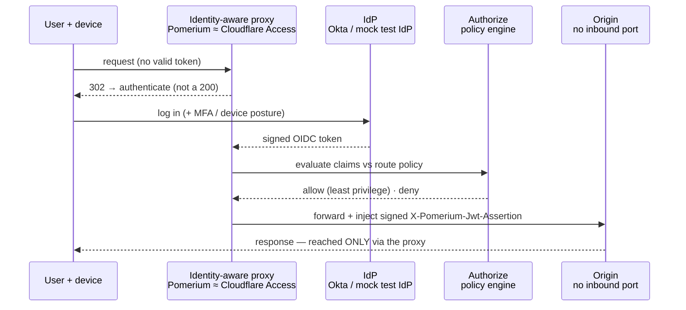
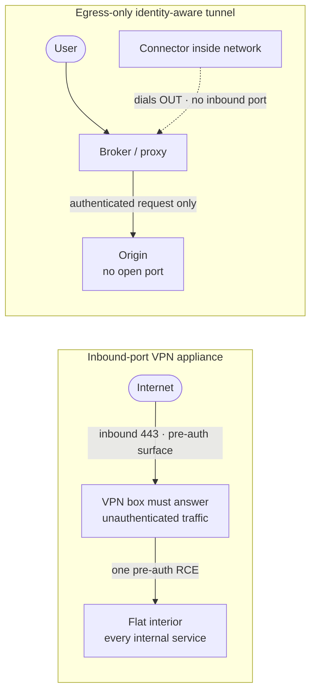
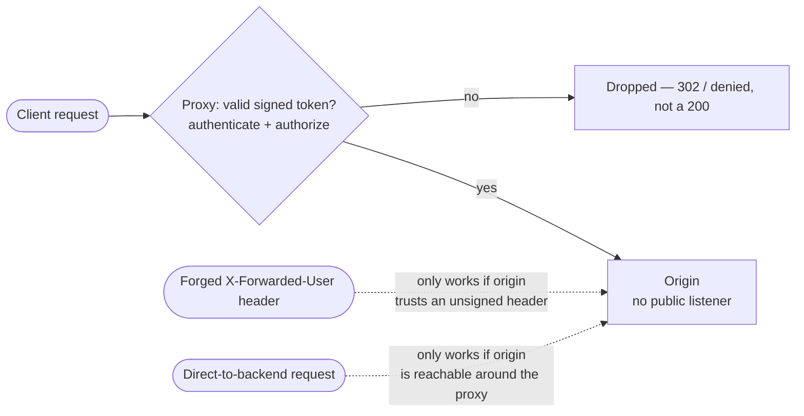

# Module 06 — Identity-Aware Access

*Type 7 · Build-&-Operate — stand up an identity-aware proxy and run it; the deliverable is the
operating proxy and its verified deny path, not an essay. (Secondary: Judgment-as-Code — the regression
test that proves the deny path can't silently open.) [Go to the hands-on lab →](lab.md)*

*Last reviewed: 2026-08*

**Zero Trust Network Access** — *the VPN appliance had to answer the internet before it knew who you
were; the identity-aware proxy makes every request prove itself first, and the service behind it never
opens a port at all.*

<!-- module-meta -->
**Difficulty:** Intermediate &nbsp;·&nbsp; **Estimated time:** ~4–6 hrs (study + lab) &nbsp;·&nbsp; **Prerequisites:** [Foundations](../../../00-foundations/README.md), and [Module 02 — Identity as the Control Plane](../02-identity-control-plane/README.md) for OIDC/JWT
{ .module-meta }

!!! abstract "In 60 seconds"
    An identity-aware proxy is a reverse proxy that speaks OIDC: it demands a signed, valid token on
    *every* request, checks it against policy, and only then forwards to a service that never listens on
    a public port. No valid token, no connection — not a 401, a dropped packet. This flips the fatal
    property of a perimeter VPN, whose appliance must accept *unauthenticated* connections from the whole
    internet just to show you a login — which is exactly why a single pre-auth bug in that box
    (Ivanti Connect Secure, Pulse Secure) hands attackers the interior with no credential at all. The
    model holds only while every path runs through the proxy (no bypass) and the origin trusts nothing
    but the proxy's signed proof (no forged header). You'll stand up Pomerium, watch a packet-level
    denial, and prove both failure modes fail closed.

## Why this matters

Traditional remote access draws a hard line at the perimeter: authenticate once at the VPN, and the
interior treats you as trusted. That assumption did not just age badly under hybrid work and cloud — it
carries a structural flaw that keeps producing the same headline. To let a remote employee reach the
login screen, a VPN concentrator has to expose an inbound listener to the entire internet, and that
listener must process attacker-controlled input *before* the attacker has proven anything. The
appliance is a large, feature-rich, internet-facing program that answers strangers by design. When one
of its pre-auth code paths has a bug, there is no credential to steal and no MFA to trip — the attacker
is simply *in*, and a flat interior does the rest.

Identity-aware access removes that surface. Internal services stop listening on the public internet
entirely; a proxy sits in front, terminates inbound TLS, validates the caller's identity token against
policy, and only then forwards upstream. The origin has **no open port** — attackers scanning your IP
range see nothing to attack. And in the egress-only variant (a connector inside the network that dials
*out* to a broker), there is no inbound port anywhere on the path at all. Either way, the "answer the
internet before you know who's asking" surface that Ivanti and Pulse Secure turned into national
incidents simply does not exist.

## Objective

Stand up Pomerium as an identity-aware proxy in front of a backend that has no published port; observe
a packet-level denial of an unauthenticated request; trace an authenticated request end-to-end and read
the injected identity headers; then prove the two ways this architecture is forged — a client-supplied
identity header and a direct-to-backend bypass — and confirm your deployment refuses both, encoded as a
regression test that goes red if it ever stops.

## The core idea

!!! note "The mental model"
    An identity-aware proxy is, stripped of marketing, a **reverse proxy that speaks OIDC**. Instead of
    a firewall rule that allows TCP/443 to an interior, you have a process that requires a signed token
    on *every* request, validates its signature, expiry, and claims against a policy, then forwards or
    rejects. The origin knows none of this — it just sees HTTP arriving with identity headers the proxy
    injected, from a proxy that is the only thing that can reach it.

The unit of access is the **request**, not the session (Module 01's spine). Where a VPN authenticates
once and drops you onto the network, the proxy re-derives trust every time: who is asking, from what
device, for which resource, right now. Pomerium bundles the three pieces you would otherwise wire by
hand — an **authenticate** service (the OIDC redirect dance with your IdP), an **authorize** service
(policy evaluated against claims), and a **proxy** (the forwarding) — and the lab runs all three in one
container for legibility; production splits them for scale and blast radius.

### The property that negates the VPN bug: no inbound port on the origin

The VPN appliance's defining weakness is that it must field unauthenticated traffic to function. The
identity-aware model attacks that at the root. The origin listens only on an internal network the proxy
can reach; nothing routes to it from outside. Compare the two shapes directly:

In the self-hosted proxy model you still expose *one* hardened, single-purpose process (the proxy),
but it authenticates before any origin logic runs, and the origins themselves are dark. In the
egress-only model (BeyondCorp connectors, Cloudflare Tunnel, Tailscale's mesh) the inbound listener
disappears entirely — the connector *dials out*. Both eliminate the "answer strangers, then RCE" path
the case study below turned into a crisis.

### The case-study seam: a pre-auth VPN RCE that no-inbound-ports negates

**In January 2024, two chained flaws in Ivanti Connect Secure** — the appliance formerly sold as Pulse
Connect Secure — were mass-exploited across thousands of internet-facing gateways. **CVE-2023-46805** is
an **authentication bypass** in the web component; **CVE-2024-21887** is a **command injection**. Chained,
an *unauthenticated* attacker reaches the admin web interface and runs arbitrary commands on the box —
the concentrator that terminates every remote employee's tunnel. No stolen password, no MFA prompt,
because the vulnerable code runs *before* authentication. Both are in the **CISA Known Exploited
Vulnerabilities catalog**; CISA issued Emergency Directive **ED 24-01** ordering federal agencies to
mitigate.

!!! note "Same shape, five years earlier: Pulse Secure CVE-2019-11510"
    A pre-auth **arbitrary file read** in the same product line let attackers pull plaintext credentials
    and session data straight off the appliance — no login required. It fueled ransomware intrusions
    (including the 2020 Travelex attack) *years* after a patch existed, because internet-facing VPN boxes
    are slow to patch and always listening. Also in CISA KEV. Different bug, identical lesson: the
    fatal surface is the **unauthenticated, internet-facing listener the appliance can't do without.**

Now read those breaches through the identity-aware model. There is no pre-auth web component to reach
because **the origin has no inbound port** — the only internet-facing process is a proxy that refuses
the request until the IdP has vouched for the caller, and in the egress-only variant there is no
inbound process at all. A pre-auth RCE needs something answering the internet unauthenticated; the
model's whole point is that nothing does. This is the seam to teach in the lab: you will confirm the
whoami backend is reachable *only* through Pomerium and that an unauthenticated request never touches it.

### Where this still fails — the deny path only holds under two conditions

The proxy buys you nothing unless the origin trusts **only the proxy** — and that is exactly where real
deployments break. An identity-aware proxy works by *injecting* the validated identity into the upstream
request as headers. The model is sound until a header an attacker can also set is trusted as if the
proxy set it.

The proxy's verdict is the only way in **only if** both dashed paths are closed:

- **No forged header.** The origin must trust *only* the proxy's *signed* assertion —
  `X-Pomerium-Jwt-Assertion`, a JWT the proxy signs with its own key — verified against the JWKS at
  `/.well-known/pomerium/jwks.json` plus `aud`/`iss`/`exp`, *before* trusting any identity inside it. A
  plain `curl -H "X-Forwarded-User: admin@corp.com"` costs nothing; a backend that believes an
  *unsigned* identity header has handed authentication to the attacker. **CVE-2026-40575** (OAuth2
  Proxy, CVSS 9.1) is this exact class made into a CVE: a client could spoof `X-Forwarded-Uri` so the
  proxy evaluated its auth rules against a *different* path than it forwarded.
- **No bypass.** Every route to the origin must pass through the proxy. A published port, a flat-network
  path, or a teammate who `docker run`s it with `-p` for convenience means a request never hits the
  identity check and the proxy is decoration. "No open ports" is not a nice-to-have — it is the
  precondition that makes the verdict binding, and it is the same property that negates the Ivanti/Pulse
  class.

!!! warning "The gotcha"
    Header-forgery and bypass are duals of one rule: **every path to the origin goes through the proxy,
    and the origin believes only what the proxy cryptographically signs.** Break either and a Zero-Trust
    deployment becomes theater. `curl -H "X-Forwarded-User: admin@corp.com"` is free; forging
    `X-Pomerium-Jwt-Assertion` needs the proxy's private key.

??? note "Background: policy should bind to groups, not email strings"
    A policy that says `allow if email ends in @corp.com` sounds reasonable until the IdP also issues
    tokens to `@corp-partner.com` contractors, or until you must distinguish a finance analyst from a
    junior dev. Real ZT policy matches on IdP-managed **groups or roles**, not raw email strings — the
    IdP is the system of record (it enforces MFA and device posture *before* issuing the token); the
    proxy is only the enforcement point. Tailscale reaches the same "no open ports" outcome at the
    *network* layer (each device gets a WireGuard tunnel identity); Pomerium does it at the *application*
    layer. Which you pick depends on whether you control the app (proxy is easier) or the infrastructure
    (mesh fits).

### Self-hosted proxy vs managed ZTNA — the same shape, different operator

| | Self-hosted proxy (Pomerium, oauth2-proxy) | Managed ZTNA / SASE (Cloudflare Access, Tailscale, Zscaler) |
|---|---|---|
| **Where it runs** | Your infra — you deploy, patch, scale the proxy | Vendor edge; you install a lightweight connector |
| **Inbound ports** | One hardened proxy exposed; origins dark | Often **zero** — connector dials out (egress-only tunnel) |
| **IdP** | Bring your own OIDC/SAML IdP | Bring your own IdP; vendor brokers the flow |
| **Policy control** | Full — Rego-like policy in your repo, versioned | Vendor policy UI/API; less low-level control |
| **Blast radius / ops** | You own the crypto, keys, upgrades — and the mistakes | Vendor owns uptime and CVEs; you accept their trust boundary |
| **Cost** | OSS, infra-only | Free tier → per-seat; scales with users |
| **Pick it when** | You want the mechanism legible and self-owned, control the app | You want no inbound ports with minimal ops, many remote users |

!!! tip "AI caveat"
    A model drafts a Pomerium `policy` block in seconds, and AI-generated access policy skews
    **permissive** — the only way to know is to send a request that *should* fail. Never accept the
    policy on the allow path alone: test the **deny path** (a rejected token, a forged identity header, a
    direct-to-backend request) and confirm each is refused, not a 200. That verdict is what the lab's
    `check-deny.sh` regression test makes permanent.

## Go deeper (~3 hrs · optional)

*The core idea above is the spine — it teaches the model, and you can do the lab from it alone. These
links are for **going deeper** and working from **primary sources**, not for relearning what's above.*

**The case-study seam — the VPN appliance CVEs (~30 min)**
- [CISA Known Exploited Vulnerabilities catalog](https://www.cisa.gov/known-exploited-vulnerabilities-catalog) — the authoritative "actively exploited in the wild" list; search it for the Ivanti and Pulse entries below to confirm real-world exploitation, not theory.
- [NVD — CVE-2023-46805 (Ivanti Connect Secure authentication bypass)](https://nvd.nist.gov/vuln/detail/CVE-2023-46805) — the auth-bypass half of the January 2024 chain; read the description and CWE for *where* the pre-auth surface lives.
- [NVD — CVE-2024-21887 (Ivanti Connect Secure command injection)](https://nvd.nist.gov/vuln/detail/CVE-2024-21887) — the RCE half; chained with the above, an unauthenticated attacker runs commands on the concentrator.
- [NVD — CVE-2019-11510 (Pulse Secure pre-auth arbitrary file read)](https://nvd.nist.gov/vuln/detail/CVE-2019-11510) — the five-years-earlier same-shape bug; note how long it was exploited *after* a patch shipped.

**Zero Trust fundamentals (~45 min)**
- [NIST SP 800-207 — Zero Trust Architecture, §2–3](https://nvlpubs.nist.gov/nistpubs/SpecialPublications/NIST.SP.800-207.pdf) (~25 min) — the authoritative definition; §2 for the tenets and §3 for deployment models. The "policy enforcement point vs policy decision point" split in §3 is exactly the authorize-vs-proxy division you stand up in the lab.
- [BeyondCorp: A New Approach to Enterprise Security (Google, 2014)](https://research.google/pubs/beyondcorp-a-new-approach-to-enterprise-security/) (~20 min) — the paper that made "ditch the VPN" credible. Focus on the access proxy and device-inventory components; skip the rollout sections.

**The proxy architecture and where validation sits (~1 hr)** *(`[depth]` — the core idea already teaches this; read for the source detail)*
- [How Pomerium works — architecture overview](https://www.pomerium.com/docs/internals/architecture) (~20 min) — the data-flow diagram is the fastest way to see where token validation sits relative to upstream forwarding. Note which component injects the assertion header.
- [Pomerium — JWT verification (Continuous Identity Verification at the Application Layer)](https://www.pomerium.com/docs/guides/jwt-verification) (~25 min) — **read this closely; it is the centerpiece.** It spells out exactly what the *backend* must check on `X-Pomerium-Jwt-Assertion` (signature against the JWKS, `aud`/`iss`, `exp`) before trusting any claim — i.e. why a signed assertion is safe and a plain header is not.

**OIDC/JWT and the header-trust CVE (~45 min)**
- [An Illustrated Guide to OAuth and OpenID Connect (Okta Developer Blog)](https://developer.okta.com/blog/2019/10/21/illustrated-guide-to-oauth-and-oidc) (~30 min) — the flow diagrams make the token handshake concrete; the "raw explanation" the core-idea section assumes. (Module 02 had you mint and validate a JWT — this is the refresher.)
- [OAuth2 Proxy — `X-Forwarded-Uri` header-spoofing advisory (CVE-2026-40575)](https://github.com/oauth2-proxy/oauth2-proxy/security/advisories/GHSA-7x63-xv5r-3p2x) (~10 min) — the recent (CVSS 9.1) incident the header-trust gotcha is built around. Read the "specific conditions" and the fix (the `--trusted-proxy-ip` allowlist) — the lesson, made into a CVE.

## Key concepts

- An identity-aware proxy requires a valid IdP-issued token on **every request** — not once per session — and only then forwards to an origin that never listens publicly.
- **No inbound port on the origin** is the property that negates a pre-auth VPN-appliance RCE (Ivanti CVE-2023-46805 + CVE-2024-21887; Pulse CVE-2019-11510) — there is no unauthenticated internet-facing surface to exploit.
- Egress-only tunnels (connector dials out) remove the inbound listener entirely; self-hosted proxies expose one hardened process and keep origins dark.
- The proxy terminates TLS; the origin sees injected identity headers, not the original token.
- **The origin must trust only the proxy's *signed* assertion (`X-Pomerium-Jwt-Assertion`), verified against the JWKS — never a plain, client-supplied header.** Forging an unsigned header is free (CVE-2026-40575 is this class); forging a signed one needs the proxy's private key.
- **No bypass:** every path to the origin passes through the proxy. Forged-header and bypass are the two duals of the same rule.
- Policy should bind to IdP-managed groups/roles, not raw email strings; the IdP is the authority, the proxy is the enforcement point.

## AI acceleration

A model will draft a Pomerium `policy` block in seconds — paste your IdP's claim structure and ask for
the `allow`/`deny` stanzas — and that speed is exactly the risk: **AI-generated access policy skews
permissive**, and the only way to know is to send a request that *should* fail. The posture holds — AI
authors → you review every line → you own it — and here it has a concrete shape: never accept the
policy on the allow path alone. Test the **deny path** yourself (a token that should be rejected, a
forged identity header, a direct-to-backend request) and confirm each is refused, not a 200. That
review is exactly what the lab's required `check-deny.sh` regression test makes permanent: the secondary
Judgment-as-Code beat of this module is encoding your verdict — "the unauthenticated and forged-header
paths stay closed" — as a script so a future config change can't silently reopen them.

!!! question "Check yourself"
    - Why does a no-inbound-port origin negate a *pre-auth* VPN-appliance RCE like the Ivanti or Pulse Secure chain — what surface no longer exists?
    - Why must the origin trust only the proxy's *signed* assertion and never a plain `X-Forwarded-User` header?
    - What is "proxy bypass," and why does an open backend port make the entire deny path moot regardless of how good the policy is?
