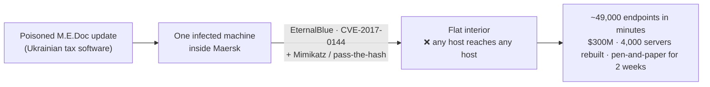
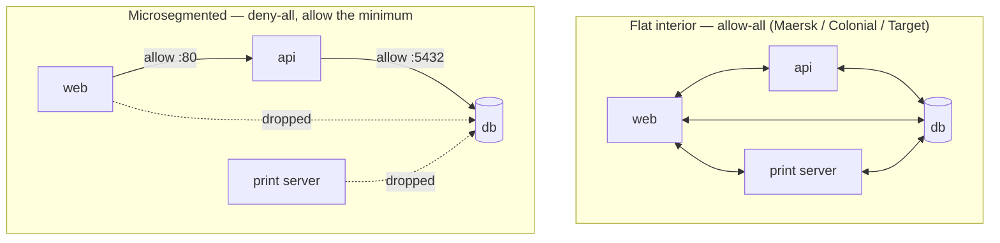
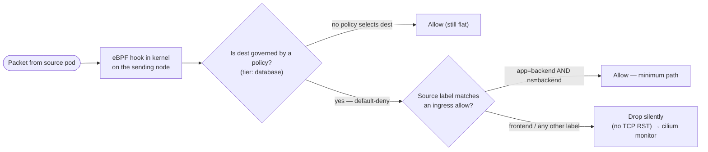

# Module 07 — Microsegmentation

*Type 7 · Build-&-Operate — stand up a default-deny segmentation policy in a real cluster and run it;
the deliverable is the policy-as-code and its proven allow+deny pair, not an essay. (Secondary:
Judgment-as-Code — the regression test that proves the denied path can't silently reopen.)
[Go to the hands-on lab →](lab.md)*

*Last reviewed: 2026-08*

**Zero Trust Network Access** — *shrink the blast radius to a single service boundary, not a VLAN —
learned by watching one poisoned machine become an entire global network.*

<!-- module-meta -->
**Difficulty:** Intermediate &nbsp;·&nbsp; **Estimated time:** ~4–6 hrs (study + lab) &nbsp;·&nbsp; **Prerequisites:** [Foundations](../../../00-foundations/README.md)
{ .module-meta }

!!! abstract "In 60 seconds"
    "Assume breach, minimize blast radius" (Module 01) has a concrete network shape:
    **microsegmentation**. The interior's default flips from *allow-all, block exceptions* to
    **deny-all, allow the minimum**, and that posture lives in version control as declarative,
    **label-scoped** rules — not hand-maintained IP firewall rules that rot on every pod restart. The
    cleanest way to learn *why* is to take apart NotPetya: one poisoned machine owned Maersk's entire
    global network in minutes because the interior was flat. You'll deploy a default-deny Cilium policy
    in a kind cluster, prove the allow *and* the deny, try to pivot around it, and freeze the pair as a
    regression test.

## Why this matters

Module 01 ended on a principle: *assume breach, minimize blast radius.* This module is where that
principle stops being a slogan and becomes a file you commit. The Colonial interior was flat; so was
Target's; so was Maersk's. In every case a single foothold reached far more than it had any business
reaching, because **the network said yes by default**. Microsegmentation is the direct answer — you
make east-west traffic (server-to-server, pod-to-pod) deny-by-default and then carve back the exact
paths the application actually needs. "We have a firewall at the edge" scopes *nothing* down once the
attacker is already inside; auditors in regulated environments (PCI-DSS, HIPAA, FedRAMP) now ask
specifically how you isolate cardholder data or PHI workloads from their neighbors in the *same*
cluster. The cleanest way to learn why is a breach the edge firewall was powerless to stop.

## Objective

Use a real lateral-movement catastrophe (NotPetya / Maersk) to derive *why* east-west default-deny is
the load-bearing control — then build it: deploy a default-deny Cilium network policy in a kind
cluster that restricts database-tier access to backend pods only, prove the allow case (backend→db)
and the deny case (frontend→db), watch the drop verdict in `cilium monitor`, try to pivot around it,
and encode the allow+deny pair as a regression test that goes red the moment the network is
re-flattened.

## The case: NotPetya / Maersk, June 2017

**At a glance —** the perimeter was irrelevant; the malware was already inside on one box. What turned
one box into 49,000 was the *flat interior*. The exploit is a footnote; the topology is the lesson.

On June 27, 2017, **NotPetya** entered Maersk through a poisoned auto-update to *M.E.Doc*, a piece of
Ukrainian accounting software, landing on a single machine. Within a *minute or two* it had the entire
global network. It spread two ways at once: **EternalBlue** (CVE-2017-0144, the SMBv1 RCE) hit every
unpatched Windows host reachable on the internal network, and a Mimikatz-style credential dump plus
pass-the-hash walked the rest using domain-admin tokens it scraped from memory. Maersk lost an
estimated **$300 million**, rebuilt **4,000 servers and 45,000 PCs**, and ran container terminals on
pen-and-paper for the better part of two weeks. ([Andy Greenberg's WIRED reconstruction](https://www.wired.com/story/notpetya-cyberattack-ukraine-russia-code-crashed-the-world/)
is the canonical account.)

!!! note "Same shape, different door"
    **Target 2013** — a stolen HVAC-*vendor* credential reached the corporate network, and a flat path
    led straight to the point-of-sale systems and 40 million cards. Different entry, identical lesson:
    the wall held at the edge and there was nothing behind it. Patching SMBv1 would have blunted
    NotPetya's *spread mechanism*; it would not have fixed the *topology* that let any foothold reach
    everything. That topology is what this module removes.

## Call it before you read on

Don't scroll. Write one answer — being wrong here is the point.

> **Maersk was fully patched the next week and the flat network was still there. If NotPetya-2 landed
> on one box again, what stops it this time — the patch, or something about the shape of the network?**

Most people reach for the patch: "close CVE-2017-0144 and you're fine." That kills *this* worm's
favorite propagation trick. It does nothing about the next credential-theft-plus-pass-the-hash spread,
or the next zero-day SMB bug, or the misconfigured service account. The patch fixes one *door*; it
leaves the *hallway* — the flat interior every foothold walks down — completely open.

## The reveal — the flat interior is the bug, not the exploit

The exploit was replaceable; the flat interior was the multiplier. Microsegmentation attacks the
multiplier. Its one idea: flip the network's default from *allow-all, block exceptions* to
**deny-all, allow the minimum**, and keep that posture in version control as declarative policy rather
than a tangle of firewall rules someone maintains by hand.

In Kubernetes the unit of segmentation is the **workload, not the subnet**: you label pods
(`app: backend`, `tier: database`) and write a rule that says *"pods labelled `tier: database` accept
ingress only from pods labelled `app: backend`."* Everything else is dropped because the policy exists
at all — the mere presence of an ingress rule on a pod flips it to default-deny. Crucially the rule is
**label-scoped, not IP-scoped**: pod IPs churn on every restart, so IP rules rot constantly, while
labels follow the workload. The policy *is* the perimeter now — there is no edge firewall doing this;
the boundary is wherever the policy says it is.

!!! note "The mental model"
    *The boundary is the kernel hook every packet already traverses.* Cilium is a CNI built on eBPF, so
    enforcement happens **in-kernel, on the sending node, before the packet leaves the container** — not
    at a downstream firewall. A pod on the *same node* as the database still goes through it. There is
    no "go around the network boundary," which is exactly what makes the deny credible enough to
    red-team.

The load-bearing judgment is **default-deny then allow the minimum — and prove both halves.** A policy
you only tested on the allow path is theater. The discipline this module makes you practice is to
verify the *deny* directly, then actively attempt to pivot around it (a different source pod, a
relabel, a direct dial to the service IP) and confirm it still drops. A default-deny baseline you
haven't tried to break is a guess.

| | Flat interior / VLAN | Microsegmentation (label-scoped) |
|---|---|---|
| **Default posture** | allow-all, block exceptions | **deny-all, allow the minimum** |
| **Unit of isolation** | subnet / VLAN (coarse) | the **workload** (one service boundary) |
| **What a rule names** | an IP or CIDR (rots on restart) | a **label** that follows the workload |
| **Where it's enforced** | perimeter / N-S firewall | **in-kernel (eBPF), on the sending node** |
| **Lives as** | hand-maintained firewall config | declarative **policy-as-code** in git |
| **NotPetya outcome** | one box → 49,000 in minutes | one box → one box; east-west denied by default |

!!! warning "The gotcha — two ways this silently breaks"
    **Default-deny silently breaks DNS.** A strict deny that forgets to allow port 53 to kube-system
    kills name resolution for every governed pod, and the symptom looks like an *application* bug, not a
    policy — so an explicit DNS allow is part of the baseline, not an afterthought. **Label scope is the
    soft spot.** `fromEndpoints: {app: backend}` allows *any* pod carrying that label in *any* namespace,
    so an attacker who can schedule a pod labelled `app: backend` elsewhere inherits the allow. Bind app
    **and** namespace — the difference between naming a *workload* and naming a *string anyone can copy*.

The observability half closes the loop: Hubble and `cilium monitor` give a per-flow audit trail —
"frontend tried database:80 at T, policy X dropped it" — correlated with pod/namespace/label metadata.
That is the same structured telemetry Module 09 turns into a lateral-movement detection.

!!! tip "AI caveat"
    A model generates a `CiliumNetworkPolicy` from plain-English intent in seconds, and it skews open in
    two predictable ways: it forgets the DNS allow (so you'll think a working policy is broken) and it
    writes the allow as a bare app-label match with no namespace constraint. Never accept it on the
    allow path alone — test the deny, then *try to pivot around it*. That verdict is what the lab's
    `verify-policy.sh` makes permanent.

## Go deeper (~3 hrs · optional)

*The autopsy and the diagrams above are the spine — they teach the model, and you can do the lab from
them alone. These links are for **going deeper** and working from **primary sources**, not for
relearning what's above.*

**The breach, from the reporting (~20 min) — the case-study seam**
- [NotPetya / Maersk reconstruction — Andy Greenberg, WIRED (2018)](https://www.wired.com/story/notpetya-cyberattack-ukraine-russia-code-crashed-the-world/) — read the Maersk section for the *flat interior* failure that microsegmentation exists to prevent; it makes the stakes of the deny case concrete. Your evidence for *why* the topology, not the patch, is the fix.

**Kubernetes NetworkPolicy fundamentals (~45 min)** *(`[depth]` — the reveal above already teaches the default-deny mechanism; read for the resource shape you'll write)*
- [Kubernetes Network Policies (official docs)](https://kubernetes.io/docs/concepts/services-networking/network-policies/) (~25 min) — the canonical reference for the `NetworkPolicy` resource. Read "Behavior of `to` and `from` selectors" and "Default policies"; the rule that *a pod is default-deny only once a policy selects it* is the single most common source of "why is everything still open?"
- [Cilium security policy docs](https://docs.cilium.io/en/stable/security/policy/) (~20 min) — skim for `CiliumNetworkPolicy` vs. standard `NetworkPolicy` and the `fromEndpoints` selector; that selector is what you write in the lab.

**Why eBPF enforcement changes the threat model (~40 min)** *(`[depth]`)*
- [Cilium — eBPF datapath / how Cilium enforces policy](https://docs.cilium.io/en/stable/network/ebpf/intro/) (~25 min) — read enough to see *where* the drop happens (in-kernel, on the egress node) and why that means there is no path around the policy for a same-node pod. This is the "the boundary is the kernel" claim, sourced.

**Hands-on: kind + Cilium + Hubble (~1 hr)**
- [Getting Started with Cilium on kind (Cilium docs)](https://docs.cilium.io/en/stable/installation/kind/) (~25 min) — the exact bootstrap the lab uses; read once before `make up` so you know what the install is doing.
- [Observing network flows with Hubble (Cilium docs)](https://docs.cilium.io/en/stable/observability/hubble/setup/) (~20 min) — how to enable Hubble and read a drop verdict with its source/destination/label context; this is the audit trail your deliverable cites and the telemetry Module 09 reuses.

## Key concepts

- Microsegmentation flips the interior default from allow-all to **deny-all, allow the minimum**, and the policy lives as code, not hand-maintained firewall rules. The policy *is* the perimeter.
- The exploit is replaceable; the **flat interior is the multiplier** — one foothold → the whole network (NotPetya/Maersk, Colonial, Target). Segmentation attacks the multiplier, not the door.
- Cilium enforces **in-kernel via eBPF**, on the sending node, before the packet leaves the pod — so there's no "go around the boundary," even for a same-node pod.
- Rules are **label-scoped (`fromEndpoints`), not IP-scoped** — stable across pod restarts; but a bare app-label allow matches that label in *any* namespace, so bind app **and** namespace.
- **Default-deny silently breaks DNS** — allow port 53 to kube-system as part of the baseline or name resolution fails in ways that look like app bugs.
- **Prove both halves and try to pivot:** allow (backend→db) succeeds, deny (frontend→db) drops, and the deny holds under an active bypass attempt.
- Hubble / `cilium monitor` give per-flow drop verdicts with pod/namespace/label metadata — the same telemetry Module 09 detects on.

## AI acceleration

Hand a model your segmentation intent — "backend pods reach database pods on port 80, deny everything
else" — and it produces a `CiliumNetworkPolicy` in seconds, and that speed is exactly the risk, because
**AI-generated network policy skews open in two predictable ways**: it forgets the DNS allow (so you'll
think the policy is broken when it's actually working) and it writes the allow as a bare app-label
match with no namespace constraint (so any namespace's `app: backend` pod inherits the allow). The
posture holds — AI authors → you review every line → you own it — and here it has a concrete shape:
never accept the policy on the allow path alone. Test the **deny** yourself, then *try to pivot around
it*. That review is what the lab's required `verify-policy.sh` makes permanent — the Judgment-as-Code
beat that encodes your verdict ("frontend→db stays closed; backend→db stays open") so a future edit
that re-flattens the network turns the check red instead of going unnoticed. If you can explain *why*
the patch never saved Maersk but the policy would have, you own the module.

!!! question "Check yourself"
    - Maersk was fully patched the following week — why is a default-deny east-west policy still the load-bearing fix, not the patch?
    - Why is a label-scoped Cilium rule more durable than an IP-scoped firewall rule in a Kubernetes cluster?
    - A default-deny policy is in place and an app suddenly can't resolve names — what did the policy most likely forget, and why does it look like an app bug?
    - Why is `fromEndpoints: {app: backend}` (app label only) a weaker allow than one that pins both the app label and the namespace?
