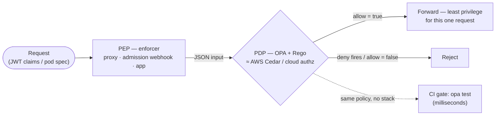
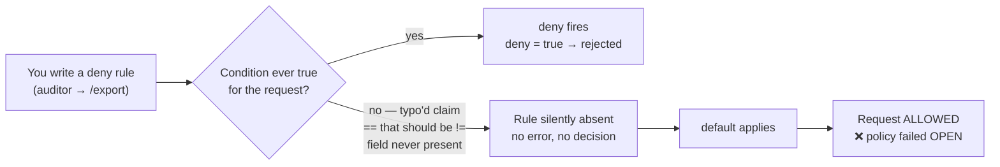
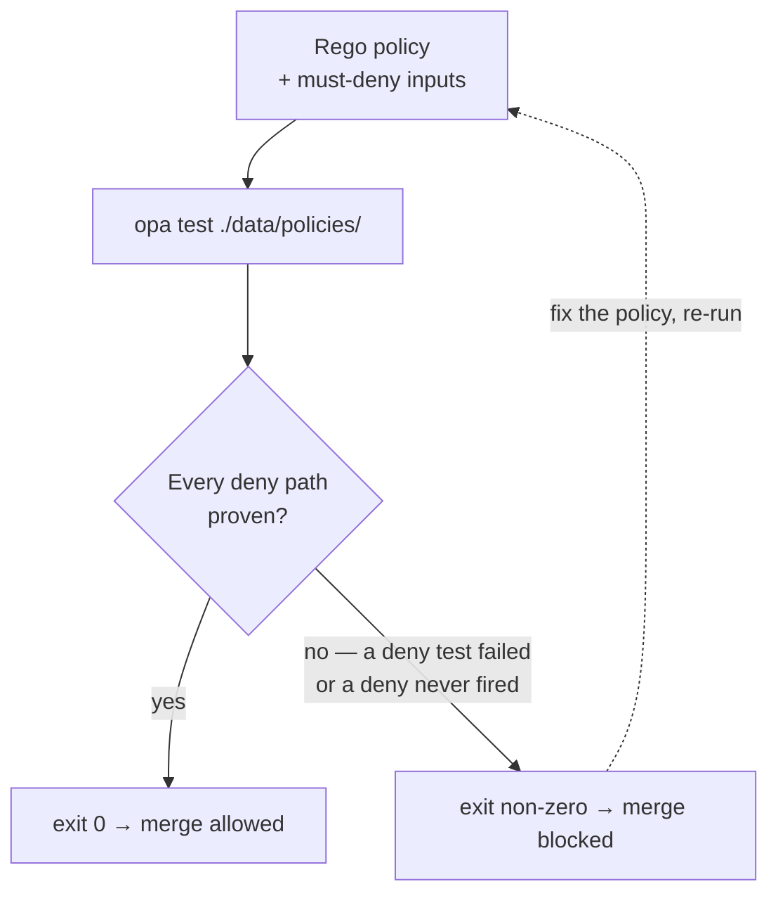

# Module 08 — Policy as Code

*Type 8 · Judgment-as-Code / Gate — the deliverable is a policy gate that fails-bad and passes-good in
CI; you prove it both ways and catch a fail-open gap. (Secondary: Build-&-Operate — you run real OPA
over real Rego.) [Go to the hands-on lab →](lab.md)*

*Last reviewed: 2026-08*

**Zero Trust Network Access** — *authorization logic that lives in git, gets reviewed, gets tested like
software — and fails closed when you forget a rule.*

<!-- module-meta -->
**Difficulty:** Intermediate &nbsp;·&nbsp; **Estimated time:** ~4–6 hrs (study + lab) &nbsp;·&nbsp; **Prerequisites:** [Foundations](../../../00-foundations/README.md) · Module 06 (Identity-Aware Access) for the OIDC/JWT claims a policy reads
{ .module-meta }

!!! abstract "In 60 seconds"
    Policy as code puts authorization logic in a version-controlled file — surrounded by tests, shipped
    through a pull request, auditable as a `git blame` — so it stops drifting the way a UI checkbox
    does. You describe the rule in **Rego**, **OPA** returns a structured decision, and *your*
    infrastructure enforces it. But that expressiveness hides one failure mode this module is built
    around: **a rule you never wrote is an allow.** A policy that fails *open* looks like a control while
    granting everything — the deny that never fires denies nothing. The deliverable is a CI gate that
    catches exactly that, proven both ways: red on the broken policy, green only on the real fix.

## Why this matters

When access policy lives in a UI — a checkbox in your IdP, a firewall rule buried in a vendor portal,
a role toggle in a SaaS admin panel — it drifts. The person who enabled the exception three years ago
has left. The audit log records *that* the rule changed but not *why*. The quarterly access review
catches the stale grant eventually, maybe. Policy as code puts that same authorization logic in a
version-controlled file, wrapped in tests, merged through review, and auditable as a `git blame`. The
engineering discipline that keeps application code from regressing — diffs, tests, CI — now keeps your
*authorization* from regressing.

In a Zero Trust architecture this matters more than under a perimeter model, because ZT moves the
question from "is this traffic inside the network?" to "does **this** identity, at **this** moment,
with **this** device posture, have permission to do **this** thing?" That is a complex predicate —
too complex to express reliably by clicking checkboxes. You need a language built for authorization
logic and a runtime that evaluates it the same way every time, at scale. And the same expressiveness
that buys you that precision hides the trap this whole module circles: **the deny you meant to write,
but never did, defaults to allow.** A policy that fails open is worse than no policy — it looks like a
control while granting everything behind it.

## The core idea: OPA is a decision point, and the dangerous default is *allow*

**Open Policy Agent (OPA)** is a general-purpose policy engine. You write the authorization logic in
**Rego** — a declarative, logic-programming query language built for policy — feed OPA a JSON document
describing the request (`input`), and OPA returns a structured decision: `allow` is `true`/`false`, and
a `deny` rule fires or it doesn't. *Your* infrastructure then acts on that answer. The load-bearing
design choice is that **OPA is decoupled from enforcement** — it does not sit in the data path. Your
app, your Kubernetes admission webhook, or your identity-aware proxy from Module 06 (the **PEP**,
policy *enforcement* point) *calls* OPA (the **PDP**, policy *decision* point) and enforces the verdict.

That decoupling is the whole reason policy-as-code is gate-able. Because the decision logic is separate
from the thing enforcing it, you can evaluate the policy in **milliseconds** against a canned `input` —
no proxy, no cluster, no running stack — which is exactly what lets it live in CI beside your unit
tests. **That gate is the deliverable of this module:** the verdict encoded so it can't quietly regress
when someone copies the policy next quarter.

!!! note "The mental model"
    OPA answers a question; it never opens a door. You hand it `input` (the request as JSON), it hands
    back a decision (`{"allow": true}` / `deny` fired), and your PEP forwards or rejects. Policy and
    enforcement being separate is what makes the policy a *unit under test* — and a control you can gate
    in CI instead of a checkbox you hope nobody un-ticked.

### The centerpiece: a rule that never fires is silently absent

Here is why this is a *judgment-as-code* module and not a "learn Rego" page. Rego is **declarative**:
you write *what must be true* for a rule to fire, not a sequence of if-statements. A rule whose
condition is **never satisfied is not an error — it is silently absent.** So if you write a `deny` rule
but a condition inside it is never true — you check `input.user.roles` (plural) when the request spells
it `input.user.role`; you type `==` where you meant `!=`; you guard it behind a field the request never
carries — the rule simply never fires. No deny is produced, and **the default applies.**

If your evaluation is structured so that "nothing denied" means "allow," you have just shipped a policy
that **fails open**: it denies nothing, passes every test you only wrote for the allow path, and grants
access to exactly the case you thought you'd blocked. This is the single most dangerous class of OPA
mistake, and the cruelty is that it is *invisible* — the policy looks complete, the demo is green, and
the hole is precisely the rule you *meant* to write. **The skill is testing the deny path explicitly,
and structuring the query so that absence-of-decision resolves to deny, not allow.**

!!! warning "The gotcha"
    A `deny` rule whose condition never matches is not a bug OPA reports — it is a rule that quietly
    isn't there. Query `data.corp.access.deny` for the request that *must* be blocked: if the rule is
    broken you get `false`, not a fired deny — and enforcement that reads "not denied" as "allow" has
    just failed open. `default allow := false` and querying the **deny** decision (deny overrides allow)
    is how you make "no rule fired" resolve to *closed*, not *open*.

### The gate is the deliverable

A scanner — or OPA itself — is a fast junior reviewer with no context: it evaluates exactly the rules
you wrote, instantly, every time, and tells you **nothing** about the rule you forgot. That blind spot
is where you add the value the tool can't. So the lab's rhythm is: write the policy → run the case that
*must* be denied → confirm the deny actually **fired** (not that allow merely happened to be absent) →
wire it into a gate that exits non-zero on the bad input and zero on the good one. A test suite that
only exercises the allow path is not a gate — it is theater that stays green while the deny rule rots.

The lab's two scenarios are deliberately tiny so the mechanism stays legible: **role-based data
access** (an analyst reads but can't write; deny overrides allow) and **Kubernetes admission** (reject
any pod running as root — including the one that *omits* `runAsUser`, which is also root by default and
the case AI drafts most often miss). AI will draft both Rego files in seconds and they will look
correct; the question that separates a control from a liability is whether *you* ran the deny case and
proved the gate flips.

!!! note "Production shape — a deny *set* of reasons"
    The lab keeps `deny` a boolean with `default deny := false` so the output is legible (`true`/`false`).
    The production pattern is a **partial set** — `deny contains msg if { … }` — that collects one human
    string per violation, so an admission rejection tells the developer *why*. **OPA Gatekeeper**
    (`ConstraintTemplate` + `Constraint`) wraps that same engine in Kubernetes CRDs for real enforcement.
    The trap is identical either way: a member that's never added is a reason you never emit — a deny
    that never fires.

## The case-study seam: broken access control is the deny that never fired

Every year OWASP ranks the most common web risks, and in 2021 **Broken Access Control** moved to the
**#1** slot — 94% of tested applications had some form of it. That category *is* this module's failure
mode in the wild: an authorization check that was supposed to say "no" either wasn't written, ran on
the wrong field, or was bypassable — so the request that should have been denied sailed through. The
mechanism is the same whether the missing check is a forgotten Rego `deny` or a route handler that
trusts a client-supplied ID.

The canonical shape is the **IDOR** (insecure direct object reference): an authenticated user changes
`/account/1001` to `/account/1002` and reads someone else's data, because the endpoint authenticated
*who you are* but never authorized *what you may touch*. In 2018 the U.S. Postal Service's "Informed
Visibility" API did exactly this at scale — any of ~60 million authenticated users could query the
account details of any other, because the authorization check that should have scoped each request to
its own owner simply wasn't enforced. No exotic exploit; the deny never fired. That is why the lab's
discipline — *run the case that must be denied and confirm it actually was* — is not pedantry. It is
the one test that would have caught it.

!!! note "The mental model"
    Authentication proves *who*. Authorization decides *what they may do* — and it is the half that
    silently doesn't run. Policy-as-code's value is making that second check a version-controlled,
    unit-tested artifact with a CI gate, so "the deny that never fired" becomes a red build instead of a
    breach.

## UI-clicked policy vs. policy as code

The shift is the same one Zero Trust makes everywhere — from a state you *hope* is right to a decision
you can *prove* is right, every time:

| | UI-clicked policy | Policy as code (OPA/Rego) |
|---|---|---|
| **Where it lives** | a checkbox / portal / vendor console | a versioned `.rego` file in git |
| **Change record** | "modified by admin" — *that* it changed | a diff + PR: *what*, *who*, *why*, reviewed |
| **Testing** | click through it and hope | `opa test` — allow **and** deny paths, in CI |
| **Drift** | silent; caught at the next audit, maybe | a failing gate blocks the merge |
| **Reuse** | re-click per system, inconsistently | one policy, many enforcement points |
| **Fail mode** | opaque — you can't see the missing rule | **still** fails open if untested — the gate is what closes it |

The last row is the honest one: policy-as-code does not *automatically* fail closed. It gives you the
*means* to prove it does — `default allow := false`, an explicit deny-path test, and a gate that goes
red when the deny stops firing. Skip those and you've merely moved the fail-open policy from a portal
into a repo.

!!! tip "AI caveat"
    AI is fluent at Rego — RBAC, pod security, JWT claim checks — and drafts both of this lab's policies
    correct-*looking* in seconds. That fluency is the hazard: the model writes the *allow* path it was
    asked for and rarely the *deny* path you need proven. The non-negotiable follow-up: run OPA against
    an input that **must** be denied and confirm the deny **fired** (`deny = true`), not that the result
    was merely empty/false. An absent decision reads as allow in a poorly-structured query — and that's
    the one thing the model won't warn you about.

## Go deeper (~3 hrs · optional)

*The sections above teach the mechanism — you can do the lab from them alone. These links are for
working from the **primary sources** and going deeper, not for relearning what's above.*

**The case-study seam — broken access control (~30 min)**
- [OWASP Top 10 (2021) — A01: Broken Access Control](https://owasp.org/Top10/A01_2021-Broken_Access_Control/) — the authoritative writeup of the #1 web risk and the exact failure this module encodes into a gate. Read the "Description" and the common-weakness list (IDOR, missing function-level authz); every item is a `deny` that never fired.
- [Krebs on Security — "USPS Site Exposed Data on 60 Million Users" (2018)](https://krebsonsecurity.com/2018/11/usps-site-exposed-data-on-60-million-users/) — the Informed Visibility API IDOR, a broken-access-control incident at scale. The documented case the seam above is drawn from.

**OPA and Rego foundations (~1.25 hrs)** *(`[depth]` — the core idea above already teaches these; read for the source vocabulary)*
- [OPA — Policy Language (official docs)](https://www.openpolicyagent.org/docs/policy-language) (~50 min) — the canonical Rego reference. Read **Rules**, **The `default` keyword**, and **Negation** closely: `default` is your fail-closed switch, and negation is where "the rule never fired" silently becomes an allow. Skim Comprehensions; the lab's policies stay simple on purpose.
- [OPA — Policy Testing (official docs)](https://www.openpolicyagent.org/docs/policy-testing) (~35 min) — `opa test` unit-tests Rego the way you test app code: `test_` rules, the `with … as …` input-mocking keyword, `--coverage`. This is the tool that makes "explicitly test the deny path" mechanical instead of a discipline you must remember.

**OPA in Kubernetes admission (~45 min)**
- [OPA Gatekeeper — Introduction (official docs)](https://open-policy-agent.github.io/gatekeeper/website/docs/) (~45 min) — the production path for OPA admission in Kubernetes (it wraps OPA in CRDs: `ConstraintTemplate` + `Constraint`). Read the admission-webhook architecture and the **Constraints** model. The lab uses raw `opa eval` for legibility; read this so you know what the real deployment looks like.

**Policy as code as a gate (~40 min)**
- [OPA — CLI reference: `opa eval` / `opa test` exit codes](https://www.openpolicyagent.org/docs/cli/) (~25 min) — the gate lives or dies on exit codes. Read exactly when `opa test` exits non-zero, and how `opa eval --fail` / `--fail-defined` turn a decision into a process exit you can gate on (`--fail` exits non-zero on an *undefined/empty* result; `--fail-defined` on a *defined* one — pick the one that makes "the bad state" non-zero).
- [The Rego Playground](https://play.openpolicyagent.org/) (~15 min) — paste a policy + input and watch the decision in the browser; the fastest way to *see* a deny rule silently not firing (the output goes empty/`false`, never an error) before you've installed anything.

## Key concepts

- OPA is a **decision point (PDP), decoupled from enforcement (PEP)** — it returns a verdict; your proxy / admission webhook / app enforces it. Decoupling is what makes the policy testable and gate-able in milliseconds.
- Rego is **declarative**: you write *what must be true* for a rule to fire, not control flow. A rule whose condition is never true is **silently absent** — no error, no decision.
- **The fail-open trap is the whole module:** the `deny` you forgot to write (or that never fires) defaults to *allow*. Always test the deny path; structure the query so "no decision" means deny.
- `default allow := false` **plus querying the deny decision** (deny overrides allow) is how you make absence-of-rule fail *closed*.
- Kubernetes admission must cover **both** explicit `runAsUser: 0` **and** an omitted `runAsUser` — the second is also root, and is the case AI drafts most often miss.
- **Broken Access Control (OWASP A01:2021)** is this failure in the wild — an authorization check that should have said "no" but never ran (IDOR, USPS 2018).
- The deliverable is the **gate**: it exits non-zero on the bad input and zero on the fix, so the verdict can't regress. A test that only checks the allow path is not a gate; it's theater.

## AI acceleration

AI is fluent at Rego for common patterns — RBAC, Kubernetes pod security, JWT claim checks — and will
draft both of this lab's policies correct-*looking* in seconds. That fluency is exactly the hazard,
because the model writes the *allow* path it was asked for and rarely the *deny* path you actually need
proven. The non-negotiable follow-up after every AI-drafted policy: run OPA against an input that
**must** be denied and confirm the deny **fired** — `deny = true` (or `allow = false` for an
allow-shaped query), **not** an empty or `false` result that nobody checked was even evaluated. An
absent decision reads as allow in a poorly-structured query: the policy "passes" because the rule was
never exercised. The model will not warn you about this; it is the one thing you own. Make AI draft the
policy, the tests, and the CI workflow; **you** write the deny-case input, confirm the gate fails the
bad state for the *right* reason, and confirm it passes only the genuine fix. AI authors, you review
every line, you own the verdict — and you own the rule it forgot to write.

!!! question "Check yourself"
    - Why does decoupling OPA (the PDP) from the enforcement point (the PEP) make the policy gate-able in CI?
    - In a poorly-structured query, why does an empty/`false` deny read as *allow* — and what does that mean for a `deny` rule whose condition never fires?
    - For the Kubernetes admission policy, why is rejecting `runAsUser: 0` not enough — what second case must the rule also catch?
