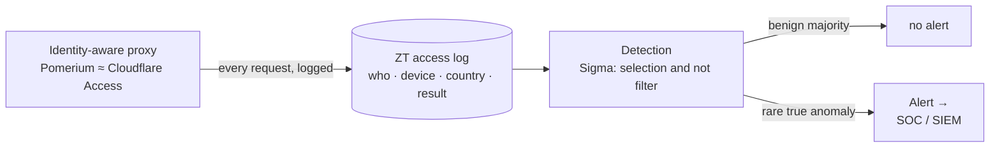
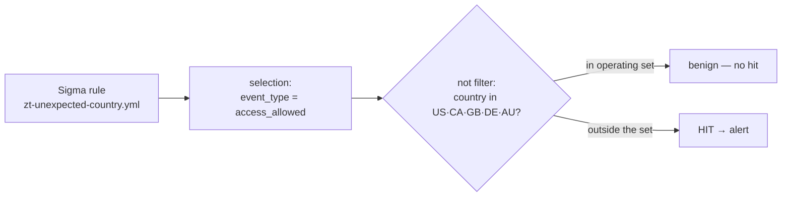
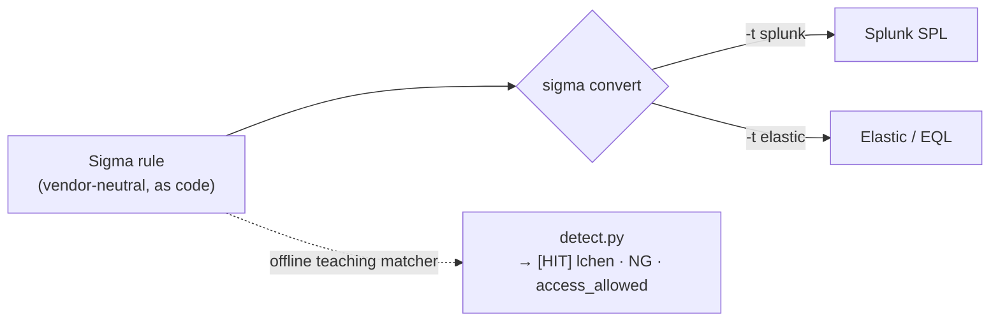
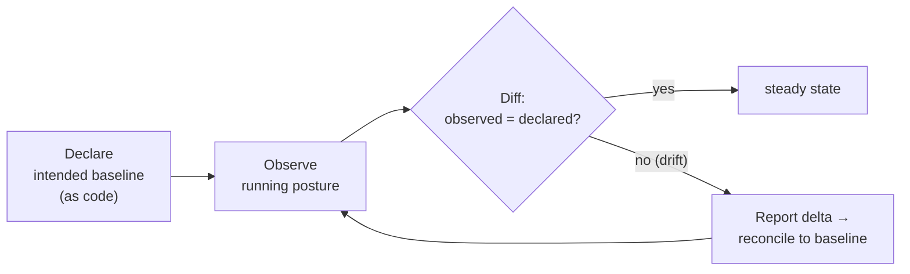

# Module 09 — Monitoring & Detection in Zero Trust

*Type 6 · Reconstruct — write a detection against an immutable identity-aware access log and prove it
fires on the real anomaly while staying quiet on the benign majority. (Secondary: Type 13 · Eval
Harness — score it on a held-out corpus behind a regression gate; Type 16 · Drift/Steady-State — catch
the ZT posture itself rotting.) Deliverable: a fired Sigma detection + the scored/gated eval + a
posture-drift detector. [Go to the hands-on lab →](lab.md)*

*Last reviewed: 2026-08*

**Zero Trust Network Access** — *when the perimeter dissolves, the access log becomes the primary
detection surface — and a detection is a hypothesis you must test, not a rule you hope works.*

<!-- module-meta -->
**Difficulty:** Intermediate &nbsp;·&nbsp; **Estimated time:** ~4.5–6.5 hrs (study + lab) &nbsp;·&nbsp; **Prerequisites:** [Foundations](../../../00-foundations/README.md) · Module 06 (Identity-Aware Access) for the access-log structure
{ .module-meta }

!!! abstract "In 60 seconds"
    Eliminating implicit trust does not make detection matter less — it is a windfall. Because every
    request is authenticated and authorized *at the proxy*, every request is also **logged** with full
    context: who, what device, from where, to which service, with what result. The access log stops
    being an afterthought and becomes the **primary detection surface** — you now detect anomalous
    *authenticated* access, not just perimeter breaches. But a rule that fires in the demo is an
    anecdote, and "trust nothing" is a posture you *hold over time*, not a switch you flip once. You'll
    write a Sigma rule against real-shaped ZT access logs, prove it fires on the credential-compromise
    login and stays quiet on the benign majority, then measure it on a held-out corpus and build a
    drift detector that catches the posture silently eroding.

## Why this matters

For most of security history the detection surface was the **edge** — a firewall's allow/deny logs, a
VPN concentrator's RADIUS records, an IDS watching north-south traffic. Once an attacker got past the
edge with a valid credential, they were largely invisible: the east-west traffic between servers never
crossed a sensor, and the perimeter had already said "yes." That is exactly how a stolen password
becomes a data breach nobody sees for months.

Zero Trust inverts this. Because the unit of access is the *request* and every request is brokered by
an identity-aware proxy, the proxy writes a structured record for **every** access decision — not just
the ones that cross a boundary. The consequence is profound: *you no longer detect breaches, you detect
**anomalous authenticated access***. The stolen credential that was invisible east-west is now a log
line with a country, a device posture, and a session ID attached. But this windfall is only real if you
write rules against it, *prove* those rules catch attacks without drowning the SOC, and keep the
underlying posture from quietly rotting. This module is the whole discipline: the log, the detection,
the proof, and the steady state.

## Objective

Write a Sigma rule that detects a successful login from an unexpected country in a Zero Trust access
log and fire it against bundled access events — confirming it hits the real credential-compromise event
and stays silent on the benign majority. Then take the two steps that turn a detection from an anecdote
into a control: **measure** it against a *held-out* corpus (anomalies it must catch, benign near-misses
it must not) into a precision/recall/FP-rate scorecard behind a regression gate; and build a **drift
detector** that compares the live posture (token lifetimes, allow-exceptions, posture-check
enforcement) against an intended baseline and reports the delta.

## The detection surface: every request is now a labelled log line

In a perimeter model the analyst sees a firewall allow and, if they're lucky, a RADIUS username — no
device, no session history, no idea what the user did *after* authenticating. A ZT access log is a
different animal: each event already carries identity claims (user, IdP subject, groups), a device
posture signal (`compliant` / `unknown`), the source country, the service and path, a session ID, and
a machine-readable **decision** in the `event_type` field. The record is annotated at the access layer,
before you write a single detection.

| | Perimeter / VPN log | Zero Trust access log |
|---|---|---|
| **Emitted for** | traffic that crosses the edge | **every** request, north-south *and* east-west |
| **Identity** | maybe a username | user + IdP subject + groups, per request |
| **Device** | none | posture signal (`compliant` / `unknown`) in the decision |
| **Decision** | allow / drop (packet-level) | `access_allowed` · `access_denied` · `auth_failed` (semantic) |
| **After auth** | invisible (east-west unlogged) | every resource touch is a line with a session ID |
| **Detection value** | breach at the edge, if at all | anomalous *authenticated* access, everywhere |

That semantic `event_type` is the lever, and the value of each type differs in a way the perimeter never
gave you:

- **`access_allowed`** carries the country, device, and byte-volume fields that make *behavioral* rules
  possible at all — unexpected country, bulk export, off-hours access. This is where the
  credential-compromise signal lives.
- **`access_denied`** is the proxy enforcing policy against a *valid* identity — an authenticated user
  reaching for something their role forbids. That is excellent insider-threat and
  compromised-credential signal, not noise.
- **`auth_failed`** in ZT means a *token* failed validation — the IdP already screened the bot-hammered
  garbage, so what's left is **far higher fidelity** than the millions of login failures a perimeter
  login page absorbs.

## A detection is a hypothesis on a benign stream

!!! note "The mental model"
    Most traffic is legitimate. A detection's *whole job* is separating the rare true anomaly from the
    benign lookalikes — so a rule is a **hypothesis on a benign stream**, not a switch that flags "bad."
    The `filter` stanza is the load-bearing half: `selection` says *what looks interesting*
    (`access_allowed`), and `not filter` is what keeps the rule from firing on the benign majority (the
    operating-country allowlist). Delete the filter and the rule fires on every successful login — which
    is to say, on nothing useful.

The detection you'll write is a single **`selection and not filter`** Sigma rule: *a successful
`access_allowed` from a country outside the operating set (US, CA, GB, DE, AU)* — the classic
credential-compromise signal, mapped to **MITRE ATT&CK T1078 (Valid Accounts)**. In the bundled logs it
fires on exactly one event: a valid session for `lchen@corp.com` geolocating to **NG**, minutes after
the same user's legitimate US access. Notice what it *doesn't* fire on — the six-event `auth_failed`
flood from **RO**: those are `auth_failed`, not `access_allowed`, so `selection` never matches them. The
attacker who *fails* to authenticate is noisy and low-value; the attacker who **succeeds** with a stolen
token is the quiet, high-value catch. That distinction is the module in one line.

Sigma is the point here: you write the detection **once**, as vendor-neutral code, and `sigma convert`
compiles it to whatever SIEM the org runs. The lab ships an offline `detect.py` that runs the identical
rule against the raw JSONL so you can iterate without a SIEM — but the rule you commit is the portable
artifact.

## The case: a breach that only the identity log could see (SUNBURST, Dec 2020)

**At a glance —** the perimeter said "yes" at every step; the intrusion was signed, valid, and
invisible to edge sensors. What exposed it was a single anomalous *authenticated* action in an identity
log — the exact shape of signal Zero Trust makes routine.

The SolarWinds/SUNBURST campaign is the canonical demonstration of why the perimeter is the wrong
detection surface. The attackers rode a **trojanized but validly-signed** software update into thousands
of networks and then moved using **valid credentials and tokens** — no exploit to trip an IDS, no
malformed packet, no failed login. To a perimeter, every step looked like authorized traffic, because
in a credential sense it *was*. This is MITRE ATT&CK **T1078 (Valid Accounts)** at scale, and it is
precisely the failure mode a firewall log cannot show you.

What ultimately surfaced the intrusion at the security firm that first disclosed it was not an edge
alert but an **identity anomaly**: an account registered an *additional* device for multi-factor
authentication, and the notification sent to the real employee — who had done no such thing — exposed
the compromise. A single anomalous authenticated action in an identity log did what months of
perimeter monitoring did not. That is the lesson to internalize before the lab: the credential-misuse
signal you're about to detect (`lchen`'s valid session from NG) is the same class of signal, just made
routine — because in Zero Trust *every* access decision is already a labelled log line, so you don't
have to get lucky to see the one that matters.

!!! warning "The gotcha — the loud events aren't the dangerous ones"
    The RO `auth_failed` flood *looks* like the attack because it's loud. It isn't — those tokens
    failed. The dangerous event is the one that **succeeded**: `lchen`'s `access_allowed` from NG. A
    detection that keys on failed auth misses credential compromise entirely, because a stolen token
    *passes* auth. Detect the successful anomalous access, not the noisy failed one.

## Prove it, then hold it

A detection that fires correctly on the demo set is still untrustworthy — you tuned it on the same
events you're grading it on, a memorised exam. The move that earns trust is measurement on a **held-out
corpus** the rule never saw, deliberately stocked with the cases that *break* a geo-rule: on the
malicious side the compromise login and the harder variants (a session that starts in-country and
continues from abroad, an impossible-travel pair); on the benign side the near-misses a naive rule fires
on and shouldn't — an executive on a logged business trip, a developer whose corporate VPN egresses
through another country, a cloud job geolocating to a datacenter region. Score it into **precision** (of
what it flagged, how much was real), **recall** (of the real anomalies, how many it caught), and
**FP-rate** (the analyst-time cost) — and for a leading-indicator detection, **recall is load-bearing**:
a missed credential-compromise can be a breach, while a false positive costs an analyst a few minutes.
Then wire a **regression gate**: the eval runs in CI, and a rule that drifts too *narrow* (recall drops)
or too *broad* (FP-rate climbs) fails the build. A gate you have only ever seen pass is not a gate.

!!! note "Coverage is not effectiveness"
    A 500-event corpus of easy traffic is *worse* than a 30-event one that includes the VPN-egress
    near-miss and the impossible-travel pair. Sample the failure modes; don't count items. The held-out
    set earns its keep with the hard cases, not with more of the easy ones.

The detection above watches the *traffic*. The last control watches the *posture* — because the Zero
Trust property you proved at deployment is **not self-sustaining**. The pattern is the steady-state
loop: **declare** the intended baseline as data, **observe** the running config, **diff** the two,
**report** the delta, and **reconcile** back to the baseline.

The three drifts are real and silent: **token-lifetime creep** (a 15-minute access token quietly bumped
to 8 hours to stop re-auth complaints — every stolen token now lives 32× longer), **accreted
allow-exceptions** (the temporary "let the contractor reach the DB" rule that outlived the contractor),
and **silently-disabled posture checks** (device-compliance enforcement flipped to "log only" and never
flipped back). None throws an error; the system keeps working, just less Zero-Trust each week. Both NIST
SP 800-207 and the CISA Zero Trust Maturity Model name *continuous* monitoring as a pillar — explicitly
not a one-shot. The audit trail that proves every request was authorized is also the detection surface
for when authorization is abused, *and* the drift detector is what proves the policy authorizing it
hasn't quietly rotted.

!!! tip "AI caveat"
    AI drafts the mechanical parts well — the Sigma `selection and not filter` rule, the confusion-matrix
    arithmetic, the JSON diffing. What you own is what it quietly gets wrong: it defaults the metric to
    *accuracy* (override to recall-on-anomalies — a geo-rule that never fires is 99% "accurate" and
    useless); it will happily generate the held-out corpus *and* score against it — the exact
    contamination this module warns against, so **you** label each near-miss by hand; and the drift
    baseline is *your* judgment from the threat model, not a model's plausible default.

## Go deeper (~3 hrs · optional)

*The sections above are the spine — they teach the model and you can do the lab from them alone. These
links are for **going deeper** and working from the **primary sources**, not for relearning what's above.*

**ZT continuous monitoring — the pillar, not the afterthought (~45 min) — the case-study seam**
- [MITRE ATT&CK — T1078: Valid Accounts](https://attack.mitre.org/techniques/T1078/) — the technique the
  unexpected-country rule targets, and the class of behavior behind SUNBURST. Read the sub-techniques
  (esp. T1078.004 Cloud Accounts) and the detection guidance; it names the log fields your rule keys on.
- [CISA Zero Trust Maturity Model v2.0 (PDF)](https://www.cisa.gov/sites/default/files/2023-04/zero_trust_maturity_model_v2_0.pdf) `[depth]` — read the **Visibility & Analytics** cross-cutting capability and the **Governance** pillar; this is the authoritative framing for *why* monitoring and posture-governance are first-class in ZT, and the maturity levels map onto the drift detector you build.
- [NIST SP 800-207, §7 "Threats Associated with Zero Trust Architecture" (PDF)](https://nvlpubs.nist.gov/nistpubs/SpecialPublications/NIST.SP.800-207.pdf) `[depth]` — read §7; the "subverted ZTA decision process" and "stolen credentials / insider threat" subsections are exactly the failure modes the detection and drift detector target.
- [CISA advisory AA20-352A — SolarWinds / SUNBURST](https://www.cisa.gov/news-events/cybersecurity-advisories/aa20-352a) — the government technical advisory on the campaign in the case study; read the initial-access and lateral-movement TTPs to see valid-account abuse at national scale.

**Sigma and detection-as-code (~1 hr)**
- [SigmaHQ — "Rule Creation" guide](https://sigmahq.io/docs/basics/rules.html) — the canonical reference for `logsource`, `detection`, and the condition grammar; you need the `selection and not filter` pattern this lab's rule uses. (~20 min, the parts you'll actually use.)
- [SigmaHQ rules — `rules/cloud/` directory](https://github.com/SigmaHQ/sigma/tree/master/rules/cloud) `[depth]` — real production Sigma over cloud access events; skim three or four to see how practitioners name fields and structure geo/identity detections, then compare to this lab's ZT-shaped events.

**Eval gates, not vibes — measuring a detection (~45 min)**
- [Google ML Crash Course — "Classification: Accuracy, recall, precision"](https://developers.google.com/machine-learning/crash-course/classification/accuracy-precision-recall) — the precise definitions your scorecard prints, and crucially *why accuracy misleads on imbalanced data* (a geo-rule that never fires is 99% "accurate" and useless). Short and visual.
- [Roberto Rodriguez (Cyb3rWard0g) — Threat Hunter Playbook](https://threathunterplaybook.com/intro.html) `[depth]` — a practitioner's framing of why detections need a labelled test set and replayable data rather than a one-off "it fired once." Read the introduction and the data-driven testing rationale.

**Posture drift over time (~30 min)**
- [Google SRE Workbook — "Configuration Design and Best Practices"](https://sre.google/workbook/configuration-design/) `[depth]` — the declared-state-vs-observed-state mental model the drift detector implements; read the section on configuration as data and reconciliation. The SRE "config drift" framing transfers intact to ZT posture drift.

## Key concepts

- The perimeter's detection surface was the **edge**; Zero Trust makes the **access log** the primary
  detection surface — every request is a labelled line, so you detect anomalous *authenticated* access.
- ZT access logs carry a semantic `event_type`: `access_allowed` (behavioral signal lives here),
  `access_denied` (insider/compromise signal against a *valid* identity), `auth_failed` (high-fidelity,
  the IdP pre-screened the noise).
- A detection is a **hypothesis on a benign stream**; the `not filter` half is load-bearing — it's what
  keeps the rule off the benign majority.
- The dangerous event is the one that **succeeded** (stolen token *passes* auth), not the loud
  `auth_failed` flood — detect the successful anomalous access.
- A detection measured only on the **demo set** is a memorised exam; grade it on a **held-out** corpus,
  and prefer **recall** for a leading-indicator geo-rule. A regression gate fails the build both ways.
- **Coverage ≠ effectiveness** — the held-out set earns its keep with hard near-misses (legit travel,
  VPN egress, impossible-travel), not with more easy events.
- **"Trust nothing" is an over-time posture.** Token-lifetime creep, accreted allow-exceptions, and
  silently-disabled posture checks erode it with no alarm — the drift loop (declare → observe → diff →
  reconcile) catches it.

## AI acceleration

Give a model one log line and the field names and it produces a working `selection and not filter` rule
fast; it writes the confusion-matrix arithmetic, the scorecard table, and the JSON diffing for the
drift detector competently. **What you must own is everything it quietly gets wrong here.** The metric:
it defaults to accuracy — override to recall-on-anomalies and justify it. The **held-out wall**: it will
happily generate the test corpus *and* score against it, the contamination this module is about — have
it *draft* adversarial near-misses (a VPN-egress event that looks like a foreign login), then **you
label each one yourself** against the real behavior it mimics. The gate direction: does it fail *closed*
when the score is missing or the eval errors, or does a broken eval silently pass? And for the drift
detector, the baseline is *your* judgment — a model asked "what should the token lifetime be?" gives a
plausible default; you set it from the threat model and let the detector flag deviations from *that*.
AI nails the hit case and misses the filter edge cases far more often than the reverse — the near-misses
are the thing to verify by hand.

!!! question "Check yourself"
    - Why does Zero Trust make the *access log* the primary detection surface — and what could a
      perimeter firewall log never have shown you about SUNBURST?
    - The RO `auth_failed` flood is loud; the NG `access_allowed` is quiet. Which is the real attack, and
      why does a rule keyed on failed auth miss credential compromise?
    - Why is a detection that fires correctly on the demo set still untrustworthy — and what does a
      held-out corpus prove that the demo set can't?
    - Name the three silent posture drifts the drift detector catches — and why does none of them set off
      an alarm on its own?
