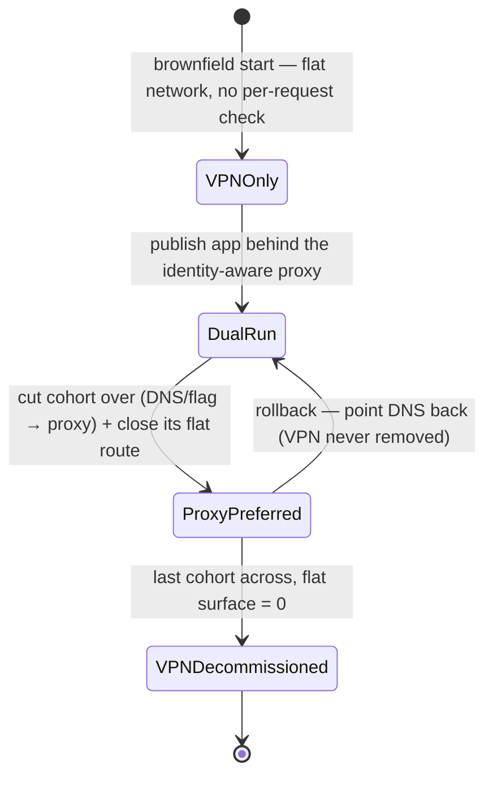
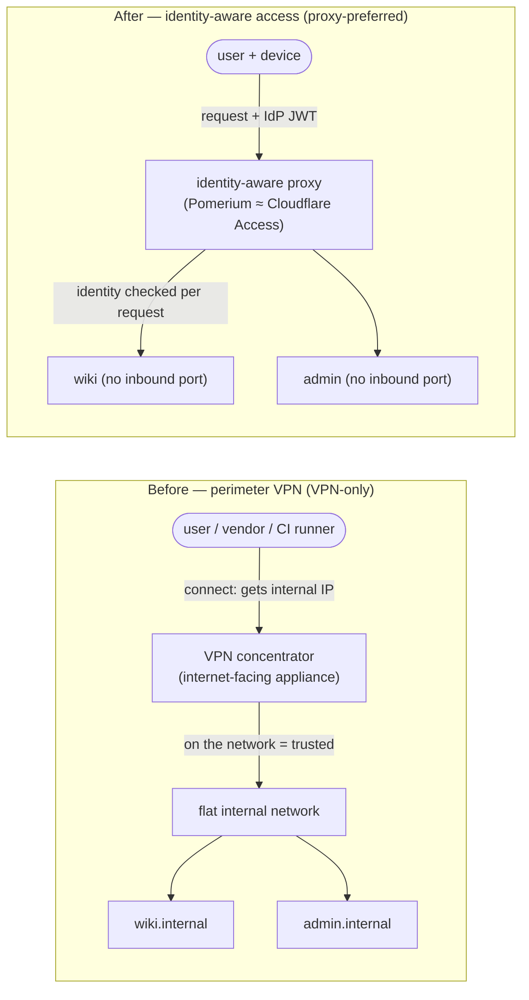
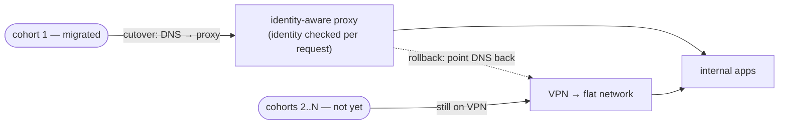
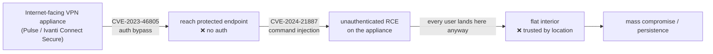

# Module 10 — VPN → ZTNA Migration

*Type 12 · Migration / Brownfield — retire a legacy VPN on a flat network and put every app behind
identity-aware access *incrementally, without an outage* (strangler-fig): publish each app behind the
proxy, migrate users per app, shrink the VPN, decommission it last. Deliverable: a migration runbook +
per-app cutover checklist + a per-cohort rollback plan — a plan a team could execute Monday, not an
essay. [Go to the hands-on lab →](lab.md)*

*Last reviewed: 2026-08*

**Zero Trust Network Access** — *every greenfield ZTNA tutorial starts from an empty network and a clean
IdP. Your job starts from a VPN that already exists, that the whole company logs into every morning, and
that you are not allowed to break.*

<!-- module-meta -->
**Difficulty:** Intermediate–Advanced &nbsp;·&nbsp; **Estimated time:** ~4.5–6 hrs (study + lab) &nbsp;·&nbsp; **Prerequisites:** [Module 01 — Zero Trust Principles](../01-zero-trust-principles/README.md) (the flat-network breach), [Module 06 — Identity-Aware Access](../06-identity-aware-access/README.md) (the proxy you migrate *to*)
{ .module-meta }

!!! abstract "In 60 seconds"
    Every ZTNA tutorial starts greenfield — an empty network, a clean IdP, nothing to break. The real
    job is **brownfield**: a decade-old VPN on a flat network that the whole company logs into every
    morning, and the one rule is *no outage*. The naive big-bang cutover (flip everything one Saturday)
    is the canonical disaster — one blast radius, no incremental rollback. The discipline is
    **strangler-fig**: publish each app behind the identity-aware proxy, run both paths side by side,
    move one cohort at a time, prove each move with a before/after access test, keep a per-cohort
    rollback, and decommission the VPN *last* — when the un-migrated surface is provably zero.

## Why this matters

Every ZTNA tutorial you have read — including the earlier modules of this track — starts from nothing.
An empty network, a clean IdP, a backend with no users yet. You write the policy, stand up the proxy,
publish the app with no inbound ports, and it works on the first try because there was never anything to
break. That is **greenfield**, and almost no real ZTNA project starts there. The project you actually
walk into is **brownfield**: an organization that has run a VPN for a decade, on a flat internal network,
where the entire workforce — plus a half-dozen vendors and a fleet of CI runners — connects every morning
and reaches a sprawl of internal apps that nobody has fully inventoried. [Module 01](../01-zero-trust-principles/README.md)
showed you exactly this shape and exactly why it is dangerous: a single legacy VPN account was the entry
point in the Colonial Pipeline 2021 breach, and once inside, the flat network let the intrusion spread.
Your job is to retire that VPN and put every app behind identity-aware access instead. The one rule:
**no outage.** The VPN cannot go dark on a Tuesday morning while 800 people are mid-task.

There is a second, sharper reason to move *now*, and it is about the appliance itself — covered in
[**The case for retiring the VPN**](#the-case-for-retiring-the-vpn-a-vpn-appliance-is-a-single-fat-target)
below. The naive migration move, though, is the dangerous one, and it is the move almost every team is
first tempted to make: pick a Saturday, stand up the new ZTNA proxy for everything at once, flip DNS,
turn the VPN off, and go home. This is the **big-bang cutover**, and it fails for a reason that has
nothing to do with whether ZTNA "works" — it fails because you have changed the access path for *every
app and every user simultaneously*. When something breaks (and with an un-inventoried estate, something
always breaks — an app that depended on a hardcoded internal IP, a service account whose token the proxy
rejects, a vendor whose source range you forgot to allow), you cannot tell *which* of the hundred changes
caused it, you cannot roll back *just* the broken slice, and you are debugging a total outage live while
the whole company is locked out. The blast radius is the entire organization, and the rollback is "turn
the VPN back on and admit the migration failed."

## Objective

Produce a migration runbook that takes a real brownfield estate — a running VPN on a flat network with a
handful of internal apps — off the perimeter model and behind an identity-aware proxy **incrementally,
with no outage**: sequence the apps into cohorts least-risky-first, define the per-app cutover and the
before/after test that proves each move, attach a per-cohort rollback, and decommission the VPN last —
so a teammate could execute the plan without you and a reviewer can trace every cohort's proof.

## The core idea: you don't flip a switch; you run both, move cohorts, prove each, then retire the VPN

!!! note "The mental model"
    The **strangler fig** (Martin Fowler, 2001): the rainforest vine grows *around* a host tree,
    gradually taking over until it can stand on its own — the original never cut down in a single
    stroke. Applied to access: you do *not* tear down the VPN and replace it in one cutover. You grow
    the identity-aware path *around* the running VPN, moving apps and users across one cohort at a time,
    so the surface still depending on the flat network shrinks toward zero while access never stops.

The lifecycle above has four states and you never skip one. **VPN-only** is the brownfield start:
connectivity is the only check. **Dual-run** is the coexistence period — the same app is reachable both
the old flat way *and* through the proxy — which the standards body ([NIST SP 800-207 §7.2](https://nvlpubs.nist.gov/nistpubs/SpecialPublications/NIST.SP.800-207.pdf))
calls the hybrid ZTA/perimeter architecture and treats as a normal, extended phase, not a bug.
**Proxy-preferred** is per app: you cut a cohort's traffic to the proxy *and close its flat route*, so
that app is now identity-checked with no bypass. **VPN-decommissioned** is the single irreversible step,
taken last, only when every app is across. The edge that makes the whole thing safe is the one that loops
back — *proxy-preferred → dual-run* — the rollback: because the VPN is still running, backing a cohort out
is cheap.

The mechanism that makes this incremental is that **the two paths run side by side, and a per-cohort
cutover switch decides which path a given app's traffic takes.**

Concretely: the **legacy path** is the VPN onto the flat network (a user connects, gets an internal IP,
and reaches `app.internal` directly — *connectivity is the only check*); the **new path** is the
identity-aware proxy from [Module 06](../06-identity-aware-access/README.md) (a request hits the proxy,
which validates the caller's IdP-issued JWT against policy and only then forwards upstream — *identity is
the check, on every request, with no inbound port on the backend*). A **cohort** (a migration *wave*) is
the unit you move: a small, coherent group of apps-plus-the-users-who-need-them. You start with the
lowest-risk one — an internal low-stakes web app used by a single team you can coordinate with — never
the crown jewels first. The **cutover** is the switch that points that cohort's traffic at the proxy
instead of the VPN route: a DNS change (point `app.internal` at the proxy), a feature flag, a routing
rule, or a per-group access policy. Because the two paths are independent, moving cohort 1 changes
*nothing* for cohorts 2..N — they keep using the VPN, untouched, exactly as before.

The discipline that makes it safe reduces to one feedback signal per cohort: **the before/after access
test**, whose goal is *"still reachable for authorized users, now via the proxy; the old flat path
closing."* Before you cut a cohort over, you record the baseline — the authorized user reaches the app
*and how* (through the VPN/flat route). You cut over. Then you run the *same* test and prove three things:
(1) the authorized user **still reaches the app** (no outage — the whole point); (2) they now reach it
**through the proxy** (the request carries identity, the proxy logged an allow — the migration actually
moved, it didn't just appear to); and (3) the **old flat path to that app is now closed** (a direct
request to the backend on the flat network no longer connects — otherwise you have *added* a ZTNA path
without *removing* the bypass, which is migration theater). Only when all three hold is the cohort
migrated. If any fails, you **roll back that cohort** — flip the cutover switch back to the VPN route —
and the cohort is serving on the old path again in minutes while you debug *one small slice*, not a
company-wide outage. Then you do the next cohort. Only after the **last** cohort is across and proven do
you close the flat network and **decommission the VPN**.

!!! warning "The gotcha"
    A migration is done only when the old path is **closed**, not when the new path *works*. Declare
    victory the moment the app answers through the proxy and — if the flat network still routes to the
    backend — every user and every attacker who lands on the VPN can skip the proxy entirely. The
    before/after test's third assertion (the old flat path is closing) is the one teams skip and the one
    that matters most: closing it per cohort is what actually shrinks the Module-01 breach surface.

??? note "Background: the before/after test proves three things, not one"
    Before you cut a cohort, record the baseline — the authorized user reaches the app, and *how*
    (through the VPN/flat route). Cut over, then run the *same* test and prove all three: (1) the user
    **still reaches** the app (no outage), (2) now **through the proxy** (identity-checked, the proxy
    logged an allow), and (3) the **old flat path is closed** (direct-to-backend no longer connects).
    All three, or it isn't migrated — and if any fails, flip the cutover switch back to the VPN and
    debug one small slice, not a company-wide outage.

## The case for retiring the VPN: a VPN appliance is a single, fat target

The Module-01 lesson — one credential on a flat network — is the *access-model* reason to leave the VPN
behind. There is a second reason, and it is about the box itself. A remote-access VPN terminates on an
**internet-facing concentrator**: a single appliance, reachable pre-authentication from the entire
internet, that every remote user must hit before they get anywhere. That makes it the fattest target in
the estate — and attackers have repeatedly proven it. In January 2024 a chain of two flaws in **Ivanti
Connect Secure** (the product formerly sold as **Pulse Connect Secure**) — **CVE-2023-46805**, an
authentication-bypass, chained with **CVE-2024-21887**, a command-injection — gave *unauthenticated
remote code execution* on the appliance, and it was mass-exploited across thousands of internet-facing
devices within days. The mechanism is worth stating plainly: the auth-bypass lets an attacker reach an
endpoint that should have required a login; the command-injection on that now-reachable endpoint runs
their code; and because *everyone who authenticates through this box lands on the same flat interior
anyway*, one compromised appliance is a doorway to the whole internal network — the exact flat-interior
failure Module 01 autopsied, except the attacker didn't even need a stolen credential. It was serious
enough that CISA issued **Emergency Directive ED 24-01** ordering federal agencies to mitigate. This was
not a one-off: **CVE-2021-22893** in the same Pulse Connect Secure line was a pre-auth exploited
zero-day years earlier. The pattern — internet-facing VPN concentrator, pre-auth reachable, one exploit
to mass compromise — is why "modernize the VPN" is not the answer and *removing* it is. ZTNA's
no-inbound-port posture (the backend has no published port; only the identity-aware proxy talks to it)
deletes the fat pre-auth target this whole class of exploit depends on.

!!! tip "AI caveat"
    A model is genuinely useful on the *bookkeeping* — the per-app checklist, the cohort sequence, the
    proof table, the access-test design. But ask it to "just migrate everything" and it cheerfully
    produces a *big-bang* plan, because that's the simplest thing to express. The judgment it can't do
    for you is sequencing by blast radius and, above all, verifying the third assertion — asked to
    "confirm the migration worked," it checks the app answers through the proxy and misses the open back door.

## Go deeper (~2.5 hrs · optional)

*The core idea above is the spine — it teaches the strangler-fig cutover and the three-part proof, and
you can build the runbook from it alone. These links are for **going deeper** and working from the
**primary sources**, not for relearning what's above.*

**The strangler-fig pattern — why incremental beats big-bang (~30 min)**
- [Martin Fowler — *Strangler Fig Application*](https://martinfowler.com/bliki/StranglerFigApplication.html) (~15 min) — the original 2001 essay that named the pattern. Read it for the *why*: gradual replacement around a running system de-risks what a big-bang rewrite cannot. The metaphor maps one-to-one onto moving access cohorts across while the VPN keeps serving — the model the whole module rests on.
- [Google BeyondCorp — *Migrating to BeyondCorp: Maintaining Productivity While Improving Security*](https://research.google/pubs/migrating-to-beyondcorp-maintaining-productivity-while-improving-security/) (~15 min) — Google's own account of moving a real workforce off the VPN to identity-aware access **incrementally**, running access policies in a simulation/monitoring mode that proved each cohort would still have access *before* the cutover. The real-world proof that prove-before-you-cut is how this is done at scale, not a textbook ideal.

**The case-study seam — why the VPN appliance itself is the liability (~30 min)** *(`[depth]` — the case section above teaches the mechanism; these are the authoritative primary sources the risk statement must cite)*
- [CISA — *Colonial Pipeline / DarkSide* joint advisory (AA21-131A)](https://www.cisa.gov/news-events/cybersecurity-advisories/aa21-131a) (~20 min) — re-anchor on why the legacy VPN you're retiring is the liability: an inactive VPN account with no MFA on a flat network was the entry, and the flat interior let it spread. Read "Mitigations" for what ZTNA fixes that the VPN couldn't.
- [NVD — CVE-2023-46805 (Ivanti Connect Secure auth bypass)](https://nvd.nist.gov/vuln/detail/CVE-2023-46805) and [CVE-2024-21887 (command injection)](https://nvd.nist.gov/vuln/detail/CVE-2024-21887) — the two-flaw chain that gave unauthenticated RCE on the appliance; read the CVSS and description to see the pre-auth reach. Cross-listed on the [CISA Known Exploited Vulnerabilities catalog](https://www.cisa.gov/known-exploited-vulnerabilities-catalog).
- [CISA — Emergency Directive ED 24-01 (mitigate Ivanti Connect Secure / Policy Secure)](https://www.cisa.gov/news-events/directives/ed-24-01-mitigate-ivanti-connect-secure-and-ivanti-policy-secure-vulnerabilities) — the government's emergency response; evidence of how serious an internet-facing VPN concentrator compromise is at scale.

**Migration, from the standards body and a real cutover (~1.5 hrs)**
- [NIST SP 800-207 — *Zero Trust Architecture*, §7 "Migrating to a Zero Trust Architecture"](https://nvlpubs.nist.gov/nistpubs/SpecialPublications/NIST.SP.800-207.pdf) (~40 min) `[depth]` — the authoritative treatment of *migration specifically*. §7.2 ("Hybrid ZTA and Perimeter-Based Architecture") describes running ZTA and perimeter-based access **in parallel** — the dual-run period this lab reproduces — and §7.3 lays out the phased rollout that warns against the all-at-once swap. Read §7.2–7.3; it is the standards-body version of "run both, move cohorts."
- *Re-read your own [Module 06 — Identity-Aware Access](../06-identity-aware-access/lab.md)* — the proxy you migrate *to*. The migration's "new path" is exactly that proxy-in-front-of-a-backend shape; this module's new contribution is running it *beside* a legacy path and cutting cohorts over. Skim it for the proxy data flow and the no-bypass / trust-only-the-proxy discipline you must preserve.
- [Tailscale — *How to migrate from a legacy VPN*](https://tailscale.com/kb/1549/legacy-vpn-migration-guide) (~20 min) — a concrete vendor walkthrough of the side-by-side approach (run the new mesh alongside the old VPN, move users in groups, then turn the VPN off). Read it for the *operational rhythm* of a real cutover — overlap period, per-group moves, the "turn it off last" step — not as a tool endorsement; the same rhythm applies to the proxy path.

## Key concepts

- **Brownfield is the ZTNA default, not the edge case** — the VPN already exists, the whole org logs into it, and the estate is half-inventoried; "just stand up ZTNA" is greenfield advice that does not survive contact with a running network.
- **Big-bang cutover is the disaster the pattern prevents** — changing every app's access path at once is one blast radius with no incremental rollback, debugged live against the whole organization. The before/after test and the per-cohort rollback exist because of this.
- **Strangler-fig: publish behind the proxy, run both paths, move one cohort at a time** — a per-cohort DNS/feature-flag cutover decides which path an app's traffic takes; moving cohort 1 changes nothing for the rest. The four-state lifecycle: VPN-only → dual-run → proxy-preferred → VPN-decommissioned.
- **The before/after access test proves three things, not one** — after each cutover: (1) the authorized user *still reaches* the app (no outage), (2) now *through the proxy* (identity-checked, proxy logged the allow), and (3) the *old flat path is closing* (direct-to-backend no longer connects).
- **A migration is done when the old path is CLOSED, not when the new one WORKS** — leaving the flat route open is migration theater; every user and attacker can still skip the proxy. Closing it per cohort is what shrinks the Module-01 breach surface.
- **Rollback is cheap because the VPN is still running** — back a cohort out by flipping its cutover switch to the VPN route; the VPN is decommissioned *last*, the one irreversible step, when the un-migrated surface is provably zero.
- **The appliance itself is a reason to leave** — an internet-facing VPN concentrator is a single, pre-auth-reachable target (Ivanti/Pulse CVE-2023-46805 + CVE-2024-21887, mass-exploited 2024). ZTNA's no-inbound-port posture deletes that target.

## AI acceleration

A model is genuinely useful at the *planning and bookkeeping* half of this migration — drafting the
per-app cutover checklist, generating the cohort sequence (least-risky-first), turning a raw before/after
proof into a clean table, and writing the inventory-to-checklist script. That is real leverage on the
tedious parts. But the posture is strict, because the dangerous instinct is the same one a stressed
engineer has: **AI drafts the plan → you decide the cohort order and own the cutover → you read the
before/after proof yourself.** Ask a model to "just migrate everything" or "write a cutover script" and it
will cheerfully produce a *big-bang* plan — one flip, all apps — because that is the simplest thing to
express and it doesn't carry the operational fear of a live outage. The judgment the model cannot do for
you is sequencing by *blast radius* (which cohort is safe to move first, what its dependencies are, who to
coordinate with) and, above all, **verifying the third assertion** — that the old flat path actually
closed — because a model asked to "confirm the migration worked" will check that the app answers through
the proxy and call it done, missing the open back door entirely. Make the model draft the checklist and
the script; **you** confirm every cohort has a tested rollback, that the proof shows no-outage *and*
old-path-closed, and that the VPN comes down only after the last cohort is provably across. AI authors the
runbook; you own the cutover.

!!! question "Check yourself"
    - Why does a big-bang cutover fail for reasons that have nothing to do with whether ZTNA "works"?
    - The before/after test asserts three things after each cohort cutover — what are they, and which one do teams most often skip?
    - Why is the per-cohort rollback cheap, and why is decommissioning the VPN the one irreversible step you take last?
    - Beyond the flat-interior access model, what makes an internet-facing VPN concentrator itself a liability — and what ZTNA property removes that target?
