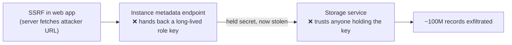
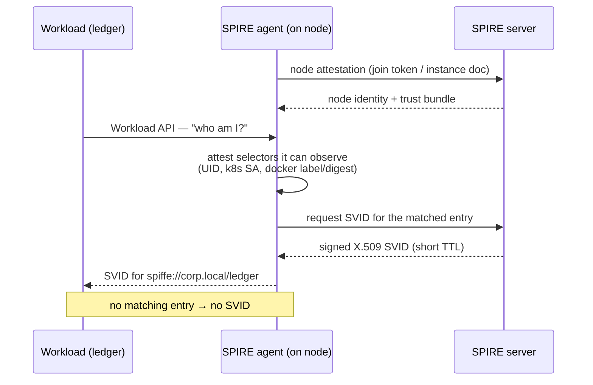
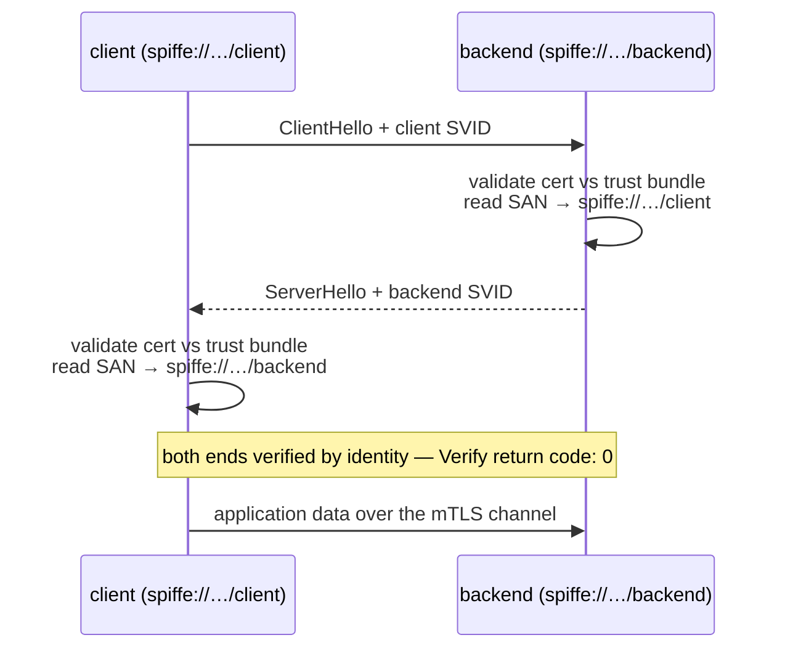

# Module 12 — Workload Identity & mTLS (SPIFFE/SPIRE)

*Type 7 · Build-&-Operate — stand up a SPIFFE/SPIRE trust domain, issue each workload a short-lived
SVID, and establish identity-keyed mTLS; the deliverable is the running, reviewed system and its
verified deny — an unregistered workload gets no identity — not an essay. [Go to the hands-on lab →](lab.md)*

*Last reviewed: 2026-08*

**Zero Trust Network Access** — *zero trust for humans is an identity-aware proxy; zero trust between
services is a cryptographic identity every workload can prove — and rotate — on its own.*

<!-- module-meta -->
**Difficulty:** Intermediate &nbsp;·&nbsp; **Estimated time:** ~5–7 hrs (study + lab) &nbsp;·&nbsp; **Prerequisites:** [Foundations](../../../00-foundations/README.md)
{ .module-meta }

!!! abstract "In 60 seconds"
    Zero trust for humans is the identity-aware proxy from earlier modules. But most traffic in a real
    system isn't a human at a browser — it's the checkout service calling the ledger, one pod talking to
    another. Ask how those services authenticate to each other and the honest answer in most shops is
    *they don't*: a shared API key, a long-lived token, or nothing ("same network"). That is the exact
    flat-trust assumption zero trust kills, one layer down. SPIFFE gives each workload a cryptographic
    identity (an **SVID**) it earns by **attestation** and proves with **mutual TLS** — and there's no
    long-lived secret to steal. You'll stand up SPIRE, issue two workloads their SVIDs, watch an mTLS
    call verify *both* ends by identity, and prove an unregistered workload gets nothing.

## Why this matters

Every module before this one made *human* access zero-trust: a proxy checks a user's token on each
request, a policy engine decides. But humans are the minority of the traffic. The bulk is
service-to-service — east-west calls between processes that never touch a login page. Ask how the
backend proves to the ledger that it really is the backend and the common answers are a shared API key
in an env var, a long-lived service-account token, or — most often — nothing, "because they're on the
same network." That last one is the flat interior that Module 01's Colonial autopsy indicted, wearing
a different hat. Even the network segmentation from earlier in this track only narrows it: a
label-based rule says *this pod may connect to that pod*, but it never makes the caller **prove who it
is**. A stolen pod identity, a mislabeled workload, or anything that lands inside the allowed segment
is trusted by default. Workload identity closes that gap — it is the application/workload pillar of
NIST SP 800-207, and it's the part of zero trust the proxy modules structurally can't reach.

## Objective

Stand up a SPIFFE/SPIRE trust domain, register two workloads, and have each **fetch its own
short-lived X.509 SVID at runtime** and use it to establish **mutual TLS** — so the client proves its
identity to the server *and* the server to the client, with no shared secret anywhere. Then **prove
the boundary**: a workload with no registration entry is refused an identity by the agent and cannot
complete the mTLS handshake — demonstrating that identity, not network position, is what grants access.

## The case that workload identity answers: SSRF → metadata → a stolen static key

Start with the incident, because it names exactly what a held secret costs. In 2019, an attacker used
a **server-side request forgery (SSRF)** flaw in a bank's web application to make the server call its
own cloud instance-metadata endpoint, which handed back the credentials of the role attached to that
instance. Those were **long-lived, held credentials** — a secret the workload *had*, sitting where any
code running as that workload (or tricked into running as it) could read them. With that key the
attacker authenticated to internal storage as a trusted service and exfiltrated ~100 million records.
Nothing was "hacked" at the storage layer; the attacker simply *presented a valid secret the workload
was holding*. This is the [Cloud Instance Metadata API technique, MITRE ATT&CK T1552.005](https://attack.mitre.org/techniques/T1552/005/).

The load-bearing failure isn't the SSRF — those get found and fixed constantly. It's that
authentication to the internal service rested on a **secret the caller held**, so *possessing the
bytes was the same as being the service*. Workload identity removes the thing that was stolen. Under
SPIFFE there is no long-lived key in the workload to read: the credential is a short-lived certificate
the workload **fetches at runtime and proves**, tied to *what the workload demonstrably is*, and it
expires in minutes. The mechanism that makes that possible is the subject of this module — and the
[SPIFFE overview](https://spiffe.io/docs/latest/spiffe-about/overview/) is the authoritative statement
of the problem it solves.

## The core idea

!!! note "The mental model"
    A workload's identity should be a credential it can **prove**, not a secret it **holds**. SPIFFE
    gives each workload a **SPIFFE ID** (a URI like `spiffe://corp.local/ledger`) wrapped in a
    short-lived X.509 **SVID**; services present their SVIDs and validate each other's, reading the
    peer's SPIFFE ID out of the certificate. The practitioner translation: **a SVID is to a service
    what a short-lived OIDC token is to a user** — verifiable identity per request, no standing trust,
    automatic expiry.

The move to internalize is that shift from *holds* to *proves*. **SPIFFE** (Secure Production Identity
Framework For Everyone) gives every workload a **SPIFFE ID** — a URI like `spiffe://corp.local/ledger`
— and a **SVID** (SPIFFE Verifiable Identity Document): that ID wrapped in a short-lived X.509
certificate signed by the trust domain's CA. When the ledger connects to the database, it presents its
SVID; the database presents its own; each validates the other against the same trust bundle and reads
the peer's SPIFFE ID out of the certificate's SAN. That's **mutual TLS keyed on identity**. What makes
it zero-trust rather than "TLS with client certs" is *where the certificate comes from and how long it
lives*: the workload never has a long-lived key in a file to be stolen — it fetches a fresh SVID at
startup, and the platform rotates it automatically every few minutes. The Capital One key would have
been worthless within minutes, and there'd have been nothing in the image to steal in the first place.

### How a workload earns its identity: two-layer attestation

**SPIRE** (the SPIFFE Runtime Environment) is the implementation that issues those SVIDs, and its
central problem is the one that trips up every "just give each service a cert" scheme: **how do you
hand a brand-new workload its first credential without already trusting it?** SPIRE solves it with two
layers of **attestation**. A SPIRE **agent** runs on each node and first proves the *node's* identity
to the SPIRE **server** (node attestation — a cloud instance-identity document, a Kubernetes projected
token, or a join token in a lab). Then, when a local workload calls the agent's **Workload API** asking
for its SVID, the agent **attests the workload** by inspecting properties it can observe but the
workload cannot forge from the outside — its Unix UID, its Kubernetes service account, its Docker
labels or image digest.

The agent matches those *selectors* against the **registration entries** the operator created
(`spiffe://corp.local/ledger` is issued only to a process whose selectors say
`docker:label:com.corp.svc:ledger`) and hands back exactly the right SVID. No bootstrap secret is ever
shipped to the workload — its identity is *derived from what it demonstrably is*, which is why a
workload with no matching entry simply gets nothing.

!!! warning "The gotcha — the selectors are the whole security decision"
    That reframes the control from "protect the key" to "**get the attestation right**." A selector
    that's too loose — attesting on a Unix UID every container shares, or a label any deployment can
    set — lets the wrong workload claim an identity: the workload-identity equivalent of a wildcard IAM
    policy. Pin each entry to selectors genuinely hard to spoof in your environment (an image digest, a
    service account bound to a namespace) and keep SVID TTLs short. Ask of every entry: *could a
    different workload satisfy this?*

### The handshake: mutual TLS keyed on the SVID

Once both services hold a runtime SVID, the connection itself is ordinary mutual TLS — with one
difference that matters: the trust decision is *the peer's SPIFFE ID*, read out of the certificate,
not the peer's IP or which segment it sits in.

And note the boundary of what this gives you: SPIFFE proves *which workload* is calling and encrypts
the channel — it is **authentication**, not **authorization**. Deciding whether
`spiffe://corp.local/web` *may* call `spiffe://corp.local/ledger` is a policy question — the handoff to
the OPA module: the mesh authenticates with the SVID, and the policy engine evaluates the SPIFFE ID
against the access rule. Identity here, decision there.

### Network-position trust vs. cryptographic workload identity

| | Network-position trust | Cryptographic workload identity (SPIFFE) |
|---|---|---|
| **What proves the caller** | its source IP / subnet / segment label | a signed SVID it presents; the peer validates it |
| **Credential** | a shared secret it *holds* (API key, static token) | a certificate it *proves*, fetched at runtime |
| **Lifetime** | long-lived; rotated rarely if ever | minutes; auto-rotated by the platform |
| **If stolen** | reusable until noticed (Capital One) | expires in minutes; nothing sits in the image to steal |
| **Trust basis** | "you're in the allowed segment" | "you are demonstrably `spiffe://…/x`" |
| **Answers "who is calling?"** | no — only "from where" | yes — the peer's SPIFFE ID |

The practitioner translation ties it all together: **a SVID is to a service what a short-lived OIDC
token is to a user.** The earlier modules gave a human a signed, short-lived token that travels with
the request and is re-evaluated at each hop; SPIFFE gives a *service* a signed, short-lived certificate
that does the same. Same zero-trust principle — verifiable identity per request, no standing trust,
automatic expiry — applied to the east-west traffic the proxy and the segmentation policy never
actually authenticate.

!!! tip "AI caveat"
    A model writes the SPIRE config, the `entry create` commands, and the go-spiffe mTLS boilerplate
    fluently. Where you own the judgment is **the selectors** — the actual security decision, and the
    model has no way to know your environment. It will happily pick a selector that *works*
    (`unix:uid:0`, a label any pod can set) without seeing it's forgeable. Review every selector
    against "could a different workload satisfy this?" and prove it: an unregistered workload gets no
    SVID.

## Go deeper (~3.5 hrs · optional)

*The mechanism above is the spine — it teaches the model, and you can do the lab from it alone. These
links are for **going deeper** and working from the **primary sources**, not for relearning what's
above.*

**SPIFFE/SPIRE concepts (~1.5 hrs) — the vocabulary the lab makes concrete**
- [SPIFFE — Concepts (SPIFFE ID, SVID, trust domain, Workload API)](https://spiffe.io/docs/latest/spiffe-about/spiffe-concepts/) — the authoritative model; read "SPIFFE ID," "SVID," and "Workload API." This is the vocabulary the lab makes concrete.
- [SPIRE — Concepts: Agent, Server, Attestation](https://spiffe.io/docs/latest/spire-about/spire-concepts/) — how SPIRE issues identities: node attestation, workload attestation, selectors, registration entries. Read the attestation sections carefully — that two-layer model is the heart of the lab.

**Why workload identity & mTLS (~1 hr)**
- [SPIFFE — Overview: "What is SPIFFE and why is it important?"](https://spiffe.io/docs/latest/spiffe-about/overview/) — the problem statement (also the case-study seam above): why shared secrets and network-location trust fail for service-to-service auth, and what an identity-based model replaces them with.
- [Cloudflare — A primer on mutual TLS (mTLS)](https://www.cloudflare.com/learning/access-management/what-is-mutual-tls/) — a short, vendor-neutral explainer of how mutual TLS authenticates *both* sides of a connection. Read this if "both ends present a cert" isn't already second nature.

**Hands-on grounding (~1 hr)** *(`[depth]` — the lab walks this; read once first to recognize each step)*
- [SPIRE — Quickstart (the docker-compose 5-step)](https://spiffe.io/docs/latest/try/getting-started-linux-macos-x/) — the official walkthrough the lab mirrors: start the server, generate a join token, start the agent, create a registration entry, fetch an SVID.
- [go-spiffe — X.509-SVID example (mTLS between two workloads)](https://github.com/spiffe/go-spiffe/tree/main/v2/examples/spiffe-tls) — the canonical "two services do mTLS off the Workload API" example; skim the client and server to see how a workload fetches its SVID and validates the peer's SPIFFE ID. Reference for the *Automate & own it* build.

## Key concepts

- SPIFFE ID + SVID: a workload's identity is a URI (`spiffe://trust-domain/path`) carried in a short-lived X.509 cert, not a secret it stores.
- Mutual TLS on identity: both ends present an SVID and validate the peer's SPIFFE ID — no shared key anywhere.
- Two-layer attestation: the agent proves the *node* to the server, then attests each *workload* by unforgeable selectors (UID, k8s SA, docker label/digest).
- Registration entries map selectors → SPIFFE ID — the workload-identity equivalent of an IAM policy; loose selectors are the wildcard-grant failure mode.
- Short TTL + auto-rotation: SVIDs expire in minutes and the agent re-issues them, so a leaked credential is worthless fast — and there's no long-lived key to leak (the Capital One lesson).
- Authentication, not authorization: SPIFFE proves *who* is calling; the OPA module decides *whether* that caller is allowed — identity here, policy there.
- A SVID is to a service what a short-lived OIDC token is to a user — the same per-request, no-standing-trust model, one layer down.

## AI acceleration

A model is genuinely useful for the *plumbing* here: drafting the SPIRE server/agent config, the
`spire-server entry create` commands, and the go-spiffe mTLS client/server boilerplate — all of which
it writes fluently. Where you own the judgment is **the selectors**, because that is the actual
security decision and the model has no way to know your environment. Ask it to generate a registration
entry and it will happily pick a selector that *works* — `unix:uid:0`, a label any pod can set —
without seeing that the selector is forgeable and would hand your workload's identity to anything that
asks. Review every selector against "could a different workload satisfy this?", prefer image digests /
bound service accounts over shared UIDs and free-form labels, and **prove it** the way the lab does:
confirm an unregistered workload is refused an SVID and the mTLS handshake fails. AI drafts the entry;
you make it unforgeable and verify the deny.

!!! question "Check yourself"
    - Why does label-based segmentation not *authenticate* the caller, and what does workload identity add that it can't?
    - How does SPIRE hand a brand-new workload its first credential without already trusting it?
    - The Capital One attacker stole a valid, held credential — why is there nothing equivalent to steal under SPIFFE?
    - SPIFFE proves *which* workload is calling — so what is it *not* doing, and where does that decision live instead?
