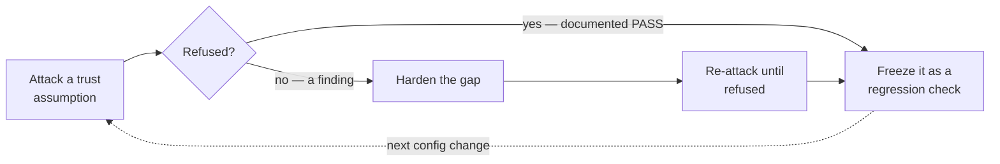
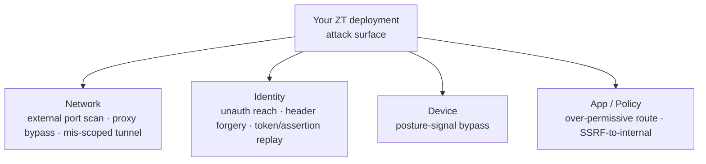
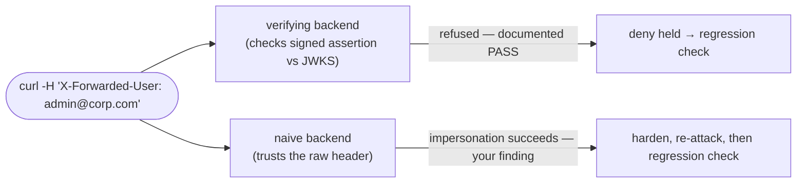

# Module 11 — Red-team Your Zero-Trust Deployment

*Type 10 · Design → Red-team-your-own-design → Harden — take the gated service you already built
(Modules 05/06), enumerate its trust assumptions, and attack each one; the attacks that *fail* are the
design holding (documented), the one that lands you harden, and every gap becomes a standing regression
check. Deliverable: a red-team report + a re-runnable regression suite that goes red the instant a deny
path reopens. [Go to the hands-on lab →](lab.md)*

*Last reviewed: 2026-08*

**Zero Trust Network Access** — *a control you haven't attacked is a hope, not a control — and a gap you
found once but never re-test is a gap you'll ship again.*

<!-- module-meta -->
**Difficulty:** Intermediate–Advanced &nbsp;·&nbsp; **Estimated time:** ~4–6 hrs (study + lab) &nbsp;·&nbsp; **Prerequisites:** [Foundations](../../../00-foundations/README.md); Module 05 (SASE / no-inbound-ports) and Module 06 (Identity-Aware Access / Pomerium) — you red-team the deployment you stood up there
{ .module-meta }

!!! abstract "In 60 seconds"
    A green dashboard and a tunnel that shows *connected* prove the happy path; they say nothing about
    whether the design refuses the attacks it was built to refuse. This module is the discipline of
    attacking your **own** Zero-Trust deployment on purpose: you enumerate its load-bearing trust
    assumptions — nothing listens, identity is required every request, the backend trusts only a *signed*
    identity, every path goes through the proxy — and you attack each one. An attack that's refused is a
    documented win. An attack that lands is a finding you harden. And the move that makes it *engineering*
    rather than a one-time audit: every attack becomes a **regression check** that re-runs forever, so a
    future config change that reopens a deny path turns your suite red before it ships.

## Why this matters

There is a gap between "I deployed Zero Trust" and "I proved it holds," and most deployments live in it.
A `docker compose up` that returns a green dashboard, a tunnel that shows *connected*, an Access policy
that asks for an email — these tell you the happy path works. They tell you nothing about whether the
design refuses the attacks it was built to refuse. You only trust a control after you have attacked it
yourself and watched it hold; until then it is an assertion.

This is not theoretical caution. The header-trust failure class is one of the most common ways a real
Zero-Trust proxy quietly becomes theater — and it ships in real products, this year, with 9-point CVSS
scores (the case study below). But the deeper reason to red-team your own build is *durability*: a
weakness you find and fix in a one-time review comes straight back the next time someone publishes a
port "for convenience," relaxes a policy under deadline, or trusts a client header to unblock a
demo. The artifact that survives that is not the report — it's the **regression suite**. Turning each
attack into a check that re-runs on every change is what separates a security *audit* (a snapshot) from
security *engineering* (a property the system keeps proving about itself).

## Objective

Take the gated, no-inbound-ports service you built in Modules 05/06 and attack it as an outsider would.
Enumerate its trust assumptions — no inbound listener, no unauthenticated reach, no forged identity, no
over-permissive route, no proxy bypass — and probe each. Document the attacks that *failed* (the design
held) as evidence; for the one that succeeds against a deliberately naive backend, harden it and
re-attack until it fails too. Then turn every probe into a committed **regression check** so the deny
path stays proven, not just proven once.

## The core idea

!!! note "The mental model"
    **A control you haven't attacked is a hope, not a control — and a gap you found once but never
    re-test is a gap you'll ship again.** Deployment proves the happy path; red-teaming proves the
    *deny* path, and the deny path is the only thing that makes it Zero Trust. Every attack you run
    should end its life as a **regression check** that re-runs forever.

Red-teaming your own design is a loop, not a report. You attack an assumption; if the deployment refuses
you, that refusal is a documented *win* — "I attacked this and it held" is exactly the evidence a
security review asks for. If the attack lands, that's a finding: you harden the gap, then re-attack
until it fails too. And then — the move this edition insists on — you **freeze the attack into a
regression check** so the property you just proved keeps proving itself on every future change. A
red-team that finds nothing on its first pass has *either* a hardened design or a shallow attack; the
way you tell the difference is to include a known-vulnerable target and confirm your attack can actually
detect it.

### Enumerate the trust assumptions — the ZT attack surface by pillar

An identity-aware proxy makes a handful of promises, and each promise is a thing to attack. Laid out by
NIST pillar, the surface is small and legible — which is the point: a deployment you can enumerate is a
deployment you can regression-test.

Each surface maps to an attack, the control it tests, and — the durable output — the regression check
that keeps it closed:

| Attack | Trust assumption it tests | Control / tenet (pillar) | Regression check it becomes |
|---|---|---|---|
| **External port scan** | "nothing listens but the proxy" | no inbound listener (Network) | `nmap` asserts the backends expose **no** open port |
| **No-session request** | "identity is required on every request" | verify explicitly (Identity) | `curl` asserts an unauth request is **never** a 200 |
| **Identity-header forgery / assertion replay** | "the backend trusts only a *signed* identity" | verify explicitly + signature (Identity) | a forged/replayed header is **rejected**, not acted on |
| **Device-posture bypass** | "posture is part of the access decision" | verify device (Device) | a request with no/faked posture signal is **denied** |
| **Over-permissive route / SSRF-to-internal** | "least privilege, per route" | minimize blast radius (App/Policy) | a probe to an unauthorized upstream is **refused** |
| **Proxy bypass / mis-scoped tunnel** | "every path goes through the proxy" | no bypass (Network/Tunnel) | a direct-to-backend request is **unreachable** |

The first two are the easy passes — if either fails, the deployment isn't Zero Trust yet and the rest
are moot. The last one (bypass) is the *dual* of the second: even a perfect deny path is decoration if
the backend is reachable *around* it — a published port "for convenience," a route on a flat internal
network, a teammate's `docker run -p`. The interesting one, and the one this module is built around, is
identity-header forgery.

### The centerpiece: identity-header forgery

An identity-aware proxy works by *injecting* the validated caller into the upstream request as a header
— Pomerium's signed `X-Pomerium-Jwt-Assertion`, plus context like `X-Forwarded-For` /
`X-Forwarded-User`. The whole model holds right up until the backend trusts a header that an attacker
can *also* set. `curl -H "X-Forwarded-User: admin@corp.com"` costs nothing; a forged value of a *signed*
assertion costs the proxy's private key, which you don't have. So the rule the backend must follow is
exact: **trust the identity in `X-Pomerium-Jwt-Assertion` only after verifying its signature against the
proxy's JWKS (`/.well-known/pomerium/jwks.json`), plus `aud`/`iss`/`exp` — and never trust a plain,
client-supplied identity header.**

The lab has you stand *two* backends behind the proxy so you can see both sides: a properly-verifying
one (the forgery is refused — a documented pass) and a deliberately naive one that believes a raw
`X-Forwarded-User` header (the forgery *succeeds* — your one finding). Hardening the naive backend to
verify the signed assertion, then watching the same forgery fail, is the harden-and-re-attack beat — and
freezing that forgery as a standing check is what stops the mistake from silently returning.

!!! warning "The gotcha"
    The model holds right up until the backend trusts a header an attacker can *also* set. `curl -H
    "X-Forwarded-User: admin@corp.com"` costs nothing; forging a *signed* `X-Pomerium-Jwt-Assertion`
    costs the proxy's private key, which you don't have. The backend must trust the signed assertion
    only after verifying it against the JWKS plus `aud`/`iss`/`exp` — never a plain client-supplied
    header. The case study below is this exact class, live in a real product.

### The case: CVE-2026-40575 — OAuth2 Proxy header-spoofing bypass (CVSS 9.1)

You don't have to imagine the header-trust failure; it shipped. In **CVE-2026-40575** (OAuth2 Proxy,
CVSS 9.1, fixed in 7.15.2), an unauthenticated attacker could spoof the `X-Forwarded-Uri` header so the
proxy evaluated its auth and skip-auth rules against a *different* path than the one actually forwarded
upstream — reaching protected routes with **no session at all**. The mechanism is the whole lesson in
one line: the proxy made an authorization decision using a value the *client* controlled. The fix was a
`--trusted-proxy-ip` allowlist — stop trusting `X-Forwarded-*` headers from anyone but the real upstream
proxy. That allowlist *is* the rule: a forwarded header is only trustworthy when it was added by a hop
*you* control, never when it arrived from the client. The failure generalizes far past one product — any
forward-auth design that trusts a client-settable header, or leaves the backend reachable around the
proxy, has a deny path that was never actually tested.

??? note "Background: why forwarded headers are structurally untrustworthy"
    `X-Forwarded-For`, `X-Forwarded-User`, `X-Forwarded-Uri` are all *hints a client can write*. A proxy
    you control may **append** to them honestly, but nothing stops an attacker from setting the first
    value. The only safe posture is an explicit trust boundary: count trusted hops (Pomerium's
    `xff_num_trusted_hops`), pin the upstream IP (OAuth2 Proxy's `--trusted-proxy-ip`), or require a
    *signed* assertion the client cannot mint. The three "Go deeper" writeups below are the same idea
    from three angles: the CVE, the product knob, and the general principle.

!!! tip "AI caveat"
    A model drafts the whole harness — the `nmap` invocation, the `curl` probes, the forged-header
    payloads — in one shot, and that speed is real. The review has one specific failure mode to hunt: a
    script that **fails open**, printing PASS when a request errors, times out, or hits an unexpected
    redirect, will tell you your *design* held when in fact your *test* broke. Every assertion must fail
    *closed* — a probe that can't reach a verdict is a failure to investigate, never a silent pass. This
    matters double once the checks are regression tests: a fail-open check is a green light that means
    nothing, wired to run forever.

## Go deeper (~2.5 hrs · optional)

*The teaching above is the spine — it names the trust assumptions, the forgery mechanism, and the
CVE, and you can do the lab from it alone. These links are for working from the **primary sources** and
going deeper on the header-trust class, not for relearning what's above.*

**The design you're attacking — what each tenet promises (~45 min) — the case-study seam**
- [NIST SP 800-207 — Zero Trust Architecture, §2 (tenets) and §3.4 (threats to ZTA)](https://nvlpubs.nist.gov/nistpubs/SpecialPublications/NIST.SP.800-207.pdf) (~30 min) — §2 is the checklist your attacks test; **read §3.4 closely** — it enumerates exactly the deployment-level threats (subverting the policy decision/enforcement point, DoS of the PEP, stolen credentials) that this red-team operationalizes. The PDP/PEP split there is the proxy-vs-backend boundary you attack.
- [Pomerium — JWT verification ("Continuous Identity Verification at the Application Layer")](https://www.pomerium.com/docs/guides/jwt-verification) (~15 min) — the centerpiece reference: what the *backend* must check on `X-Pomerium-Jwt-Assertion` (signature against the JWKS, `aud`/`iss`/`exp`) before trusting any claim. This is the rule the naive backend violates and the verifying backend obeys.

**The header-trust failure class, made real (~40 min) — the CVE and its generalization**
- [OAuth2 Proxy — "Authentication Bypass via X-Forwarded-Uri Header Spoofing" (CVE-2026-40575, GHSA-7x63-xv5r-3p2x)](https://github.com/oauth2-proxy/oauth2-proxy/security/advisories/GHSA-7x63-xv5r-3p2x) (~15 min) — the recent, real, CVSS-9.1 advisory the forgery attack is built around. Read the affected-config conditions and the fix (the `--trusted-proxy-ip` allowlist) — that allowlist *is* the lesson: trust `X-Forwarded-*` only from the real proxy. *(NVD entry: <https://nvd.nist.gov/vuln/detail/CVE-2026-40575>)*
- [Pomerium — X-Forwarded-For Settings (`xff_num_trusted_hops`)](https://www.pomerium.com/docs/reference/x-forwarded-for-settings) (~10 min) `[depth]` — Pomerium's own knob for the same problem: when `xff_num_trusted_hops` is 0/unset, the incoming `X-Forwarded-For` is *not* trusted. Read it as the concrete "how a real product refuses a spoofed header" counterpart to the CVE.
- [adam-p — "The perils of the 'real' client IP" (X-Forwarded-For)](https://adam-p.ca/blog/2022/03/x-forwarded-for/) (~15 min) `[depth]` — the clearest practitioner writeup of *why* any client-settable header is untrustworthy unless added by a proxy you control. Read the "spoofing" and "which hop do I trust?" sections; it generalizes the CVE to the whole class.

**The attack tooling (~25 min, skim — you've met these in Foundations)**
- [Nmap — Host Discovery and Port Scanning Basics (official reference guide)](https://nmap.org/book/man-host-discovery.html) (~15 min) — you need only the basic TCP connect/SYN scan and the "no open ports" reading; this is the "prove nothing listens" tool. Skip the scripting-engine chapters.
- [PortSwigger Web Security Academy — HTTP request smuggling / header notes](https://portswigger.net/web-security/request-smuggling) (~10 min, optional) `[depth]` — read only as background on why proxies and backends disagreeing about a request is a recurring bug class; the header-forgery you run is the simplest member of that family.

## Key concepts

- **A control you haven't attacked is a hope, not a control.** Deployment proves the happy path; only red-teaming proves the deny path — and the deny path is what makes it Zero Trust.
- **Enumerate the trust assumptions by pillar:** no inbound listener (Network), no unauthenticated reach + no forged identity (Identity), posture in the decision (Device), least-privilege routes / no SSRF-to-internal (App/Policy), no proxy bypass or mis-scoped tunnel (Network). Each is an attack.
- **Header trust is the gotcha.** The backend must trust only the proxy's *signed* assertion (`X-Pomerium-Jwt-Assertion`), verified against the JWKS + `aud`/`iss`/`exp` — never a plain, client-supplied header. Forging an unsigned header is free; forging a signed one needs the proxy's private key. **CVE-2026-40575** (OAuth2 Proxy, CVSS 9.1) is this exact class.
- **Bypass is the dual of denial.** Every path to the backend must pass through the proxy; a published port or flat-network route makes the entire deny path moot.
- **A refused attack is a documented win**, not a non-event. The one finding you *do* land is the exercise working; you harden it and re-attack until it fails too.
- **Every attack ends as a regression check.** A gap found once but never re-tested is a gap you'll ship again — freezing each probe into a standing suite turns a one-time audit into a durable property.
- A red-team that finds nothing on its first pass may have a hardened design *or* a shallow attack — include a known-vulnerable backend so you can confirm your attack actually distinguishes the two.

## AI acceleration

A model will happily draft your whole attack harness — the `nmap` invocation, the `curl` probes, the
forged-header payloads — in one shot, and that speed is genuinely useful. The posture holds exactly as
everywhere else: **AI authors → you review every line → you own it**, and in a red-team harness the
review has one specific failure mode to hunt. An attack script that **fails open** — that prints PASS
when the request errors, times out, or hits a redirect the script didn't anticipate — will tell you your
design held when in fact your *test* broke. Every assertion must fail *closed*: a probe that can't reach
a verdict counts as a failure to investigate, never a silent pass. This is sharper here than usual
because the checks don't run once — they become **regression tests** that gate every future change, so a
fail-open check is a permanent green light that means nothing. Make a model draft the harness, then read
each check and ask: if this `curl` returned nothing, a `000`, or an unexpected 502, does the harness
report a held design or a broken test? Then prove it honest the only way that counts — point the *same*
harness at the deliberately-naive backend and watch it correctly go red.

!!! question "Check yourself"
    - Why is a green dashboard and a `connected` tunnel not evidence that your Zero Trust design holds?
    - Why does forging a plain `X-Forwarded-User` header cost nothing while forging `X-Pomerium-Jwt-Assertion` is infeasible — and how does CVE-2026-40575 illustrate the same class?
    - What does turning each attack into a *regression check* buy you that a one-time red-team report does not — and what makes a fail-open check worse than no check?
