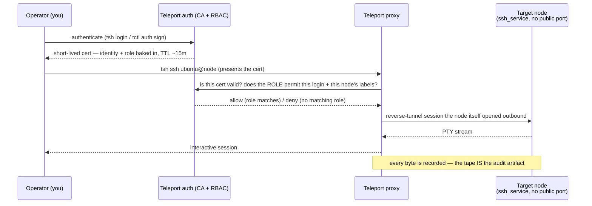
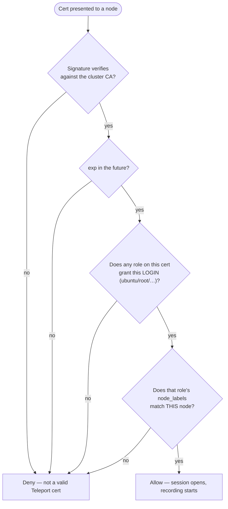
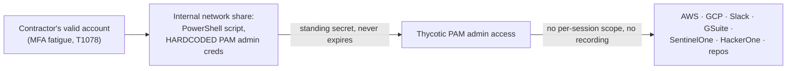

# Module 13 — Privileged Access in a Zero Trust World

*Type 7 · Build-&-Operate — stand up a real privileged-access gateway, mint a short-lived certificate
bound to your identity, and SSH through it to a target that has no other way in; the deliverable is the
running system and its two proven denials, not an essay. [Go to the hands-on lab →](lab.md)*

*Last reviewed: 2026-08*

**Zero Trust Network Access** — *every module before this one made user→app access zero trust; this one
asks who gets to type `sudo` on the box that runs the ledger, and why a standing SSH key was always the
wrong answer.*

<!-- module-meta -->
**Difficulty:** Intermediate &nbsp;·&nbsp; **Estimated time:** ~5–7 hrs (study + lab) &nbsp;·&nbsp; **Prerequisites:** [Foundations](../../../00-foundations/README.md) · [Module 02](../02-identity-control-plane/README.md) · [Module 12](../12-workload-identity-mtls/README.md)
{ .module-meta }

!!! abstract "In 60 seconds"
    User-to-application ZTNA — the identity-aware proxy, the OIDC token, the device posture check — is
    table stakes. The fight that actually decides an enterprise breach is **privileged access**: who can
    SSH into the database host, RDP into the domain controller, `kubectl exec` into the cluster running
    payments. The traditional answer — a shared bastion, a standing SSH key on everyone's laptop, "ask
    Ops for the root password" — is a flat-trust design wearing an admin badge, and it is exactly what
    turned one phished contractor into Uber's entire internal estate in September 2022. This module
    replaces it with **Teleport**: every admin session rides a **short-lived, identity-bound
    certificate**, every session is **authorized per-request by RBAC**, and every session is **recorded**
    — so "privileged access" stops meaning "a secret someone holds" and starts meaning "a credential you
    prove, that expires, and that leaves a tape." Privileged access is SPIFFE for humans.

## Why this matters

Every module before this one answered *"can this user reach this web app?"* — an identity-aware proxy
checks a token, a policy engine decides, the session ends when the token expires. That is real progress,
and it is also the *easy* half of the enterprise access problem. The traffic that actually ends a company
is not a marketing intern's SSO session; it's an engineer's SSH key that reaches the production database,
an SRE's `kubectl` context that can exec into any pod, a domain admin's RDP session into the box that
issues Kerberos tickets. **Privileged access** is access to the infrastructure that runs everything else,
and the traditional model for granting it — a bastion host everyone SSHs through, a shared or
individually-held private key with no expiry, "here's the root password, don't lose it" — never went
through the zero-trust redesign the web layer did. It is still standing-credential, still
network-position, still nobody-watching.

That gap is not theoretical. It is the exact shape of one of the most consequential breaches of the
decade, and it is why "stand up Teleport" is the easy half of this module and "understand that the
signing CA, the RBAC role, and the session recording *are* the blast-radius controls — not the SSH
tooling" is the half that makes you an architect instead of a tutorial-follower.

## Objective

Stand up Teleport Community Edition as a certificate-based privileged-access gateway — an auth+proxy
service and a target SSH node that joins it — mint yourself a **short-lived certificate** bound to your
identity and role, and use it to reach the node **through the proxy** (the node exposes no SSH port of
its own to reach directly). Watch the session get **recorded**, play it back, and then prove the two
things that make this a control and not a convenience: a user **without** the right role is **denied**,
and a connection that tries to **skip the proxy** and hit the node directly is **refused**. Finish by
tightening an intentionally over-broad RBAC role down to the specific principal and resource it actually
needs.

## The core idea

!!! note "The mental model"
    **A privileged session is a short-lived, provable identity — not a secret you hold.** Where the old
    model handed out a private key that worked forever and trusted whoever presented it, Teleport issues
    a certificate that is *signed proof of who you are and what role granted you access*, valid for
    minutes to hours, useless the moment it expires, and impossible to present without going through the
    proxy that recorded the attempt.

The shift mirrors, almost exactly, the workload-identity shift from Module 12 — SPIFFE gives a *service* a
short-lived certificate it proves instead of a static key it holds; Teleport gives a *human operator* the
same thing for infrastructure access. Different audience, identical architecture: a certificate authority
issues short-lived credentials bound to identity, a policy layer decides what each identity may reach, and
nothing long-lived sits anywhere waiting to be stolen.

### The access flow you're about to run

**Teleport** replaces the shared bastion with a **certificate authority plus a policy engine**. You don't
get a key that works forever; you get a certificate the CA signs *right now*, scoped to the roles you
hold, expiring in minutes. The proxy is the only network path to the node — the node doesn't listen for
inbound connections at all; it dials **out** to the proxy and waits, the same reverse-tunnel shape a SPIFFE
workload doesn't need because SPIFFE has no bastion to begin with. Every session that crosses the proxy is
recorded, frame by frame, so "who ran what, when" is a query against a tape, not a hope that someone was
watching.

!!! note "tctl auth sign vs tsh login — two ways to the same short-lived cert"
    The lab mints your first certificate with `tctl auth sign` — the administrator's offline equivalent of
    `tsh login`, used here so the flow is fully scriptable without a browser-based password reset. A real
    deployment puts a human through `tsh login` (SSO, WebAuthn, or a local password) instead; what you get
    back — a certificate with an explicit TTL and your identity and roles baked into its extensions — is
    identical either way, and that certificate, not the login method, is the actual control.

### RBAC is a chain of gates, not a network path

A certificate proves *who you are*; it does not by itself prove *what you may touch*. Teleport's roles
bind three things together — the **logins** you may use on a target (`ubuntu`, not `root`, unless the
role says so), the **labels** of the nodes you may reach (`env: production`, not `*`), and the session
**options** (max TTL, whether the session must be recorded). Skip the labels-matching gate — grant
`node_labels: '*':'*'` because it was faster to write — and the certificate becomes a skeleton key to
every host in the fleet, no matter how short its TTL. Short-lived is not the same as narrowly scoped;
the lab's judgment step (Step 5) is entirely about closing that gap.

!!! warning "The gotcha — a short TTL does not make an over-broad role safe"
    The single most common mistake in privileged-access rollouts is treating "short-lived certificates"
    as the whole win and leaving the RBAC role wildcarded — `logins: [root]`, `node_labels: '*': '*'` —
    because it's the fastest way to get the demo working. A five-minute certificate that grants root on
    every host is still root on every host for five minutes, to anyone who can get that role assigned. The
    TTL bounds *how long*; the role bounds *how much*. Both are blast-radius controls, and only one of
    them is visible if you only look at the certificate.

### The case: standing credentials, no session boundary, total blast radius

Everything above says *scope and expiry are the control.* The breach below is what happens when neither
exists.

**Uber (September 2022) — a contractor's valid account to a hardcoded PAM admin key to everything.** An
attacker obtained an Uber external contractor's corporate password (bought after the contractor's personal
device was compromised) and, after repeated MFA push prompts, got one accepted — **MFA fatigue** turning a
**valid account (MITRE ATT&CK T1078)** into a foothold. From there the attacker moved through Uber's
internal network with the access that account already carried, using the same kind of legitimate remote
administrative channels — **remote services (MITRE ATT&CK T1021)** — that any admin uses every day. On an
internal network share, the attacker found a PowerShell script with **hardcoded admin credentials to
Uber's Thycotic privileged-access-management vault** — a standing, unexpiring secret, sitting in plaintext
because *something* had to authenticate to PAM non-interactively and nobody had built a better way. That
one static credential was the admin key to the vault that held the keys to everything else: AWS, GCP,
Google Drive, the Slack workspace, SentinelOne, the HackerOne admin console, internal dashboards, code
repositories. Uber's own account of the incident confirms the outcome — the attacker reached "elevated
permissions to a number of tools, including G Suite and Slack" — and a UK court later convicted a
Lapsus$-affiliated teenager in connection with this and related intrusions.

!!! note "Why this is the privileged-access failure mode, not just a credential-theft story"
    The password-spray-to-MFA-fatigue opening is common and already covered by device-trust and
    phishing-resistant-MFA modules elsewhere in this track. What makes Uber the case study *for this
    module* is what happened **after** initial access: a **standing, non-expiring, hardcoded credential**
    to a **privileged-access system itself**, with **no per-session scoping** (it was an admin key, not a
    role bound to one login on one host) and **no recording** to make the misuse visible while it was
    happening. Every one of those is exactly the control this module builds: certificates instead of
    static secrets, RBAC roles instead of one admin key, and a session recording instead of silence.

| | Shared bastion / standing key (Uber's PAM pattern) | Teleport (this module) |
|---|---|---|
| **What an attacker who gets it holds** | a secret that works until someone finds and rotates it | a certificate that expires on its own, usually in minutes |
| **Scope** | often admin/root, because scoping per-user is extra work | RBAC role: specific logins, specific node labels |
| **Network reachability** | the bastion (or the PAM system itself) is a network target | the target node has no inbound port; nothing to hit directly |
| **Visibility into misuse** | none, unless something else happens to log it | every session recorded, frame by frame, queryable after the fact |
| **Remedy after compromise** | rotate the secret everywhere it's used — if you even know where that is | nothing to rotate; the next cert request re-evaluates identity + role |

### The one load-bearing judgment — TTL and RBAC scope are both blast-radius controls, and neither substitutes for the other

Two failure modes recur, and both are choices dressed up as defaults:

- **TTL creep.** A certificate valid for 12 hours "so nobody has to re-auth mid-shift" quietly restores
  standing-credential risk for most of a workday. The lab mints certificates with a TTL on the order of
  minutes on purpose — defend that number, don't inherit it.
- **RBAC left wildcarded.** `node_labels: '*': '*'` and `logins: [root]` get shipped because they make the
  demo work on the first try, and then nobody tightens them once the real fleet exists. A wildcarded role
  is a skeleton key with an expiry date — better than Uber's PAM key, but not by as much as the short TTL
  makes it feel.

Every one of those settings is a number and a label selector you must be able to **defend**, not a default
you inherited.

!!! tip "AI caveat"
    A model will happily emit a Teleport role YAML that is *syntactically* perfect and **wildcarded** —
    `node_labels: '*': '*'` is the fastest way to make a demo pass, and it is also the Uber-PAM failure
    mode in YAML. The sharpest review is on the **role**, not the certificate: make the model defend every
    `logins` entry and every `node_labels` selector against "could this identity reach a host it has no
    business touching?" before you trust it in the lab or anywhere real.

## Go deeper (~4 hrs · optional)

*The sections above teach the mechanism end-to-end — you can complete the lab from them alone. These
links go to the **primary sources** and deepen the case study; they are not the path you must click
through to understand the module. Optional depth is tagged `[depth]`.*

**The Uber breach — the case-study seam (~1 hr)**
- [Uber Newsroom — Security Update (September 2022)](https://www.uber.com/newsroom/security-update/) — Uber's own account: contractor MFA fatigue leading to "elevated permissions to a number of tools, including G Suite and Slack." Read it as the company's own admission of how far one compromised account reached.
- [CyberArk — Unpacking the Uber Breach](https://www.cyberark.com/resources/blog/unpacking-the-uber-breach) — the technical breakdown of the PowerShell-script-to-Thycotic-PAM-admin path; read it for the mechanism this module's control set is built to close.
- [MITRE ATT&CK T1078 — Valid Accounts](https://attack.mitre.org/techniques/T1078/) — the technique that turned one contractor's phished password into a foothold. Short and directly applicable.
- [MITRE ATT&CK T1021 — Remote Services](https://attack.mitre.org/techniques/T1021/) — the technique family covering movement through legitimate remote-administration channels (SSH, RDP, and the rest) once a valid account is in hand — the exact channel this module's proxy-mediated model closes off from direct reach. `[depth]`

**Zero trust frameworks — privileged access named explicitly (~1 hr)**
- [NIST SP 800-207 — Zero Trust Architecture](https://csrc.nist.gov/pubs/sp/800/207/final) — read for the Policy Enforcement Point / Policy Decision Point model; this module is the PEP guarding **administrative** access to infrastructure, not a web app. The architecture from Module 02 doesn't change — the resource behind it does. `[depth]`
- [CISA Zero Trust Maturity Model v2.0](https://www.cisa.gov/sites/default/files/2023-04/zero_trust_maturity_model_v2_508.pdf) — read the Identity pillar's treatment of privileged access management: just-in-time elevation, session recording, and credential vaulting as what separates an Advanced/Optimal identity posture from a Traditional one. This module builds exactly those three. `[depth]`

**Teleport — the mechanics (~1.5 hrs)**
- [Teleport — Server Access](https://goteleport.com/docs/enroll-resources/server-access/introduction/) — the product surface the lab exercises: certificate-based SSH access, no agent-side static credentials.
- [Teleport — Access Controls / RBAC](https://goteleport.com/docs/reference/access-controls/roles/) — how roles bind logins, node labels, and session options together; read this before Step 5 of the lab.
- [Teleport — Session Recording](https://goteleport.com/docs/reference/deployment/audit/) — how a session becomes a replayable audit artifact, and what "sync" recording at the node means for the lab.

## Key concepts

- **A privileged session is a certificate you prove, not a key you hold** — Teleport's CA issues
  short-lived, identity-bound certificates in place of standing SSH keys; a leaked certificate expires on
  its own, a leaked key doesn't.
- **RBAC roles bind three things** — the **logins** an identity may use, the **node labels** it may
  reach, and session **options** (TTL, recording). All three must match, or the connection is denied.
- **The proxy is the only path in** — the target node has no listening SSH port; it dials *out* to the
  proxy and waits, so there is nothing on the network for a direct connection attempt to reach.
- **Session recording is the audit artifact** — every privileged session is captured and replayable,
  turning "who did what on that box" from a hope into a query.
- **TTL and RBAC scope are independent blast-radius controls** — a short TTL on a wildcarded role is
  still a skeleton key, just a temporary one; both have to be tight.
- **Uber (2022):** a phished contractor account plus a **standing, hardcoded PAM admin credential** with
  no per-session scope and no recording turned one MFA-fatigue foothold into nearly the entire internal
  estate — the exact failure mode this module's controls are built to close.

## AI acceleration

A model will generate a working Teleport role YAML and `tctl`/`tsh` invocations quickly, and the output
usually runs on the first try — which is exactly the trap, because "runs" and "scoped correctly" are
different bars. **Your review job:** check every `logins` entry and every `node_labels` selector in a
generated role against "could this identity reach a host or account it has no business touching?" A
model asked for "a role that lets the on-call engineer SSH into the app servers" will often hand you
`node_labels: '*': '*'` because it's the shortest YAML that satisfies the prompt — that is the Uber-PAM
failure mode in miniature, a privileged grant with no boundary. Ask the model to defend the TTL it chose
and the label selector it wrote before you apply the role; if it can't explain why `node_labels: {env:
production}` and not `'*': '*'`, you don't yet know what you're granting, so you don't yet own it.

!!! question "Check yourself"
    - A certificate proves *who* is connecting. What does it *not* prove on its own, and which part of a
      Teleport role closes that gap?
    - Why was Uber's hardcoded PAM admin credential worse than a phished password with MFA — what two
      properties did it have that a short-lived, role-scoped certificate removes?
    - The target node in this lab has no listening SSH port. What does that structurally rule out that a
      firewall rule on an open port never fully rules out?
