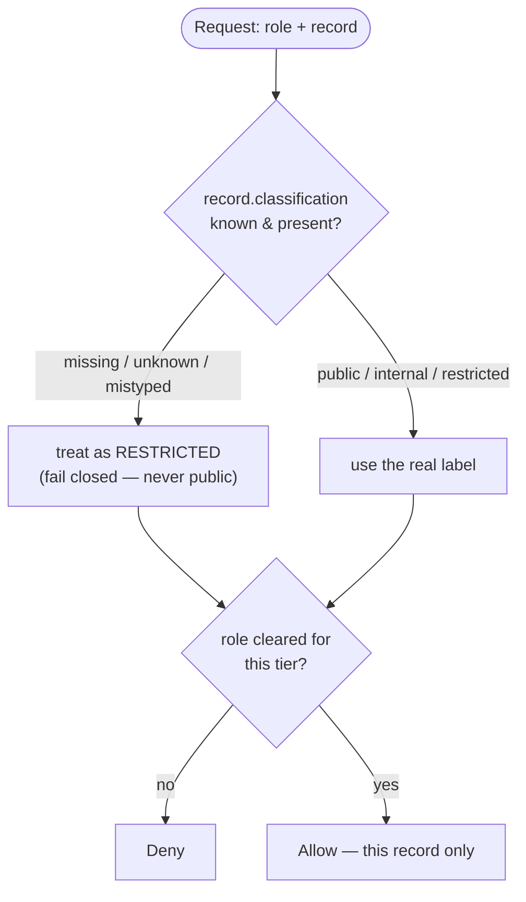
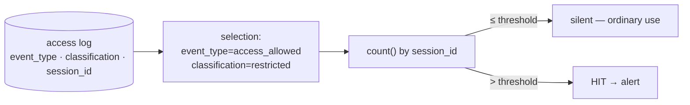
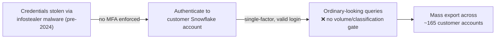

# Module 14 — Data, the Last Pillar

*Type 8 · Judgment-as-Code / Gate — extend the OPA policy from Module 08 with a role × classification
input that fails closed on a missing label, and the Sigma detection from Module 09 with a session-volume
signal for bulk-restricted reads. (Secondary: Type 6 · Reconstruct, for the detection half.) Deliverable:
the deny path proven — including watching it fail *open* and recover — and the detection fired, not an
essay. [Go to the hands-on lab →](lab.md)*

*Last reviewed: 2026-08*

**Zero Trust Network Access** — *a correctly-authenticated, correctly-authorized request is not the end
of the story — it can still walk out the door with data it should never have touched in bulk, which is
why data is the fifth pillar, not an afterthought to the other four.*

<!-- module-meta -->
**Difficulty:** Intermediate &nbsp;·&nbsp; **Estimated time:** ~4–5.5 hrs (study + lab) &nbsp;·&nbsp; **Prerequisites:** [Foundations](../../../00-foundations/README.md) · [Module 08 — Policy as Code](../08-policy-as-code/README.md) · [Module 09 — Monitoring & Detection](../09-monitoring-detection/README.md)
{ .module-meta }

!!! abstract "In 60 seconds"
    Every module before this one answered *"is this request authorized?"* — identity, device, network,
    workload. None of them asked the question data-loss prevention actually needs answered: *once a
    request is authorized, how much can it take, and does the system that just said yes even know what it
    handed over?* NIST SP 800-207's fifth pillar is **data**, and the 2024 Snowflake customer breaches are
    the case that proves the gap is real: attackers used stolen-but-valid credentials, no MFA required, to
    authenticate exactly like the legitimate account — and once in, ordinary, individually-authorized
    reads became a mass export because nothing downstream of authentication knew or cared what
    *classification* of data was leaving. You'll extend the OPA policy from Module 08 so the record's
    classification label — not just the requester's role — decides the answer, prove it **fails closed**
    on a missing or mangled label by watching it fail *open* first, then extend the Sigma detection from
    Module 09 to catch the one signal identity and geography can't give you: a session reading far more
    restricted data than any legitimate use explains.

## Why this matters

Every earlier module in this track answers some version of *"can this request proceed?"* — and every one
of them stops at the moment the answer is yes. Identity (Module 02) proves who's asking. Device trust
(Module 03) proves what they're asking from. Microsegmentation (Module 07) and workload identity (Module
12) bound what one compromised thing can reach. Policy as code (Module 08) makes the *access* decision
version-controlled and testable. But "yes, this request is authorized" and "this is a safe amount of data
to hand over" are two different questions, and Zero Trust's own reference architecture names the second
one its own pillar for a reason: an attacker who steals a valid credential doesn't need to defeat any of
the first four pillars. They authenticate normally, request normally, and the only thing that looks wrong
is *how much* they took and *what classification* it was.

That is not a hypothetical gap. It is the exact shape of the 2024 Snowflake customer breaches: no exploit,
no forged token, no bypassed proxy — just credentials obtained from infostealer logs, used against
accounts with no MFA enforced, reading data through completely ordinary, individually-legitimate-looking
queries. The account was real. The access was, on paper, authorized. What was missing was any control that
looked at the *data* — its classification, its volume, its destination — as a first-class input to the
access decision, the way the rest of this track has treated identity, device, and network all along.

## Objective

Extend `data-classification.rego` (the same OPA engine from Module 08) so the access decision is a
function of **both** the requester's role **and** the record's `classification` label — public, internal,
or restricted — and prove two things about it: a merely-authenticated, non-privileged role reading
restricted data is **denied**, and a record whose label is missing or unrecognized resolves to the *most*
restrictive tier, never the least. Then extend the Sigma detection from Module 09 with a rule that fires
on **bulk reads of restricted data within one session** — a signal neither identity nor geography can give
you — and prove it fires on the anomalous session while staying silent on ordinary, individually-authorized
restricted access. Finally, map the CASB, DLP-egress, tokenization, CMK/BYOK, and data-residency controls a
production data-loss-prevention program layers on top of both engines — honestly labelled as **assessed**,
not stood up.

## Label-based authorization: the same OPA, a new input

Every OPA policy in this track so far has taken a claim about the **requester** — a role, a group, a
SPIFFE ID — and decided from it. This module adds a claim about the **resource**: the classification label
on the record itself. That is a small change in the input shape and a large change in what the policy has
to get right, because the label is not guaranteed to be there. Records get migrated without their tags.
Someone copy-pastes a taxonomy value with the wrong case. A new table ships before anyone classifies it.
None of that is a corner case in a real data estate — it is the normal condition of an inventory that
predates the policy that now governs it.

The single load-bearing design decision is therefore not the role/classification matrix itself — analysts
and auditors read internal, only data-officers and admins read restricted, deny-by-default is the same
shape as every other Rego policy in this track — it's what happens when the label **can't be resolved**.
`default effective_classification := "restricted"` is one line, and it is the difference between "unlabeled
data is ungoverned" and "unlabeled data is the most protected tier in the building." Get that line wrong —
default it to `"public"`, or simply forget it and let an unmatched label fall through — and every migration
gap, every dropped tag, every mistyped taxonomy value becomes a silent grant, not a silent deny. The lab
makes you watch that failure happen before you trust the fix.

!!! warning "The gotcha — 'unlabeled' is not 'ungoverned'"
    The instinct a naive policy encodes is *"if I don't recognize the classification, I can't enforce
    anything, so let it through."* That is exactly backwards, and it is the single most consequential line
    in this module's policy. An unrecognized or absent label carries **less** information than a known
    one, which means the policy knows **less** about how safe the record is to hand over — and knowing
    less is an argument for *more* caution, not less. Fail closed: unresolved always means the most
    restrictive tier.

## Detecting exfil-shaped access: the same Sigma, a new signal

OPA's job ends the moment it answers one request. It correctly says yes to every one of a compromised
account's reads, because each one, taken alone, *is* legitimate — the account really does hold the
`data-officer` role, and a `data-officer` really may read restricted records. Nothing about any single
request in a credential-theft scenario looks wrong to a per-request authorization engine, which is exactly
why Zero Trust needs a second discipline layered on top of the first: the access log, read as a *stream*,
not one decision at a time.

The Sigma rule in this module is the volume version of Module 09's geography rule, and the contrast is the
point. Module 09's `zt-unexpected-country.yml` keys on **where** a request came from. This module's
`zt-bulk-restricted-read.yml` keys on **how much** restricted data one session touched — `selection |
count() by session_id > 5` — and it deliberately ignores country, device, and time of day, because a
credential-theft session frequently matches all three of the legitimate account's usual values. The tell
is not *where* or *who*; it's *how many restricted records, how fast.* That is also why the threshold
itself is a decision you have to defend, the same way Module 02 made you defend `accessTokenLifespan: 300`
— set it too high and a real bulk-export session goes undetected; set it too low and the SOC gets trained
to ignore the alert on an analyst's ordinary Tuesday.

!!! note "Two different jobs, on purpose"
    OPA decides whether **one request** may proceed, right now, from the classification and role it can
    see in that request alone. Sigma decides whether **a session's pattern**, across many already-allowed
    requests, looks like exfiltration. Neither tool can do the other's job — a per-request engine has no
    memory of the last ten requests, and a log-scanning detection can't block the eleventh read before it
    happens. Production Zero Trust runs both, and the lab's Stretch section sketches feeding the detection
    back into the policy as a real-time input.

## The case: the Snowflake customer breaches (2024)

**At a glance —** stolen-but-valid credentials, no MFA required by the platform, and once inside, mass
data export that looked, request by request, exactly like normal customer usage of a data warehouse — no
data-layer guardrail ever asked whether the volume or classification of what was leaving made sense.

Beginning in April 2024, a financially motivated threat actor Mandiant tracks as **UNC5537** systematically
worked through credentials harvested by infostealer malware — many dating back years — testing them against
customer accounts on the Snowflake data-warehousing platform. The credentials worked because the affected
accounts had **no multi-factor authentication enforced**: a valid username and password was, on its own,
sufficient. Snowflake, Mandiant, and CrowdStrike's joint investigation found no evidence the Snowflake
platform itself was breached — the failure was entirely at the customer-account layer, and it reached
roughly **165 organizations**, including Ticketmaster, AT&T, Advance Auto Parts, and Santander, before the
pattern was identified in May–June 2024.

Read the failure the way this module wants you to: once authenticated, **every query the attacker ran was,
mechanically, the same kind of query a legitimate analyst runs against a data warehouse.** There was no
exploit to trip an IDS, no malformed request, no privilege escalation — just credential-based
authentication that a role/classification-blind access model treats as fully sufficient, and a bulk-read
volume that nothing downstream flagged as different from normal warehouse usage. In MITRE ATT&CK terms,
this is data access and exfiltration over the platform's own legitimate channels — **T1530** (Data from
Cloud Storage, the read) and **T1567** (Exfiltration Over Web Service, the move-out) — not a novel
technique, just an old one with nothing in the way. **CISA issued an alert on June 3, 2024** urging
Snowflake customers to hunt for unusual account activity and enforce MFA; the Australian Cyber Security
Centre issued a parallel advisory.

!!! note "Why this is a *different* case than Storm-0558 or Capital One"
    Module 02's Storm-0558 case was about a **forged** identity — a stolen signing key, no valid
    credential needed at all. Module 12's Capital One case was about a **long-lived, over-privileged
    credential** stolen from a misconfigured metadata service. Snowflake is neither: the credentials were
    real, single-use in the sense that they belonged to a real account, and the authentication step
    behaved *exactly as designed*. The gap this module closes is what a design can still get right on
    identity and still lose on: nothing after "yes, you're authenticated" asked what classification of
    data was leaving, or how much.

## The controls you can't self-host — assessed, not demonstrated

!!! note "The mental model"
    OPA and Sigma close the two gaps this track can build for free: per-request authorization keyed on
    classification, and after-the-fact detection keyed on volume. A production data-loss-prevention
    program layers controls that require a vendor platform, a KMS, or an org-wide inventory this lab
    cannot stand up in a container. Naming them honestly — what each one would have added to Snowflake,
    and to this lab's own corpus — is the practitioner's job the same way Module 03 named posture as
    assessed, not demonstrated. And the line here is a *discipline* boundary, not only a self-hosting
    one: content-inspection DLP and CASB are **data-security functions that ride alongside ZTNA in a
    SASE stack**, not ZTNA controls. This module covers the data pillar where Zero Trust owns the
    decision — classification-driven access and exfil detection — and hands content inspection to that
    neighboring discipline. That's a scope choice, not a gap.

| Control | What it adds that OPA + Sigma here can't |
|---|---|
| **CASB** (Cloud Access Security Broker) | A proxy/API-connector layer in front of the SaaS/warehouse itself, enforcing policy and logging activity the application never emits on its own — visibility Snowflake's own customers lacked into "how much is this account reading." |
| **DLP egress scanning** | Content-aware inspection on the way *out* — a bulk CSV download or an API response over a row-count threshold, caught *before* it leaves, not reconstructed afterward from a log the way this lab's Sigma rule does. |
| **Tokenization / format-preserving encryption** | Restricted fields (SSNs, card numbers) stored as tokens, so even an authorized bulk read returns tokens, not raw values — a control that survives a correct authorization decision going to the wrong volume. |
| **CMK/BYOK** (customer-managed keys) | The org, not the vendor, holds the decryption key — so a platform-side account compromise (Snowflake's own failure mode) cannot decrypt data at rest without a *separate* key compromise. |
| **Data residency** | Governs *where* a copy of restricted data is allowed to exist at all — a question a role/classification check inside one system never answers. |

This module's lab asks you to map each of these to the Snowflake case and to name, honestly, that they are
**assessed from a design**, not something a free-tier container lab can stand up — the same discipline
Module 03 applied to device posture.

!!! tip "AI caveat"
    A model drafts the role/classification matrix cleanly and will happily generate a `default
    effective_classification := "public"` that *parses* and *passes a syntax check* while being exactly
    backwards. The review that matters here is not "does the Rego compile" but "what does an unrecognized
    label resolve to" — make it defend that one default in words before you trust it, and insist on
    watching the fail-closed case break before you believe it's fixed.

## Go deeper (~3.5 hrs · optional)

*The sections above teach the mechanism end-to-end — you can complete the lab from them alone. These links
go to the **primary sources** and deepen the case study; optional depth is tagged `[depth]`.*

**The Snowflake case, from the record (~1 hr) — the case-study seam**
- [Google Cloud / Mandiant — UNC5537 Targets Snowflake Customer Instances for Data Theft and Extortion](https://cloud.google.com/blog/topics/threat-intelligence/unc5537-snowflake-data-theft-extortion) (~25 min) — Mandiant's first-party investigation: how credentials from infostealer logs, against accounts with no MFA, produced mass data theft across ~165 customer environments. Read it as the concrete answer to "what happens when authentication succeeds and nothing downstream checks classification or volume."
- [CISA — Snowflake Recommends Customers Take Steps to Prevent Unauthorized Access (June 3, 2024)](https://www.cisa.gov/news-events/alerts/2024/06/03/snowflake-recommends-customers-take-steps-prevent-unauthorized-access) — the government alert; read it for the recommended hunting guidance and MFA enforcement, and to see how a data-platform incident gets escalated to a national advisory.
- [MITRE ATT&CK T1530 — Data from Cloud Storage](https://attack.mitre.org/techniques/T1530/) — the collection technique behind reading data out of a cloud data platform via legitimate APIs. Read the description and mitigations; this is what the OPA classification check and the Sigma volume rule both target.
- [MITRE ATT&CK T1567 — Exfiltration Over Web Service](https://attack.mitre.org/techniques/T1567/) — the move-out half: using an already-trusted web channel to get the data out, so the traffic looks like ordinary use. Short and directly applicable.

**NIST and CISA — the Data pillar as a standard, not an opinion (~1 hr)**
- [NIST SP 800-207 — Zero Trust Architecture](https://csrc.nist.gov/pubs/sp/800/207/final) (~30 min, read §2 tenets again with data in mind) — the same authoritative model every earlier module used; this module is the pillar the others left for last.
- [CISA Zero Trust Maturity Model v2.0 (PDF)](https://www.cisa.gov/sites/default/files/2023-04/zero_trust_maturity_model_v2_508.pdf) (~30 min) — read the **Data** pillar's function table (inventory, categorization, availability, access, encryption) and its Traditional → Optimal maturity stages; this is the authoritative shape the module's five assessed controls map onto.

**Rego and Sigma aggregation — going one step past Modules 08–09 (~1 hr)**
- [OPA — Policy Reference: `default` keyword](https://www.openpolicyagent.org/docs/latest/policy-reference/#default-keyword) `[depth]` — the precise semantics of `default` rules; read it to understand exactly why `default effective_classification := "restricted"` behaves the way it does when the override condition never matches.
- [SigmaHQ — aggregation expressions in the condition (`count()`, `by`)](https://sigmahq.io/docs/basics/rules.html) `[depth]` — the real-Sigma grammar this lab's `detect.py` implements a working subset of; skim it to see how a production backend (Splunk `stats count by`, Elastic EQL) compiles the same `count() by session_id` idea.

## Key concepts

- **The classification label is an access-control input, not metadata** — the policy decides *from* it,
  the same way every earlier module's policies decided from a role or a SPIFFE ID.
- **Fail closed on the label itself:** `default effective_classification := "restricted"` treats a
  missing or unrecognized label as the *most* protected tier, never the least — the single load-bearing
  line in the whole policy.
- **Deny overrides allow, and querying `deny` is the proof** — the same shape as Module 08's auditor
  deny, applied to the restricted-classification tier.
- **OPA decides one request; Sigma decides a session's volume** — two different jobs, and a
  credential-theft session passes the first one on every individual read.
- **Volume, not geography, is this module's tell** — the bulk-restricted-read rule ignores country,
  device, and time of day on purpose; a stolen-but-valid credential often matches all three.
- **Snowflake (2024): stolen creds, no MFA, no data-layer guardrail** — the account was real, the access
  was individually authorized, and nothing checked classification or volume until it was too late.
- **This module closes NIST SP 800-207's fifth pillar** — identity (02) → device (03) → network (07) →
  workload (12) → **data (14)**, the full set an enterprise buyer expects covered end to end.

## AI acceleration

A model drafts the role/classification allow rules quickly and gets the common cases right on the first
try — analysts read internal, data-officers read restricted, deny-by-default. **Your review job is the one
line the common cases never exercise:** what does the policy do with a label it doesn't recognize? A model
asked to "handle missing classification" will often produce something that *compiles* and *looks* cautious
while defaulting to `"public"` or, just as dangerous, silently matching nothing and letting `allow`'s
absence read as permission somewhere downstream. Make it defend the default in words — "an unlabeled
record should resolve to X because Y" — and then, per the lab's centerpiece, **watch it fail before you
trust it fixed**: change the default, observe the unlabeled record become readable, then restore it. The
same posture applies to the Sigma threshold: a model will pick a plausible-looking number; you own proving
it both ways, too loose and too tight, before you commit to it.

!!! question "Check yourself"
    - Why is "the record has no recognizable classification label" a case that must resolve to the *most*
      restrictive tier, and what's wrong with a policy that resolves it to the *least* restrictive one
      because no rule matched?
    - `dpatel`'s 8 overnight restricted reads are each, individually, authorized by the OPA policy exactly
      like their 3 ordinary daytime reads. What does that tell you about what a per-request access-control
      engine can and cannot catch on its own?
    - In the Snowflake breach, what part of the attack chain looked completely ordinary to any
      authentication or per-request authorization check — and what kind of control was actually missing?
    - Which NIST 800-207 pillar does this module close, and which earlier modules in this track closed
      the other four?
