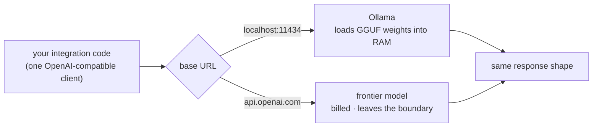
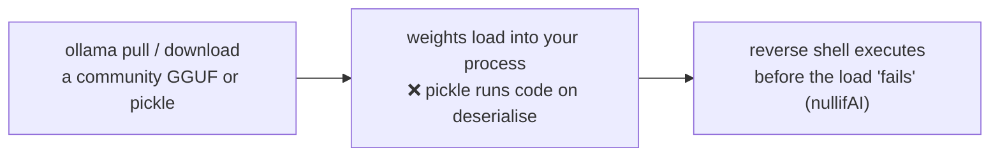

# Module 02 — Running Local Models

*Type 7 · Build-&-Operate — stand up a local LLM and benchmark its throughput *and* answer-quality against your own alerts and hardware; the deliverable is the running model plus its measured baseline, not a leaderboard number. (Secondary: Decision / ADR.) [Go to the hands-on lab →](lab.md)* &nbsp;·&nbsp; *[Cheat sheet →](cheatsheet.md)*

*Last reviewed: 2026-08*

**AI-Augmented Security Operations** — *a model you can't explain is a dependency you can't audit; running it yourself is where that audit starts.*

<!-- module-meta -->
**Difficulty:** Intermediate &nbsp;·&nbsp; **Estimated time:** ~4–6 hrs (study + lab) &nbsp;·&nbsp; **Type:** Build-&-Operate &nbsp;·&nbsp; **Prerequisites:** [Foundations](../../../00-foundations/README.md)
{ .module-meta }

!!! abstract "In 60 seconds"
    Data-residency and segmentation rules often forbid sending telemetry to a hosted model, so you
    run it on infrastructure you control. **Quantisation** is what makes that practical — 4-bit
    weights shrink a 7B model from ~14 GB to ~4 GB, laptop-sized. Ollama serves it behind an
    OpenAI-compatible API, so the rest of the track swaps local↔frontier by changing one URL. The
    one load-bearing judgment: measure throughput *and* answer quality on **your** alerts and **your**
    hardware — never a leaderboard.

## Why this matters
Sending sensitive telemetry to a hosted model is often a non-starter — data residency requirements,
security classification policies, and network segmentation all push toward running the model on
infrastructure you control. Ollama made this accessible: a single binary that pulls a model, starts
an OpenAI-compatible REST API on localhost, and serves inference without a PhD in CUDA. But the
moment you stand it up, the real question lands: *is this thing fast enough and good enough to do
the job?* — and the only honest answer comes from running it on your own work. This module is where
you build the running serving layer **and** measure it the way a leaderboard never will: against
your prompts, on your hardware.

## Objective
Stand up a quantised open-weight model locally via Ollama as a running, OpenAI-compatible service,
then **measure it on your own work**: throughput (tokens/sec) and answer quality on a set of
security-domain prompts, ending in a hardware-justified recommendation a security team can act on.

## The core idea
This is a **build-and-operate** module: the point is not a breach to dissect but a *working serving
layer you stand up, measure, and own*. A language model is, at its core, a very large file of
floating-point numbers — the weights — plus the code that multiplies them together at inference
time. The breakthrough that made local inference practical is **quantisation**: instead of storing
each weight as a 32- or 16-bit float, you represent it in 4 or 8 bits, losing a small amount of
numerical precision in exchange for a dramatic reduction in memory footprint. A 7-billion-parameter
model in 16-bit precision needs ~14 GB of RAM; the same model in 4-bit quantisation fits in ~4 GB.
That's the difference between "needs a high-end workstation" and "runs on a developer laptop." The
GGUF format (used by `llama.cpp` and Ollama) is the container format that packages quantised weights
for CPU inference.

The trade is legible once you put the footprints side by side — smaller weights, less RAM, a
measurable (not free) quality cost:

| Precision | ~RAM for a 7B model | What you trade |
|---|---|---|
| FP16 (16-bit) | ~14 GB | Full quality; needs a workstation / GPU |
| Q8_0 (8-bit) | ~7 GB | Near-lossless; still heavy |
| Q4_K_M (4-bit) | ~4 GB | Small quality loss — **laptop-sized** |

!!! note "The mental model"
    A model is just a big file of floating-point weights plus the code that multiplies them.
    Quantisation trades a little numerical precision for a large drop in memory footprint, and the
    OpenAI-compatible API means your integration code never cares whether the weights live on
    `localhost:11434` or `api.openai.com` — local-vs-frontier becomes a config change, not a rewrite.

Ollama's key abstraction is the **Modelfile** — a small configuration that points at a GGUF base
model and layers in a system prompt, a context size, and any sampling parameters. When you run
`ollama run tinyllama`, you're actually pulling a Modelfile plus a quantised GGUF, starting a
serving process that loads the weights into RAM, and opening an HTTP API on port 11434. The API is
intentionally OpenAI-compatible: the same client code that hits `api.openai.com/v1/chat/completions`
can hit `localhost:11434/v1/chat/completions` with a one-line URL change. This matters for
security tool integration: you write the integration once against the local model, and swapping to
a frontier model is a configuration change, not a code change — the whole rest of this track plugs
into the service you stand up here.

**The one load-bearing judgment: measure on YOUR alerts and YOUR hardware, not a leaderboard.** A
benchmark score from a model card tells you how some model did on someone else's task on someone
else's GPU; it does not tell you whether *this* quantisation answers *your* triage prompts fast
enough on *your* CPU. The practical axis is never "which model is smarter" — it's throughput vs.
quality *at the task you actually run*. Throughput is tokens per second; quality is measured
empirically against your own prompts. A model that generates 40 tokens/second and classifies
correctly 92% of the time is useful for alert triage; one that generates 8 tokens/second and is
right 94% is not, if your queue grows faster than it's processed. `llama.cpp`'s `llama-bench` and
the timer loop over this lab's `data/benchmark-prompts.txt` give you the throughput number directly;
the quality side — labelling each answer Correct / Partial / Wrong against ground truth — is a
*first, by-hand cut at evaluation*. **Module 11 (AI Evaluation & Observability) generalises exactly
this move** into a held-out test set, a scorecard, and a regression gate; the qualitative pass you
do here is the seed of the discipline that becomes non-negotiable once a model is making decisions
unattended. Measure here so you have the instinct before module 11 makes it rigorous.

!!! warning "The gotcha"
    A model card's benchmark number measures *some* model on *someone else's* task on *someone else's*
    GPU. It does not tell you whether this quantisation answers *your* triage prompts fast enough on
    *your* CPU. A model that does 40 tok/s at 92% beats one that does 8 tok/s at 94% if your queue
    grows faster than it drains — throughput *and* quality, at the task you actually run.

One important operational constraint: models don't update themselves. A local model's knowledge is
frozen at its training cutoff. For threat intelligence — which evolves daily — this means the model
can reason about *technique classes* (phishing, encoded execution, lateral movement) but will not
know about a CVE disclosed last month. The operational pattern is "model classifies the technique;
the analyst (or a tool) queries the live threat feed." The model handles the reasoning pattern;
current data comes from tools (more on that in Modules 04–06).

!!! tip "AI caveat"
    Use a model to *interpret* your benchmark numbers — paste the throughput/quality table and ask
    which tasks justify a larger model. It reasons about the tradeoff well, but it cannot know your
    numbers; you supply the empirical measurements, and you own the recommendation precisely because
    the data came from your hardware on your prompts, not its training set.

### The security seam — what you pull is code

Standing the service up is also the track's first **supply-chain decision**. A model file is not
inert data: the PyTorch/pickle serialisation format executes Python during *deserialisation*, so
merely *loading* an untrusted model can run attacker code before it ever answers a prompt. In the
**nullifAI** finding (ReversingLabs, Feb 2025), two models on Hugging Face hid a reverse shell in a
deliberately *broken* pickle stream — corrupted so the payload executed *first* and the scanner that
should have caught it (Picklescan) skipped the file as malformed. `ollama pull` from a curated
registry is lower-risk than a random community GGUF, but the trust question is the same one you
answer for any dependency: *do I vet the source before I load it?* Prefer safetensors/GGUF from known
publishers, and scan before you load.

## Go deeper (~3 hrs · optional)

*The body above teaches quantisation, the serving stack, and the throughput-vs-quality judgment —
you can run the lab from it. These links are optional depth and the primary sources: the GGUF format,
the deployment walkthroughs, and the malicious-model writeup.*

**How models run locally (~1.5 hrs)**
- [Ollama documentation — Models overview](https://ollama.com/library) — browse the model library to understand the naming convention (`name:size-quantisation`); pay attention to the size column vs. the parameter count.
- [GGUF and the llama.cpp ecosystem (Hugging Face blog)](https://huggingface.co/docs/hub/en/gguf) `[depth]` — explains the GGUF format, quantisation levels (Q4_K_M, Q8_0, etc.), and how to find models. Read the "Quantization" section carefully.
- [llama.cpp README](https://github.com/ggml-org/llama.cpp/blob/master/README.md) `[depth]` — skim the benchmarking section; the `llama-bench` tool is what the lab automates.

**Practical deployment (~1 hr)**
- [Simon Willison, "Run a model with llama.cpp"](https://simonwillison.net/2023/Mar/11/llama/) — short walkthrough that demystifies the whole stack in one read; written in 2023 but the concepts haven't changed.
- [Ollama API reference](https://github.com/ollama/ollama/blob/main/docs/api.md) — the REST API you'll call directly; focus on `/api/generate` and `/api/chat` endpoints.

**The security seam — malicious models (~20 min)**
- [ReversingLabs, "Malicious ML models discovered on Hugging Face platform" (nullifAI, Feb 2025)](https://www.reversinglabs.com/blog/rl-identifies-malware-ml-model-hosted-on-hugging-face) — the authoritative writeup of the seam above: how a broken-pickle stream ran a reverse shell on *load* and evaded Picklescan. Read it before you `pull` anything you didn't publish.

**Hardware and throughput (~30 min)**
- [Tim Dettmers, "Which GPU for deep learning?"](https://timdettmers.com/2023/01/30/which-gpu-for-deep-learning/) `[depth]` — the most cited practical guide; skim for the memory bandwidth discussion, which explains why VRAM dominates inference speed.

## Key concepts
- Quantisation: how 4-bit weights make 7B models fit on a laptop
- GGUF format and Ollama's Modelfile abstraction
- OpenAI-compatible API: write once, swap endpoint for local-vs-frontier — the service the rest of the track plugs into
- Throughput (tokens/sec) vs. quality as the practical evaluation axis — **measured on your prompts and your hardware, not a leaderboard**
- The by-hand quality pass here is the seed of the rigorous eval harness in **Module 11**
- Training cutoff as a hard limit for threat intel recency
- **What you pull is code:** loading an untrusted model can execute a payload (pickle deserialisation; the *nullifAI* finding) — running a model is a supply-chain trust decision

## AI acceleration
Use a model to help you analyse your benchmark results — paste in the throughput numbers and ask
it to explain which tasks benefit from a larger model and which are well-served by the small one.
The model can reason about the tradeoff; you supply the empirical numbers it can't know — and you
own the recommendation, because the numbers came from *your* hardware on *your* prompts, not its
training set.

!!! question "Check yourself"
    - Why does 4-bit quantisation let a 7B model run on a laptop, and what does it cost you?
    - You read that a model scores well on a public leaderboard. Why is that not enough to deploy it for your alert triage?
    - A local model is frozen at its training cutoff. How does the operational pattern still let it help triage a CVE disclosed last week?
    - When you `ollama pull` a community model, what actually runs — and why does the *nullifAI* finding make "just download the GGUF" a supply-chain decision, not a config step?
