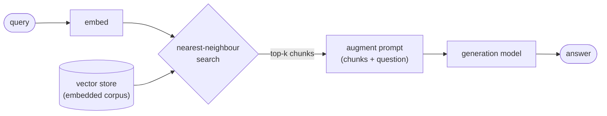
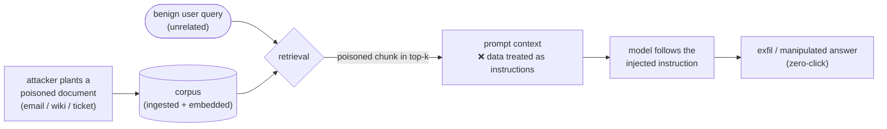

# Module 04 — Retrieval-Augmented Generation

*Type 7 · Build-&-Operate — build a RAG pipeline over a SOC corpus *and* the retrieval eval that proves it works (recall@k on a labelled query set + a regression gate); the deliverable is the working pipeline and its scorecard, not a vibe. (Secondary: Eval Harness.) [Go to the hands-on lab →](lab.md)* &nbsp;·&nbsp; *[Cheat sheet →](cheatsheet.md)*

*Last reviewed: 2026-08*

**AI-Augmented Security Operations** — *a confident answer over the wrong context is the silent failure; measure retrieval, not vibes.*

<!-- module-meta -->
**Difficulty:** Intermediate &nbsp;·&nbsp; **Estimated time:** ~5–7 hrs (study + lab) &nbsp;·&nbsp; **Type:** Build-&-Operate + Eval Harness &nbsp;·&nbsp; **Prerequisites:** [Foundations](../../../00-foundations/README.md)
{ .module-meta }

!!! abstract "In 60 seconds"
    RAG grounds a model in *your* corpus: embed the documents, embed the query, retrieve the closest
    chunks, stuff them into context. The build (nomic-embed → ChromaDB → Ollama) is the easy half.
    The hard half is that **RAG fails at retrieval, not generation, and retrieval failure is silent** —
    the wrong chunks still produce a fluent, confident, wrong answer. So the deliverable is the
    pipeline *plus* a retrieval eval: a labelled query set, **recall@k** and **groundedness**, and a
    regression gate that catches a chunking/embedding change before it tanks recall.

## Why this matters
A base language model knows only what was in its training data — a fixed cutoff, and nothing
proprietary: none of your runbooks, none of your past incident timelines, none of your internal
detection notes. RAG (Retrieval-Augmented Generation) is the standard pattern for grounding a model
in a specific corpus: embed your documents into a vector store, embed the user's query into the same
space, retrieve the semantically closest chunks, and stuff them into the model's context window
alongside the question. Done right, the model answers "What was the containment procedure for last
year's credential incident?" from your actual post-incident report rather than from its training
priors.

But "done right" is the catch, and it is where most RAG builds quietly fail. The generation step is
the visible part — a fluent, confident paragraph — so teams judge the system by whether the answer
*reads* well. The retrieval step underneath is invisible, and it is where the system actually
succeeds or fails. **A RAG that retrieves the wrong chunks will still produce a confident,
well-written, completely wrong answer**, and you will never notice from the prose. This module builds
the RAG *and* the thing that keeps it honest: a retrieval eval — a labelled query set, a recall@k
and groundedness scorecard, and a regression gate — so you measure the layer that breaks instead of
trusting the layer that talks.

## Objective
Build a working RAG pipeline (nomic-embed → ChromaDB → Ollama) over a SOC knowledge base, then build
the retrieval eval that proves it works: a **labelled query set** (queries mapped to known-relevant
doc chunks), a **recall@k / groundedness scorecard**, and a **regression gate** that fails when a
chunking or embedding change drops recall.

## The core idea
The RAG architecture is three independently swappable components. An **embedding model**
(`nomic-embed-text`, a small 137M-parameter model that produces 768-dim vectors and *only*
representations — it generates no language) maps text to points in semantic space, where similar
meaning lands close together by cosine distance. A **vector store** (ChromaDB) holds those vectors
and does the nearest-neighbour search. A **generation model** (served by Ollama) takes the retrieved
chunks plus the question and writes the answer. Swap ChromaDB for Qdrant or `nomic-embed` for
`all-minilm` and the rest of the pipeline is unchanged. That is the build, and it is the easy half.

!!! note "The mental model"
    RAG is three independently swappable parts: an **embedder** maps text to points in semantic space,
    a **vector store** does nearest-neighbour search, a **generation model** writes the answer from
    the retrieved chunks. The talking layer is visible and the retrieval layer underneath is invisible
    — which is exactly why teams grade the prose and miss the failure.

The hard half — and the one load-bearing judgment of this module — is that **RAG fails at retrieval,
not generation, and retrieval failure is silent.** Three failure modes hide under a good-looking
answer. A **retrieval miss**: the relevant document exists but the retrieved chunks don't contain
it — because your chunk size doesn't bracket the passage, the embedding model doesn't represent your
domain vocabulary, or the query is phrased unlike the document. **Context poisoning**: stale or
superseded chunks surface alongside current ones in an uncurated corpus. **Hallucination-on-context**:
the model fabricates a detail that wasn't in the retrieved chunks at all. In every case the
generation step papers over the gap with fluent prose. The reviewer who only reads the answer is
grading the system's *handwriting*, not its *sources*.

!!! warning "The gotcha"
    A RAG that retrieves the *wrong* chunks still produces a confident, well-written, completely wrong
    answer — and you will never notice from the prose. "It answered my demo question" is an anecdote,
    not a measurement. Score retrieval directly (recall@k, groundedness) on a held-out query set, or
    you are grading the system's handwriting instead of its sources.

This is precisely the trap Module 11 names: a non-deterministic system that performs on the handful
of inputs you happened to try is not a measured system — it is one you have an anecdote about. So the
deliverable here is not "a RAG that answered my demo question." It is the RAG **plus** an eval that
measures the retrieval layer directly. Two metrics, borrowed from the RAGAS framing and reimplemented
minimally so the mechanism is legible: **recall@k** — did at least one genuinely-relevant chunk land
in the top-k retrieved? — which catches the retrieval miss the generation never reveals; and
**groundedness** — are the claims in the answer actually supported by the retrieved text? — which
catches hallucination-on-context. The labelled query set is the held-out corpus those metrics run
against; the regression gate is what makes a future "harmless" tweak (a smaller chunk size, a swapped
embedder) prove it didn't quietly tank recall before it merges. Same held-out discipline as Module
11, applied to retrieval: you grade on queries the pipeline was never tuned against, never on the demo
question you already saw it answer.

For a security team, RAG earns its place on read-heavy tasks over a stable corpus — querying past
incident summaries, surfacing runbook steps, finding precedent for a detection rule. It is the wrong
tool for real-time data (threat feeds, current CVEs); that's a tool call, not a retrieval (Module 05).
The two combine in the SoC copilot of Module 06 — and that copilot is only trustworthy if its
retrieval is *measured*, which is the harness you build here generalised one module up.

!!! tip "AI caveat"
    A model writes the chunk-split-embed-store loop and the recall@k arithmetic well. What it gets
    wrong: the **chunking judgment** (does a chunk bracket a whole procedure step for *your* document
    lengths?), the **labels** (it may *propose* candidate queries, but you confirm which chunk is
    genuinely relevant against the source — a model labelling its own query set is contamination), and
    the **gate direction** (it must fail *closed* — an errored or missing metric fails the build).

### The attack surface — a retrieved document *is* an instruction channel (EchoLeak, CVE-2025-32711)

Everything above assumes the corpus is trusted. It usually isn't. RAG's defining move — take text the
model didn't write and paste it into the context window — is also its defining vulnerability: **a
retrieved chunk is untrusted input the model treats as if you said it.** If an attacker can land a
document in the corpus (a shared mailbox, a wiki anyone can edit, a ticket the pipeline auto-ingests),
they can plant *instructions* that ride into the prompt on the next query that happens to retrieve
them. That is **indirect prompt injection**, and it is the same class of bug as SQL injection — data
crossing into the instruction channel — not a content-moderation problem you can prompt your way out of.

[CVE-2025-32711 — "EchoLeak"](https://nvd.nist.gov/vuln/detail/CVE-2025-32711) is the canonical case.
A single crafted email, never opened by the victim, sat in the Microsoft 365 mailbox that Copilot's
RAG retrieved from. When the user later asked Copilot an unrelated question, retrieval pulled the
attacker's email into context; its embedded instructions steered the model to gather sensitive data
and exfiltrate it through an auto-loaded image URL — a **zero-click** data leak, no user interaction.
The system prompt that said "only answer from the provided context" was structurally unable to help:
the poisoned text *is* the context.

Module 09 attacks this pipeline in depth. The point here is narrower, and it changes what your eval is
*for*: the retrieval scorecard is also a **poisoning regression test**. The query that should *never*
surface the planted document is just another held-out case — and the day it does, the same gate that
catches a chunking regression catches the injection.

## Go deeper (~3 hrs · optional)

*The core idea above teaches the RAG pipeline and the retrieve-not-generate failure model — you can
build the lab from it alone. These links are for **going deeper** and working from the **primary
sources**: the tool docs, the chunking intuition, and the eval vocabulary.*

**How RAG works (~1.5 hrs)**
- [LlamaIndex — "What is RAG?" / High-Level Concepts](https://developers.llamaindex.ai/python/framework/getting_started/concepts/) `[depth]` — the cleanest conceptual walkthrough of retrieval → augmentation → generation in sequence; read the "Key concepts" section before the lab.
- [ChromaDB documentation — Getting started](https://docs.trychroma.com/docs/overview/getting-started) `[depth]` — the vector store you'll use; skim the collection / add / query examples so the ingest and query scripts read as familiar, not magic.

**Chunking and retrieval quality (~1 hr)**
- [Greg Kamradt, "5 Levels of Text Splitting" (YouTube, ~25 min)](https://www.youtube.com/watch?v=8OJC21T2SL4) `[depth]` — the most practical treatment of chunking; watch for the intuition on how chunk size trades retrieval precision against recall, which is exactly the dial your eval will measure.
- [Jerry Liu, "Building Production-Ready RAG Applications" (YouTube, ~45 min)](https://www.youtube.com/watch?v=TRjq7t2Ms5I) `[depth]` — covers the real failure modes (retrieval miss, hallucination-on-context) with production examples; the case for evaluating retrieval rather than eyeballing answers.

**Measuring retrieval, not vibes (~30 min)**
- [RAGAS docs — "Metrics" overview](https://docs.ragas.io/en/stable/concepts/metrics/) `[depth]` — the standard vocabulary for RAG eval: **context precision / context recall** (retrieval quality) and **faithfulness / groundedness** (is the answer supported by the retrieved context?). Read the metric definitions; you reimplement a minimal recall@k and groundedness in the lab so the arithmetic is legible.
- [Module 11 — AI Evaluation & Observability](../11-ai-evaluation/README.md) — the shared held-out-set + scorecard + regression-gate harness this module's retrieval eval plugs into. Read its "The core idea" if you skipped ahead; this module is its RAG-shaped instance.

## Key concepts
- RAG = embed corpus → embed query → retrieve top-k chunks → generate from them; three swappable parts (embedder / vector store / generation model).
- The failure is at **retrieval**, and it's **silent**: a retrieval miss still yields a fluent, confident, wrong answer. Reading the prose grades handwriting, not sources.
- **recall@k**: did a genuinely-relevant chunk land in the top-k? Catches the retrieval miss generation hides.
- **groundedness**: are the answer's claims supported by the retrieved text? Catches hallucination-on-context.
- **Held-out labelled query set**: queries → known-relevant chunks, never tuned against — the only honest grade of the next query.
- **Regression gate**: a chunking/embedding change that drops recall fails the build, before it merges.

## AI acceleration
A model writes the mechanical halves of both the RAG and the eval well — the ChromaDB
chunk-split-embed-store loop, the query plumbing, the recall@k and groundedness arithmetic, the
scorecard table. **What you must own is what a model will quietly get wrong.** On the build: the
chunking judgment (is the split size right for *your* document lengths, and does a chunk bracket a
whole procedure step?) and where the retrieved context sits in the prompt. On the eval, three things:
(1) the **labels** — a model labelling its own query set is the contamination Module 11 warns about,
so it may *generate* candidate queries but you confirm which chunk is genuinely relevant against the
source document; (2) the **metric direction and gate** — it must **fail closed** (a missing metric or
an errored eval fails the build, never silently passes); and (3) the **held-out wall** — a model will
happily score against the demo question, and the whole point is grading queries the pipeline never
saw. The model writes the loops; you own the labels, the metric, and the gate.

!!! question "Check yourself"
    - Why is retrieval the silent failure mode, and what does reading only the answer actually grade?
    - What does **recall@k** measure, and what distinct failure does **groundedness** catch that recall@k misses?
    - When is RAG the *wrong* tool — and what do you reach for instead?
