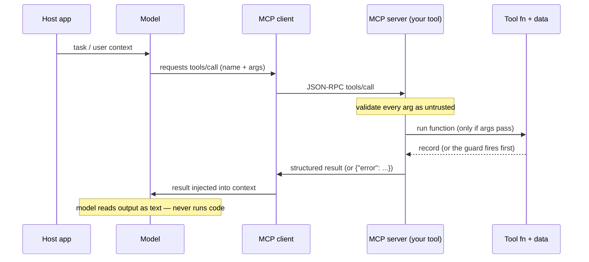
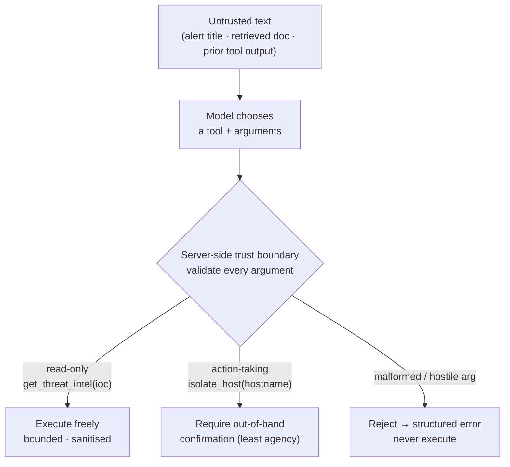

# Module 05 — Building MCP Servers

*Type 9 · Tool-Build — ship a reusable MCP server others can run (flags, README, tests) and prove it rejects a hostile argument, because every argument an LLM passes is untrusted input; the deliverable is the packaged, tested tool. (Secondary: Build-&-Operate — you stand it up and run a real client against it.) [Go to the hands-on lab →](lab.md)* &nbsp;·&nbsp; *[Cheat sheet →](cheatsheet.md)*

*Last reviewed: 2026-08*

**AI-Augmented Security Operations** — *MCP is the USB port for AI tools: write the tool once, and any compliant client can call it. Which means: whatever you expose, you've handed an LLM a button — so every argument is untrusted input.*

<!-- module-meta -->
**Difficulty:** Intermediate &nbsp;·&nbsp; **Estimated time:** ~3.5–5.5 hrs (study + lab) &nbsp;·&nbsp; **Prerequisites:** [Foundations](../../../00-foundations/README.md), [Module 04 — RAG](../04-rag/README.md)
{ .module-meta }

!!! abstract "In 60 seconds"
    MCP is the open protocol that lets an AI agent call tools you expose — write a Python function,
    decorate it with `@mcp.tool()`, and any compliant client can call it. The flip side is the whole
    module: **the moment you expose a tool you've handed a non-deterministic model a button, with
    arguments it chooses** — and those arguments can be steered by text the model read from an
    untrusted source. So the tool is a **trust boundary** with three explicit contracts (schema,
    validation, structured errors), and the deliverable is the packaged server *plus* tests that prove
    it rejects a hostile argument instead of executing it.

## Why this matters
A language model alone can reason, but it cannot act — it cannot query a live threat feed, search
an alert database, or look up an incident ticket. The Model Context Protocol (MCP) is the open
standard that fixes this: it defines a clean JSON-RPC interface by which an AI agent (the MCP
*client*) calls tools exposed by an MCP *server*. Write a tool as a Python function, expose it via
`fastmcp`, and any MCP-compatible client — a frontier model, a local Ollama agent, an n8n AI node —
can discover and call it at inference time.

That is the upside. The flip side is the whole point of this module: **the moment you expose a tool,
you have given a non-deterministic model a button it can press, with arguments it chooses.** Your
tool is no longer called by code you wrote and reviewed; it is called by whatever the model decided,
which can itself be steered by text the model read from an untrusted source (an alert title, a
retrieved document, a tool result). So the tool you build here is not a script — it is a
**reusable component with a security contract**: a typed schema, validated inputs, and bounded,
structured errors. Build it that way and module 06 can wire it into a copilot with confidence;
build it loosely and you have shipped an attack surface.

## Objective
Build, package, and **test** an MCP server exposing security-relevant tools as reusable,
schema-validated components — with a test suite that proves each tool returns correct results on
good input *and rejects a malformed or hostile argument instead of executing it*. The deliverable
is the packaged server plus its correctness/validation tests.

## The core idea

**MCP is a thin protocol, and the tool is the product.** At its core the client sends a
`tools/call` JSON-RPC request with a tool name and arguments; the server executes the function and
returns a structured result; the client injects that result into the model's context for the next
generation step. The model never executes code directly — it *requests*, the server *runs*, the
model *reads the output as text*. `fastmcp` collapses the boilerplate: decorate a function with
`@mcp.tool()`, and it generates the JSON-RPC plumbing, the transport, and — crucially — the **tool
schema, derived from your function's type annotations and docstring** (`ioc: str` becomes a required
string parameter the model sees in the manifest). Code and schema can't drift because they're the
same source. (Recent MCP revisions lift `inputSchema`/`outputSchema` to full JSON Schema 2020-12, so
the contract you can express is richer than "a flat bag of strings.")

!!! note "The mental model"
    The model never executes code — it *requests*, the server *runs*, the model *reads the output as
    text*. Because `fastmcp` derives the schema from your type annotations and docstring, code and
    schema can't drift. So the tool description is API docs for a caller who has never seen your code
    (because it hasn't): a precise description yields precise calls; a vague one yields vague calls.

**Treating a tool as a build means three contracts have to be explicit, not incidental.** *Schema:*
the parameter types and the docstring are what the model reads to decide how to call you — a vague
description (`search(query: str)`) yields vague calls; a precise one
(`search_alerts(query: str) — case-insensitive substring search across alert titles, hosts, and IOC
fields; returns up to 10 matches`) yields precise ones. Write tool descriptions like API docs for an
engineer who has never seen your code — because the model hasn't. *Validation:* every argument is
**untrusted input from a non-deterministic caller**. *Errors:* a tool must fail as a structured
result (`{"error": "..."}`), never as an unhandled exception that crashes the server mid-session or
leaks a stack trace into the model's context.

!!! warning "The gotcha"
    Every argument is **untrusted input from a non-deterministic, injectable caller** — not from code
    you reviewed. The server, not the model, owns access control, bounds, and sanitisation. And the
    *kind* of tool matters: a read-only `get_threat_intel(ioc)` can be called freely; an
    action-taking `isolate_host(hostname)` is irreversible and must require out-of-band confirmation.
    The model has no inherent sense of that difference — you encode it.

**The load-bearing judgment: a tool is a trust boundary, so validate every argument as hostile.**
This is not the abstract caution it sounds like. In April 2025, [Invariant Labs disclosed *tool
poisoning attacks*](https://invariantlabs.ai/blog/mcp-security-notification-tool-poisoning-attacks):
because the model reads tool descriptions *and arguments* as part of its context, an attacker who
controls either can steer the model — and arguments flowing into a tool can carry instructions or
injection payloads exactly the way SQL injection carries them into a query. OWASP made this its own
category — [**MCP03:2025 · Tool Poisoning**](https://owasp.org/www-project-mcp-top-10/2025/MCP03-2025%E2%80%93Tool-Poisoning).
The deeper failure that injection *reaches* is **the confused deputy**: the model, steered by that
untrusted text, invokes a tool it holds *legitimate* authority to call — but on the attacker's behalf.
That is [OWASP LLM Top-10's **LLM06:2025 · Excessive Agency**](https://genai.owasp.org/llmrisk/llm062025-excessive-agency/)
at the tool layer — the blast radius is bounded not by what the model *should* do but by what the tool
*lets* it do, so an **over-broadly scoped** tool (one that can delete, isolate, or exfiltrate) is what
converts an injection into an irreversible action. So the server, not the model, owns access control,
rate limiting, length bounds, and input sanitisation. And the *kind* of tool matters: a read-only
`get_threat_intel(ioc)` can be called freely; an action-taking `isolate_host(hostname)` is irreversible
and should require an out-of-band confirmation step. The model has no inherent sense of that
difference — **what gets a tool, and what that tool is allowed to do, is a security-architecture
decision you make and encode.** The test suite you write in the lab is how you prove you made it.

> **Connects forward — your tool is an attack surface.** Module 09 (*Securing the AI You Run*)
> red-teams the copilot you'll assemble in module 06, and the MCP server you build here is one of its
> three attack layers: a hostile `ioc` or `query` argument can inject into the model's context, and a
> loosely scoped action tool can be abused. The validation tests you write now are the regression
> suite that proves those attacks stay blocked.

!!! tip "AI caveat"
    A model drafts `fastmcp`/JSON-RPC tool bodies well — but you own the **contract and the tests**.
    Review the input validation, the error handling (does a missing data file return a dict, or a
    stack trace into the model's context?), and the descriptions. Then have it draft the test suite
    *including the hostile-argument cases* and check every assertion: a test that "passes" because it
    never exercised the rejection path is worse than no test.

## Go deeper (~2.5 hrs · optional)

*The core idea above teaches the protocol, the three contracts, and the trust boundary — you can
build and test the server from it alone. These links are for **going deeper** and working from the
**primary sources**: the spec you implement, the tool-design guidance, and the real disclosures behind
the case-study seam.*

**The protocol and the library (~1 hr)** *(`[depth]` — "The core idea" already teaches the contract; read for the source vocabulary and the exact schema fields)*
- [Model Context Protocol — *Tools* (specification, 2025-06-18)](https://modelcontextprotocol.io/specification/2025-06-18/server/tools) — the authoritative description of the tool contract: `tools/list` → `tools/call` → result, and the `inputSchema`/`outputSchema` (now full JSON Schema 2020-12). Read this section, not the whole spec — it's the part your code implements.
- [fastmcp documentation — *Quickstart* and *Tools*](https://gofastmcp.com/getting-started/welcome) — the library you'll use; focus on how the schema is derived from type annotations and how to declare and validate parameters. ~20 min.

**Designing the tool as a component (~45 min)**
- [Anthropic, *Building effective agents*](https://www.anthropic.com/engineering/building-effective-agents) — the clearest framing of when a tool earns its place vs. when RAG or neither is right; the "augmented LLM" pattern is exactly what this module ships. Read the "tools" and "augmented LLM" sections (~25 min).
- [Anthropic, *Writing effective tools for agents — with agents*](https://www.anthropic.com/engineering/writing-tools-for-agents) — practical guidance on naming, descriptions, error messages, and token-efficient outputs — i.e. the schema/error contract this module makes you own.

**Why the argument is untrusted (~45 min) — the case-study seam**
- [Invariant Labs, *MCP Security Notification: Tool Poisoning Attacks* (2025-04-01)](https://invariantlabs.ai/blog/mcp-security-notification-tool-poisoning-attacks) — the disclosure that made "the tool description and arguments are part of the model's context" concrete; demonstrated SSH-key/secret exfil through innocent-looking tools. Read before you write your validation.
- [OWASP MCP Top 10 — *MCP03:2025 Tool Poisoning*](https://owasp.org/www-project-mcp-top-10/2025/MCP03-2025%E2%80%93Tool-Poisoning) — the checklist version of the same risk; map each mitigation to a test you'll write.
- [OWASP Top 10 for LLM Applications — *LLM06:2025 Excessive Agency*](https://genai.owasp.org/llmrisk/llm062025-excessive-agency/) — the confused-deputy half of the seam: least-privilege tool scope and human-in-the-loop for action tools. Read the mitigation checklist; it's why an over-broadly scoped tool turns an injection into an irreversible action. ~15 min.
- [Simon Willison, *Model Context Protocol has prompt injection security problems* (2025-04-09)](https://simonwillison.net/2025/Apr/9/mcp-prompt-injection/) — short, sharp framing of why MCP servers are injection targets; the practitioner translation of the sources above.

## Key concepts
- MCP is a JSON-RPC protocol: `tools/list` → `tools/call` → result; the model requests, the server runs.
- `fastmcp` derives the schema from type annotations + docstring — code and schema can't drift.
- A tool is a **reusable component with three contracts**: schema (model-readable), validation (every arg untrusted), errors (structured, never an unhandled exception).
- Tool description quality directly drives tool-call quality — write it like API docs.
- A tool is a **trust boundary**: validation, bounds, and access control live in the server, not the model.
- Tool trust hierarchy: read-only (free) vs. action-taking (irreversible → require confirmation).
- A malformed/hostile argument must be **rejected, not executed** — and a test must prove it (forward to module 09).

## AI acceleration
Have a model draft the tool function bodies — it knows Python and the `fastmcp`/JSON-RPC patterns
well. Your ownership is the **contract and the tests**: review the input validation (does the tool
bound and sanitise `ioc` before using it?), the error handling (what does it return if the data file
is missing — a dict, or a stack trace into the model's context?), and the tool descriptions (precise
enough for a model to call correctly?). Then have the model help draft the *test suite* — including
the hostile-argument cases — and review every assertion: a test that "passes" because it never
actually exercised the rejection path is worse than no test. **The model writes the function; you own
the security boundary, and the tests are how you prove you own it.**

!!! question "Check yourself"
    - Why is every argument an MCP tool receives untrusted input, even when the calling model is "yours"?
    - Name the three contracts a tool must make explicit, and what each one protects against.
    - Why should `get_threat_intel(ioc)` and `isolate_host(hostname)` be treated differently — and where does that decision get enforced?
