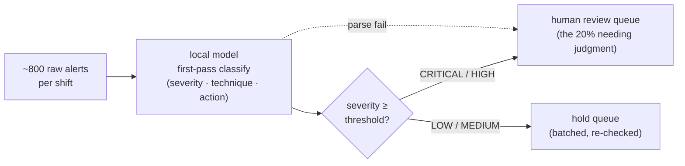
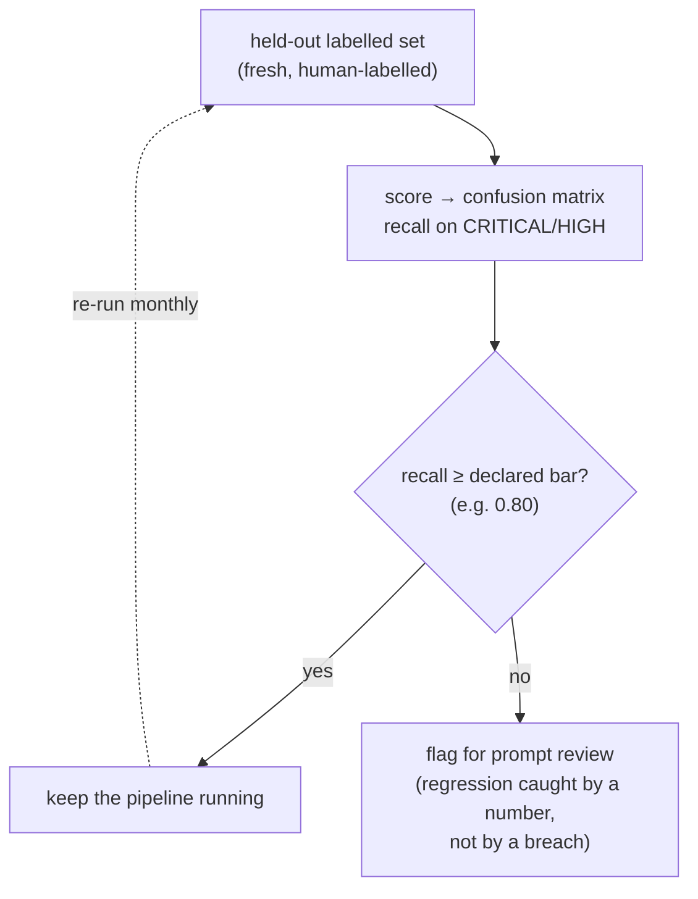

# Module 07 — AI-Assisted Detection & Triage

*Type 13 · Eval Harness — score an AI triage model against a ground-truth label set (confusion matrix, precision/recall) and gate it at a threshold; the deliverable is the labelled corpus + scorecard + a re-eval cadence. (Secondary: Build-&-Operate.) [Go to the hands-on lab →](lab.md)* &nbsp;·&nbsp; *[Cheat sheet →](cheatsheet.md)*

*Last reviewed: 2026-08*

**AI-Augmented Security Operations** — *the model doesn't replace the analyst; it handles the repetitive 80% so the analyst focuses on the 20% that matters — and you only trust it as far as you have measured it.*

<!-- module-meta -->
**Difficulty:** Intermediate &nbsp;·&nbsp; **Estimated time:** ~3–5 hrs (study + lab) &nbsp;·&nbsp; **Type:** Eval Harness &nbsp;·&nbsp; **Prerequisites:** [Foundations](../../../00-foundations/README.md)
{ .module-meta }

!!! abstract "In 60 seconds"
    A local model does first-pass alert triage — severity, technique, recommended action — to compress
    the queue so analysts spend judgment on the 20% that needs it. But "right enough" is a *measured*
    claim or a wish: a model that quietly starts marking criticals "all clear" hides the one alert that
    mattered. So you score classifications against a **held-out** label file into a **confusion
    matrix**, and the load-bearing metric is **recall on the critical class** (not accuracy), re-run on
    a cadence so a regression is caught by a number rather than by a breach.

## Why this matters

A modern SOC generates hundreds to thousands of alerts per shift. The majority are low-confidence,
familiar-pattern events that a skilled analyst evaluates in seconds — but seconds times thousands
adds up to hours of queue-draining toil before anything requiring genuine judgment gets touched.
A local model performing first-pass classification — severity, technique, recommended action — can
compress that queue by routing the clearly-low events to a holding queue and escalating the
high-confidence critical signals immediately. The model doesn't need to be right 100% of the time;
it needs to be right enough to be a useful filter, with a human reviewing anything it flags.

But "right enough" is a *measured* claim or it is a wish. A triage model that quietly starts
marking criticals as "all clear" buries the one alert that mattered under a green dashboard — and
nothing tells you, because you never had a number to watch. This module's whole point is to make the
claim measurable: classify against a ground-truth label file, score it into a confusion matrix, and
re-run that scorecard on a schedule so a regression is caught by a number rather than by a breach.

## Objective
Build a batch alert triage classifier that labels 50 alerts with a local model, scores the
classifications against a **held-out ground-truth label file** into a **confusion matrix** (precision,
recall, false-negative rate per severity class), and re-runs that scorecard on a threshold so a drop
below the bar is caught deliberately.

## The core idea

This is an **Eval Harness** (Type 13) module — and the distributed exemplar of it for this track.
The construct is the same one [Module 11 (AI Evaluation & Observability)](../11-ai-evaluation/README.md)
generalizes into a reusable harness, and the same one [04 (RAG)](../04-rag/README.md) and
[06 (SoC Copilot)](../06-soc-copilot/README.md) borrow: **a held-out labelled set + a scorecard + a
threshold/regression gate.** Build it here, in the small, against the most legible AI security task —
classification — and you have the shape every other AI system in the track plugs into.

Alert triage is fundamentally a classification problem: given an alert's text, assign it a severity
(CRITICAL/HIGH/MEDIUM/LOW) and recommend an immediate action. Classification is the task category
where few-shot prompting (Module 03's Pattern 5) is most reliable for local models — the model
pattern-matches against examples rather than reasoning from first principles. The key design
decision in a triage pipeline isn't "which model" — it's "what does failure look like and is it
acceptable?" And the only honest way to answer that is to **measure it against labels the prompt was
never tuned on.** The five demo alerts the model classifies cleanly are the same five you tuned
against; a demo is a memorised exam. The number that means anything is the score on the *held-out*
set — the same train/dev/test wall Module 11 makes explicit.

!!! note "The mental model"
    Triage is a classification problem — the most legible AI security task, and the distributed
    exemplar of the **eval-harness** shape (held-out set + scorecard + threshold gate) that Modules
    04, 06, and 11 all reuse. Build it here in the small and you have the shape every other AI system
    in the track plugs into.

**Why local for the first pass —** the three review tiers trade cost against depth, and the routing
(Module 01) sends the bulk pattern-match work to the cheapest tier:

| Tier | Cost / latency | Data boundary | Best for | Failure cost |
|---|---|---|---|---|
| **Local model** (triage) | Cheap, fast, batchable | Stays on internal logs | High-volume first-pass classification of the familiar 80% | A miss is caught by the held-out recall number |
| **Frontier model** | Billed per call, latency spikes | Every call leaves the perimeter | The hard, scrubbed, cross-domain minority | Same accountability (*Moffatt*), plus data-residency exposure |
| **Human analyst** | Expensive, scarce, the bottleneck | Trusted | The escalated 20% and every irreversible call | The point of the whole pipeline is to spend it only where it counts |

**The metric is a judgment, and accuracy is the wrong one.** In a SOC the classes are imbalanced and
the costs are asymmetric, so a single accuracy number hides the failure that matters. A false
negative (model classifies a CRITICAL alert as MEDIUM) has a very different cost than a false
positive (model classifies a MEDIUM alert as HIGH): a missed critical can cost a breach, while a
false alarm costs an analyst a few minutes. That FP-economics asymmetry is why the load-bearing
metric here is **recall on the malicious/critical class** and its complement the **false-negative
rate** — not accuracy — and why calibrating the prompt to bias toward over-classification (when
uncertain, output HIGH rather than MEDIUM) is the right choice for security triage, unlike most
classification tasks where class balance matters. The confusion matrix is what lets you *see* the
recall/false-positive tradeoff and pick the knee deliberately instead of by feel.

!!! warning "The gotcha"
    A single **accuracy** number hides the failure that matters: in a SOC the classes are imbalanced
    and the costs are asymmetric. A missed critical (CRITICAL scored MEDIUM) can cost a breach; a
    false alarm costs an analyst minutes. So the metric is **recall on the critical class** and its
    complement the false-negative rate — and biasing the prompt toward *over*-classification is the
    right call, the opposite of most classification tasks.

!!! danger "The overreliance trap — automation bias (OWASP LLM09)"
    The failure isn't only the model's — it's the analyst's. Once a triage queue has been right for a
    hundred shifts, a confidently-worded "MEDIUM — likely benign" on the one alert that actually
    mattered gets trusted *because the pipeline is usually right*. That's **automation bias**, and it
    is the canonical [OWASP LLM09 (Overreliance)](https://owasp.org/www-project-top-10-for-large-language-model-applications/)
    scenario: the model's fluent under-classification de-prioritizes a real intrusion, and the human
    who should have caught it defers to the machine. The recall-on-critical number and the
    parse-or-flag rail exist to make that de-prioritization *visible* by a number, instead of silent
    under a green dashboard.

The output format discipline from Module 03 is non-negotiable here: the triage script parses the
model's output, and a malformed response must be handled explicitly rather than propagated to the
analyst queue as garbage. The right failure mode is "parsing failed → flag this alert for direct
human review → log the raw model output for debugging." A pipeline that silently drops alerts or
logs errors to /dev/null is more dangerous than no pipeline at all.

??? note "Background: why triage is batch, not real-time"
    Throughput makes this concrete. If a shift generates 800 alerts and the model processes 5/min on
    the available hardware, the pipeline takes 160 minutes — longer than a shift. The architectural
    response is batching: run the model on the previous hour's alerts at the start of each hour, so
    the analyst arrives at a pre-classified queue rather than a raw feed. The pipeline isn't
    real-time; it's background batch processing, which changes what "acceptable latency" means.

**Quality control means tracking accuracy over time, not just at initial validation — this is the
regression gate, run on a schedule.**

Models don't drift (fixed weights), but alert distributions
do: new attack techniques, new tooling, changed environment topology all produce alert patterns the
model hasn't seen in its few-shot examples. So you re-score the held-out scorecard monthly against
fresh human-labelled alerts and flag the model for prompt review the moment recall drops below the
declared threshold (e.g. 80%). That monthly re-eval *is* the offline version of Module 11's CI
regression gate: a number that must hold, checked on a cadence, so a degradation is caught by the
scorecard instead of by an analyst missing the one alert that mattered.

!!! tip "AI caveat"
    A model writes the parsing and confusion-matrix code well. What it gets quietly wrong: it
    **defaults to accuracy** (you override to recall-on-critical and justify it), it will **score
    against the labels you tuned on** (you enforce the held-out wall), it leaves the **parse-failure
    path** implicit (a failed parse gets flagged for human review, never silently dropped), and it
    won't bias the prompt toward HIGH on uncertainty unless you tell it to. You own the failure
    semantics and the gating number.

## Go deeper (~2 hrs · optional)

*The core idea above teaches the eval-harness shape and the recall-vs-accuracy judgment — you can
build the lab from it alone. These links are for **going deeper** and working from the **primary
sources**: the overreliance risk you must cite, the precise metric definitions, and the batching
pattern. Not for relearning what's above.*

**Structured output & the overreliance risk (~45 min) — the case-study seam**
- Review Module 03 — Pattern 4 (Structured Output Alert Triage) before starting the lab.
- [OWASP Top 10 for LLM — LLM09 (Overreliance)](https://owasp.org/www-project-top-10-for-large-language-model-applications/) — the triage pipeline is the canonical overreliance / automation-bias scenario; read the description and mitigations before implementing automated actions on model output. You cite this by ID in the deliverable.

**Evaluation methodology (~45 min)** *(`[depth]` — the metric section above already teaches recall-vs-accuracy; read for the precise definitions)*
- [Google, "Classification: Accuracy, recall, precision, and related metrics" (ML Crash Course)](https://developers.google.com/machine-learning/crash-course/classification/accuracy-precision-recall) `[depth]` — the precise definitions of precision/recall/F1 and *why accuracy misleads on imbalanced classes*; short and visual, this is the vocabulary your confusion matrix prints.
- [Google, "Thresholding and the confusion matrix" (ML Crash Course)](https://developers.google.com/machine-learning/crash-course/classification/thresholding) `[depth]` — how moving the decision threshold trades recall against false positives; this is the curve you tune in the lab.

**Automation patterns (~30 min)** *(`[depth]`)*
- [Python `concurrent.futures` documentation](https://docs.python.org/3/library/concurrent.futures.html) `[depth]` — `ThreadPoolExecutor` is how you batch multiple Ollama requests concurrently; read the basic example to understand the map pattern.

## Key concepts
- This is the per-system **Eval Harness** (Type 13) that Module 11 generalizes and that 04/06 borrow: held-out labelled set + scorecard + threshold gate.
- Held-out set vs. demo/tuning set: score on the labels you tuned against and every number lies.
- Metric choice is a judgment: recall + false-negative rate for security triage, not accuracy — accuracy hides the rare-but-costly miss.
- FP-economics asymmetry: a missed critical can cost a breach; a false alarm costs minutes — so bias toward over-classification.
- Output format discipline: parse-or-flag, never silently drop.
- The monthly re-eval is the regression gate run on a cadence: a recall drop below threshold flags the model before an analyst does.

## AI acceleration
Have a model help write the parsing and confusion-matrix computation code — it's boilerplate and a
model writes it well. **What you must own is everything a model will quietly get wrong here:** the
choice of metric (a model defaults to accuracy — you override it to recall-on-critical and justify
it), the held-out discipline (a model will happily score against the same labels you tuned on; you
enforce the wall), the failure-handling logic (an alert where parsing fails gets flagged for human
review, not silently dropped), and the bias direction in the prompt (does it err toward HIGH on
uncertainty?). The model writes the plumbing; you own the failure semantics and the number that
gates the system.

!!! question "Check yourself"
    - Why does a single accuracy number lie for SOC triage, and which metric replaces it?
    - The model classifies all five demo alerts correctly. Why is that not evidence it's ready to route real alerts?
    - When the triage script can't parse a model response, what must happen — and what is the dangerous thing teams do instead?
