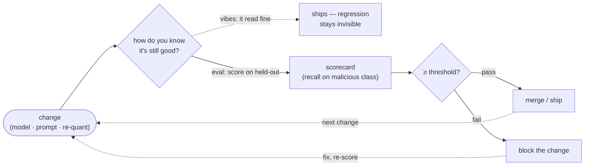
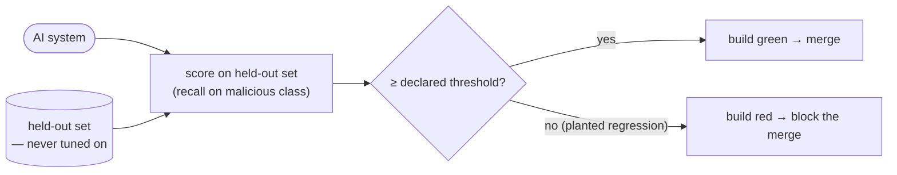

# Module 11 — AI Evaluation & Observability

*Type 13 · Eval Harness — build a held-out eval set, a scorecard, and a CI regression gate that goes red when a change silently degrades the system; the deliverable is the reusable eval harness, not a one-off accuracy number. [Go to the hands-on lab →](lab.md)* &nbsp;·&nbsp; *[Cheat sheet →](cheatsheet.md)*

*Last reviewed: 2026-08*

**AI-Augmented Security Operations** — *eval gates, not vibes: you cannot trust — or improve — what you do not measure.*

<!-- module-meta -->
**Difficulty:** Advanced &nbsp;·&nbsp; **Estimated time:** ~4–6 hrs (study + lab) &nbsp;·&nbsp; **Type:** Eval Harness &nbsp;·&nbsp; **Prerequisites:** [04 — RAG](../04-rag/README.md), [07 — AI Detection & Triage](../07-ai-detection-triage/README.md)
{ .module-meta }

!!! abstract "In 60 seconds"
    This is the measurement layer the rest of the track plugs into. A non-deterministic system that
    performs on the handful of inputs you tried is not measured — it's an *anecdote*, and a demo set
    actively lies because it's the same data you tuned on. The discipline: a **held-out** test set,
    a metric chosen on purpose (**recall on the malicious class**, not accuracy), a **scorecard**, and
    a **CI regression gate** that goes red when a planted regression degrades the score. Modules 04,
    06, and 07 each plug into it. An AI system without an eval is a liability with good demo luck.

## Why this matters
Every AI system you built earlier in this track works in the demo. The triage classifier in
Module 07 labelled the five sample alerts; the RAG in Module 04 answered the question you typed at
it; the SoC copilot in Module 06 wrote a plausible summary. They *looked* good — and that is exactly
the problem. A non-deterministic system that performs on the handful of inputs you happened to try is
not a measured system; it is a system you have an *anecdote* about. The day it silently regresses —
a model upgrade, a re-quantisation, a prompt edit, a changed alert distribution — nothing tells you,
because you never had a number to watch. In a SOC the failure is not abstract: a triage model that
quietly starts marking criticals as "all clear" buries the one alert that mattered under a green
dashboard. This module is the discipline the rest of the track plugs into — the held-out test set,
the metric, the scorecard, and the regression gate that turns "it seems fine" into "here is the
number, and CI will fail the day it drops."

## Objective
Build an eval harness for an AI security system: assemble a **labelled, held-out** corpus, choose and
justify a metric, score the system against it into a **scorecard**, and wire a **CI regression gate**
that fails the build when a planted regression degrades the score.

## The core idea

> **Your RAG and your triage classifier look great in the demo. Are they actually *good*? Prove it.**
> Before reading on, write down how you would convince a skeptical teammate — with evidence, not
> adjectives — that your Module 07 triage model is good enough to route real alerts unattended.

If your honest answer is "it got the demo alerts right" or "the outputs read well," you have just
named the trap. **You cannot prove it — not without a held-out eval — and the demo set actively
lies to you.** The five alerts you watched it classify are the same five you tuned the prompt
against; of course it gets them right. A demo is a memorised exam. The reveal of this module is that
the move which makes an AI system trustworthy is not a better prompt or a bigger model — it is
*measurement against data the system has never been tuned on*, reported as a number, gated in CI.

**Three postures, one honest one.** The difference between *trusting* a system and *measuring* it:

| Posture | What it checks | Catches a silent regression? | Failure mode |
|---|---|---|---|
| **Vibes-check** | "the outputs read well" on the inputs you tried | **No** — same data you tuned on | ships confident-but-wrong (the *Moffatt* failure) |
| **Held-out eval** | a metric on data the system never saw | Only the moment you re-run it | a good number that quietly goes stale between runs |
| **Regression gate** | that held-out metric, in CI, on every change | **Yes** — a red build blocks the merge | none, as long as it fails *closed* |

That bottom-left cell is the case-study seam: it is *[Moffatt v. Air Canada](../01-hybrid-ai-pattern/README.md)*
(module 01) one layer down — a confidently-wrong output that shipped because **nothing measured it**. A
silent model/prompt regression is the same failure with no courtroom to catch it: a model upgrade, a
re-quantisation, or a one-line prompt edit quietly degrades quality, the outputs still *read* fine, and
absent a held-out eval you learn about it from an incident, not a dashboard. The eval is the control that
makes "you own the output" actually enforceable — it fails the build *before* the bad change ships.

!!! note "The mental model"
    A demo is a memorised exam: the inputs you watched it ace are the same ones you tuned against, so
    "it got the demo right" is no evidence at all. The only honest estimate of behaviour on the *next*
    input is a score on a held-out set the system has never touched — the standard train/dev/test wall
    from ML, applied to a prompt-driven system that was never gradient-trained. The discipline
    transfers intact.

**Held-out set vs. demo/tuning set.** The single most important line in eval is the wall between the
data you tune on and the data you grade on. You tune the prompt, pick the few-shot examples, and pick
the threshold against a *tuning* set; you report the score against a *held-out* set the system has
never touched. Score on the tuning set and every number is inflated by the same memorisation that
makes the demo lie — you are grading the open-book answers. Held-out evaluation is the only honest
estimate of how the system behaves on the next alert it has never seen. (This is the standard
train/dev/test split from machine learning, applied to a prompt-driven system that was never
"trained" in the gradient sense — the discipline transfers intact.)

**Metric choice, and *why*.** A scorecard is only as honest as its metric, and accuracy is usually
the wrong one. In a SOC the classes are wildly imbalanced and the costs are asymmetric, so a single
number hides the failure that matters. The vocabulary you need is the confusion matrix — true/false
positives and negatives — and the three ratios built from it: **precision** (of the alerts you
called malicious, how many were?), **recall** (of the truly malicious alerts, how many did you
catch?), and **F1** (their harmonic mean). For security triage the load-bearing metric is **recall
on the malicious class** and the **false-negative rate** that is its complement: a missed critical
(a false "all clear") can cost a breach, while a false positive costs an analyst a few minutes. A
model that is 95% *accurate* by ignoring the rare attacks is worthless; a model with 99% recall on
malicious and a tolerable false-positive rate is gold. You will also watch the **false-positive
rate** as the cost you pay for that recall — push recall up and you flood the queue; the eval is what
lets you find the knee of that curve deliberately instead of by feel. For RAG the analog is
**retrieval@k** (did the relevant document land in the top-k retrieved chunks?) and **groundedness**
(is the answer supported by what was retrieved, or hallucinated?) — because a RAG that retrieves the
wrong context answers confidently and wrongly, and a generation metric alone never sees the bad
retrieval underneath.

!!! warning "The gotcha"
    Accuracy is usually the wrong metric: in a SOC the classes are imbalanced and the costs are
    asymmetric, so a model that's 95% *accurate* by ignoring the rare attacks is worthless. The
    load-bearing number is **recall on the malicious class** and its complement the false-negative
    rate — a missed critical can cost a breach; a false positive costs an analyst minutes.

**Coverage ≠ effectiveness.** A 500-item test set is not better than a 30-item one if all 500 are
easy. Coverage — how *much* you test — is not the same as effectiveness — whether you test the cases
that *break* the system. A held-out set earns its keep by including the hard, adversarial, and
near-miss cases: the benign event that looks malicious, the novel technique phrased unusually, the
question whose answer sits in a poorly-chunked document. Counting items is vanity; deliberately
sampling the failure modes is the work.

??? note "Observability: the eval that never stops"
    An offline eval tells you the system was good *the day you ran it*. Production is where it rots:
    the weights are fixed, but the *input distribution* drifts — new tooling, new attacker tradecraft,
    a re-org that changes what "normal" looks like — and the score you measured in March no longer
    describes June. Observability is the standing version of the eval: log every input, output, and
    (where you have it) the realised outcome, so you can re-score against fresh ground truth and *see
    the drift before an analyst does*. The same scorecard, run on last month's labelled traffic, is
    your early-warning system.

**The regression gate.** The deliverable that makes this engineering rather than a one-off study is a
**gate**: the eval runs in CI, and a change that drops the score below a declared threshold **fails
the build** — exactly as a unit test fails on a broken function. The proof that the gate works is a
*planted regression*: a deliberately degraded set of predictions (a model that under-classifies, or
retrieves the wrong chunks) that must turn the scorecard red and exit non-zero. A gate you have only
ever seen pass is not a gate; you have not shown it can catch anything. The contrast — green on the
good system, red on the regressed one — *is* the lesson, and it is what lets a team upgrade a model
on a Friday without praying.

This module is the measurement layer the rest of the track was missing. **Modules 04 (RAG), 06 (SoC
copilot), and 07 (triage) each plug into it**: 07's confusion matrix becomes a held-out scorecard with
a gate; 04's "where retrieval fails" becomes retrieval@k with a regression threshold; 06's summaries
get a groundedness check. An AI system without an eval is not done — it is a liability with good
demo luck.

!!! tip "AI caveat"
    A model writes the confusion-matrix arithmetic and the scorecard table well. What it gets quietly
    wrong: it **defaults to accuracy** (you override to recall-on-malicious and justify it), it will
    **score on the tuning set** (you enforce the held-out wall), and it leaves the gate direction
    ambiguous (does it fail *closed* when the score is missing or the eval errors?). Ask it to
    generate *adversarial* held-out items, then label and verify each yourself — a model labelling its
    own test set is the contamination this whole module warns against.

## Go deeper (~2.5 hrs · optional)

*The sections above are the spine — they teach the held-out wall, the metric, and the gate, and you can
do the lab from them alone. These links are for **going deeper** and working from the **primary sources**,
not for relearning what's above.*

**Silent regression — why eval is non-negotiable (~45 min) — the case-study seam**
- [OWASP Top 10 for LLM Applications — LLM09 (Overreliance / Misinformation)](https://owasp.org/www-project-top-10-for-large-language-model-applications/) — the threat the eval mitigates: trusting confident-but-wrong output. Read the description and the "lack of evaluation" mitigations. This is the *Moffatt* failure (module 01) one layer down — an output that ships because nothing measured it.
- [Chen, Zaharia & Zou — "How Is ChatGPT's Behavior Changing over Time?" (arXiv 2307.09009)](https://arxiv.org/abs/2307.09009) `[depth]` — a documented, *measured* model regression: the same prompts scored materially worse across dated model versions. The empirical proof that "a change quietly degraded quality" is real, not hypothetical — and invisible without a standing held-out eval.
- [Princeton (Narayanan & Kapoor) — "Evaluating LLMs is a minefield"](https://www.cs.princeton.edu/~arvindn/talks/evaluating_llms_minefield/) `[depth]` — a sharp talk/writeup on how easy it is to fool yourself with a bad eval (contamination, the demo-set trap, cherry-picked examples); the cautionary half of this module.

**Confusion matrix & the metrics (~45 min)**
- [Google ML Crash Course — "Classification: Accuracy, recall, precision, and related metrics"](https://developers.google.com/machine-learning/crash-course/classification/accuracy-precision-recall) — the precise definitions of precision/recall/F1 and, crucially, *when accuracy misleads on imbalanced classes*; short and visual, this is the vocabulary your scorecard prints.
- [Google ML Crash Course — "Thresholding and the confusion matrix"](https://developers.google.com/machine-learning/crash-course/classification/thresholding) `[depth]` — how moving the decision threshold trades recall against false positives; this is the curve you tune in the lab.

**LLM / RAG evaluation (~1 hr)**
- [RAGAS docs — "Metrics" overview](https://docs.ragas.io/en/stable/concepts/metrics/) —  the standard framing for RAG eval: context precision/recall (retrieval quality) and faithfulness/groundedness (is the answer supported by retrieved context). Read the metric definitions; you reimplement a minimal retrieval@k in the lab.
- [promptfoo docs — "Assertions & metrics"](https://www.promptfoo.dev/docs/configuration/expected-outputs/) `[depth]` — a production-grade, config-driven eval/regression-gate runner for LLM outputs; read how a test case declares an expected output and how the suite is wired into CI. This is the tool you would reach for instead of hand-rolling `eval.py` in a real shop.
- [Anthropic — "Define success criteria and build evaluations"](https://platform.claude.com/docs/en/test-and-evaluate/develop-tests) `[depth]` — first-party guidance on building task-specific eval sets, choosing graders (exact-match vs. model-graded), and holding out test data; vendor-neutral on the principles.

## Key concepts
- Held-out set vs. demo/tuning set: you tune on one and grade on the other, or every number lies.
- Metric choice is a judgment: recall + false-negative rate for security triage; retrieval@k + groundedness for RAG. Accuracy hides the rare-but-costly failure.
- The FP/recall tradeoff: push recall up and the queue floods; the eval finds the knee deliberately.
- Coverage ≠ effectiveness — test the cases that break the system, not just *more* cases.
- Observability is the eval that never stops: log inputs/outputs/scores to catch input-distribution drift in production.
- The regression gate: a planted regression must fail the build — a gate you've only seen pass isn't a gate.

## AI acceleration
Have a model draft the mechanical parts — the confusion-matrix arithmetic, the precision/recall/F1
computation, the scorecard table, the argument parsing. That code is boilerplate and a model writes
it well. **What you must own is everything a model will quietly get wrong here:** the choice of
metric (a model defaults to accuracy — you override it to recall-on-malicious and justify it), the
held-out discipline (a model will happily score on the tuning set; you enforce the wall), and the
gate threshold and its direction (does the gate fail *closed* when the score is missing or the eval
errors, or does a broken eval silently "pass"?). Ask a model to generate *adversarial* held-out
items — benign events crafted to look malicious — then label them yourself and verify each against
the technique it mimics, because a model labelling its own test set is the contamination this whole
module warns against.

!!! question "Check yourself"
    - Why does the demo set "actively lie," and what is the one wall that makes a score honest?
    - Why is accuracy the wrong metric for SOC triage, and which metric replaces it (and why)?
    - What is a "planted regression," and why isn't a gate you've only ever seen pass actually a gate?
